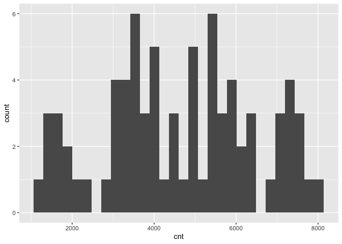
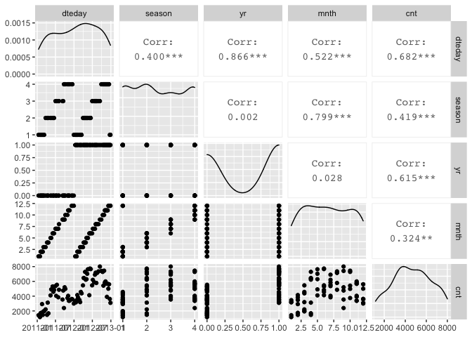
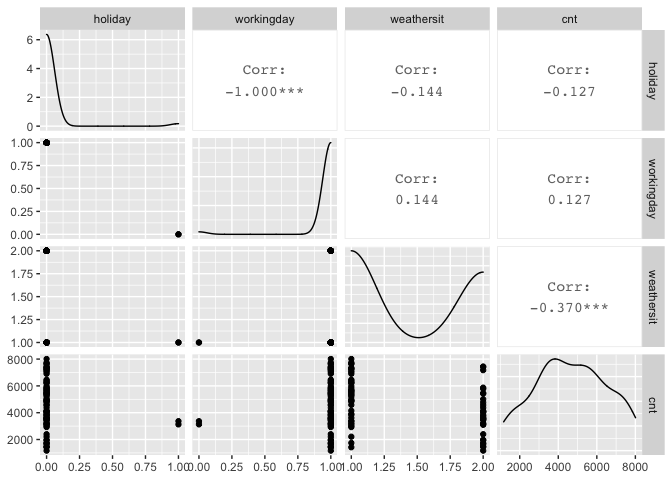
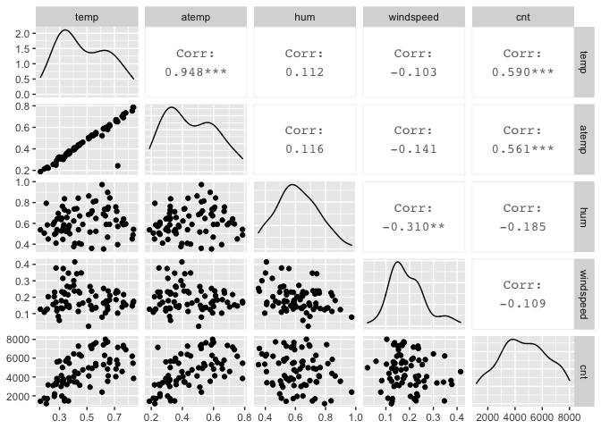
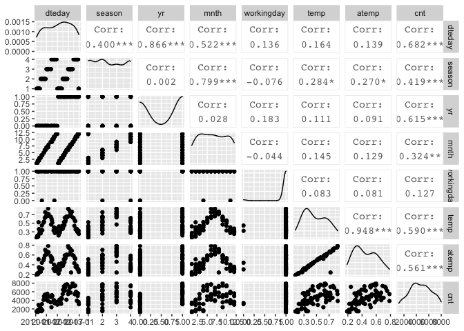

Project 2 - Karen Lopez
================
October 16, 2020

  - [Introduction](#introduction)
  - [Data](#data)
  - [Summarizations](#summarizations)
  - [Modeling](#modeling)
  - [Automation](#automation)

## Introduction

This project uses the bike sharing data set, day.csv, that’s located
*[here](https://archive.ics.uci.edu/ml/datasets/Bike+Sharing+Dataset)*
and contains 731 observations with 15 attributes. For modeling, the
response variable is the count of total rental bikes rented (*cnt*) and
11 of the 14 remaining variables will be considered for predictor
variables. Variables *casual* and *registered* are omitted and analysis
are performed on each *weekday* variable. The 11 remaining variables
include values for date, season, year, month, holiday, working day,
weather, temperature, feeling temperature, humidity, and wind speed.  
The purpose of this analysis is to fit two different tree models and
select the best one based on the appropriate criteria. This report will
be automated to run on the data set for each day of the week, starting
with Sunday at 0, Monday at 1, and so on.  
Many methods I’ll use come from a variety of packages installed in this
first code chunk. First I will read in the data and randomly separate it
into the training set and testing set, with 70% of the data going into
the traiing set. Then I will create some summary statistics and various
data plots to view variable relationships and narrow down the predictor
variables. Lastly, I will train and fit the models to compare them and
pick the final model.  
To begin, necessary libraries are loaded so their functions are
accessible and global variables are set.

``` r
library(readr)
library(caret)
library(knitr)
library(corrplot)
library(dplyr)
library(tidyverse)
library(rpart)
num <- 12
```

## Data

The dataset is read in using a relative path and saved as an object. The
weekday variable is converted to a factor with the day values replacing
their corresponding number, and then the weekday variable is used to
filter the data for each day of the week. The data is then randomly
split into a training and testing set, where 70% of the data goes into
the training set and the remaining 30% goes into the testing set.

``` r
#read in dataset with relative path & save to object
bikeData <- read_csv("Bike-Sharing-Dataset/day.csv") #read in data
#replace weekday numbers with day name
bikeData$weekday <- factor(bikeData$weekday, levels = c(0, 1, 2, 3, 4, 5, 6), labels = c("Sunday", "Monday", "Tuesday", "Wednesday", "Thursday", "Friday", "Saturday"))

bikeData <- bikeData %>% filter(weekday==params$weekday)

#create partitions in data indexes with 70% going in the training set
set.seed(num)
trainIndex <- createDataPartition(bikeData$cnt, p = 0.7, list = FALSE)

#create train and test data set using the trainIndex vector
bikeDataTrain <- bikeData[trainIndex, ]
bikeDataTest <- bikeData[-trainIndex, ]

bikeDataTrain #view train data
```

    ## # A tibble: 76 x 16
    ##    instant dteday     season    yr  mnth holiday weekday
    ##      <dbl> <date>      <dbl> <dbl> <dbl>   <dbl> <fct>  
    ##  1      14 2011-01-14      1     0     1       0 Friday 
    ##  2      28 2011-01-28      1     0     1       0 Friday 
    ##  3      35 2011-02-04      1     0     2       0 Friday 
    ##  4      42 2011-02-11      1     0     2       0 Friday 
    ##  5      49 2011-02-18      1     0     2       0 Friday 
    ##  6      56 2011-02-25      1     0     2       0 Friday 
    ##  7      63 2011-03-04      1     0     3       0 Friday 
    ##  8      70 2011-03-11      1     0     3       0 Friday 
    ##  9      84 2011-03-25      2     0     3       0 Friday 
    ## 10      98 2011-04-08      2     0     4       0 Friday 
    ## # … with 66 more rows, and 9 more variables: workingday <dbl>,
    ## #   weathersit <dbl>, temp <dbl>, atemp <dbl>, hum <dbl>,
    ## #   windspeed <dbl>, casual <dbl>, registered <dbl>, cnt <dbl>

``` r
bikeDataTest #view train data
```

    ## # A tibble: 28 x 16
    ##    instant dteday     season    yr  mnth holiday weekday
    ##      <dbl> <date>      <dbl> <dbl> <dbl>   <dbl> <fct>  
    ##  1       7 2011-01-07      1     0     1       0 Friday 
    ##  2      21 2011-01-21      1     0     1       0 Friday 
    ##  3      77 2011-03-18      1     0     3       0 Friday 
    ##  4      91 2011-04-01      2     0     4       0 Friday 
    ##  5     119 2011-04-29      2     0     4       0 Friday 
    ##  6     126 2011-05-06      2     0     5       0 Friday 
    ##  7     147 2011-05-27      2     0     5       0 Friday 
    ##  8     175 2011-06-24      3     0     6       0 Friday 
    ##  9     203 2011-07-22      3     0     7       0 Friday 
    ## 10     224 2011-08-12      3     0     8       0 Friday 
    ## # … with 18 more rows, and 9 more variables: workingday <dbl>,
    ## #   weathersit <dbl>, temp <dbl>, atemp <dbl>, hum <dbl>,
    ## #   windspeed <dbl>, casual <dbl>, registered <dbl>, cnt <dbl>

## Summarizations

Just to get an overview of the data, I first look at the summary of all
variables, and the distribution of the rental bike counts. Then I delve
deeper into the variable relationships with the response variable,
count, and with each other using ggpairs. These correlations will help
me narrow down which variables to include in the tree models, but I can
also view their corresponding scatterplots and density curves.

``` r
#summary of training data set
summary(bikeDataTrain)
```

    ##     instant          dteday               season     
    ##  Min.   : 14.0   Min.   :2011-01-14   Min.   :1.000  
    ##  1st Qu.:194.2   1st Qu.:2011-07-13   1st Qu.:1.000  
    ##  Median :402.5   Median :2012-02-06   Median :2.000  
    ##  Mean   :386.6   Mean   :2012-01-21   Mean   :2.474  
    ##  3rd Qu.:568.8   3rd Qu.:2012-07-21   3rd Qu.:4.000  
    ##  Max.   :728.0   Max.   :2012-12-28   Max.   :4.000  
    ##                                                      
    ##        yr              mnth           holiday       
    ##  Min.   :0.0000   Min.   : 1.000   Min.   :0.00000  
    ##  1st Qu.:0.0000   1st Qu.: 3.750   1st Qu.:0.00000  
    ##  Median :1.0000   Median : 6.500   Median :0.00000  
    ##  Mean   :0.5526   Mean   : 6.579   Mean   :0.02632  
    ##  3rd Qu.:1.0000   3rd Qu.:10.000   3rd Qu.:0.00000  
    ##  Max.   :1.0000   Max.   :12.000   Max.   :1.00000  
    ##                                                     
    ##       weekday     workingday       weathersit   
    ##  Sunday   : 0   Min.   :0.0000   Min.   :1.000  
    ##  Monday   : 0   1st Qu.:1.0000   1st Qu.:1.000  
    ##  Tuesday  : 0   Median :1.0000   Median :1.000  
    ##  Wednesday: 0   Mean   :0.9737   Mean   :1.434  
    ##  Thursday : 0   3rd Qu.:1.0000   3rd Qu.:2.000  
    ##  Friday   :76   Max.   :1.0000   Max.   :2.000  
    ##  Saturday : 0                                   
    ##       temp            atemp             hum        
    ##  Min.   :0.1609   Min.   :0.1884   Min.   :0.3542  
    ##  1st Qu.:0.3260   1st Qu.:0.3188   1st Qu.:0.5230  
    ##  Median :0.4400   Median :0.4324   Median :0.5929  
    ##  Mean   :0.4766   Mean   :0.4524   Mean   :0.6133  
    ##  3rd Qu.:0.6348   3rd Qu.:0.5881   3rd Qu.:0.7131  
    ##  Max.   :0.8383   Max.   :0.7866   Max.   :0.9725  
    ##                                                    
    ##    windspeed           casual         registered  
    ##  Min.   :0.02239   Min.   :  38.0   Min.   :1129  
    ##  1st Qu.:0.13635   1st Qu.: 267.0   1st Qu.:3046  
    ##  Median :0.17476   Median : 657.0   Median :3912  
    ##  Mean   :0.19082   Mean   : 714.1   Mean   :3938  
    ##  3rd Qu.:0.23176   3rd Qu.:1061.2   3rd Qu.:5190  
    ##  Max.   :0.41480   Max.   :1807.0   Max.   :6630  
    ##                                                   
    ##       cnt      
    ##  Min.   :1167  
    ##  1st Qu.:3386  
    ##  Median :4673  
    ##  Mean   :4653  
    ##  3rd Qu.:5900  
    ##  Max.   :8009  
    ## 

``` r
#quantitative histogram for cnt to view distribution
g <- ggplot(bikeDataTrain, aes(x=cnt))
g + geom_histogram()
```

<!-- -->

``` r
#create 3 plots of variables against each other and the response variable
bikeDataTrain1 <- bikeDataTrain %>% select(dteday, season, yr, mnth, cnt)
GGally::ggpairs(bikeDataTrain1)
```

<!-- -->

``` r
#all 3 might be of interest

bikeDataTrain2 <- bikeDataTrain %>% select(holiday, workingday, weathersit, cnt)
GGally::ggpairs(bikeDataTrain2)
```

<!-- -->

``` r
#workingday might be of interest

bikeDataTrain3 <- bikeDataTrain %>% select(temp, atemp, hum, windspeed, cnt)
GGally::ggpairs(bikeDataTrain3)
```

<!-- -->

``` r
#temp & atemp might be of interest

bikeDataTrain4 <- bikeDataTrain %>% select(dteday, season, yr, mnth, workingday, temp, atemp, cnt)
GGally::ggpairs(bikeDataTrain4)
```

<!-- -->

``` r
# yr & atemp might be of more interest than the others 
```

Various predictor variables have interactions with each other, and I
want to focus on those with the lower correlation values with each other
but higher correlations with the response. These variables include such
as year, temperature, and feeling temperature. The date, season, and
month variables will be omitted from further analysis because of their
stronger correlations with other variables, and working day will be
omitted for its weak correlation with count. The temperature and feeling
temperature have a very strong correlation so I’ll only keep feeling
temperature for it’s slightly stronger correlation with the response
variable, and analyze it alongside the year variable. These variables
were chosen using the `weekday = Monday` data, and will be used for all
other days to keep analyses consistent.

## Modeling

Next I will utilize the `caret` package to create two tree models with
the training set and then predict each on the testing set, after
reducing both sets to include only the variables of interest. The models
are based on the response variable, *cnt*, being a continuous variable.
The predictors are *yr* and *atemp*, which are categorical (0: 2011, 1:
2012) and continuous variables, respectively.

The first model is a non-ensemble tree-based model chosen using
leave-one-out cross-validation, and the second model is a boosted tree
model chosen using 12-fold cross-validation. Just in case, and for good
practice, the predictor variables are standardize via centering and
scaling. Each model is then predicted on using the training set, and
their performances are compared via root mean square error (RMSE) and/or
mean absolute error (MAE) values.

``` r
#select only variables needed for modeling
bikeDataTrain <- bikeDataTrain %>% select(cnt, yr, atemp)
kable(head(bikeDataTrain)) #preview reduced train data
```

|  cnt | yr |    atemp |
| ---: | -: | -------: |
| 1421 |  0 | 0.188413 |
| 1167 |  0 | 0.223317 |
| 1708 |  0 | 0.228587 |
| 1746 |  0 | 0.213509 |
| 2927 |  0 | 0.511983 |
| 1461 |  0 | 0.350461 |

``` r
bikeDataTest <- bikeDataTest %>% select(cnt, yr, atemp)
kable(head(bikeDataTest)) #preview reduced test data
```

|  cnt | yr |    atemp |
| ---: | -: | -------: |
| 1510 |  0 | 0.208839 |
| 1543 |  0 | 0.157833 |
| 3239 |  0 | 0.527009 |
| 2227 |  0 | 0.283454 |
| 4595 |  0 | 0.497463 |
| 4608 |  0 | 0.474117 |

``` r
#(not ensemble) tree-based model chosen using leave one out cross validation
#using regression tree to model cnt (continuous variable)
treeFit1 <- train(cnt ~ ., data = bikeDataTrain, method = "rpart", preProcess = c("center", "scale"), trControl = trainControl(method = "LOOCV"))
treeFit1 #view resulting tree parameters
```

    ## CART 
    ## 
    ## 76 samples
    ##  2 predictor
    ## 
    ## Pre-processing: centered (2), scaled (2) 
    ## Resampling: Leave-One-Out Cross-Validation 
    ## Summary of sample sizes: 75, 75, 75, 75, 75, 75, ... 
    ## Resampling results across tuning parameters:
    ## 
    ##   cp         RMSE      Rsquared    MAE     
    ##   0.1402340  1398.182  0.42673435  1266.226
    ##   0.1608121  1606.449  0.25066856  1430.591
    ##   0.3776599  2072.004  0.03688922  1912.958
    ## 
    ## RMSE was used to select the optimal model using the
    ##  smallest value.
    ## The final value used for the model was cp = 0.140234.

``` r
#plot(treeFit1) #plot result

#boosted tree model chosen using cross-validation
treeFit2 <- train(cnt ~ ., data = bikeDataTrain, method = "gbm", preProcess = c("center", "scale"), trControl = trainControl(method = "cv", number = num))
```

    ## Iter   TrainDeviance   ValidDeviance   StepSize   Improve
    ##      1  3018998.1302             nan     0.1000 208145.8304
    ##      2  2822181.7769             nan     0.1000 208190.2306
    ##      3  2581282.4198             nan     0.1000 145153.8233
    ##      4  2425109.0131             nan     0.1000 167249.5673
    ##      5  2255469.9751             nan     0.1000 115498.5998
    ##      6  2097818.1542             nan     0.1000 97930.4797
    ##      7  2019152.2786             nan     0.1000 79668.5734
    ##      8  1901391.1383             nan     0.1000 86768.3296
    ##      9  1816096.8534             nan     0.1000 36026.0353
    ##     10  1736426.3904             nan     0.1000 79265.1347
    ##     20  1200225.3211             nan     0.1000 27070.4972
    ##     40   957006.4204             nan     0.1000 -6988.8851
    ##     60   921458.1705             nan     0.1000 -3338.1731
    ##     80   899428.4346             nan     0.1000 -4006.4633
    ##    100   878281.7470             nan     0.1000 -4409.2705
    ##    120   855636.8649             nan     0.1000 -13296.1057
    ##    140   845736.5609             nan     0.1000 -46702.6920
    ##    150   829841.4851             nan     0.1000 -33194.7134
    ## 
    ## Iter   TrainDeviance   ValidDeviance   StepSize   Improve
    ##      1  2921653.7813             nan     0.1000 126390.0324
    ##      2  2629651.6741             nan     0.1000 250823.3427
    ##      3  2455333.5129             nan     0.1000 198605.8885
    ##      4  2290718.8679             nan     0.1000 202680.1354
    ##      5  2136044.1934             nan     0.1000 134426.1357
    ##      6  1992271.9143             nan     0.1000 49000.8904
    ##      7  1790868.9544             nan     0.1000 143585.5433
    ##      8  1731971.7681             nan     0.1000 63530.2094
    ##      9  1637163.0126             nan     0.1000 84957.2978
    ##     10  1551334.3780             nan     0.1000 39278.3968
    ##     20  1121708.4321             nan     0.1000 1550.0813
    ##     40   934419.2002             nan     0.1000 -7938.3181
    ##     60   892796.8950             nan     0.1000 -6700.4476
    ##     80   851376.3187             nan     0.1000 -2072.8867
    ##    100   832419.8212             nan     0.1000 -13822.3243
    ##    120   806476.3310             nan     0.1000 -6428.5326
    ##    140   787253.4239             nan     0.1000 -15206.7000
    ##    150   776150.6321             nan     0.1000 -15431.4946
    ## 
    ## Iter   TrainDeviance   ValidDeviance   StepSize   Improve
    ##      1  3052604.9736             nan     0.1000 166616.6976
    ##      2  2766050.3004             nan     0.1000 195287.6222
    ##      3  2557586.2984             nan     0.1000 154449.0170
    ##      4  2323835.0239             nan     0.1000 248258.9745
    ##      5  2146575.3524             nan     0.1000 88974.1460
    ##      6  1967704.7983             nan     0.1000 169130.5350
    ##      7  1856482.5181             nan     0.1000 96029.8226
    ##      8  1756719.8483             nan     0.1000 44824.1984
    ##      9  1676269.5524             nan     0.1000 92589.7543
    ##     10  1556038.1710             nan     0.1000 73203.1575
    ##     20  1105735.1615             nan     0.1000 16982.8963
    ##     40   961196.7837             nan     0.1000 -1494.3048
    ##     60   942210.2350             nan     0.1000 -10965.3750
    ##     80   893959.1064             nan     0.1000 -15237.1623
    ##    100   831209.8256             nan     0.1000 -9883.9247
    ##    120   798332.8845             nan     0.1000 -15804.3308
    ##    140   773390.5731             nan     0.1000 -11008.7746
    ##    150   761787.1376             nan     0.1000 -3205.9192
    ## 
    ## Iter   TrainDeviance   ValidDeviance   StepSize   Improve
    ##      1  3092548.4700             nan     0.1000 213239.7589
    ##      2  2904669.9169             nan     0.1000 171734.3213
    ##      3  2743866.1173             nan     0.1000 183890.5291
    ##      4  2561106.7228             nan     0.1000 97117.1846
    ##      5  2399280.6691             nan     0.1000 166900.3830
    ##      6  2283779.3195             nan     0.1000 90790.7609
    ##      7  2109839.7217             nan     0.1000 116864.9299
    ##      8  2046871.8675             nan     0.1000 71650.0888
    ##      9  1915814.2504             nan     0.1000 33060.3290
    ##     10  1819830.2221             nan     0.1000 65412.5306
    ##     20  1268996.1430             nan     0.1000 21613.3205
    ##     40  1065588.9174             nan     0.1000 -11261.5476
    ##     60  1039660.4399             nan     0.1000 -2254.5719
    ##     80  1013134.2662             nan     0.1000 -3609.4089
    ##    100   995469.8839             nan     0.1000 -7233.1331
    ##    120   976309.8519             nan     0.1000 -16559.5691
    ##    140   960571.1129             nan     0.1000 -3100.3718
    ##    150   947016.1577             nan     0.1000 -12507.4584
    ## 
    ## Iter   TrainDeviance   ValidDeviance   StepSize   Improve
    ##      1  3058778.2502             nan     0.1000 275903.9898
    ##      2  2818786.0455             nan     0.1000 114957.8959
    ##      3  2681176.2473             nan     0.1000 135610.4641
    ##      4  2526894.4200             nan     0.1000 31709.7945
    ##      5  2326665.3007             nan     0.1000 195797.5658
    ##      6  2179044.0329             nan     0.1000 160681.7577
    ##      7  2009765.7326             nan     0.1000 116554.5128
    ##      8  1851406.9104             nan     0.1000 56537.7164
    ##      9  1768174.3142             nan     0.1000 69514.6822
    ##     10  1693293.3300             nan     0.1000 50113.9246
    ##     20  1245249.6011             nan     0.1000 -4004.1865
    ##     40  1093221.1273             nan     0.1000 -41235.6477
    ##     60  1043164.5934             nan     0.1000 -30177.4360
    ##     80  1021217.0475             nan     0.1000 -9450.7095
    ##    100   997445.2271             nan     0.1000 -2412.0232
    ##    120   953856.5455             nan     0.1000 -5868.0150
    ##    140   938947.7228             nan     0.1000 -7181.8808
    ##    150   920393.1474             nan     0.1000 -21098.2301
    ## 
    ## Iter   TrainDeviance   ValidDeviance   StepSize   Improve
    ##      1  3077565.6664             nan     0.1000 234770.6773
    ##      2  2756269.5969             nan     0.1000 234848.3290
    ##      3  2593342.6212             nan     0.1000 158065.4126
    ##      4  2364481.3828             nan     0.1000 198698.6474
    ##      5  2218400.2358             nan     0.1000 130480.1293
    ##      6  2004790.7132             nan     0.1000 164808.3349
    ##      7  1886070.7156             nan     0.1000 81631.1050
    ##      8  1772419.3523             nan     0.1000 102693.0119
    ##      9  1677641.4626             nan     0.1000 41071.7087
    ##     10  1568946.8601             nan     0.1000 73587.0548
    ##     20  1188161.9938             nan     0.1000 -7899.8732
    ##     40  1031156.9065             nan     0.1000 -12826.1574
    ##     60   993581.5695             nan     0.1000 -8143.1887
    ##     80   967227.7592             nan     0.1000 -16506.5942
    ##    100   924350.2899             nan     0.1000 -4826.1855
    ##    120   908553.7837             nan     0.1000 -9269.4661
    ##    140   880501.0581             nan     0.1000 -13943.1050
    ##    150   873498.0815             nan     0.1000 -13286.6362
    ## 
    ## Iter   TrainDeviance   ValidDeviance   StepSize   Improve
    ##      1  3023426.7241             nan     0.1000 173401.5910
    ##      2  2680423.3055             nan     0.1000 162498.2731
    ##      3  2527413.2752             nan     0.1000 168571.8795
    ##      4  2384531.0337             nan     0.1000 82283.8646
    ##      5  2239510.3844             nan     0.1000 113709.1436
    ##      6  2110640.7048             nan     0.1000 89080.3016
    ##      7  2013281.9542             nan     0.1000 10376.4928
    ##      8  1905664.7131             nan     0.1000 77278.9630
    ##      9  1802101.1974             nan     0.1000 92355.9347
    ##     10  1716365.1102             nan     0.1000 41880.4062
    ##     20  1259413.0613             nan     0.1000 16873.1309
    ##     40  1088160.1282             nan     0.1000 -8572.8908
    ##     60  1071596.4332             nan     0.1000 -10321.9650
    ##     80  1039924.1073             nan     0.1000 -8281.5934
    ##    100  1017824.4103             nan     0.1000 -20214.9909
    ##    120   998156.8483             nan     0.1000 -7262.7975
    ##    140   975244.4889             nan     0.1000 -17295.0256
    ##    150   970183.1638             nan     0.1000 -7947.9647
    ## 
    ## Iter   TrainDeviance   ValidDeviance   StepSize   Improve
    ##      1  2942579.1188             nan     0.1000 226256.7827
    ##      2  2737278.2120             nan     0.1000 156570.0597
    ##      3  2453395.0197             nan     0.1000 240970.9532
    ##      4  2257115.3694             nan     0.1000 102270.4228
    ##      5  2166550.0747             nan     0.1000 110831.4772
    ##      6  2027921.3497             nan     0.1000 123186.0263
    ##      7  1918992.6273             nan     0.1000 98179.0303
    ##      8  1829857.6995             nan     0.1000 74294.8528
    ##      9  1753970.4930             nan     0.1000 83067.4810
    ##     10  1700753.3525             nan     0.1000 55110.5343
    ##     20  1233598.2275             nan     0.1000 12921.7136
    ##     40  1068177.9006             nan     0.1000 -3875.4566
    ##     60  1016634.4462             nan     0.1000 -6190.6039
    ##     80   978040.4611             nan     0.1000 -10520.4021
    ##    100   945528.6037             nan     0.1000  746.6632
    ##    120   904203.0050             nan     0.1000 2246.8393
    ##    140   869434.0519             nan     0.1000 -17212.7405
    ##    150   864619.1392             nan     0.1000 -4302.2448
    ## 
    ## Iter   TrainDeviance   ValidDeviance   StepSize   Improve
    ##      1  3032613.4333             nan     0.1000 232915.7459
    ##      2  2868320.5281             nan     0.1000 225181.9772
    ##      3  2683353.1874             nan     0.1000 231683.5163
    ##      4  2504934.3497             nan     0.1000 116291.4405
    ##      5  2351875.4167             nan     0.1000 137467.7823
    ##      6  2193189.0993             nan     0.1000 156978.0039
    ##      7  2040753.6894             nan     0.1000 109255.3207
    ##      8  1955204.7704             nan     0.1000 87768.6401
    ##      9  1865127.0916             nan     0.1000 50211.3408
    ##     10  1802918.5245             nan     0.1000 38248.2199
    ##     20  1285590.5679             nan     0.1000 2935.8858
    ##     40  1083255.3405             nan     0.1000 -10746.9339
    ##     60  1038983.5018             nan     0.1000 2692.1243
    ##     80  1008682.4912             nan     0.1000 -24505.4647
    ##    100   976860.2142             nan     0.1000 -25374.8082
    ##    120   958654.2638             nan     0.1000 -9031.1103
    ##    140   935308.7952             nan     0.1000 -1095.6893
    ##    150   932996.6551             nan     0.1000 -12711.6196
    ## 
    ## Iter   TrainDeviance   ValidDeviance   StepSize   Improve
    ##      1  3110652.1780             nan     0.1000 255516.6652
    ##      2  2861456.3969             nan     0.1000 205492.6287
    ##      3  2646542.0324             nan     0.1000 167869.7251
    ##      4  2451123.6360             nan     0.1000 108712.4815
    ##      5  2279931.8859             nan     0.1000 153685.8457
    ##      6  2133127.8142             nan     0.1000 89407.5310
    ##      7  2033481.9523             nan     0.1000 16631.3039
    ##      8  1903757.0234             nan     0.1000 98293.5477
    ##      9  1824582.9933             nan     0.1000 39423.7256
    ##     10  1732853.5925             nan     0.1000 85281.4924
    ##     20  1242901.6524             nan     0.1000 -22332.0150
    ##     40  1063361.2844             nan     0.1000 -3776.5545
    ##     60  1028824.9274             nan     0.1000 -10197.6847
    ##     80  1001827.8757             nan     0.1000 -10903.2340
    ##    100   984018.8636             nan     0.1000 -19904.9880
    ##    120   975172.1314             nan     0.1000 -2907.9396
    ##    140   960528.4720             nan     0.1000 -19237.7488
    ##    150   955059.2580             nan     0.1000 -3968.6561
    ## 
    ## Iter   TrainDeviance   ValidDeviance   StepSize   Improve
    ##      1  3031699.5861             nan     0.1000 191923.5401
    ##      2  2796292.7351             nan     0.1000 168707.5817
    ##      3  2624871.4553             nan     0.1000 184101.3595
    ##      4  2473258.9861             nan     0.1000 85629.8246
    ##      5  2336319.3773             nan     0.1000 118340.3528
    ##      6  2180267.9615             nan     0.1000 110401.8719
    ##      7  2043660.3763             nan     0.1000 78497.7192
    ##      8  1910508.6933             nan     0.1000 94844.9356
    ##      9  1775046.9486             nan     0.1000 98316.0556
    ##     10  1691073.1679             nan     0.1000 83052.0856
    ##     20  1220889.2611             nan     0.1000 -1763.7573
    ##     40  1043615.2773             nan     0.1000 -9325.9197
    ##     60  1021985.8093             nan     0.1000 -2491.1726
    ##     80   979118.9239             nan     0.1000 -12632.4915
    ##    100   951531.0900             nan     0.1000 -17234.9914
    ##    120   920175.4636             nan     0.1000 -5255.6694
    ##    140   899133.3526             nan     0.1000 -24409.4527
    ##    150   893497.1451             nan     0.1000 -26456.8221
    ## 
    ## Iter   TrainDeviance   ValidDeviance   StepSize   Improve
    ##      1  3101306.5820             nan     0.1000 251411.8757
    ##      2  2809095.2435             nan     0.1000 295693.4568
    ##      3  2666800.2016             nan     0.1000 164969.6289
    ##      4  2496814.6634             nan     0.1000 120339.0067
    ##      5  2317800.1237             nan     0.1000 97505.5031
    ##      6  2217264.3503             nan     0.1000 51697.6186
    ##      7  2084242.1260             nan     0.1000 45437.4121
    ##      8  1925712.9592             nan     0.1000 122877.0699
    ##      9  1828909.0824             nan     0.1000 82538.1801
    ##     10  1729858.6851             nan     0.1000 76601.7176
    ##     20  1247038.3304             nan     0.1000 -23737.7053
    ##     40  1079377.3414             nan     0.1000 -12122.5233
    ##     60  1017194.4504             nan     0.1000 -22208.5678
    ##     80   980677.1669             nan     0.1000 -6469.1162
    ##    100   953109.6655             nan     0.1000 1133.2777
    ##    120   943034.9796             nan     0.1000 -7004.1254
    ##    140   922979.6966             nan     0.1000 -16217.9793
    ##    150   905441.0794             nan     0.1000 -32430.1981
    ## 
    ## Iter   TrainDeviance   ValidDeviance   StepSize   Improve
    ##      1  3138592.9391             nan     0.1000 144328.6351
    ##      2  2909043.5077             nan     0.1000 233234.8343
    ##      3  2778057.9739             nan     0.1000 99532.0393
    ##      4  2592094.2195             nan     0.1000 179145.2919
    ##      5  2420435.4841             nan     0.1000 153375.8860
    ##      6  2298691.1184             nan     0.1000 105909.7062
    ##      7  2157474.5312             nan     0.1000 94992.7927
    ##      8  2058613.0075             nan     0.1000 85237.7637
    ##      9  1974806.2472             nan     0.1000 37570.7323
    ##     10  1906655.8022             nan     0.1000 6877.2738
    ##     20  1291316.7603             nan     0.1000 12188.8907
    ##     40  1066354.3545             nan     0.1000 -565.6059
    ##     60  1033400.8311             nan     0.1000 -11970.0409
    ##     80  1016968.2187             nan     0.1000 -9826.4533
    ##    100   996970.3600             nan     0.1000 -8652.0310
    ##    120   980662.6958             nan     0.1000 -7192.9923
    ##    140   966897.4300             nan     0.1000 -10516.0123
    ##    150   959921.7841             nan     0.1000 -8260.8021
    ## 
    ## Iter   TrainDeviance   ValidDeviance   StepSize   Improve
    ##      1  3055979.9524             nan     0.1000 213491.4139
    ##      2  2836289.2019             nan     0.1000 159224.3621
    ##      3  2605676.1135             nan     0.1000 215069.4724
    ##      4  2450648.0676             nan     0.1000 114164.2298
    ##      5  2271638.5958             nan     0.1000 158279.1394
    ##      6  2140819.7969             nan     0.1000 115453.6491
    ##      7  2003520.2463             nan     0.1000 128557.5660
    ##      8  1928022.7458             nan     0.1000 54482.7521
    ##      9  1802257.6479             nan     0.1000 48985.1395
    ##     10  1693633.4208             nan     0.1000 79158.5740
    ##     20  1223266.7390             nan     0.1000 23096.1507
    ##     40  1053559.3149             nan     0.1000 -1971.7029
    ##     60  1012055.1965             nan     0.1000 -44135.4938
    ##     80   989410.4412             nan     0.1000 -18527.6353
    ##    100   960416.5146             nan     0.1000 -7602.8062
    ##    120   930306.3754             nan     0.1000 -17194.9861
    ##    140   915188.9876             nan     0.1000 -21467.9833
    ##    150   901474.9109             nan     0.1000 -5583.9727
    ## 
    ## Iter   TrainDeviance   ValidDeviance   StepSize   Improve
    ##      1  3032842.0481             nan     0.1000 171664.4066
    ##      2  2896426.7915             nan     0.1000 110332.9206
    ##      3  2585463.2561             nan     0.1000 276156.2929
    ##      4  2425830.6768             nan     0.1000 113504.1434
    ##      5  2223586.4860             nan     0.1000 214663.8629
    ##      6  2078506.3650             nan     0.1000 134507.4333
    ##      7  1894635.7953             nan     0.1000 89379.0814
    ##      8  1806345.8912             nan     0.1000 61457.5083
    ##      9  1716742.8102             nan     0.1000 91904.2740
    ##     10  1641388.4471             nan     0.1000 58175.6328
    ##     20  1217453.4652             nan     0.1000 8930.0163
    ##     40  1070527.5481             nan     0.1000 -50029.3370
    ##     60  1034667.0488             nan     0.1000 -5011.0120
    ##     80  1003260.8001             nan     0.1000 -6086.9326
    ##    100   962732.4899             nan     0.1000 -8044.8757
    ##    120   930950.0593             nan     0.1000 -4700.4908
    ##    140   910302.1384             nan     0.1000 -12628.4315
    ##    150   898787.5097             nan     0.1000 -3766.0513
    ## 
    ## Iter   TrainDeviance   ValidDeviance   StepSize   Improve
    ##      1  2973583.9038             nan     0.1000 182163.5154
    ##      2  2763302.7534             nan     0.1000 192544.7696
    ##      3  2590842.1734             nan     0.1000 167194.8822
    ##      4  2503073.1465             nan     0.1000 100921.3471
    ##      5  2337711.9725             nan     0.1000 75570.1644
    ##      6  2189049.8698             nan     0.1000 99984.0284
    ##      7  2021984.7710             nan     0.1000 101796.4349
    ##      8  1928768.4754             nan     0.1000 92164.5942
    ##      9  1839054.2114             nan     0.1000 68468.0990
    ##     10  1774520.2586             nan     0.1000 69520.6593
    ##     20  1248507.1023             nan     0.1000 8431.0953
    ##     40  1045807.4797             nan     0.1000 -8172.5376
    ##     60  1009095.3728             nan     0.1000 -3542.7435
    ##     80   986800.6277             nan     0.1000 -9779.6630
    ##    100   954167.9909             nan     0.1000 -18256.8176
    ##    120   933751.3610             nan     0.1000 -8597.8084
    ##    140   917250.1329             nan     0.1000 -7601.8164
    ##    150   917133.2222             nan     0.1000 -3981.1940
    ## 
    ## Iter   TrainDeviance   ValidDeviance   StepSize   Improve
    ##      1  2818692.6265             nan     0.1000 203202.4430
    ##      2  2569838.1921             nan     0.1000 186925.5955
    ##      3  2453693.5384             nan     0.1000 88610.5252
    ##      4  2259580.3631             nan     0.1000 188929.5976
    ##      5  2142827.9544             nan     0.1000 138614.7776
    ##      6  2074914.6836             nan     0.1000 82295.1335
    ##      7  1942805.6640             nan     0.1000 101401.0556
    ##      8  1858572.3931             nan     0.1000 70827.1395
    ##      9  1763912.3555             nan     0.1000 23067.7691
    ##     10  1680910.3541             nan     0.1000 76537.7571
    ##     20  1159423.9557             nan     0.1000 14638.5117
    ##     40   998655.8401             nan     0.1000 -28754.2729
    ##     60   955625.5031             nan     0.1000 -12240.1116
    ##     80   944613.8718             nan     0.1000 -21448.9679
    ##    100   912264.9051             nan     0.1000 -13345.0550
    ##    120   894251.7774             nan     0.1000 -12022.0327
    ##    140   886658.0822             nan     0.1000 -6087.7335
    ##    150   873243.6488             nan     0.1000 -16771.8300
    ## 
    ## Iter   TrainDeviance   ValidDeviance   StepSize   Improve
    ##      1  2879949.1844             nan     0.1000 288547.4265
    ##      2  2688474.0699             nan     0.1000 179801.0310
    ##      3  2503921.8401             nan     0.1000 188470.9158
    ##      4  2353151.7359             nan     0.1000 109693.8041
    ##      5  2169755.2408             nan     0.1000 193560.5686
    ##      6  2018450.5581             nan     0.1000 119359.4378
    ##      7  1916729.9091             nan     0.1000 71136.6811
    ##      8  1818415.3885             nan     0.1000 91968.4044
    ##      9  1759884.5363             nan     0.1000 48652.9341
    ##     10  1614465.5478             nan     0.1000 112584.0391
    ##     20  1241513.3959             nan     0.1000 10200.0583
    ##     40  1065225.8821             nan     0.1000 -1912.6091
    ##     60  1005465.3837             nan     0.1000 -146.2258
    ##     80   976916.2058             nan     0.1000 -424.2759
    ##    100   944769.6827             nan     0.1000 -9694.6914
    ##    120   918613.5103             nan     0.1000 -4388.1777
    ##    140   887049.4145             nan     0.1000 -14000.0485
    ##    150   868668.8577             nan     0.1000 -12014.2276
    ## 
    ## Iter   TrainDeviance   ValidDeviance   StepSize   Improve
    ##      1  2967728.9773             nan     0.1000 201369.9932
    ##      2  2795381.0575             nan     0.1000 161213.9699
    ##      3  2632677.5191             nan     0.1000 92286.7258
    ##      4  2474509.0607             nan     0.1000 82081.6179
    ##      5  2352425.6716             nan     0.1000 139756.3800
    ##      6  2241510.1339             nan     0.1000 85643.8958
    ##      7  2149811.7468             nan     0.1000 63631.1569
    ##      8  2054173.8564             nan     0.1000 54794.3214
    ##      9  1968279.2408             nan     0.1000 53959.6042
    ##     10  1844532.3499             nan     0.1000 90177.6209
    ##     20  1366553.0799             nan     0.1000 27092.4743
    ##     40  1140985.4627             nan     0.1000 -2232.6371
    ##     60  1076464.1035             nan     0.1000 -2955.6435
    ##     80  1057186.3469             nan     0.1000 -6902.2108
    ##    100  1043100.5150             nan     0.1000 -23296.9289
    ##    120  1018306.6369             nan     0.1000 -2168.3889
    ##    140  1007301.5203             nan     0.1000 -15427.5100
    ##    150   992367.5486             nan     0.1000 -7959.4567
    ## 
    ## Iter   TrainDeviance   ValidDeviance   StepSize   Improve
    ##      1  2985265.5658             nan     0.1000 202932.6402
    ##      2  2750718.2721             nan     0.1000 240732.7129
    ##      3  2548005.6246             nan     0.1000 201723.0468
    ##      4  2332236.7217             nan     0.1000 204762.2241
    ##      5  2102559.6495             nan     0.1000 114890.6694
    ##      6  1991439.3358             nan     0.1000 83789.0846
    ##      7  1825625.8043             nan     0.1000 73176.2870
    ##      8  1747754.0128             nan     0.1000 59635.7271
    ##      9  1669459.1625             nan     0.1000 33935.1392
    ##     10  1618849.2615             nan     0.1000 22077.2755
    ##     20  1211077.7155             nan     0.1000 -1218.6039
    ##     40  1071482.7355             nan     0.1000 -27759.2771
    ##     60  1008604.9308             nan     0.1000 -12032.9258
    ##     80   991133.5162             nan     0.1000 -4239.1387
    ##    100   967816.8527             nan     0.1000 -2132.0194
    ##    120   937444.3290             nan     0.1000 -6168.2268
    ##    140   917162.4633             nan     0.1000 -16228.2197
    ##    150   899536.2508             nan     0.1000 -10507.4098
    ## 
    ## Iter   TrainDeviance   ValidDeviance   StepSize   Improve
    ##      1  2928015.6294             nan     0.1000 147950.9152
    ##      2  2683137.1869             nan     0.1000 204004.4274
    ##      3  2528242.5473             nan     0.1000 180644.6147
    ##      4  2274159.8503             nan     0.1000 225674.2352
    ##      5  2120182.2136             nan     0.1000 75280.1228
    ##      6  1989128.5665             nan     0.1000 112514.0148
    ##      7  1861518.1068             nan     0.1000 93537.9711
    ##      8  1793846.1061             nan     0.1000 59489.4296
    ##      9  1711921.7200             nan     0.1000 69778.3259
    ##     10  1612521.6688             nan     0.1000 87212.5630
    ##     20  1223111.4578             nan     0.1000 15326.8780
    ##     40  1091985.4384             nan     0.1000 -7340.4322
    ##     60  1041406.9195             nan     0.1000 -15603.1357
    ##     80  1000004.1240             nan     0.1000 -29124.5300
    ##    100   990378.6647             nan     0.1000 -21326.2568
    ##    120   956946.9578             nan     0.1000  175.9223
    ##    140   937220.6332             nan     0.1000 -8567.4216
    ##    150   934737.8894             nan     0.1000 -356.1410
    ## 
    ## Iter   TrainDeviance   ValidDeviance   StepSize   Improve
    ##      1  3205217.3598             nan     0.1000 256425.1761
    ##      2  2995497.5044             nan     0.1000 191985.3822
    ##      3  2781271.2291             nan     0.1000 181286.0141
    ##      4  2613666.0485             nan     0.1000 87536.3369
    ##      5  2442971.7921             nan     0.1000 141487.3008
    ##      6  2320654.6495             nan     0.1000 81231.1775
    ##      7  2189398.5704             nan     0.1000 91100.0701
    ##      8  1996971.5435             nan     0.1000 103748.1384
    ##      9  1889596.5041             nan     0.1000 96665.7198
    ##     10  1755887.9718             nan     0.1000 23092.3653
    ##     20  1240941.0984             nan     0.1000 -19048.2204
    ##     40  1058946.1473             nan     0.1000 -5826.1796
    ##     60  1028965.2756             nan     0.1000 -14487.0126
    ##     80  1012663.7121             nan     0.1000 -6325.4805
    ##    100   988756.2693             nan     0.1000 -6734.0458
    ##    120   977128.4020             nan     0.1000 -2203.5037
    ##    140   963520.0851             nan     0.1000 -13783.1251
    ##    150   950372.0494             nan     0.1000 -7423.3497
    ## 
    ## Iter   TrainDeviance   ValidDeviance   StepSize   Improve
    ##      1  3112416.0866             nan     0.1000 351341.0796
    ##      2  2841961.1189             nan     0.1000 168232.6857
    ##      3  2600699.5105             nan     0.1000 198515.8645
    ##      4  2449039.3804             nan     0.1000 149115.4556
    ##      5  2239818.1798             nan     0.1000 129674.0341
    ##      6  2037508.8186             nan     0.1000 123448.7559
    ##      7  1928514.2176             nan     0.1000 75054.0691
    ##      8  1827817.3092             nan     0.1000 70226.5318
    ##      9  1750216.0968             nan     0.1000 47504.4789
    ##     10  1686243.9812             nan     0.1000 71597.2263
    ##     20  1206546.2125             nan     0.1000 -33836.4308
    ##     40  1055542.9495             nan     0.1000 -10120.3390
    ##     60  1014206.2620             nan     0.1000 -8875.0711
    ##     80   992075.7528             nan     0.1000 -14700.0874
    ##    100   966386.6461             nan     0.1000 -733.0389
    ##    120   943714.1394             nan     0.1000 -7345.7754
    ##    140   911392.1301             nan     0.1000 -14953.0382
    ##    150   895357.3489             nan     0.1000 -4094.5196
    ## 
    ## Iter   TrainDeviance   ValidDeviance   StepSize   Improve
    ##      1  3223565.2756             nan     0.1000 297434.7824
    ##      2  2943889.0126             nan     0.1000 308872.3080
    ##      3  2731052.8976             nan     0.1000 153804.1807
    ##      4  2533501.2496             nan     0.1000 73760.5052
    ##      5  2382251.4385             nan     0.1000 62198.4224
    ##      6  2217426.1208             nan     0.1000 168610.1571
    ##      7  2067882.6670             nan     0.1000 170567.3443
    ##      8  1953985.1960             nan     0.1000 50445.0816
    ##      9  1884135.8913             nan     0.1000 52812.2287
    ##     10  1790389.5281             nan     0.1000 93651.2986
    ##     20  1271982.0501             nan     0.1000 12917.1307
    ##     40  1082174.0746             nan     0.1000 -13183.4665
    ##     60  1027885.0014             nan     0.1000 -13924.5648
    ##     80   983533.9291             nan     0.1000 -15492.9144
    ##    100   962400.1997             nan     0.1000 -10525.9271
    ##    120   934121.7323             nan     0.1000 -19637.6958
    ##    140   904060.4963             nan     0.1000 -23330.0833
    ##    150   896960.1321             nan     0.1000 -8605.9619
    ## 
    ## Iter   TrainDeviance   ValidDeviance   StepSize   Improve
    ##      1  3149510.9206             nan     0.1000 160932.6247
    ##      2  2965572.7850             nan     0.1000 221849.1628
    ##      3  2736439.6962             nan     0.1000 179972.2953
    ##      4  2569770.9831             nan     0.1000 118010.3727
    ##      5  2383142.0886             nan     0.1000 185833.8159
    ##      6  2244102.2631             nan     0.1000 107307.0305
    ##      7  2114880.2488             nan     0.1000 112563.3302
    ##      8  2018343.5668             nan     0.1000 83091.3951
    ##      9  1912397.2867             nan     0.1000 110411.4308
    ##     10  1805230.0419             nan     0.1000 102282.6648
    ##     20  1322135.5541             nan     0.1000 30999.8873
    ##     40  1037832.0725             nan     0.1000 -1037.7051
    ##     60   998836.2357             nan     0.1000 -7378.1880
    ##     80   974925.2673             nan     0.1000 -7816.7185
    ##    100   945700.1456             nan     0.1000 -8242.3024
    ##    120   931880.8662             nan     0.1000   15.0033
    ##    140   910445.2126             nan     0.1000 -4807.2329
    ##    150   907179.3281             nan     0.1000 -2731.6333
    ## 
    ## Iter   TrainDeviance   ValidDeviance   StepSize   Improve
    ##      1  3164937.1903             nan     0.1000 193448.1899
    ##      2  2851107.0359             nan     0.1000 322518.2190
    ##      3  2692456.9218             nan     0.1000 176428.2380
    ##      4  2471201.1983             nan     0.1000 215584.3927
    ##      5  2305968.9278             nan     0.1000 177287.8426
    ##      6  2183411.3443             nan     0.1000 121784.2236
    ##      7  1983810.3038             nan     0.1000 130934.6906
    ##      8  1864121.6792             nan     0.1000 32607.6037
    ##      9  1769230.4603             nan     0.1000 64267.4105
    ##     10  1684456.9866             nan     0.1000 85515.5585
    ##     20  1195047.5760             nan     0.1000 28759.9007
    ##     40  1022276.2768             nan     0.1000 -14204.5938
    ##     60   958051.2983             nan     0.1000 -2826.3062
    ##     80   928501.0321             nan     0.1000 -2998.1595
    ##    100   897849.4275             nan     0.1000 -6962.6150
    ##    120   868406.3074             nan     0.1000 -22961.8983
    ##    140   839760.2928             nan     0.1000 -6777.6500
    ##    150   827720.4497             nan     0.1000 -20246.1180
    ## 
    ## Iter   TrainDeviance   ValidDeviance   StepSize   Improve
    ##      1  3058403.5519             nan     0.1000 152027.8923
    ##      2  2762707.9592             nan     0.1000 206351.2719
    ##      3  2579172.1849             nan     0.1000 144984.3000
    ##      4  2364420.2964             nan     0.1000 189975.3919
    ##      5  2205125.7064             nan     0.1000 130070.4096
    ##      6  2028010.7671             nan     0.1000 165313.0555
    ##      7  1898146.7539             nan     0.1000 87368.9319
    ##      8  1796987.4743             nan     0.1000 83314.4256
    ##      9  1690805.3298             nan     0.1000 41411.7440
    ##     10  1569202.4729             nan     0.1000 53619.1034
    ##     20  1129290.0960             nan     0.1000 12668.7138
    ##     40  1009023.1453             nan     0.1000 -3618.1210
    ##     60   946748.1977             nan     0.1000 -20595.1708
    ##     80   909951.7748             nan     0.1000 -328.2189
    ##    100   878510.6505             nan     0.1000 -15881.9160
    ##    120   846820.1311             nan     0.1000 -11000.6109
    ##    140   827814.8552             nan     0.1000 -13065.9816
    ##    150   816042.2503             nan     0.1000 -3173.9222
    ## 
    ## Iter   TrainDeviance   ValidDeviance   StepSize   Improve
    ##      1  3119694.5409             nan     0.1000 256357.0574
    ##      2  2942197.2592             nan     0.1000 136157.2706
    ##      3  2729460.1655             nan     0.1000 131889.3260
    ##      4  2559238.6635             nan     0.1000 125811.7584
    ##      5  2350240.3213             nan     0.1000 168036.9745
    ##      6  2219189.1795             nan     0.1000 101684.4331
    ##      7  2053763.0930             nan     0.1000 127739.7198
    ##      8  1903036.5779             nan     0.1000 78943.0854
    ##      9  1821861.6680             nan     0.1000 70700.9070
    ##     10  1741721.4067             nan     0.1000 72976.3796
    ##     20  1258405.7959             nan     0.1000 6623.2096
    ##     40  1069147.2766             nan     0.1000 -4480.2232
    ##     60  1042011.5946             nan     0.1000 -2341.5733
    ##     80  1026654.5781             nan     0.1000 -9063.6455
    ##    100   998750.5836             nan     0.1000 -6808.7306
    ##    120   985176.8720             nan     0.1000 -7826.2904
    ##    140   965226.7918             nan     0.1000 -21557.1972
    ##    150   958900.8145             nan     0.1000 -5787.7997
    ## 
    ## Iter   TrainDeviance   ValidDeviance   StepSize   Improve
    ##      1  3127968.7249             nan     0.1000 242529.3053
    ##      2  2810776.1681             nan     0.1000 275505.0001
    ##      3  2544182.6366             nan     0.1000 134657.7868
    ##      4  2379510.3604             nan     0.1000 167130.6236
    ##      5  2222802.6932             nan     0.1000 180827.7921
    ##      6  2030051.3697             nan     0.1000 175573.5146
    ##      7  1864934.5456             nan     0.1000 93177.7204
    ##      8  1792957.6478             nan     0.1000 58903.7614
    ##      9  1701209.7148             nan     0.1000 40869.6757
    ##     10  1608816.6581             nan     0.1000 75163.3253
    ##     20  1205913.5041             nan     0.1000 5377.8394
    ##     40  1078068.5378             nan     0.1000 -5701.0692
    ##     60  1036600.6289             nan     0.1000 -13884.3998
    ##     80  1007620.5594             nan     0.1000 -25271.4175
    ##    100   980144.9266             nan     0.1000 -11381.5760
    ##    120   959620.0164             nan     0.1000 -14188.1920
    ##    140   942148.1552             nan     0.1000 -11760.9579
    ##    150   920603.4300             nan     0.1000 -4173.6274
    ## 
    ## Iter   TrainDeviance   ValidDeviance   StepSize   Improve
    ##      1  3224404.4272             nan     0.1000 170242.4735
    ##      2  2872402.4032             nan     0.1000 305904.7446
    ##      3  2611016.6845             nan     0.1000 223612.2665
    ##      4  2419948.7111             nan     0.1000 131964.7404
    ##      5  2324638.9489             nan     0.1000 83877.4996
    ##      6  2214118.1960             nan     0.1000 19840.1757
    ##      7  2020774.4319             nan     0.1000 152221.0864
    ##      8  1909002.7611             nan     0.1000 124738.5843
    ##      9  1794840.8956             nan     0.1000 88418.2886
    ##     10  1709393.2819             nan     0.1000 44876.2474
    ##     20  1201759.8898             nan     0.1000 7908.4227
    ##     40  1047025.0313             nan     0.1000 -9513.3231
    ##     60  1018043.3228             nan     0.1000 -8734.6193
    ##     80   986526.7676             nan     0.1000 -2746.1421
    ##    100   957955.6456             nan     0.1000 -7423.6738
    ##    120   944411.8292             nan     0.1000 -15615.3023
    ##    140   913144.1736             nan     0.1000 -4607.1253
    ##    150   901785.8248             nan     0.1000 -12295.2117
    ## 
    ## Iter   TrainDeviance   ValidDeviance   StepSize   Improve
    ##      1  2936703.1707             nan     0.1000 190974.8587
    ##      2  2722045.8000             nan     0.1000 107803.2981
    ##      3  2558766.0431             nan     0.1000 161427.7094
    ##      4  2378960.4569             nan     0.1000 127538.9815
    ##      5  2236715.9417             nan     0.1000 120004.5342
    ##      6  2092461.5656             nan     0.1000 58679.9380
    ##      7  1998849.9645             nan     0.1000 73601.2089
    ##      8  1913335.4572             nan     0.1000 22740.7911
    ##      9  1802409.8853             nan     0.1000 76417.9982
    ##     10  1727744.3240             nan     0.1000 58522.0707
    ##     20  1214505.0479             nan     0.1000 9332.2820
    ##     40  1045564.5028             nan     0.1000 1136.4716
    ##     60  1026430.4899             nan     0.1000 -8461.4433
    ##     80   993047.3612             nan     0.1000 -13747.1699
    ##    100   978889.5926             nan     0.1000 -3253.1565
    ##    120   959903.9022             nan     0.1000 -7524.4758
    ##    140   945155.8366             nan     0.1000 -5730.3450
    ##    150   946467.6177             nan     0.1000 -9316.7157
    ## 
    ## Iter   TrainDeviance   ValidDeviance   StepSize   Improve
    ##      1  2886961.0089             nan     0.1000 267443.3990
    ##      2  2713968.1283             nan     0.1000 84235.3090
    ##      3  2403680.3426             nan     0.1000 256723.3545
    ##      4  2184631.6409             nan     0.1000 185632.6590
    ##      5  2082174.0601             nan     0.1000 99881.3703
    ##      6  1968805.5079             nan     0.1000 129282.5238
    ##      7  1869096.8150             nan     0.1000 96259.8194
    ##      8  1763184.4869             nan     0.1000 48000.3394
    ##      9  1706596.5310             nan     0.1000 70025.4449
    ##     10  1613464.4848             nan     0.1000 99011.7584
    ##     20  1187670.7361             nan     0.1000 17098.3587
    ##     40  1027175.2157             nan     0.1000 -24615.5622
    ##     60   996116.4490             nan     0.1000 -25380.6112
    ##     80   971164.2504             nan     0.1000 -10611.1395
    ##    100   937292.0164             nan     0.1000 -19553.6335
    ##    120   906451.7363             nan     0.1000 -5706.6342
    ##    140   891944.8173             nan     0.1000 -16870.1503
    ##    150   869706.6921             nan     0.1000 -17643.9026
    ## 
    ## Iter   TrainDeviance   ValidDeviance   StepSize   Improve
    ##      1  2846438.3990             nan     0.1000 258590.6891
    ##      2  2611136.8785             nan     0.1000 182059.4546
    ##      3  2374348.9124             nan     0.1000 211699.7751
    ##      4  2143696.9497             nan     0.1000 149959.8877
    ##      5  2024416.3953             nan     0.1000 90506.0698
    ##      6  1874419.7935             nan     0.1000 92346.5020
    ##      7  1735946.1850             nan     0.1000 74891.9875
    ##      8  1629068.7782             nan     0.1000 80722.0807
    ##      9  1554340.0858             nan     0.1000 36380.8339
    ##     10  1448897.5201             nan     0.1000 42116.0485
    ##     20  1130366.0393             nan     0.1000 2687.8757
    ##     40  1029553.0452             nan     0.1000 -33207.2009
    ##     60   991252.6590             nan     0.1000 -15368.1729
    ##     80   966634.9589             nan     0.1000 -16884.7039
    ##    100   943785.6707             nan     0.1000 -26341.2055
    ##    120   898322.1885             nan     0.1000 -9073.3848
    ##    140   864744.8211             nan     0.1000 -10143.0464
    ##    150   869424.5027             nan     0.1000 -33009.7585
    ## 
    ## Iter   TrainDeviance   ValidDeviance   StepSize   Improve
    ##      1  3228112.3710             nan     0.1000 241585.6683
    ##      2  3023924.5857             nan     0.1000 221518.7524
    ##      3  2816932.6887             nan     0.1000 199696.2439
    ##      4  2585679.0630             nan     0.1000 149452.0267
    ##      5  2412080.8332             nan     0.1000 131100.9683
    ##      6  2263989.9320             nan     0.1000 81594.7273
    ##      7  2164439.0155             nan     0.1000 23933.5256
    ##      8  2071423.6712             nan     0.1000 62494.4643
    ##      9  1971877.8219             nan     0.1000 82241.2784
    ##     10  1875332.9003             nan     0.1000 85897.8068
    ##     20  1322211.0299             nan     0.1000 -17398.2894
    ##     40  1098484.6813             nan     0.1000 -10863.0218
    ##     60  1074252.3690             nan     0.1000 -12838.2405
    ##     80  1048573.5495             nan     0.1000 -12102.1587
    ##    100  1037172.8895             nan     0.1000 -9363.5329
    ##    120  1018569.2057             nan     0.1000 -8308.3628
    ##    140  1003826.7105             nan     0.1000 -16492.5278
    ##    150   992384.1623             nan     0.1000 -5181.9099
    ## 
    ## Iter   TrainDeviance   ValidDeviance   StepSize   Improve
    ##      1  3167402.8406             nan     0.1000 207058.5369
    ##      2  2883681.4412             nan     0.1000 196744.1250
    ##      3  2623782.8261             nan     0.1000 225498.5028
    ##      4  2373359.6190             nan     0.1000 264770.3012
    ##      5  2218040.9547             nan     0.1000 176460.3397
    ##      6  2077312.5912             nan     0.1000 58647.6352
    ##      7  1931452.5152             nan     0.1000 132917.7150
    ##      8  1843969.7276             nan     0.1000 69024.9246
    ##      9  1744968.2449             nan     0.1000 75453.5229
    ##     10  1659152.3381             nan     0.1000 59195.4389
    ##     20  1217916.3732             nan     0.1000 18152.2387
    ##     40  1064403.0558             nan     0.1000 -16684.4146
    ##     60  1019113.3659             nan     0.1000 -12063.6287
    ##     80   993339.9878             nan     0.1000 -20510.9309
    ##    100   961520.3355             nan     0.1000 -16993.7968
    ##    120   945347.8626             nan     0.1000 -9295.5346
    ##    140   910778.6827             nan     0.1000 -10784.6833
    ##    150   900719.5187             nan     0.1000 -8400.7981
    ## 
    ## Iter   TrainDeviance   ValidDeviance   StepSize   Improve
    ##      1  3068179.1391             nan     0.1000 365146.6194
    ##      2  2897686.1214             nan     0.1000 170670.6773
    ##      3  2607532.1801             nan     0.1000 273425.4856
    ##      4  2373635.5347             nan     0.1000 188553.3921
    ##      5  2157592.6348             nan     0.1000 212059.2895
    ##      6  1986038.4759             nan     0.1000 154688.8626
    ##      7  1866345.1193             nan     0.1000 99068.7885
    ##      8  1774087.6470             nan     0.1000 69053.2735
    ##      9  1678506.1877             nan     0.1000 52163.2152
    ##     10  1608893.3806             nan     0.1000 64383.0706
    ##     20  1173292.4320             nan     0.1000 -1890.2080
    ##     40  1053711.2891             nan     0.1000 -13942.5153
    ##     60  1019018.0129             nan     0.1000 -6377.1125
    ##     80   966827.7321             nan     0.1000 -2197.2971
    ##    100   946835.0212             nan     0.1000 -3558.9572
    ##    120   919473.3263             nan     0.1000 -11883.8282
    ##    140   902597.4328             nan     0.1000 -988.7047
    ##    150   894220.0087             nan     0.1000 -11639.2361
    ## 
    ## Iter   TrainDeviance   ValidDeviance   StepSize   Improve
    ##      1  3061253.1713             nan     0.1000 205438.5924
    ##      2  2895440.3528             nan     0.1000 161631.8066
    ##      3  2767867.8521             nan     0.1000 167643.5640
    ##      4  2630837.0011             nan     0.1000 142180.4808
    ##      5  2462147.8282             nan     0.1000 154138.8601
    ##      6  2330130.6582             nan     0.1000 77024.5230
    ##      7  2205636.1391             nan     0.1000 117489.9115
    ##      8  2064170.2244             nan     0.1000 73696.6641
    ##      9  1950614.4329             nan     0.1000 116679.1200
    ##     10  1848605.2861             nan     0.1000 92375.4218
    ##     20  1312384.7178             nan     0.1000 31928.7027
    ##     40  1090418.5469             nan     0.1000 -10557.5233
    ##     50  1056145.2292             nan     0.1000 -5942.9036

``` r
treeFit2 #view resulting tree parameters
```

    ## Stochastic Gradient Boosting 
    ## 
    ## 76 samples
    ##  2 predictor
    ## 
    ## Pre-processing: centered (2), scaled (2) 
    ## Resampling: Cross-Validated (12 fold) 
    ## Summary of sample sizes: 70, 69, 69, 68, 71, 69, ... 
    ## Resampling results across tuning parameters:
    ## 
    ##   interaction.depth  n.trees  RMSE      Rsquared   MAE     
    ##   1                   50      1148.780  0.6361989  1007.339
    ##   1                  100      1177.963  0.6249821  1028.612
    ##   1                  150      1183.613  0.6179283  1027.441
    ##   2                   50      1161.254  0.6315340  1021.344
    ##   2                  100      1180.115  0.6211498  1032.930
    ##   2                  150      1197.746  0.6064343  1042.844
    ##   3                   50      1167.820  0.6413313  1015.935
    ##   3                  100      1184.783  0.6218968  1028.165
    ##   3                  150      1206.242  0.6045165  1048.889
    ## 
    ## Tuning parameter 'shrinkage' was held constant at a value
    ##  of 0.1
    ## Tuning parameter 'n.minobsinnode' was held constant
    ##  at a value of 10
    ## RMSE was used to select the optimal model using the
    ##  smallest value.
    ## The final values used for the model were n.trees =
    ##  50, interaction.depth = 1, shrinkage = 0.1 and
    ##  n.minobsinnode = 10.

``` r
#compare models on test set, using predict
treePred1 <- predict(treeFit1, newdata = data.frame(bikeDataTest))
#treePred1 #view prediction results
postResample(treePred1, bikeDataTest$cnt) # view root mean square error
```

    ##         RMSE     Rsquared          MAE 
    ## 1138.3687536    0.7244029 1009.8068755

``` r
treePred2 <- predict(treeFit2, newdata = data.frame(bikeDataTest))
#treePred2 #view prediction results
postResample(treePred2, bikeDataTest$cnt) # view root mean square error
```

    ##        RMSE    Rsquared         MAE 
    ## 907.0277902   0.8203281 762.6297976

The model with the lowest RMSE and/or lowest MAE value should be used as
the final model. The instructor later asked us to focus on MAE, so for
the Monday data, the better model is the boosted tree model.

## Automation

``` r
#save unique days
weekdays <- unique(bikeData$weekday)
#set filenames
outFile <- paste0(weekdays, ".md")
#get list for each day with the day parameter
params = lapply(weekdays, FUN = function(x){list(weekday = x)})
#create data frame
reports <- tibble(outFile, params)
reports
apply(reports, MARGIN = 1,
  FUN = function(x){
    render(input = "Bike-Sharing-Dataset/day.csv",
    output_file = x[[1]],
    params = x[[2]])
  })
```
