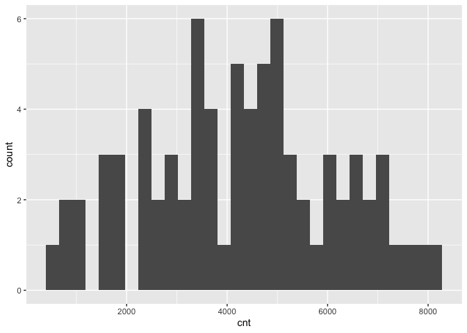
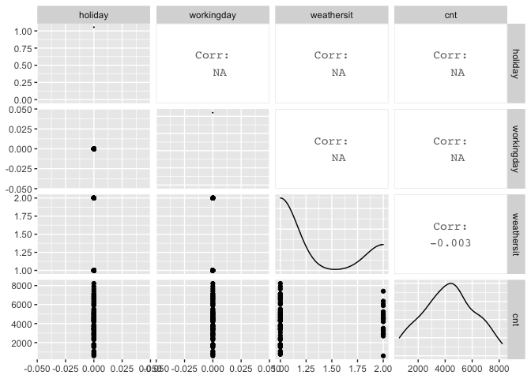
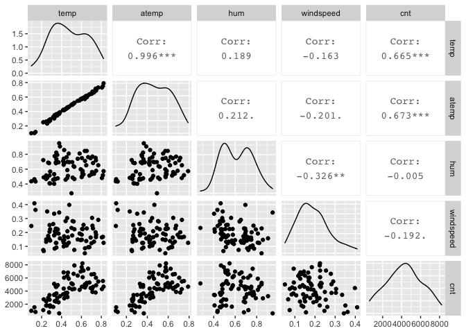
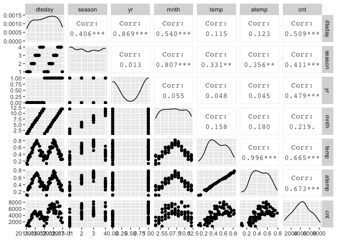

Project 2 - Karen Lopez
================
October 16, 2020

  - [Introduction](#introduction)
  - [Data](#data)
  - [Summarizations](#summarizations)
  - [Modeling](#modeling)

## Introduction

This project uses the bike sharing data set, day.csv, that’s located
*[here](https://archive.ics.uci.edu/ml/datasets/Bike+Sharing+Dataset)*
and contains 731 observations with 15 attributes. For modeling, the
response variable is the count of total rental bikes rented (*cnt*) and
11 of the 14 remaining variables will be considered for predictor
variables. Variables *casual* and *registered* are omitted and analysis
are performed on each *weekday* variable. The 11 remaining variables
include date, season, year, month, holiday, working day, weather,
temperature, feeling temperature, humidity, and wind speed.  
The purpose of this analysis is to fit two different tree models and
select the best one based on the appropriate criteria. This report will
be automated to run on the data set for each day of the week, starting
with Monday at 0, Tuesday at 1, and so on.  
Many methods I’ll use come from a variety of packages installed in this
first code chunk. First I will read in the data and randomly separate it
into the training set and testing set, with 70% of the data going into
the traiing set. Then I will create some summary statistics and various
data plots to view variable relationships and narrow down the predictor
variables. Lastly, I will train and fit the models to compare them and
pick the final model.  
To begin, necessary libraries are loaded so their functions are
accessible and global variables are set.

``` r
library(readr)
library(caret)
library(knitr)
library(corrplot)
library(dplyr)
library(tidyverse)
library(rpart)
num <- 12
```

## Data

The dataset is read in using a relative path and saved as an object. The
weekday variable is used to filter the data for each day of the week.
The data is then randomly split into a training and testing set, where
70% of the data goes into the training set and the remaining 30% goes
into the testing set.

``` r
#read in dataset with relative path & save to object
bikeData <- read_csv("Bike-Sharing-Dataset/day.csv") #read in data
#bikeData$weekday <- as.factor(bikeData$weekday) #convert weekday to factor
bikeData <- bikeData %>% filter(weekday==0)

#create partitions in data indexes with 70% going in the training set
set.seed(num)
trainIndex <- createDataPartition(bikeData$cnt, p = 0.7, list = FALSE)

#create train and test data set using the trainIndex vector
bikeDataTrain <- bikeData[trainIndex, ]
bikeDataTest <- bikeData[-trainIndex, ]

bikeDataTrain #view train data
```

    ## # A tibble: 76 x 16
    ##    instant dteday     season    yr  mnth holiday weekday workingday weathersit
    ##      <dbl> <date>      <dbl> <dbl> <dbl>   <dbl>   <dbl>      <dbl>      <dbl>
    ##  1       9 2011-01-09      1     0     1       0       0          0          1
    ##  2      23 2011-01-23      1     0     1       0       0          0          1
    ##  3      30 2011-01-30      1     0     1       0       0          0          1
    ##  4      37 2011-02-06      1     0     2       0       0          0          1
    ##  5      44 2011-02-13      1     0     2       0       0          0          1
    ##  6      51 2011-02-20      1     0     2       0       0          0          1
    ##  7      58 2011-02-27      1     0     2       0       0          0          1
    ##  8      65 2011-03-06      1     0     3       0       0          0          2
    ##  9      79 2011-03-20      1     0     3       0       0          0          1
    ## 10     100 2011-04-10      2     0     4       0       0          0          2
    ## # … with 66 more rows, and 7 more variables: temp <dbl>, atemp <dbl>,
    ## #   hum <dbl>, windspeed <dbl>, casual <dbl>, registered <dbl>, cnt <dbl>

``` r
bikeDataTest #view train data
```

    ## # A tibble: 29 x 16
    ##    instant dteday     season    yr  mnth holiday weekday workingday weathersit
    ##      <dbl> <date>      <dbl> <dbl> <dbl>   <dbl>   <dbl>      <dbl>      <dbl>
    ##  1       2 2011-01-02      1     0     1       0       0          0          2
    ##  2      16 2011-01-16      1     0     1       0       0          0          1
    ##  3      72 2011-03-13      1     0     3       0       0          0          1
    ##  4      86 2011-03-27      2     0     3       0       0          0          2
    ##  5      93 2011-04-03      2     0     4       0       0          0          1
    ##  6     135 2011-05-15      2     0     5       0       0          0          2
    ##  7     149 2011-05-29      2     0     5       0       0          0          1
    ##  8     170 2011-06-19      2     0     6       0       0          0          2
    ##  9     198 2011-07-17      3     0     7       0       0          0          1
    ## 10     205 2011-07-24      3     0     7       0       0          0          1
    ## # … with 19 more rows, and 7 more variables: temp <dbl>, atemp <dbl>,
    ## #   hum <dbl>, windspeed <dbl>, casual <dbl>, registered <dbl>, cnt <dbl>

## Summarizations

Just to get an overview of the data, I first look at the summary of all
variables, and the distribution of the rental bike counts. Then I delve
deeper into the variable relationships with the response variable,
count, and with each other using ggpairs. These correlations will help
me narrow down which variables to include in the tree models, but I can
also view their corresponding scatterplots and density curves.

``` r
#summary of training data set
summary(bikeDataTrain)
```

    ##     instant          dteday               season            yr        
    ##  Min.   :  9.0   Min.   :2011-01-09   Min.   :1.000   Min.   :0.0000  
    ##  1st Qu.:189.2   1st Qu.:2011-07-08   1st Qu.:1.000   1st Qu.:0.0000  
    ##  Median :404.5   Median :2012-02-08   Median :2.000   Median :1.0000  
    ##  Mean   :381.7   Mean   :2012-01-16   Mean   :2.474   Mean   :0.5395  
    ##  3rd Qu.:563.8   3rd Qu.:2012-07-16   3rd Qu.:4.000   3rd Qu.:1.0000  
    ##  Max.   :730.0   Max.   :2012-12-30   Max.   :4.000   Max.   :1.0000  
    ##       mnth           holiday     weekday    workingday   weathersit   
    ##  Min.   : 1.000   Min.   :0   Min.   :0   Min.   :0    Min.   :1.000  
    ##  1st Qu.: 4.000   1st Qu.:0   1st Qu.:0   1st Qu.:0    1st Qu.:1.000  
    ##  Median : 7.000   Median :0   Median :0   Median :0    Median :1.000  
    ##  Mean   : 6.605   Mean   :0   Mean   :0   Mean   :0    Mean   :1.263  
    ##  3rd Qu.:10.000   3rd Qu.:0   3rd Qu.:0   3rd Qu.:0    3rd Qu.:2.000  
    ##  Max.   :12.000   Max.   :0   Max.   :0   Max.   :0    Max.   :2.000  
    ##       temp             atemp              hum           windspeed      
    ##  Min.   :0.09652   Min.   :0.09884   Min.   :0.2758   Min.   :0.05038  
    ##  1st Qu.:0.33625   1st Qu.:0.33963   1st Qu.:0.4925   1st Qu.:0.13356  
    ##  Median :0.45875   Median :0.45296   Median :0.6152   Median :0.17880  
    ##  Mean   :0.47795   Mean   :0.46108   Mean   :0.6180   Mean   :0.19107  
    ##  3rd Qu.:0.62417   3rd Qu.:0.58428   3rd Qu.:0.7253   3rd Qu.:0.22886  
    ##  Max.   :0.82250   Max.   :0.79040   Max.   :0.9483   Max.   :0.40921  
    ##      casual         registered        cnt      
    ##  Min.   :  54.0   Min.   : 451   Min.   : 605  
    ##  1st Qu.: 637.8   1st Qu.:2249   1st Qu.:2940  
    ##  Median :1325.5   Median :2920   Median :4358  
    ##  Mean   :1323.8   Mean   :2961   Mean   :4284  
    ##  3rd Qu.:1960.0   3rd Qu.:3761   3rd Qu.:5481  
    ##  Max.   :2846.0   Max.   :5657   Max.   :8227

``` r
#quantitative histogram for cnt to view distribution
g <- ggplot(bikeDataTrain, aes(x=cnt))
g + geom_histogram()
```

<!-- -->

``` r
#create 3 plots of variables against each other and the response variable
bikeDataTrain1 <- bikeDataTrain %>% select(dteday, season, yr, mnth, cnt)
GGally::ggpairs(bikeDataTrain1)
```

<!-- -->

``` r
#all 3 might be of interest

bikeDataTrain2 <- bikeDataTrain %>% select(holiday, workingday, weathersit, cnt)
GGally::ggpairs(bikeDataTrain2)
```

<!-- -->

``` r
#none might be of interest (all corr N/A or negative)

bikeDataTrain3 <- bikeDataTrain %>% select(temp, atemp, hum, windspeed, cnt)
GGally::ggpairs(bikeDataTrain3)
```

<!-- -->

``` r
#temp & atemp might be of interest

bikeDataTrain4 <- bikeDataTrain %>% select(dteday, season, yr, mnth, temp, atemp, cnt)
GGally::ggpairs(bikeDataTrain4)
```

<!-- -->

``` r
# yr & atemp might be of more interest than the others 
```

Various predictor variables have interactions with each other, and I
want to focus on those with the lower correlation values, such as year,
temperature, and feeling temperature. The date, season, and month
variables will be omitted from further analysis because of their
stronger correlations with other variables. The temperature and feeling
temperature have a very strong correlation so I’ll only keep feeling
temperature for it’s slightly stronger correlation with the response
variable, and analyze it alongside the year variable. These variables
were chosen using the Monday data, and will be used for all other days
to keep analyses consistent.

## Modeling

Next I will utilize the `caret` package to create two tree models with
the training set and then predict each on the testing set, after
reducing both sets to include only the variables of interest. The models
are based on the response variable, *cnt*, being a continuous variable.
The predictors are *yr* and *atemp*, which are categorical (0: 2011, 1:
2012) and continuous variables, respectively.

The first model is a non-ensemble tree-based model chosen using
leave-one-out cross-validation, and the second model is a boosted tree
model chosen using 12-fold cross-validation. Just in case, and for good
practice, the predictor variables are standardize via centering and
scaling. Each model is then predicted on using the training set, and
their performances are compared via root mean square error (RMSE) and/or
mean absolute error (MAE) values.

``` r
#select only variables needed for modeling
bikeDataTrain <- bikeDataTrain %>% select(cnt, yr, atemp)
kable(head(bikeDataTrain)) #preview reduced train data
```

|  cnt | yr |     atemp |
| ---: | -: | --------: |
|  822 |  0 | 0.1161750 |
|  986 |  0 | 0.0988391 |
| 1096 |  0 | 0.2503220 |
| 1623 |  0 | 0.2916710 |
| 1589 |  0 | 0.3241130 |
| 1812 |  0 | 0.2773300 |

``` r
bikeDataTest <- bikeDataTest %>% select(cnt, yr, atemp)
kable(head(bikeDataTest)) #preview reduced test data
```

|  cnt | yr |    atemp |
| ---: | -: | -------: |
|  801 |  0 | 0.353739 |
| 1204 |  0 | 0.234217 |
| 2417 |  0 | 0.380091 |
| 1693 |  0 | 0.250339 |
| 3249 |  0 | 0.378767 |
| 4553 |  0 | 0.536000 |

``` r
#(not ensemble) tree-based model chosen using leave one out cross validation
#using regression tree to model cnt (continuous variable)
treeFit1 <- train(cnt ~ ., data = bikeDataTrain, method = "rpart", preProcess = c("center", "scale"), trControl = trainControl(method = "LOOCV"))
treeFit1 #view resulting tree parameters
```

    ## CART 
    ## 
    ## 76 samples
    ##  2 predictor
    ## 
    ## Pre-processing: centered (2), scaled (2) 
    ## Resampling: Leave-One-Out Cross-Validation 
    ## Summary of sample sizes: 75, 75, 75, 75, 75, 75, ... 
    ## Resampling results across tuning parameters:
    ## 
    ##   cp          RMSE      Rsquared      MAE     
    ##   0.05601484  1286.544  0.5347874118  1043.336
    ##   0.16772907  1535.245  0.3555363734  1312.820
    ##   0.50606257  2082.045  0.0006764519  1875.925
    ## 
    ## RMSE was used to select the optimal model using the smallest value.
    ## The final value used for the model was cp = 0.05601484.

``` r
#plot(treeFit1) #plot result

#boosted tree model chosen using cross-validation
treeFit2 <- train(cnt ~ ., data = bikeDataTrain, method = "gbm", preProcess = c("center", "scale"), trControl = trainControl(method = "cv", number = num))
```

    ## Iter   TrainDeviance   ValidDeviance   StepSize   Improve
    ##      1  3057912.4064             nan     0.1000 298255.6686
    ##      2  2809550.5282             nan     0.1000 257713.6811
    ##      3  2647150.8806             nan     0.1000 128247.9465
    ##      4  2421118.6328             nan     0.1000 213358.3748
    ##      5  2199452.9830             nan     0.1000 167721.5472
    ##      6  2058319.7508             nan     0.1000 97414.5575
    ##      7  1946024.4332             nan     0.1000 92761.1227
    ##      8  1864202.7968             nan     0.1000 89173.6745
    ##      9  1766363.7388             nan     0.1000 87232.0601
    ##     10  1654665.2355             nan     0.1000 83141.0885
    ##     20  1038762.0654             nan     0.1000 36279.1446
    ##     40   751770.0328             nan     0.1000 -9586.1618
    ##     60   674080.7725             nan     0.1000 -7992.9636
    ##     80   632907.8828             nan     0.1000 -3865.5709
    ##    100   595770.7641             nan     0.1000 -10719.3443
    ##    120   568636.6466             nan     0.1000 -10853.7343
    ##    140   549757.5065             nan     0.1000 -1355.6394
    ##    150   535981.4590             nan     0.1000 -6278.4109
    ## 
    ## Iter   TrainDeviance   ValidDeviance   StepSize   Improve
    ##      1  3001743.9872             nan     0.1000 276161.7252
    ##      2  2670574.1574             nan     0.1000 295521.1511
    ##      3  2355833.6317             nan     0.1000 319489.4743
    ##      4  2128820.9747             nan     0.1000 212560.4916
    ##      5  1940695.3974             nan     0.1000 180248.5381
    ##      6  1759853.9157             nan     0.1000 140871.7443
    ##      7  1652029.9863             nan     0.1000 116637.2325
    ##      8  1560264.5139             nan     0.1000 98679.9277
    ##      9  1437352.5439             nan     0.1000 128714.8306
    ##     10  1344663.0709             nan     0.1000 55427.8375
    ##     20   893645.1034             nan     0.1000 16990.6356
    ##     40   666296.2876             nan     0.1000 -2213.9075
    ##     60   614666.1330             nan     0.1000 1420.7691
    ##     80   564322.2889             nan     0.1000 -350.6993
    ##    100   519719.6592             nan     0.1000 -2400.5071
    ##    120   484001.8696             nan     0.1000 -9372.4255
    ##    140   463934.6494             nan     0.1000 -3356.5714
    ##    150   452588.1049             nan     0.1000 -871.2172
    ## 
    ## Iter   TrainDeviance   ValidDeviance   StepSize   Improve
    ##      1  3090260.1264             nan     0.1000 258350.8519
    ##      2  2797215.6461             nan     0.1000 229518.1582
    ##      3  2566788.3952             nan     0.1000 186388.9700
    ##      4  2367570.5786             nan     0.1000 173138.2574
    ##      5  2192268.6122             nan     0.1000 159932.1781
    ##      6  1996414.5112             nan     0.1000 172119.1125
    ##      7  1883067.9271             nan     0.1000 59887.5635
    ##      8  1758736.7035             nan     0.1000 109006.7341
    ##      9  1674728.0632             nan     0.1000 61533.5780
    ##     10  1540682.5114             nan     0.1000 132574.3166
    ##     20   917195.7154             nan     0.1000 20218.9837
    ##     40   663141.7817             nan     0.1000 -18993.7840
    ##     60   607495.2413             nan     0.1000 -5338.9333
    ##     80   570912.4031             nan     0.1000  171.6730
    ##    100   502615.7421             nan     0.1000 -13511.3378
    ##    120   472559.8091             nan     0.1000 -13065.4232
    ##    140   451549.4235             nan     0.1000 -2408.5131
    ##    150   438807.2430             nan     0.1000 -7609.9808
    ## 
    ## Iter   TrainDeviance   ValidDeviance   StepSize   Improve
    ##      1  2999005.2732             nan     0.1000 278004.1528
    ##      2  2815510.5675             nan     0.1000 212929.8176
    ##      3  2692266.3129             nan     0.1000 128922.4774
    ##      4  2430378.2322             nan     0.1000 206490.0588
    ##      5  2212223.5645             nan     0.1000 169401.6980
    ##      6  2063454.7389             nan     0.1000 100418.9606
    ##      7  1888782.3807             nan     0.1000 32452.4511
    ##      8  1780239.5792             nan     0.1000 100233.3089
    ##      9  1680057.3615             nan     0.1000 12677.6786
    ##     10  1578531.9102             nan     0.1000 106148.7405
    ##     20  1043049.9264             nan     0.1000 14446.1696
    ##     40   798552.8251             nan     0.1000 3050.5787
    ##     60   719431.1197             nan     0.1000 -17833.1311
    ##     80   691814.8623             nan     0.1000 -4605.4052
    ##    100   649711.0892             nan     0.1000 -4054.6386
    ##    120   619989.6386             nan     0.1000 -11911.6017
    ##    140   600692.2705             nan     0.1000 -4308.1122
    ##    150   581571.6130             nan     0.1000 -292.1926
    ## 
    ## Iter   TrainDeviance   ValidDeviance   StepSize   Improve
    ##      1  2995590.0929             nan     0.1000 437475.8771
    ##      2  2699048.5408             nan     0.1000 227960.5726
    ##      3  2527851.0223             nan     0.1000 188092.8149
    ##      4  2333678.2374             nan     0.1000 161124.1142
    ##      5  2201103.0861             nan     0.1000 136652.9559
    ##      6  1983012.8775             nan     0.1000 226579.2803
    ##      7  1806404.4317             nan     0.1000 174552.2313
    ##      8  1685157.9306             nan     0.1000 66349.1739
    ##      9  1602523.3249             nan     0.1000 54962.4652
    ##     10  1486091.6230             nan     0.1000 108109.6522
    ##     20   941814.7688             nan     0.1000 9425.4304
    ##     40   747731.7435             nan     0.1000 -7853.8830
    ##     60   689839.5054             nan     0.1000 -11694.5087
    ##     80   645512.9639             nan     0.1000 -7316.1694
    ##    100   618500.5326             nan     0.1000 -11334.8894
    ##    120   583030.1448             nan     0.1000 -3303.7319
    ##    140   559099.3676             nan     0.1000 -4101.0785
    ##    150   547432.2345             nan     0.1000 -4921.1486
    ## 
    ## Iter   TrainDeviance   ValidDeviance   StepSize   Improve
    ##      1  2934401.2495             nan     0.1000 442447.6154
    ##      2  2630447.8405             nan     0.1000 212963.1003
    ##      3  2426388.4333             nan     0.1000 198262.4739
    ##      4  2259454.0582             nan     0.1000 99289.9648
    ##      5  2062503.7723             nan     0.1000 155064.6046
    ##      6  1828677.7963             nan     0.1000 234570.6887
    ##      7  1717375.7909             nan     0.1000 103315.0172
    ##      8  1616720.7696             nan     0.1000 84197.9630
    ##      9  1526585.0482             nan     0.1000 43645.7070
    ##     10  1393198.4773             nan     0.1000 114995.0182
    ##     20   954797.5492             nan     0.1000 8723.1454
    ##     40   722892.6001             nan     0.1000 -653.4144
    ##     60   676839.3232             nan     0.1000 -5758.6757
    ##     80   630404.0041             nan     0.1000 -1335.4332
    ##    100   588846.0374             nan     0.1000 -8555.0837
    ##    120   567032.9292             nan     0.1000 -9638.3316
    ##    140   540525.9927             nan     0.1000 -7307.2798
    ##    150   522603.3403             nan     0.1000 -5320.0768
    ## 
    ## Iter   TrainDeviance   ValidDeviance   StepSize   Improve
    ##      1  3037555.5475             nan     0.1000 320206.4330
    ##      2  2698594.8062             nan     0.1000 228290.2753
    ##      3  2508875.8992             nan     0.1000 181204.0063
    ##      4  2356957.3419             nan     0.1000 130694.5147
    ##      5  2196148.6907             nan     0.1000 119926.8282
    ##      6  2069692.8135             nan     0.1000 131068.5281
    ##      7  1929571.4194             nan     0.1000 75928.0257
    ##      8  1800189.2469             nan     0.1000 111343.3335
    ##      9  1712659.4757             nan     0.1000 71850.3355
    ##     10  1662256.3794             nan     0.1000 42079.5326
    ##     20  1097432.8528             nan     0.1000 18592.8244
    ##     40   769611.8697             nan     0.1000 -5378.3382
    ##     60   696221.1796             nan     0.1000 -2961.7323
    ##     80   655788.9567             nan     0.1000 -14231.1600
    ##    100   628810.9072             nan     0.1000 -4586.8603
    ##    120   596935.1152             nan     0.1000  928.8597
    ##    140   572539.6619             nan     0.1000 -1374.0603
    ##    150   565262.8183             nan     0.1000 -2079.4649
    ## 
    ## Iter   TrainDeviance   ValidDeviance   StepSize   Improve
    ##      1  2997029.2968             nan     0.1000 324684.3532
    ##      2  2754817.3887             nan     0.1000 210580.3185
    ##      3  2501991.2444             nan     0.1000 210753.0051
    ##      4  2336236.2663             nan     0.1000 139521.8949
    ##      5  2065693.5615             nan     0.1000 270149.7035
    ##      6  1971429.2100             nan     0.1000 105352.6281
    ##      7  1875536.4124             nan     0.1000 88727.0854
    ##      8  1642737.2655             nan     0.1000 160607.2038
    ##      9  1566059.1042             nan     0.1000 54610.8101
    ##     10  1505952.1910             nan     0.1000 66874.3487
    ##     20   990477.8135             nan     0.1000 16102.7337
    ##     40   709062.1101             nan     0.1000 7826.4707
    ##     60   619981.1445             nan     0.1000 -5551.1546
    ##     80   574314.3739             nan     0.1000 -1684.0522
    ##    100   547294.5473             nan     0.1000 -2709.3656
    ##    120   529595.0013             nan     0.1000 -1367.7250
    ##    140   517293.6549             nan     0.1000 -9271.7723
    ##    150   504987.9251             nan     0.1000 -256.2771
    ## 
    ## Iter   TrainDeviance   ValidDeviance   StepSize   Improve
    ##      1  2938943.8051             nan     0.1000 365347.4463
    ##      2  2635301.2235             nan     0.1000 359326.9620
    ##      3  2438583.1617             nan     0.1000 206678.3269
    ##      4  2257153.6210             nan     0.1000 143972.2820
    ##      5  2066799.6070             nan     0.1000 246181.4990
    ##      6  1963235.4258             nan     0.1000 107208.1008
    ##      7  1832489.2350             nan     0.1000 120938.5293
    ##      8  1734888.8067             nan     0.1000 75566.4559
    ##      9  1631565.9962             nan     0.1000 72617.4424
    ##     10  1498821.0141             nan     0.1000 93024.5703
    ##     20   926922.0599             nan     0.1000 19156.6763
    ##     40   625121.2025             nan     0.1000 -2105.9624
    ##     60   577559.3221             nan     0.1000 -1934.6246
    ##     80   543838.6570             nan     0.1000 -8783.1198
    ##    100   518899.6962             nan     0.1000 -1575.2939
    ##    120   497945.9133             nan     0.1000 -2812.2133
    ##    140   473419.0870             nan     0.1000 -13036.1022
    ##    150   463137.3468             nan     0.1000 -7847.7555
    ## 
    ## Iter   TrainDeviance   ValidDeviance   StepSize   Improve
    ##      1  3329872.4852             nan     0.1000 247001.3367
    ##      2  3053110.4070             nan     0.1000 286627.8303
    ##      3  2761514.8425             nan     0.1000 202359.5183
    ##      4  2542154.0075             nan     0.1000 152219.8763
    ##      5  2366746.9092             nan     0.1000 154949.2307
    ##      6  2197579.1038             nan     0.1000 110409.7758
    ##      7  2024457.4884             nan     0.1000 101449.7360
    ##      8  1884081.2460             nan     0.1000 85604.4359
    ##      9  1748118.6507             nan     0.1000 118784.0281
    ##     10  1649753.1266             nan     0.1000 80516.4896
    ##     20  1069986.2309             nan     0.1000 -12532.2949
    ##     40   825887.9119             nan     0.1000 1236.6286
    ##     60   753992.0872             nan     0.1000 -2352.5437
    ##     80   720048.3453             nan     0.1000 -5668.6692
    ##    100   699358.2038             nan     0.1000 -10905.0092
    ##    120   675503.2727             nan     0.1000 -1537.8031
    ##    140   663839.1705             nan     0.1000 -12424.7857
    ##    150   651803.1556             nan     0.1000 -153.3469
    ## 
    ## Iter   TrainDeviance   ValidDeviance   StepSize   Improve
    ##      1  3220778.2938             nan     0.1000 354172.8426
    ##      2  3028715.1341             nan     0.1000 173834.6098
    ##      3  2773096.5921             nan     0.1000 241192.7470
    ##      4  2543013.0710             nan     0.1000 238657.8753
    ##      5  2379910.5225             nan     0.1000 164923.7812
    ##      6  2231040.4446             nan     0.1000 124193.9914
    ##      7  2079769.6933             nan     0.1000 118468.3568
    ##      8  1881202.1916             nan     0.1000 192392.2820
    ##      9  1741645.0382             nan     0.1000 91247.8093
    ##     10  1643090.6835             nan     0.1000 79132.1331
    ##     20  1051622.8939             nan     0.1000 19446.0930
    ##     40   756334.9530             nan     0.1000 -10233.5313
    ##     60   705063.7105             nan     0.1000 -5859.9524
    ##     80   673384.7762             nan     0.1000 -19394.8137
    ##    100   639184.6576             nan     0.1000 -3019.4798
    ##    120   603226.0686             nan     0.1000 -4534.1063
    ##    140   580150.3396             nan     0.1000 -10479.9754
    ##    150   558146.5245             nan     0.1000 -5681.3008
    ## 
    ## Iter   TrainDeviance   ValidDeviance   StepSize   Improve
    ##      1  3190979.2416             nan     0.1000 423442.3407
    ##      2  2846682.0008             nan     0.1000 353055.4009
    ##      3  2641342.9256             nan     0.1000 232500.2643
    ##      4  2459930.6657             nan     0.1000 178883.8307
    ##      5  2144433.7900             nan     0.1000 251366.2095
    ##      6  1997935.8287             nan     0.1000 128245.6978
    ##      7  1875182.3866             nan     0.1000 85212.4441
    ##      8  1739352.6141             nan     0.1000 117511.3816
    ##      9  1616498.6714             nan     0.1000 74383.6411
    ##     10  1522645.6517             nan     0.1000 31416.2133
    ##     20   992654.1532             nan     0.1000 2600.5855
    ##     40   760089.9432             nan     0.1000 -12687.5835
    ##     60   712656.7989             nan     0.1000 -5548.8434
    ##     80   648402.0308             nan     0.1000  985.7171
    ##    100   599464.2198             nan     0.1000 -2868.8750
    ##    120   559940.9848             nan     0.1000 -7265.9187
    ##    140   551097.9859             nan     0.1000 -4489.2104
    ##    150   531492.8047             nan     0.1000 -5187.5448
    ## 
    ## Iter   TrainDeviance   ValidDeviance   StepSize   Improve
    ##      1  3130795.3590             nan     0.1000 312815.5995
    ##      2  2873660.6768             nan     0.1000 169928.4744
    ##      3  2662593.1019             nan     0.1000 210680.7221
    ##      4  2490946.4134             nan     0.1000 138299.5226
    ##      5  2309796.7546             nan     0.1000 162160.3205
    ##      6  2144113.2170             nan     0.1000 120784.4735
    ##      7  2042243.8649             nan     0.1000 50432.9760
    ##      8  1941662.0298             nan     0.1000 39237.7746
    ##      9  1844710.4967             nan     0.1000 -24312.0091
    ##     10  1724252.8816             nan     0.1000 134035.7400
    ##     20  1065960.4942             nan     0.1000 15271.4359
    ##     40   778561.5816             nan     0.1000 -25259.2330
    ##     60   717677.0698             nan     0.1000 -11458.5247
    ##     80   673147.0900             nan     0.1000  -99.9436
    ##    100   645527.3364             nan     0.1000 -5560.9659
    ##    120   627306.9805             nan     0.1000 -2725.2433
    ##    140   605228.2558             nan     0.1000 -11927.1612
    ##    150   588321.4385             nan     0.1000 -3086.1155
    ## 
    ## Iter   TrainDeviance   ValidDeviance   StepSize   Improve
    ##      1  2953136.7923             nan     0.1000 448411.2996
    ##      2  2671091.2865             nan     0.1000 233032.8593
    ##      3  2440701.8214             nan     0.1000 193422.8780
    ##      4  2243508.2402             nan     0.1000 110737.4503
    ##      5  2120561.6699             nan     0.1000 106915.3315
    ##      6  1998718.5886             nan     0.1000 132528.0437
    ##      7  1878466.6411             nan     0.1000 102880.6155
    ##      8  1768576.0670             nan     0.1000 87849.3411
    ##      9  1612225.9281             nan     0.1000 162933.3554
    ##     10  1532487.7906             nan     0.1000 68840.4128
    ##     20   925227.3498             nan     0.1000 13015.0403
    ##     40   717815.8410             nan     0.1000 -4180.1907
    ##     60   662455.9778             nan     0.1000 -5548.9127
    ##     80   617989.2089             nan     0.1000 -3596.1565
    ##    100   570960.3511             nan     0.1000 -1119.9762
    ##    120   532740.8777             nan     0.1000 -11944.6679
    ##    140   495886.0989             nan     0.1000 -6194.5072
    ##    150   482664.0348             nan     0.1000 -11783.1620
    ## 
    ## Iter   TrainDeviance   ValidDeviance   StepSize   Improve
    ##      1  3126229.1181             nan     0.1000 333474.2212
    ##      2  2918793.3502             nan     0.1000 256502.1335
    ##      3  2685673.6992             nan     0.1000 232050.2275
    ##      4  2475923.2244             nan     0.1000 160555.0656
    ##      5  2234004.6780             nan     0.1000 231193.6670
    ##      6  2088583.7090             nan     0.1000 128217.0117
    ##      7  1934588.1486             nan     0.1000 129010.8264
    ##      8  1822550.2569             nan     0.1000 93979.5882
    ##      9  1734620.4099             nan     0.1000 96680.8213
    ##     10  1657403.6011             nan     0.1000 52211.5600
    ##     20  1034209.5702             nan     0.1000 18200.7016
    ##     40   797705.0640             nan     0.1000 -22825.5207
    ##     60   701780.5945             nan     0.1000 -5696.4280
    ##     80   651550.5444             nan     0.1000  618.4155
    ##    100   620873.5976             nan     0.1000 -11090.4201
    ##    120   586298.7657             nan     0.1000 -4052.1303
    ##    140   551238.9051             nan     0.1000 -2631.3878
    ##    150   540360.9207             nan     0.1000 -4303.7809
    ## 
    ## Iter   TrainDeviance   ValidDeviance   StepSize   Improve
    ##      1  3118021.6301             nan     0.1000 333700.9329
    ##      2  2843734.6420             nan     0.1000 253889.9827
    ##      3  2570610.5677             nan     0.1000 218105.5586
    ##      4  2414012.0804             nan     0.1000 135161.1038
    ##      5  2228492.3711             nan     0.1000 103859.0168
    ##      6  2095018.5570             nan     0.1000 57699.5916
    ##      7  1939578.9379             nan     0.1000 107086.1529
    ##      8  1832055.6702             nan     0.1000 92558.4008
    ##      9  1753828.6409             nan     0.1000 68963.5431
    ##     10  1700041.7675             nan     0.1000 53040.4518
    ##     20  1093336.3108             nan     0.1000 8819.1832
    ##     40   844981.2978             nan     0.1000 -9111.1449
    ##     60   782968.4426             nan     0.1000 -10850.0787
    ##     80   745408.4721             nan     0.1000  264.8563
    ##    100   714188.0079             nan     0.1000 -7183.9108
    ##    120   684996.6461             nan     0.1000 -11721.0172
    ##    140   664653.5398             nan     0.1000 -15410.3788
    ##    150   652782.5943             nan     0.1000 -1934.8300
    ## 
    ## Iter   TrainDeviance   ValidDeviance   StepSize   Improve
    ##      1  3000770.1973             nan     0.1000 486855.6122
    ##      2  2738088.1925             nan     0.1000 243916.7888
    ##      3  2537107.0330             nan     0.1000 203927.4916
    ##      4  2352523.5956             nan     0.1000 185239.9033
    ##      5  2203174.4929             nan     0.1000 137805.6148
    ##      6  2107411.6582             nan     0.1000 99961.8584
    ##      7  1967864.8237             nan     0.1000 90067.2069
    ##      8  1832599.7672             nan     0.1000 92861.9139
    ##      9  1725706.2664             nan     0.1000 76340.0479
    ##     10  1580463.4313             nan     0.1000 120914.7629
    ##     20  1013420.4601             nan     0.1000 18490.0048
    ##     40   747552.8474             nan     0.1000 -3297.0133
    ##     60   703238.7678             nan     0.1000 -11088.7660
    ##     80   675161.4022             nan     0.1000 -25905.7810
    ##    100   626010.9504             nan     0.1000 -7886.7271
    ##    120   590629.1654             nan     0.1000  636.5265
    ##    140   560541.2866             nan     0.1000 -3170.8903
    ##    150   545482.3808             nan     0.1000 -7141.6914
    ## 
    ## Iter   TrainDeviance   ValidDeviance   StepSize   Improve
    ##      1  3123740.3509             nan     0.1000 380797.3381
    ##      2  2864014.4580             nan     0.1000 292797.6302
    ##      3  2528360.3195             nan     0.1000 336635.5612
    ##      4  2312014.3667             nan     0.1000 192471.9735
    ##      5  2106467.9031             nan     0.1000 232071.6837
    ##      6  1906630.3570             nan     0.1000 183447.0586
    ##      7  1774474.3125             nan     0.1000 148754.7662
    ##      8  1693487.0511             nan     0.1000 70616.4403
    ##      9  1623516.4396             nan     0.1000 66730.3204
    ##     10  1528509.4415             nan     0.1000 61942.8957
    ##     20  1035846.7497             nan     0.1000 15380.5426
    ##     40   830817.2888             nan     0.1000 -6365.3348
    ##     60   769969.2829             nan     0.1000  -84.5617
    ##     80   716371.9230             nan     0.1000 -27667.9464
    ##    100   684589.7883             nan     0.1000 -11150.0913
    ##    120   655345.5783             nan     0.1000 -28416.3687
    ##    140   635136.9362             nan     0.1000 -6315.3178
    ##    150   629452.4873             nan     0.1000 -594.7866
    ## 
    ## Iter   TrainDeviance   ValidDeviance   StepSize   Improve
    ##      1  3227439.3747             nan     0.1000 237078.8162
    ##      2  2921007.5186             nan     0.1000 295696.1922
    ##      3  2703208.6013             nan     0.1000 230140.1317
    ##      4  2453640.3884             nan     0.1000 185108.6685
    ##      5  2323947.9592             nan     0.1000 131211.3077
    ##      6  2176170.9262             nan     0.1000 127962.7468
    ##      7  2070185.0850             nan     0.1000 85016.6396
    ##      8  2005118.8395             nan     0.1000 39581.3407
    ##      9  1881542.6781             nan     0.1000 104677.8316
    ##     10  1785504.3776             nan     0.1000 75480.7968
    ##     20  1219414.8759             nan     0.1000 16783.6134
    ##     40   901414.7130             nan     0.1000 -5185.2394
    ##     60   835560.4464             nan     0.1000 -1308.1532
    ##     80   799085.4231             nan     0.1000 -11007.5253
    ##    100   756293.9720             nan     0.1000 2592.3951
    ##    120   729289.7592             nan     0.1000 -5279.2337
    ##    140   697613.0799             nan     0.1000 -1302.7686
    ##    150   687079.7622             nan     0.1000 -2862.2202
    ## 
    ## Iter   TrainDeviance   ValidDeviance   StepSize   Improve
    ##      1  3073863.9391             nan     0.1000 424199.4397
    ##      2  2749907.6171             nan     0.1000 242485.5240
    ##      3  2554094.5316             nan     0.1000 217584.8261
    ##      4  2315044.0443             nan     0.1000 165980.2743
    ##      5  2073014.6283             nan     0.1000 157488.5482
    ##      6  1962468.8453             nan     0.1000 111096.0089
    ##      7  1728237.6447             nan     0.1000 172713.3422
    ##      8  1604759.6634             nan     0.1000 75069.8384
    ##      9  1452571.9325             nan     0.1000 113175.9241
    ##     10  1404324.2949             nan     0.1000 44108.7814
    ##     20   982063.2118             nan     0.1000 24665.2699
    ##     40   761069.0279             nan     0.1000 5147.1448
    ##     60   696391.4426             nan     0.1000 -6257.4004
    ##     80   642590.7820             nan     0.1000 -1688.6155
    ##    100   614849.0339             nan     0.1000 -5421.6531
    ##    120   592640.4952             nan     0.1000 -8826.8393
    ##    140   557567.3229             nan     0.1000 -6096.7838
    ##    150   550811.5092             nan     0.1000 -7136.3930
    ## 
    ## Iter   TrainDeviance   ValidDeviance   StepSize   Improve
    ##      1  3041283.6458             nan     0.1000 261663.0625
    ##      2  2798907.4942             nan     0.1000 233254.9076
    ##      3  2562957.5039             nan     0.1000 304669.5934
    ##      4  2340499.0635             nan     0.1000 139539.2632
    ##      5  2204338.8570             nan     0.1000 113538.9539
    ##      6  2039353.8581             nan     0.1000 131249.8927
    ##      7  1902539.8736             nan     0.1000 125108.0268
    ##      8  1720071.9350             nan     0.1000 163673.1644
    ##      9  1638449.3137             nan     0.1000 65359.5466
    ##     10  1531368.8666             nan     0.1000 97588.1279
    ##     20  1046267.6317             nan     0.1000 14532.2679
    ##     40   848961.2852             nan     0.1000 -10934.2630
    ##     60   757889.3896             nan     0.1000 -8577.3831
    ##     80   716436.8460             nan     0.1000 -2912.7618
    ##    100   653790.8630             nan     0.1000 -15026.5959
    ##    120   635649.0136             nan     0.1000 -5957.2728
    ##    140   596035.0483             nan     0.1000 -6441.5739
    ##    150   588488.8628             nan     0.1000 -4916.5776
    ## 
    ## Iter   TrainDeviance   ValidDeviance   StepSize   Improve
    ##      1  3269875.7181             nan     0.1000 341686.5835
    ##      2  2977786.6292             nan     0.1000 295885.8441
    ##      3  2806955.1382             nan     0.1000 145508.6382
    ##      4  2573765.7711             nan     0.1000 160126.3447
    ##      5  2350723.1597             nan     0.1000 178898.0866
    ##      6  2190281.9845             nan     0.1000 102595.9039
    ##      7  2002826.9005             nan     0.1000 94187.6541
    ##      8  1879269.7873             nan     0.1000 60263.1822
    ##      9  1786894.8683             nan     0.1000 68185.7412
    ##     10  1636766.5438             nan     0.1000 98068.1869
    ##     20  1065773.5145             nan     0.1000 20224.6534
    ##     40   821783.6335             nan     0.1000 -330.9350
    ##     60   765170.9706             nan     0.1000 -2404.4436
    ##     80   725648.6534             nan     0.1000 -2628.4319
    ##    100   684452.0931             nan     0.1000  -69.7198
    ##    120   668374.0666             nan     0.1000 -1954.6007
    ##    140   645080.7027             nan     0.1000 -8129.7871
    ##    150   636008.4802             nan     0.1000 -2637.0048
    ## 
    ## Iter   TrainDeviance   ValidDeviance   StepSize   Improve
    ##      1  3266106.0315             nan     0.1000 351262.0919
    ##      2  2793265.0754             nan     0.1000 419542.7551
    ##      3  2502062.7078             nan     0.1000 176355.3499
    ##      4  2324359.9535             nan     0.1000 157126.8872
    ##      5  2118336.6881             nan     0.1000 128454.6333
    ##      6  1926654.7715             nan     0.1000 147824.2755
    ##      7  1810815.9146             nan     0.1000 92497.2330
    ##      8  1731828.3770             nan     0.1000 54402.2534
    ##      9  1639954.1698             nan     0.1000 63371.8153
    ##     10  1573337.8943             nan     0.1000 61797.3383
    ##     20  1056882.6694             nan     0.1000 20439.4047
    ##     40   815637.3443             nan     0.1000 -17452.8789
    ##     60   728733.5343             nan     0.1000 -9193.8396
    ##     80   671259.5935             nan     0.1000 -7478.8435
    ##    100   624722.4617             nan     0.1000 -2429.6450
    ##    120   599321.2328             nan     0.1000 -2817.5312
    ##    140   564481.6895             nan     0.1000 -10470.9799
    ##    150   552762.0364             nan     0.1000 -7540.2167
    ## 
    ## Iter   TrainDeviance   ValidDeviance   StepSize   Improve
    ##      1  3231157.2997             nan     0.1000 297683.7223
    ##      2  2910004.3037             nan     0.1000 261415.5378
    ##      3  2671635.3615             nan     0.1000 174437.9464
    ##      4  2470661.0040             nan     0.1000 149278.4324
    ##      5  2303727.3007             nan     0.1000 116251.2430
    ##      6  2103581.1220             nan     0.1000 207230.6952
    ##      7  1977927.4055             nan     0.1000 107205.1781
    ##      8  1817969.8485             nan     0.1000 126413.6735
    ##      9  1735923.3390             nan     0.1000 57788.5460
    ##     10  1582919.2510             nan     0.1000 146355.0891
    ##     20   997069.8480             nan     0.1000 6140.2155
    ##     40   799070.1240             nan     0.1000 -8425.3031
    ##     60   711131.6093             nan     0.1000 -7047.5296
    ##     80   663065.1076             nan     0.1000 -9871.7920
    ##    100   594739.1675             nan     0.1000 -4392.4716
    ##    120   554392.5664             nan     0.1000 -4199.2060
    ##    140   533655.3176             nan     0.1000 -4282.9112
    ##    150   523115.8957             nan     0.1000 -17221.5229
    ## 
    ## Iter   TrainDeviance   ValidDeviance   StepSize   Improve
    ##      1  3117457.5547             nan     0.1000 274752.2719
    ##      2  2908995.9831             nan     0.1000 235126.3705
    ##      3  2644385.5974             nan     0.1000 194881.1312
    ##      4  2493571.5167             nan     0.1000 168479.7434
    ##      5  2357494.7334             nan     0.1000 129930.6648
    ##      6  2214812.2511             nan     0.1000 114093.5502
    ##      7  2097652.8264             nan     0.1000 81810.7335
    ##      8  1980504.8939             nan     0.1000 135839.3194
    ##      9  1856016.5876             nan     0.1000 117061.1219
    ##     10  1744856.2099             nan     0.1000 85799.4730
    ##     20  1128250.7898             nan     0.1000 26061.4945
    ##     40   862897.8834             nan     0.1000 -20279.6797
    ##     60   769045.4600             nan     0.1000 -3063.3177
    ##     80   718830.3399             nan     0.1000 -2793.6679
    ##    100   674272.3939             nan     0.1000 -7039.8769
    ##    120   664189.5631             nan     0.1000 -4898.4462
    ##    140   624352.2614             nan     0.1000 -12378.8787
    ##    150   613643.4472             nan     0.1000 -23271.4794
    ## 
    ## Iter   TrainDeviance   ValidDeviance   StepSize   Improve
    ##      1  3095042.9992             nan     0.1000 299072.6192
    ##      2  2838722.5909             nan     0.1000 238372.8811
    ##      3  2530009.0770             nan     0.1000 329913.3817
    ##      4  2324007.5445             nan     0.1000 167281.7524
    ##      5  2094473.6618             nan     0.1000 216455.7720
    ##      6  1972025.8706             nan     0.1000 114200.5700
    ##      7  1787686.2844             nan     0.1000 164568.6462
    ##      8  1659508.8958             nan     0.1000 71363.0956
    ##      9  1513901.5113             nan     0.1000 123842.3576
    ##     10  1460638.3434             nan     0.1000 67879.0204
    ##     20  1020435.0790             nan     0.1000 -14165.0296
    ##     40   810461.7377             nan     0.1000 -17821.6292
    ##     60   762684.0333             nan     0.1000 -3843.9653
    ##     80   717447.4806             nan     0.1000 -18609.1321
    ##    100   679663.0934             nan     0.1000  352.8440
    ##    120   636888.6379             nan     0.1000 -3345.7939
    ##    140   612490.4009             nan     0.1000 -5408.2573
    ##    150   599757.0359             nan     0.1000 -6425.2481
    ## 
    ## Iter   TrainDeviance   ValidDeviance   StepSize   Improve
    ##      1  3072906.0786             nan     0.1000 276851.1916
    ##      2  2818433.5099             nan     0.1000 232555.5183
    ##      3  2613248.8946             nan     0.1000 207948.3898
    ##      4  2437495.4059             nan     0.1000 151045.9681
    ##      5  2211706.8797             nan     0.1000 222511.7417
    ##      6  2078905.5250             nan     0.1000 93289.3451
    ##      7  1862003.2918             nan     0.1000 193011.1280
    ##      8  1740915.8760             nan     0.1000 72998.2122
    ##      9  1650669.2527             nan     0.1000 56859.0820
    ##     10  1520031.3704             nan     0.1000 77648.3139
    ##     20   995942.0177             nan     0.1000 -11247.4037
    ##     40   810307.5434             nan     0.1000 -8832.5726
    ##     60   703299.0094             nan     0.1000 1017.1502
    ##     80   648613.0603             nan     0.1000 -12368.0448
    ##    100   608522.3716             nan     0.1000 -5180.2541
    ##    120   562588.3433             nan     0.1000 -4868.5067
    ##    140   535981.6543             nan     0.1000 -3218.0359
    ##    150   522474.3939             nan     0.1000 -8371.8660
    ## 
    ## Iter   TrainDeviance   ValidDeviance   StepSize   Improve
    ##      1  3234076.5093             nan     0.1000 380149.4316
    ##      2  2886634.7550             nan     0.1000 162531.4324
    ##      3  2623997.0609             nan     0.1000 187288.0424
    ##      4  2435677.6825             nan     0.1000 193010.1709
    ##      5  2279967.6602             nan     0.1000 107271.5388
    ##      6  2127684.9632             nan     0.1000 124331.0927
    ##      7  2006153.9274             nan     0.1000 127814.7791
    ##      8  1868585.0602             nan     0.1000 114155.6389
    ##      9  1767481.2395             nan     0.1000 93510.2394
    ##     10  1679685.7170             nan     0.1000 64208.5985
    ##     20  1071336.1841             nan     0.1000 22384.6566
    ##     40   799326.8829             nan     0.1000 -5099.8525
    ##     60   761918.1986             nan     0.1000 -3912.1646
    ##     80   726856.0485             nan     0.1000 -3469.4056
    ##    100   697099.3037             nan     0.1000 -9918.7842
    ##    120   677906.2531             nan     0.1000 -8758.2841
    ##    140   646310.8033             nan     0.1000 -253.4454
    ##    150   640889.5885             nan     0.1000 -12037.9460
    ## 
    ## Iter   TrainDeviance   ValidDeviance   StepSize   Improve
    ##      1  3263318.9801             nan     0.1000 386449.5965
    ##      2  2997140.2805             nan     0.1000 236940.4715
    ##      3  2686719.6382             nan     0.1000 237120.4902
    ##      4  2523911.5192             nan     0.1000 151886.5372
    ##      5  2296148.8163             nan     0.1000 197877.5292
    ##      6  2066060.2846             nan     0.1000 234782.8064
    ##      7  1915439.4030             nan     0.1000 120808.0651
    ##      8  1808664.8464             nan     0.1000 112279.1524
    ##      9  1669946.0909             nan     0.1000 93534.2820
    ##     10  1545457.8194             nan     0.1000 134760.3793
    ##     20   954184.2120             nan     0.1000 34907.5568
    ##     40   724565.9068             nan     0.1000 -9677.2350
    ##     60   656349.9927             nan     0.1000 -3541.5340
    ##     80   609276.8159             nan     0.1000 -1574.9062
    ##    100   576667.8607             nan     0.1000 -7247.4278
    ##    120   555213.6917             nan     0.1000 -6293.5023
    ##    140   520130.8523             nan     0.1000 -302.7035
    ##    150   509834.7553             nan     0.1000 -4001.3649
    ## 
    ## Iter   TrainDeviance   ValidDeviance   StepSize   Improve
    ##      1  3240504.8832             nan     0.1000 420913.2165
    ##      2  2911081.2180             nan     0.1000 302335.5480
    ##      3  2687072.4049             nan     0.1000 176405.2452
    ##      4  2422804.0241             nan     0.1000 197489.0763
    ##      5  2266524.3873             nan     0.1000 118709.3684
    ##      6  2059847.2291             nan     0.1000 152768.3954
    ##      7  1773998.2770             nan     0.1000 171748.2097
    ##      8  1664094.5376             nan     0.1000 80518.6176
    ##      9  1532868.1084             nan     0.1000 109057.0215
    ##     10  1423538.8189             nan     0.1000 101267.8221
    ##     20   941978.4810             nan     0.1000 17031.4046
    ##     40   765444.5292             nan     0.1000 -22176.6462
    ##     60   688013.1632             nan     0.1000 -14490.1222
    ##     80   611003.6436             nan     0.1000 -2696.1788
    ##    100   581158.6018             nan     0.1000 -12283.6112
    ##    120   558174.3472             nan     0.1000   79.3505
    ##    140   534534.5429             nan     0.1000 -2537.1218
    ##    150   521539.6649             nan     0.1000 -11839.0408
    ## 
    ## Iter   TrainDeviance   ValidDeviance   StepSize   Improve
    ##      1  3065920.4451             nan     0.1000 319288.8185
    ##      2  2805378.4866             nan     0.1000 219949.9381
    ##      3  2554483.8564             nan     0.1000 216424.3342
    ##      4  2394048.9726             nan     0.1000 118438.4344
    ##      5  2240183.5551             nan     0.1000 163944.6912
    ##      6  2099445.9953             nan     0.1000 67450.8286
    ##      7  1944266.7343             nan     0.1000 137138.7941
    ##      8  1813123.8117             nan     0.1000 116282.4087
    ##      9  1749297.7453             nan     0.1000 29885.3216
    ##     10  1661939.6196             nan     0.1000 92890.2321
    ##     20  1122307.6869             nan     0.1000 17463.1979
    ##     40   839714.1001             nan     0.1000 -6991.7498
    ##     60   774092.7017             nan     0.1000 -9555.3302
    ##     80   740596.1470             nan     0.1000 -655.0616
    ##    100   709346.3011             nan     0.1000 -2566.5479
    ##    120   681895.0263             nan     0.1000 -12703.4070
    ##    140   657061.3668             nan     0.1000 -1733.3311
    ##    150   649242.7797             nan     0.1000 -5081.2106
    ## 
    ## Iter   TrainDeviance   ValidDeviance   StepSize   Improve
    ##      1  3053545.0862             nan     0.1000 235448.9968
    ##      2  2759826.2493             nan     0.1000 187238.9819
    ##      3  2477527.4124             nan     0.1000 149987.5238
    ##      4  2208088.7340             nan     0.1000 258948.1570
    ##      5  2086525.2677             nan     0.1000 121772.0783
    ##      6  1995114.6004             nan     0.1000 97277.6677
    ##      7  1912217.4285             nan     0.1000 80845.9569
    ##      8  1793979.0976             nan     0.1000 99569.1812
    ##      9  1735579.9563             nan     0.1000 77970.9591
    ##     10  1610921.7658             nan     0.1000 54402.5304
    ##     20   965102.1141             nan     0.1000 12305.4679
    ##     40   762945.3754             nan     0.1000 -11623.7597
    ##     60   729169.1167             nan     0.1000 1839.6048
    ##     80   690742.0206             nan     0.1000 -7419.6276
    ##    100   656449.0251             nan     0.1000 -5504.3031
    ##    120   624823.3139             nan     0.1000 -10701.4763
    ##    140   595826.5567             nan     0.1000 -3019.3762
    ##    150   584429.8405             nan     0.1000 -6096.6957
    ## 
    ## Iter   TrainDeviance   ValidDeviance   StepSize   Improve
    ##      1  3032100.9054             nan     0.1000 340303.3065
    ##      2  2693770.2933             nan     0.1000 350546.8651
    ##      3  2461269.2007             nan     0.1000 167203.3125
    ##      4  2239204.7883             nan     0.1000 92781.8245
    ##      5  1992259.4671             nan     0.1000 227478.2687
    ##      6  1779433.3944             nan     0.1000 147198.4894
    ##      7  1692459.7722             nan     0.1000 93844.3649
    ##      8  1595184.6191             nan     0.1000 67320.0677
    ##      9  1485214.2689             nan     0.1000 72681.2178
    ##     10  1403912.3946             nan     0.1000 54843.0889
    ##     20   997124.8279             nan     0.1000 10296.0153
    ##     40   801680.1005             nan     0.1000 -4135.0762
    ##     60   720119.9874             nan     0.1000 -4922.1462
    ##     80   666569.7358             nan     0.1000 -10447.2861
    ##    100   628866.2015             nan     0.1000 -3704.8451
    ##    120   594720.1204             nan     0.1000 -6464.5989
    ##    140   560846.4046             nan     0.1000 -4258.1325
    ##    150   555958.4406             nan     0.1000 -336.5373
    ## 
    ## Iter   TrainDeviance   ValidDeviance   StepSize   Improve
    ##      1  3312362.8507             nan     0.1000 311986.1812
    ##      2  2978274.3115             nan     0.1000 261975.8992
    ##      3  2757432.9870             nan     0.1000 217532.0233
    ##      4  2519416.9112             nan     0.1000 193633.7064
    ##      5  2358483.9100             nan     0.1000 149949.7603
    ##      6  2218888.6977             nan     0.1000 124057.9029
    ##      7  2077501.3247             nan     0.1000 106626.9284
    ##      8  1932112.7443             nan     0.1000 128461.8965
    ##      9  1826772.7751             nan     0.1000 82355.3230
    ##     10  1733576.9780             nan     0.1000 42478.3122
    ##     20  1100173.3285             nan     0.1000 22810.3260
    ##     40   823554.0608             nan     0.1000  516.9754
    ##     60   758715.8834             nan     0.1000 3409.4191
    ##     80   709590.0985             nan     0.1000 -3021.1526
    ##    100   668114.9839             nan     0.1000 -8696.4782
    ##    120   646024.2993             nan     0.1000 4168.4407
    ##    140   618467.0842             nan     0.1000 -2633.5895
    ##    150   610049.2178             nan     0.1000 -5383.4528
    ## 
    ## Iter   TrainDeviance   ValidDeviance   StepSize   Improve
    ##      1  3180621.6831             nan     0.1000 333945.6204
    ##      2  2869070.9948             nan     0.1000 271043.0180
    ##      3  2555686.4936             nan     0.1000 215724.6963
    ##      4  2395477.5582             nan     0.1000 183917.6307
    ##      5  2230844.6591             nan     0.1000 133299.8860
    ##      6  2087719.7912             nan     0.1000 95830.1414
    ##      7  1922946.4504             nan     0.1000 142745.9805
    ##      8  1862317.6279             nan     0.1000 34111.2550
    ##      9  1734404.6136             nan     0.1000 94361.8918
    ##     10  1635682.0451             nan     0.1000 93169.7807
    ##     20   969258.9088             nan     0.1000 37261.7947
    ##     40   710818.5331             nan     0.1000 2690.2477
    ##     60   650490.8229             nan     0.1000 -7413.4265
    ##     80   604025.2793             nan     0.1000 -4229.6502
    ##    100   559901.8156             nan     0.1000 -5054.5912
    ##    120   537299.7566             nan     0.1000 -7159.5755
    ##    140   511697.4692             nan     0.1000 -877.4284
    ##    150   501887.5262             nan     0.1000 -5901.1549
    ## 
    ## Iter   TrainDeviance   ValidDeviance   StepSize   Improve
    ##      1  3230843.2151             nan     0.1000 332561.5468
    ##      2  2927269.3928             nan     0.1000 282358.3234
    ##      3  2617363.4076             nan     0.1000 166136.5143
    ##      4  2437226.3617             nan     0.1000 153795.0816
    ##      5  2311986.0473             nan     0.1000 139461.1986
    ##      6  2147321.7602             nan     0.1000 156627.7159
    ##      7  1999926.7859             nan     0.1000 114431.0124
    ##      8  1894148.6574             nan     0.1000 83620.5314
    ##      9  1771755.2282             nan     0.1000 97879.0625
    ##     10  1650919.1929             nan     0.1000 147121.0384
    ##     20   993324.2840             nan     0.1000 17685.1791
    ##     40   772629.4880             nan     0.1000 -4564.1800
    ##     60   712244.8008             nan     0.1000 -1875.0671
    ##     80   626059.2635             nan     0.1000 -7392.6186
    ##    100   583925.4043             nan     0.1000 1907.2608
    ##    120   548726.9459             nan     0.1000 -8957.0285
    ##    140   524829.7308             nan     0.1000 -10129.8823
    ##    150   518275.9320             nan     0.1000 -16064.1440
    ## 
    ## Iter   TrainDeviance   ValidDeviance   StepSize   Improve
    ##      1  3041399.6372             nan     0.1000 452233.5986
    ##      2  2705584.6338             nan     0.1000 366404.0295
    ##      3  2455707.8643             nan     0.1000 282650.2183
    ##      4  2273074.1030             nan     0.1000 191588.1225
    ##      5  2060569.3996             nan     0.1000 177161.6445
    ##      6  1861403.1248             nan     0.1000 182325.4332
    ##      7  1752258.1750             nan     0.1000 92356.4756
    ##      8  1650568.4146             nan     0.1000 71840.0527
    ##      9  1536772.9446             nan     0.1000 109436.3337
    ##     10  1479693.8999             nan     0.1000 53845.1363
    ##     20   949126.0262             nan     0.1000 6199.1440
    ##     40   733465.1239             nan     0.1000 -5478.5042
    ##     60   669297.9274             nan     0.1000 -14979.4449
    ##     80   607883.0482             nan     0.1000 -25055.5127
    ##    100   561401.7073             nan     0.1000 -6413.3929
    ##    120   532458.7344             nan     0.1000 -5640.3707
    ##    140   499311.4032             nan     0.1000 -6312.4166
    ##    150   490836.2646             nan     0.1000 -16932.4938

``` r
treeFit2 #view resulting tree parameters
```

    ## Stochastic Gradient Boosting 
    ## 
    ## 76 samples
    ##  2 predictor
    ## 
    ## Pre-processing: centered (2), scaled (2) 
    ## Resampling: Cross-Validated (12 fold) 
    ## Summary of sample sizes: 70, 69, 69, 68, 71, 69, ... 
    ## Resampling results across tuning parameters:
    ## 
    ##   interaction.depth  n.trees  RMSE       Rsquared   MAE     
    ##   1                   50       989.5040  0.7568460  835.8585
    ##   1                  100       964.1256  0.7625265  816.0899
    ##   1                  150       976.6754  0.7562538  816.0947
    ##   2                   50      1009.7581  0.7372681  840.3264
    ##   2                  100       991.0173  0.7554640  841.0381
    ##   2                  150       975.7617  0.7631643  820.3747
    ##   3                   50       997.0146  0.7435294  835.8750
    ##   3                  100       956.2423  0.7638508  793.3217
    ##   3                  150       950.0866  0.7689811  793.1349
    ## 
    ## Tuning parameter 'shrinkage' was held constant at a value of 0.1
    ## 
    ## Tuning parameter 'n.minobsinnode' was held constant at a value of 10
    ## RMSE was used to select the optimal model using the smallest value.
    ## The final values used for the model were n.trees = 150, interaction.depth =
    ##  3, shrinkage = 0.1 and n.minobsinnode = 10.

``` r
#compare models on test set, using predict
treePred1 <- predict(treeFit1, newdata = data.frame(bikeDataTest))
#treePred1 #view prediction results
postResample(treePred1, bikeDataTest$cnt) # view root mean square error
```

    ##        RMSE    Rsquared         MAE 
    ## 860.6695089   0.7997901 757.5510773

``` r
treePred2 <- predict(treeFit2, newdata = data.frame(bikeDataTest))
#treePred2 #view prediction results
postResample(treePred2, bikeDataTest$cnt) # view root mean square error
```

    ##        RMSE    Rsquared         MAE 
    ## 857.2889432   0.7886398 690.9412102

The model with the lowest RMSE or lowest MAE value should be used as the
final model. The instructor later asked us to use MAE, so for the Monday
data, the better model is the boosted tree model.
