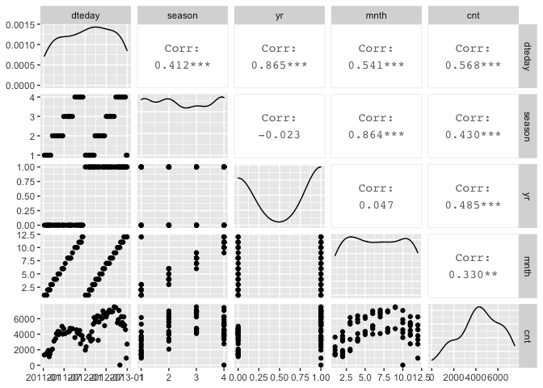

Project 2 - Karen Lopez
================
October 16, 2020

  - [Introduction](#introduction)
  - [Data](#data)
  - [Summarizations](#summarizations)
  - [Modeling](#modeling)
  - [Automation](#automation)

## Introduction

This project uses the bike sharing data set, day.csv, that’s located
*[here](https://archive.ics.uci.edu/ml/datasets/Bike+Sharing+Dataset)*
and contains 731 observations with 15 attributes. For modeling, the
response variable is the count of total rental bikes rented (*cnt*) and
11 of the 14 remaining variables will be considered for predictor
variables. Variables *casual* and *registered* are omitted and analysis
are performed on each *weekday* variable. The 11 remaining variables
include values for date, season, year, month, holiday, working day,
weather, temperature, feeling temperature, humidity, and wind speed.  
The purpose of this analysis is to fit two different tree models and
select the best one based on the appropriate criteria. This report will
be automated to run on the data set for each day of the week, starting
with Sunday at 0, Monday at 1, and so on.  
Many methods I’ll use come from a variety of packages installed in this
first code chunk. First I will read in the data and randomly separate it
into the training set and testing set, with 70% of the data going into
the traiing set. Then I will create some summary statistics and various
data plots to view variable relationships and narrow down the predictor
variables. Lastly, I will train and fit the models to compare them and
pick the final model.  
To begin, necessary libraries are loaded so their functions are
accessible and global variables are set.

``` r
library(readr)
library(caret)
library(knitr)
library(corrplot)
library(dplyr)
library(tidyverse)
library(rpart)
library(rmarkdown)
num <- 12
```

## Data

The dataset is read in using a relative path and saved as an object. The
weekday variable is converted to a factor with the day values replacing
their corresponding number, and then the weekday variable is used to
filter the data for each day of the week. The data is then randomly
split into a training and testing set, where 70% of the data goes into
the training set and the remaining 30% goes into the testing set.

``` r
#read in dataset with relative path & save to object
bikeData <- read_csv("Bike-Sharing-Dataset/day.csv") #read in data
#replace weekday numbers with day name
bikeData$weekday <- factor(bikeData$weekday, levels = c(0, 1, 2, 3, 4, 5, 6), labels = c("Sunday", "Monday", "Tuesday", "Wednesday", "Thursday", "Friday", "Saturday"))

bikeData <- bikeData %>% filter(weekday==params$weekday)

#create partitions in data indexes with 70% going in the training set
set.seed(num)
trainIndex <- createDataPartition(bikeData$cnt, p = 0.7, list = FALSE)

#create train and test data set using the trainIndex vector
bikeDataTrain <- bikeData[trainIndex, ]
bikeDataTest <- bikeData[-trainIndex, ]

bikeDataTrain #view train data
```

    ## # A tibble: 76 x 16
    ##    instant dteday     season    yr  mnth holiday weekday workingday weathersit
    ##      <dbl> <date>      <dbl> <dbl> <dbl>   <dbl> <fct>        <dbl>      <dbl>
    ##  1      10 2011-01-10      1     0     1       0 Monday           1          1
    ##  2      24 2011-01-24      1     0     1       0 Monday           1          1
    ##  3      31 2011-01-31      1     0     1       0 Monday           1          2
    ##  4      38 2011-02-07      1     0     2       0 Monday           1          1
    ##  5      45 2011-02-14      1     0     2       0 Monday           1          1
    ##  6      52 2011-02-21      1     0     2       1 Monday           0          2
    ##  7      59 2011-02-28      1     0     2       0 Monday           1          2
    ##  8      66 2011-03-07      1     0     3       0 Monday           1          1
    ##  9      80 2011-03-21      2     0     3       0 Monday           1          2
    ## 10      94 2011-04-04      2     0     4       0 Monday           1          1
    ## # … with 66 more rows, and 7 more variables: temp <dbl>, atemp <dbl>,
    ## #   hum <dbl>, windspeed <dbl>, casual <dbl>, registered <dbl>, cnt <dbl>

``` r
bikeDataTest #view train data
```

    ## # A tibble: 29 x 16
    ##    instant dteday     season    yr  mnth holiday weekday workingday weathersit
    ##      <dbl> <date>      <dbl> <dbl> <dbl>   <dbl> <fct>        <dbl>      <dbl>
    ##  1       3 2011-01-03      1     0     1       0 Monday           1          1
    ##  2      17 2011-01-17      1     0     1       1 Monday           0          2
    ##  3      73 2011-03-14      1     0     3       0 Monday           1          1
    ##  4      87 2011-03-28      2     0     3       0 Monday           1          1
    ##  5     101 2011-04-11      2     0     4       0 Monday           1          2
    ##  6     122 2011-05-02      2     0     5       0 Monday           1          2
    ##  7     150 2011-05-30      2     0     5       1 Monday           0          1
    ##  8     157 2011-06-06      2     0     6       0 Monday           1          1
    ##  9     185 2011-07-04      3     0     7       1 Monday           0          2
    ## 10     199 2011-07-18      3     0     7       0 Monday           1          1
    ## # … with 19 more rows, and 7 more variables: temp <dbl>, atemp <dbl>,
    ## #   hum <dbl>, windspeed <dbl>, casual <dbl>, registered <dbl>, cnt <dbl>

## Summarizations

Just to get an overview of the data, I first look at the summary of all
variables, and the distribution of the rental bike counts. Then I delve
deeper into the variable relationships with the response variable,
count, and with each other using ggpairs. These correlations will help
me narrow down which variables to include in the tree models, but I can
also view their corresponding scatterplots and density curves.

``` r
#summary of training data set
summary(bikeDataTrain)
```

    ##     instant          dteday               season          yr        
    ##  Min.   : 10.0   Min.   :2011-01-10   Min.   :1.0   Min.   :0.0000  
    ##  1st Qu.:207.8   1st Qu.:2011-07-26   1st Qu.:1.0   1st Qu.:0.0000  
    ##  Median :405.5   Median :2012-02-09   Median :2.0   Median :1.0000  
    ##  Mean   :385.9   Mean   :2012-01-20   Mean   :2.5   Mean   :0.5526  
    ##  3rd Qu.:566.5   3rd Qu.:2012-07-19   3rd Qu.:4.0   3rd Qu.:1.0000  
    ##  Max.   :731.0   Max.   :2012-12-31   Max.   :4.0   Max.   :1.0000  
    ##                                                                     
    ##       mnth           holiday             weekday     workingday    
    ##  Min.   : 1.000   Min.   :0.00000   Sunday   : 0   Min.   :0.0000  
    ##  1st Qu.: 3.000   1st Qu.:0.00000   Monday   :76   1st Qu.:1.0000  
    ##  Median : 6.500   Median :0.00000   Tuesday  : 0   Median :1.0000  
    ##  Mean   : 6.539   Mean   :0.09211   Wednesday: 0   Mean   :0.9079  
    ##  3rd Qu.:10.000   3rd Qu.:0.00000   Thursday : 0   3rd Qu.:1.0000  
    ##  Max.   :12.000   Max.   :1.00000   Friday   : 0   Max.   :1.0000  
    ##                                     Saturday : 0                   
    ##    weathersit         temp             atemp             hum        
    ##  Min.   :1.000   Min.   :0.09739   Min.   :0.1179   Min.   :0.3758  
    ##  1st Qu.:1.000   1st Qu.:0.35542   1st Qu.:0.3532   1st Qu.:0.5074  
    ##  Median :1.000   Median :0.47583   Median :0.4675   Median :0.6228  
    ##  Mean   :1.368   Mean   :0.48322   Mean   :0.4666   Mean   :0.6319  
    ##  3rd Qu.:2.000   3rd Qu.:0.63500   3rd Qu.:0.5969   3rd Qu.:0.7392  
    ##  Max.   :3.000   Max.   :0.78167   Max.   :0.7298   Max.   :0.9250  
    ##                                                                     
    ##    windspeed           casual         registered        cnt      
    ##  Min.   :0.04541   Min.   :   2.0   Min.   :  20   Min.   :  22  
    ##  1st Qu.:0.14111   1st Qu.: 241.2   1st Qu.:3102   1st Qu.:3327  
    ##  Median :0.18315   Median : 679.5   Median :3680   Median :4350  
    ##  Mean   :0.19654   Mean   : 619.8   Mean   :3786   Mean   :4406  
    ##  3rd Qu.:0.26104   3rd Qu.: 856.2   3rd Qu.:4943   3rd Qu.:5890  
    ##  Max.   :0.41791   Max.   :2557.0   Max.   :6435   Max.   :7525  
    ## 

``` r
#quantitative histogram for cnt to view distribution
g <- ggplot(bikeDataTrain, aes(x=cnt))
g + geom_histogram()
```

<!-- -->

``` r
#create 3 plots of variables against each other and the response variable
bikeDataTrain1 <- bikeDataTrain %>% select(dteday, season, yr, mnth, cnt)
GGally::ggpairs(bikeDataTrain1)
```

<!-- -->

``` r
#all 3 might be of interest

bikeDataTrain2 <- bikeDataTrain %>% select(holiday, workingday, weathersit, cnt)
GGally::ggpairs(bikeDataTrain2)
```

<!-- -->

``` r
#workingday might be of interest

bikeDataTrain3 <- bikeDataTrain %>% select(temp, atemp, hum, windspeed, cnt)
GGally::ggpairs(bikeDataTrain3)
```

<!-- -->

``` r
#temp & atemp might be of interest

bikeDataTrain4 <- bikeDataTrain %>% select(dteday, season, yr, mnth, workingday, temp, atemp, cnt)
GGally::ggpairs(bikeDataTrain4)
```

<!-- -->

``` r
# yr & atemp might be of more interest than the others 
```

Various predictor variables have interactions with each other, and I
want to focus on those with the lower correlation values with each other
but higher correlations with the response. These variables include such
as year, temperature, and feeling temperature. The date, season, and
month variables will be omitted from further analysis because of their
stronger correlations with other variables, and working day will be
omitted for its weak correlation with count. The temperature and feeling
temperature have a very strong correlation so I’ll only keep feeling
temperature for it’s slightly stronger correlation with the response
variable, and analyze it alongside the year variable. These variables
were chosen using the `weekday = Monday` data, and will be used for all
other days to keep analyses consistent.

## Modeling

Next I will utilize the `caret` package to create two tree models with
the training set and then predict each on the testing set, after
reducing both sets to include only the variables of interest. The models
are based on the response variable, *cnt*, being a continuous variable.
The predictors are *yr* and *atemp*, which are categorical (0: 2011, 1:
2012) and continuous variables, respectively.

The first model is a non-ensemble tree-based model chosen using
leave-one-out cross-validation, and the second model is a boosted tree
model chosen using 12-fold cross-validation. Just in case, and for good
practice, the predictor variables are standardize via centering and
scaling. Each model is then predicted on using the training set, and
their performances are compared via root mean square error (RMSE) and/or
mean absolute error (MAE) values.

``` r
#select only variables needed for modeling
bikeDataTrain <- bikeDataTrain %>% select(cnt, yr, atemp)
kable(head(bikeDataTrain)) #preview reduced train data
```

|  cnt | yr |    atemp |
| ---: | -: | -------: |
| 1321 |  0 | 0.150888 |
| 1416 |  0 | 0.117930 |
| 1501 |  0 | 0.186250 |
| 1712 |  0 | 0.303658 |
| 1913 |  0 | 0.398350 |
| 1107 |  0 | 0.284075 |

``` r
bikeDataTest <- bikeDataTest %>% select(cnt, yr, atemp)
kable(head(bikeDataTest)) #preview reduced test data
```

|  cnt | yr |    atemp |
| ---: | -: | -------: |
| 1349 |  0 | 0.189405 |
| 1000 |  0 | 0.176771 |
| 2046 |  0 | 0.332000 |
| 2028 |  0 | 0.257574 |
| 3348 |  0 | 0.565217 |
| 4401 |  0 | 0.532833 |

``` r
#(not ensemble) tree-based model chosen using leave one out cross validation
#using regression tree to model cnt (continuous variable)
treeFit1 <- train(cnt ~ ., data = bikeDataTrain, method = "rpart", preProcess = c("center", "scale"), trControl = trainControl(method = "LOOCV"))
treeFit1 #view resulting tree parameters
```

    ## CART 
    ## 
    ## 76 samples
    ##  2 predictor
    ## 
    ## Pre-processing: centered (2), scaled (2) 
    ## Resampling: Leave-One-Out Cross-Validation 
    ## Summary of sample sizes: 75, 75, 75, 75, 75, 75, ... 
    ## Resampling results across tuning parameters:
    ## 
    ##   cp          RMSE      Rsquared    MAE     
    ##   0.08082251  1495.499  0.35533419  1112.219
    ##   0.21184377  1625.609  0.23328625  1343.794
    ##   0.39733056  2055.792  0.03340374  1856.684
    ## 
    ## RMSE was used to select the optimal model using the smallest value.
    ## The final value used for the model was cp = 0.08082251.

``` r
#plot(treeFit1) #plot result

#boosted tree model chosen using cross-validation
treeFit2 <- train(cnt ~ ., data = bikeDataTrain, method = "gbm", preProcess = c("center", "scale"), trControl = trainControl(method = "cv", number = num))
```

    ## Iter   TrainDeviance   ValidDeviance   StepSize   Improve
    ##      1  2925063.9248             nan     0.1000 166775.7774
    ##      2  2763166.2040             nan     0.1000 173363.8167
    ##      3  2578289.1816             nan     0.1000 107690.4536
    ##      4  2396474.4291             nan     0.1000 152046.9602
    ##      5  2284299.5066             nan     0.1000 98774.3447
    ##      6  2183504.0444             nan     0.1000 58322.5672
    ##      7  2086455.3217             nan     0.1000 102930.3035
    ##      8  1986861.9155             nan     0.1000 87103.5405
    ##      9  1922481.8860             nan     0.1000 67808.9575
    ##     10  1823782.1733             nan     0.1000 72294.5612
    ##     20  1222152.5408             nan     0.1000 19680.1591
    ##     40   890683.8379             nan     0.1000 -6696.2232
    ##     60   822675.4501             nan     0.1000 3452.8601
    ##     80   757944.2154             nan     0.1000 -3895.4835
    ##    100   711995.6857             nan     0.1000 -6862.9507
    ##    120   672468.6919             nan     0.1000 -3572.1496
    ##    140   647500.7677             nan     0.1000 -6431.0597
    ##    150   628336.2898             nan     0.1000 -5666.7908
    ## 
    ## Iter   TrainDeviance   ValidDeviance   StepSize   Improve
    ##      1  2824709.9714             nan     0.1000 291530.1013
    ##      2  2628235.0900             nan     0.1000 194214.3539
    ##      3  2461283.5191             nan     0.1000 163503.6362
    ##      4  2226242.3060             nan     0.1000 232734.7628
    ##      5  2134158.0438             nan     0.1000 113096.7560
    ##      6  2007835.9840             nan     0.1000 78999.6583
    ##      7  1823013.6055             nan     0.1000 134645.8148
    ##      8  1703046.3842             nan     0.1000 99649.1586
    ##      9  1652634.5987             nan     0.1000 58238.9274
    ##     10  1530591.4895             nan     0.1000 88384.3710
    ##     20  1083622.2552             nan     0.1000 17446.9618
    ##     40   834896.3528             nan     0.1000 -7887.9865
    ##     60   757958.0767             nan     0.1000 -4527.4819
    ##     80   714915.6024             nan     0.1000 -5040.5890
    ##    100   645115.2023             nan     0.1000 -1727.6611
    ##    120   617160.4289             nan     0.1000 -4804.8238
    ##    140   586923.5297             nan     0.1000 -14577.2589
    ##    150   573738.6577             nan     0.1000 -6294.3624
    ## 
    ## Iter   TrainDeviance   ValidDeviance   StepSize   Improve
    ##      1  2947108.8368             nan     0.1000 219292.4355
    ##      2  2583366.6788             nan     0.1000 281017.0238
    ##      3  2398003.2620             nan     0.1000 156638.5978
    ##      4  2261339.6878             nan     0.1000 125111.7160
    ##      5  2040382.1387             nan     0.1000 179710.1490
    ##      6  1890326.3868             nan     0.1000 72898.2369
    ##      7  1735423.5526             nan     0.1000 110371.4127
    ##      8  1648492.2106             nan     0.1000 45389.2561
    ##      9  1496390.7217             nan     0.1000 142074.6367
    ##     10  1435720.5687             nan     0.1000 49990.4965
    ##     20   987322.7326             nan     0.1000 8497.6872
    ##     40   772639.1573             nan     0.1000 -3184.3433
    ##     60   715047.8460             nan     0.1000 -9617.3029
    ##     80   664670.4593             nan     0.1000 -3578.2067
    ##    100   623193.8343             nan     0.1000 -2946.6489
    ##    120   582137.6695             nan     0.1000 -971.6777
    ##    140   557024.8052             nan     0.1000 -7024.4019
    ##    150   547232.2843             nan     0.1000 -3751.9002
    ## 
    ## Iter   TrainDeviance   ValidDeviance   StepSize   Improve
    ##      1  2794796.0143             nan     0.1000 215494.9735
    ##      2  2629807.2386             nan     0.1000 139802.3226
    ##      3  2533826.1520             nan     0.1000 73233.8093
    ##      4  2345697.8853             nan     0.1000 128381.8209
    ##      5  2175595.4054             nan     0.1000 123310.7852
    ##      6  2069298.9917             nan     0.1000 81617.0611
    ##      7  1943452.8623             nan     0.1000 5048.3315
    ##      8  1842912.9980             nan     0.1000 94870.0971
    ##      9  1717139.7678             nan     0.1000 54508.8207
    ##     10  1646440.4055             nan     0.1000 83356.8092
    ##     20  1102077.1674             nan     0.1000 26093.4660
    ##     40   779692.5206             nan     0.1000 -6314.1004
    ##     60   731421.3234             nan     0.1000 -11380.2716
    ##     80   691033.7144             nan     0.1000 -16966.3140
    ##    100   657389.6036             nan     0.1000 -9410.4627
    ##    120   625907.8285             nan     0.1000 -12200.1435
    ##    140   610975.1500             nan     0.1000 -2860.0612
    ##    150   592523.7195             nan     0.1000 -5526.4747
    ## 
    ## Iter   TrainDeviance   ValidDeviance   StepSize   Improve
    ##      1  2770065.6187             nan     0.1000 329714.9642
    ##      2  2512749.9231             nan     0.1000 155932.3673
    ##      3  2344522.7438             nan     0.1000 163094.9283
    ##      4  2172644.9278             nan     0.1000 133229.6349
    ##      5  2074415.6598             nan     0.1000 96923.3037
    ##      6  1862443.3193             nan     0.1000 218594.9398
    ##      7  1744968.2181             nan     0.1000 61240.6971
    ##      8  1646046.6664             nan     0.1000 83918.9567
    ##      9  1554459.6450             nan     0.1000 48042.6301
    ##     10  1455703.0708             nan     0.1000 89065.8208
    ##     20   984533.7404             nan     0.1000 11362.3641
    ##     40   774240.5337             nan     0.1000 4311.0310
    ##     60   712069.7382             nan     0.1000 -10453.8033
    ##     80   670258.0024             nan     0.1000 -7411.5238
    ##    100   629716.6691             nan     0.1000 -17153.9737
    ##    120   592247.2582             nan     0.1000 -6381.4591
    ##    140   573631.6600             nan     0.1000 -3441.9525
    ##    150   556997.8860             nan     0.1000 -8094.6604
    ## 
    ## Iter   TrainDeviance   ValidDeviance   StepSize   Improve
    ##      1  2832091.0142             nan     0.1000 168620.9693
    ##      2  2523723.7462             nan     0.1000 239798.1200
    ##      3  2266533.5431             nan     0.1000 280303.2016
    ##      4  2134424.7838             nan     0.1000 98655.0223
    ##      5  1953183.1307             nan     0.1000 97190.2620
    ##      6  1751413.7413             nan     0.1000 181579.0608
    ##      7  1667769.9958             nan     0.1000 60512.2086
    ##      8  1566307.3026             nan     0.1000 104716.8222
    ##      9  1486655.7190             nan     0.1000 46059.3883
    ##     10  1427156.4869             nan     0.1000 56124.6320
    ##     20   913799.6499             nan     0.1000 13690.2443
    ##     40   703338.0214             nan     0.1000 -8260.0492
    ##     60   657737.5391             nan     0.1000 -2157.7747
    ##     80   625475.6869             nan     0.1000 -2947.4772
    ##    100   595424.7151             nan     0.1000 -16530.9786
    ##    120   547589.2054             nan     0.1000 -7338.2939
    ##    140   526885.0618             nan     0.1000 -10806.5794
    ##    150   510240.6565             nan     0.1000 -7715.3567
    ## 
    ## Iter   TrainDeviance   ValidDeviance   StepSize   Improve
    ##      1  2995057.0802             nan     0.1000 213474.7567
    ##      2  2776821.2770             nan     0.1000 86779.0061
    ##      3  2574868.6345             nan     0.1000 134764.1368
    ##      4  2410331.2929             nan     0.1000 135342.7506
    ##      5  2286508.7397             nan     0.1000 75153.4881
    ##      6  2189222.7486             nan     0.1000 96482.5041
    ##      7  2050632.6494             nan     0.1000 117932.1590
    ##      8  1936547.5213             nan     0.1000 53919.3562
    ##      9  1815688.6709             nan     0.1000 58887.2432
    ##     10  1745418.7583             nan     0.1000 58072.2223
    ##     20  1236093.4102             nan     0.1000 16689.7335
    ##     40  1005425.2441             nan     0.1000 5181.2928
    ##     60   935308.7184             nan     0.1000 -4755.3335
    ##     80   922303.8684             nan     0.1000 -5213.3175
    ##    100   885421.7220             nan     0.1000 -4115.9265
    ##    120   878842.8498             nan     0.1000 -5667.5454
    ##    140   843066.6384             nan     0.1000 -7222.9883
    ##    150   820747.7754             nan     0.1000 -2145.8613
    ## 
    ## Iter   TrainDeviance   ValidDeviance   StepSize   Improve
    ##      1  3038995.0941             nan     0.1000 125345.6560
    ##      2  2716483.6335             nan     0.1000 318493.7312
    ##      3  2465435.2781             nan     0.1000 220484.2280
    ##      4  2212018.4386             nan     0.1000 222712.4789
    ##      5  2092710.5917             nan     0.1000 137730.8970
    ##      6  2006942.2132             nan     0.1000 46334.6506
    ##      7  1903276.2073             nan     0.1000 117983.3318
    ##      8  1743047.9856             nan     0.1000 136572.2407
    ##      9  1656979.8966             nan     0.1000 62545.9633
    ##     10  1589759.1058             nan     0.1000 43454.2339
    ##     20  1093015.2628             nan     0.1000 14767.4096
    ##     40   879535.8409             nan     0.1000 -2112.4685
    ##     60   821672.6575             nan     0.1000 -7901.1378
    ##     80   770626.2737             nan     0.1000 -7020.2067
    ##    100   722679.1404             nan     0.1000 -7064.3366
    ##    120   676382.1962             nan     0.1000 -5301.2456
    ##    140   640782.2835             nan     0.1000 -8842.1607
    ##    150   624252.9165             nan     0.1000 -6359.2501
    ## 
    ## Iter   TrainDeviance   ValidDeviance   StepSize   Improve
    ##      1  2944318.9727             nan     0.1000 216272.3954
    ##      2  2714406.5998             nan     0.1000 243029.8666
    ##      3  2401892.1016             nan     0.1000 268600.1202
    ##      4  2228276.1659             nan     0.1000 109363.8802
    ##      5  2022672.6000             nan     0.1000 186427.3099
    ##      6  1868942.8927             nan     0.1000 157269.7682
    ##      7  1776076.4738             nan     0.1000 57155.0476
    ##      8  1718344.2650             nan     0.1000 68162.0971
    ##      9  1621592.1406             nan     0.1000 49196.0023
    ##     10  1558078.7309             nan     0.1000 37161.0599
    ##     20  1045299.6371             nan     0.1000 -13439.8790
    ##     40   881585.0900             nan     0.1000 -9915.3677
    ##     60   822606.5869             nan     0.1000 -3672.4975
    ##     80   761020.4233             nan     0.1000 -16569.2209
    ##    100   708375.3004             nan     0.1000 -2423.1366
    ##    120   658314.7392             nan     0.1000 -11211.2154
    ##    140   604322.1385             nan     0.1000 -9282.6538
    ##    150   588465.6091             nan     0.1000 -5399.1255
    ## 
    ## Iter   TrainDeviance   ValidDeviance   StepSize   Improve
    ##      1  3063548.4287             nan     0.1000 143189.2177
    ##      2  2795692.0959             nan     0.1000 239389.6077
    ##      3  2550039.7123             nan     0.1000 173730.1396
    ##      4  2395659.6078             nan     0.1000 120482.5364
    ##      5  2275383.8207             nan     0.1000 124931.0805
    ##      6  2132179.2834             nan     0.1000 136249.8470
    ##      7  1991233.7023             nan     0.1000 75892.4665
    ##      8  1887137.3814             nan     0.1000 100214.2429
    ##      9  1793242.5216             nan     0.1000 65444.6590
    ##     10  1689340.4349             nan     0.1000 67165.1830
    ##     20  1157505.7564             nan     0.1000 31317.0946
    ##     40   896669.0289             nan     0.1000 -19752.2527
    ##     60   845337.6941             nan     0.1000 -6442.1029
    ##     80   812640.5158             nan     0.1000 -6427.1753
    ##    100   762805.4421             nan     0.1000 -17708.7484
    ##    120   723368.6168             nan     0.1000 -8656.0966
    ##    140   711867.0650             nan     0.1000 -9724.1354
    ##    150   696275.5187             nan     0.1000 -2769.2280
    ## 
    ## Iter   TrainDeviance   ValidDeviance   StepSize   Improve
    ##      1  3060422.0587             nan     0.1000 132229.5814
    ##      2  2939603.3188             nan     0.1000 101528.7041
    ##      3  2693611.5273             nan     0.1000 187244.3904
    ##      4  2472436.1550             nan     0.1000 196202.1637
    ##      5  2320711.0617             nan     0.1000 133766.8007
    ##      6  2072910.4174             nan     0.1000 205781.3117
    ##      7  1887201.0927             nan     0.1000 137441.5412
    ##      8  1792772.4247             nan     0.1000 77558.0202
    ##      9  1673802.6700             nan     0.1000 44116.1722
    ##     10  1589352.4214             nan     0.1000 57099.8880
    ##     20  1138162.9906             nan     0.1000 10425.8415
    ##     40   904500.6203             nan     0.1000 -12500.9768
    ##     60   852603.3746             nan     0.1000 -19098.1837
    ##     80   806771.5833             nan     0.1000 -8723.6831
    ##    100   763971.1853             nan     0.1000 -18063.9384
    ##    120   713256.2532             nan     0.1000 -7023.4259
    ##    140   666771.7845             nan     0.1000 1529.3738
    ##    150   656609.5873             nan     0.1000 -13457.4824
    ## 
    ## Iter   TrainDeviance   ValidDeviance   StepSize   Improve
    ##      1  3053782.9583             nan     0.1000 238966.6362
    ##      2  2834064.6179             nan     0.1000 173737.9195
    ##      3  2656547.9280             nan     0.1000 156638.4385
    ##      4  2474643.9178             nan     0.1000 115835.4898
    ##      5  2350468.8014             nan     0.1000 127186.7185
    ##      6  2234936.8028             nan     0.1000 99326.9822
    ##      7  2107695.2775             nan     0.1000 129393.9671
    ##      8  1974666.1173             nan     0.1000 90314.2116
    ##      9  1819978.4723             nan     0.1000 145123.8837
    ##     10  1720690.6282             nan     0.1000 54763.7529
    ##     20  1145464.8150             nan     0.1000 13625.5530
    ##     40   938918.3656             nan     0.1000 -3209.3488
    ##     60   863690.3212             nan     0.1000 -25995.3464
    ##     80   778973.9811             nan     0.1000 -2722.7218
    ##    100   759780.7376             nan     0.1000 -4414.4877
    ##    120   699902.0552             nan     0.1000 -7688.5623
    ##    140   677271.6775             nan     0.1000 -6741.8853
    ##    150   657221.3855             nan     0.1000  291.4869
    ## 
    ## Iter   TrainDeviance   ValidDeviance   StepSize   Improve
    ##      1  3040511.1437             nan     0.1000 189281.1196
    ##      2  2746655.2442             nan     0.1000 170902.7778
    ##      3  2611965.9906             nan     0.1000 128653.7950
    ##      4  2453809.5282             nan     0.1000 143798.7241
    ##      5  2331561.5369             nan     0.1000 69753.8254
    ##      6  2219150.7260             nan     0.1000 73166.9791
    ##      7  2104765.9110             nan     0.1000 69526.1452
    ##      8  2021769.0826             nan     0.1000 29342.5588
    ##      9  1894389.7446             nan     0.1000 130832.0356
    ##     10  1799431.8201             nan     0.1000 97247.1842
    ##     20  1204487.3846             nan     0.1000 17395.9533
    ##     40   876480.2392             nan     0.1000 2886.8193
    ##     60   820242.0800             nan     0.1000 -8812.9895
    ##     80   771127.0702             nan     0.1000 -9498.4108
    ##    100   742849.6049             nan     0.1000 -4916.6305
    ##    120   717042.1540             nan     0.1000 -7656.3159
    ##    140   693139.0249             nan     0.1000 -5308.5951
    ##    150   681718.2630             nan     0.1000 -7164.0048
    ## 
    ## Iter   TrainDeviance   ValidDeviance   StepSize   Improve
    ##      1  2983940.8104             nan     0.1000 244307.9952
    ##      2  2756402.1279             nan     0.1000 168184.9147
    ##      3  2602431.6583             nan     0.1000 86438.9036
    ##      4  2429326.2093             nan     0.1000 47779.6958
    ##      5  2262806.2319             nan     0.1000 147085.4121
    ##      6  2120587.8641             nan     0.1000 114227.3522
    ##      7  2009956.3293             nan     0.1000 93780.5512
    ##      8  1922763.9643             nan     0.1000 79218.3652
    ##      9  1780959.8401             nan     0.1000 55687.3277
    ##     10  1652437.6809             nan     0.1000 44741.8444
    ##     20   993513.0094             nan     0.1000 5744.1969
    ##     40   780840.1624             nan     0.1000 -20173.0438
    ##     60   724137.7768             nan     0.1000 -9761.8132
    ##     80   671134.7039             nan     0.1000 -12985.9856
    ##    100   633360.3979             nan     0.1000 -4574.1180
    ##    120   615961.2289             nan     0.1000 -6951.6266
    ##    140   583510.8701             nan     0.1000 -13150.3718
    ##    150   580519.9022             nan     0.1000 -2901.7435
    ## 
    ## Iter   TrainDeviance   ValidDeviance   StepSize   Improve
    ##      1  2962706.3370             nan     0.1000 229635.1515
    ##      2  2807866.9455             nan     0.1000 165406.9364
    ##      3  2597756.9527             nan     0.1000 180124.0463
    ##      4  2429071.1210             nan     0.1000 145043.7428
    ##      5  2337238.2417             nan     0.1000 116886.8897
    ##      6  2101206.2407             nan     0.1000 190819.9355
    ##      7  1917465.5624             nan     0.1000 161463.0192
    ##      8  1721327.9330             nan     0.1000 178954.7585
    ##      9  1573525.9314             nan     0.1000 140928.1865
    ##     10  1505461.6901             nan     0.1000 46395.8748
    ##     20  1007331.2061             nan     0.1000 7330.8585
    ##     40   771515.5656             nan     0.1000 -7969.9940
    ##     60   713111.3527             nan     0.1000 1388.3088
    ##     80   674754.9295             nan     0.1000 -4732.4492
    ##    100   655340.4732             nan     0.1000 -4984.8705
    ##    120   630910.7506             nan     0.1000 -2626.4561
    ##    140   615900.9096             nan     0.1000 -18644.6331
    ##    150   592721.4030             nan     0.1000 -10809.3056
    ## 
    ## Iter   TrainDeviance   ValidDeviance   StepSize   Improve
    ##      1  2933958.9046             nan     0.1000 173439.3454
    ##      2  2717140.5553             nan     0.1000 179629.6541
    ##      3  2493304.6870             nan     0.1000 139088.5349
    ##      4  2370550.9774             nan     0.1000 99218.0493
    ##      5  2235871.1036             nan     0.1000 138914.2626
    ##      6  2131315.6660             nan     0.1000 81355.9706
    ##      7  2018064.5655             nan     0.1000 74885.7701
    ##      8  1902013.1178             nan     0.1000 86438.6403
    ##      9  1820088.6796             nan     0.1000 61768.9734
    ##     10  1759302.4529             nan     0.1000 35029.8938
    ##     20  1211218.0542             nan     0.1000 21135.5438
    ##     40   877563.8829             nan     0.1000 -5172.0011
    ##     60   812223.2935             nan     0.1000 -6956.2337
    ##     80   789668.5881             nan     0.1000 -1969.5041
    ##    100   763087.2040             nan     0.1000 -3981.1696
    ##    120   724963.1463             nan     0.1000 -2818.1322
    ##    140   703072.9863             nan     0.1000 -7882.5317
    ##    150   685618.0557             nan     0.1000 -489.7372
    ## 
    ## Iter   TrainDeviance   ValidDeviance   StepSize   Improve
    ##      1  2723954.8703             nan     0.1000 321708.1722
    ##      2  2455166.0524             nan     0.1000 235921.8449
    ##      3  2181512.0756             nan     0.1000 244686.5472
    ##      4  2010589.1765             nan     0.1000 122112.5400
    ##      5  1901288.4783             nan     0.1000 70259.6574
    ##      6  1793086.3258             nan     0.1000 103086.3484
    ##      7  1629675.8915             nan     0.1000 123758.9121
    ##      8  1561583.0415             nan     0.1000 51750.8700
    ##      9  1479273.0918             nan     0.1000 21748.5092
    ##     10  1432326.0155             nan     0.1000 52064.6322
    ##     20  1050090.0537             nan     0.1000 17797.3453
    ##     40   777312.9400             nan     0.1000 -3882.7431
    ##     60   722286.6384             nan     0.1000 -8593.1405
    ##     80   677393.6178             nan     0.1000 -9882.5638
    ##    100   627973.0789             nan     0.1000 -9816.4233
    ##    120   606499.0548             nan     0.1000 -12444.4274
    ##    140   587746.7807             nan     0.1000 -2460.6888
    ##    150   565698.2225             nan     0.1000 -10495.9010
    ## 
    ## Iter   TrainDeviance   ValidDeviance   StepSize   Improve
    ##      1  2729571.5835             nan     0.1000 353784.2415
    ##      2  2548832.6036             nan     0.1000 151094.1048
    ##      3  2462464.0001             nan     0.1000 85527.8448
    ##      4  2169525.7501             nan     0.1000 243149.4986
    ##      5  2088211.2749             nan     0.1000 95922.8266
    ##      6  1944924.8967             nan     0.1000 152977.9018
    ##      7  1874292.7219             nan     0.1000 74255.2444
    ##      8  1756485.9616             nan     0.1000 73682.4094
    ##      9  1691300.9840             nan     0.1000 67373.8453
    ##     10  1524241.3122             nan     0.1000 120494.3039
    ##     20  1085065.8060             nan     0.1000 16641.3507
    ##     40   849694.6718             nan     0.1000 -4246.6894
    ##     60   780519.4625             nan     0.1000 -12224.2707
    ##     80   715050.3896             nan     0.1000 -14482.8148
    ##    100   684314.4562             nan     0.1000 -11303.7855
    ##    120   657947.6731             nan     0.1000 -2687.8916
    ##    140   627740.6179             nan     0.1000 -7568.3033
    ##    150   615684.1399             nan     0.1000 -4640.2749
    ## 
    ## Iter   TrainDeviance   ValidDeviance   StepSize   Improve
    ##      1  3042304.6934             nan     0.1000 52991.6771
    ##      2  2846018.0822             nan     0.1000 209797.8434
    ##      3  2613307.4314             nan     0.1000 208341.3822
    ##      4  2432345.2861             nan     0.1000 138006.3196
    ##      5  2273971.8994             nan     0.1000 161461.3395
    ##      6  2174153.2281             nan     0.1000 95228.8678
    ##      7  2040057.3656             nan     0.1000 92208.1959
    ##      8  1920327.0655             nan     0.1000 69658.7328
    ##      9  1826112.2670             nan     0.1000 71062.8782
    ##     10  1735657.0824             nan     0.1000 45767.3221
    ##     20  1233377.3309             nan     0.1000 14601.0622
    ##     40   963693.6128             nan     0.1000 -2033.8203
    ##     60   894382.5433             nan     0.1000 -10138.5201
    ##     80   859871.0645             nan     0.1000 1749.8198
    ##    100   821572.2592             nan     0.1000 -11111.1744
    ##    120   783798.8566             nan     0.1000 -2068.4115
    ##    140   757856.1739             nan     0.1000 -3259.9673
    ##    150   751024.9329             nan     0.1000 -6638.1455
    ## 
    ## Iter   TrainDeviance   ValidDeviance   StepSize   Improve
    ##      1  2893700.9317             nan     0.1000 338088.3754
    ##      2  2660106.0253             nan     0.1000 191819.5295
    ##      3  2515608.5350             nan     0.1000 97999.1677
    ##      4  2285812.2028             nan     0.1000 159374.8096
    ##      5  2140599.3312             nan     0.1000 116012.5517
    ##      6  2044812.2627             nan     0.1000 88906.5878
    ##      7  1935066.2822             nan     0.1000 49710.8557
    ##      8  1849359.1998             nan     0.1000 51811.8161
    ##      9  1751529.5572             nan     0.1000 94337.3021
    ##     10  1677923.2673             nan     0.1000 27117.7371
    ##     20  1172826.3999             nan     0.1000 23630.7531
    ##     40   907153.0011             nan     0.1000 -13278.3248
    ##     60   831478.3895             nan     0.1000 -20688.9503
    ##     80   777761.6433             nan     0.1000  279.2048
    ##    100   735759.2827             nan     0.1000 -5579.3904
    ##    120   709839.4421             nan     0.1000 -16142.6209
    ##    140   675806.5435             nan     0.1000 -3629.0407
    ##    150   656784.1764             nan     0.1000 -4008.0980
    ## 
    ## Iter   TrainDeviance   ValidDeviance   StepSize   Improve
    ##      1  2990912.6612             nan     0.1000 178959.1419
    ##      2  2763798.6014             nan     0.1000 208030.2999
    ##      3  2627612.4519             nan     0.1000 134544.1651
    ##      4  2417465.7692             nan     0.1000 154809.0305
    ##      5  2204067.5795             nan     0.1000 194563.7503
    ##      6  1999990.0383             nan     0.1000 207878.8513
    ##      7  1884668.4854             nan     0.1000 71285.3159
    ##      8  1725193.9429             nan     0.1000 131854.6863
    ##      9  1651084.4251             nan     0.1000 61481.3343
    ##     10  1583668.9349             nan     0.1000 49437.0261
    ##     20  1105929.1387             nan     0.1000 14890.6807
    ##     40   922750.9253             nan     0.1000 -13298.1048
    ##     60   825771.8540             nan     0.1000 -23905.5001
    ##     80   784258.6688             nan     0.1000 -5209.0229
    ##    100   742644.5805             nan     0.1000 -4729.5606
    ##    120   696389.8790             nan     0.1000 -510.1108
    ##    140   652024.0762             nan     0.1000 -4398.9178
    ##    150   641016.3294             nan     0.1000 -10443.7359
    ## 
    ## Iter   TrainDeviance   ValidDeviance   StepSize   Improve
    ##      1  2854039.4604             nan     0.1000 259701.6408
    ##      2  2666461.7521             nan     0.1000 165627.6339
    ##      3  2504474.5615             nan     0.1000 115422.7903
    ##      4  2268379.3592             nan     0.1000 148417.8567
    ##      5  2130078.5734             nan     0.1000 112569.1905
    ##      6  1983726.7943             nan     0.1000 119743.1540
    ##      7  1818864.6499             nan     0.1000 100621.7002
    ##      8  1667844.0805             nan     0.1000 98052.7875
    ##      9  1553264.0910             nan     0.1000 106355.9225
    ##     10  1440870.5543             nan     0.1000 60572.7732
    ##     20   861950.8057             nan     0.1000 17107.6547
    ##     40   559110.9540             nan     0.1000 -6675.3116
    ##     60   504042.4639             nan     0.1000 -2895.8106
    ##     80   473729.0466             nan     0.1000 -3665.0499
    ##    100   453072.5025             nan     0.1000 -1902.7626
    ##    120   436249.5804             nan     0.1000 -1771.5991
    ##    140   422981.6640             nan     0.1000 -7731.3932
    ##    150   415742.7361             nan     0.1000 -5873.6189
    ## 
    ## Iter   TrainDeviance   ValidDeviance   StepSize   Improve
    ##      1  2856621.9487             nan     0.1000 247087.8918
    ##      2  2612783.3575             nan     0.1000 120400.3087
    ##      3  2419824.1592             nan     0.1000 161319.5762
    ##      4  2227927.0149             nan     0.1000 180938.6911
    ##      5  2062529.9546             nan     0.1000 92186.7853
    ##      6  1859368.2804             nan     0.1000 154917.7119
    ##      7  1715501.2464             nan     0.1000 113379.7832
    ##      8  1528765.7009             nan     0.1000 183413.6084
    ##      9  1358333.8761             nan     0.1000 152982.1189
    ##     10  1281730.2920             nan     0.1000 77681.5708
    ##     20   734162.2828             nan     0.1000 24085.1076
    ##     40   472965.2234             nan     0.1000 -3275.9095
    ##     60   408311.5009             nan     0.1000 -7729.8628
    ##     80   378952.3816             nan     0.1000 -218.4282
    ##    100   349666.7028             nan     0.1000 -7637.6398
    ##    120   338095.2926             nan     0.1000 -6731.6177
    ##    140   322816.9785             nan     0.1000 -917.2969
    ##    150   316108.6143             nan     0.1000 -1561.2063
    ## 
    ## Iter   TrainDeviance   ValidDeviance   StepSize   Improve
    ##      1  2849525.6528             nan     0.1000 224375.5131
    ##      2  2631137.4019             nan     0.1000 185157.4335
    ##      3  2467581.3165             nan     0.1000 152342.2346
    ##      4  2275574.3428             nan     0.1000 166988.0551
    ##      5  2075813.4502             nan     0.1000 126152.9859
    ##      6  1827790.0376             nan     0.1000 235505.1535
    ##      7  1620420.4128             nan     0.1000 213245.2188
    ##      8  1529926.7737             nan     0.1000 91409.9253
    ##      9  1351893.5968             nan     0.1000 182396.0491
    ##     10  1213684.8012             nan     0.1000 128145.7498
    ##     20   659663.8087             nan     0.1000 14725.1135
    ##     40   441795.4008             nan     0.1000 1416.2619
    ##     60   401834.3483             nan     0.1000 -11421.3173
    ##     80   378174.7393             nan     0.1000 -594.1037
    ##    100   360074.6975             nan     0.1000 -5463.3661
    ##    120   346409.8684             nan     0.1000 -1653.8859
    ##    140   331886.4505             nan     0.1000 -2996.9415
    ##    150   321708.4322             nan     0.1000 -935.8300
    ## 
    ## Iter   TrainDeviance   ValidDeviance   StepSize   Improve
    ##      1  3022712.5155             nan     0.1000 108677.7563
    ##      2  2867651.5890             nan     0.1000 153144.1455
    ##      3  2677213.8149             nan     0.1000 140359.4831
    ##      4  2529415.9786             nan     0.1000 101722.3156
    ##      5  2406592.4002             nan     0.1000 94420.2778
    ##      6  2211990.7008             nan     0.1000 128795.1014
    ##      7  2002807.4187             nan     0.1000 135403.7865
    ##      8  1906253.5454             nan     0.1000 73226.2411
    ##      9  1806324.5229             nan     0.1000 51779.1052
    ##     10  1682383.5185             nan     0.1000 105700.3270
    ##     20  1175698.8968             nan     0.1000 21385.0885
    ##     40   905665.5506             nan     0.1000 -980.0415
    ##     60   836717.4761             nan     0.1000 -19711.5177
    ##     80   789252.6692             nan     0.1000 -12623.7014
    ##    100   762292.3716             nan     0.1000 -1255.4669
    ##    120   734561.5907             nan     0.1000 -1081.1408
    ##    140   685193.6258             nan     0.1000 -1922.7500
    ##    150   676699.1423             nan     0.1000 -7591.9535
    ## 
    ## Iter   TrainDeviance   ValidDeviance   StepSize   Improve
    ##      1  2824390.5930             nan     0.1000 382649.8901
    ##      2  2614413.3877             nan     0.1000 196132.3986
    ##      3  2370338.1607             nan     0.1000 241679.1520
    ##      4  2199111.1862             nan     0.1000 73633.4537
    ##      5  2100321.4295             nan     0.1000 111470.3156
    ##      6  1977828.9090             nan     0.1000 79118.8445
    ##      7  1853323.8406             nan     0.1000 135143.0968
    ##      8  1754523.3888             nan     0.1000 68098.9659
    ##      9  1635069.0602             nan     0.1000 114545.7051
    ##     10  1550699.8572             nan     0.1000 42925.1673
    ##     20   990762.9945             nan     0.1000 -1449.1721
    ##     40   783403.1813             nan     0.1000 -9349.4621
    ##     60   744241.1734             nan     0.1000 -11460.6400
    ##     80   700255.6053             nan     0.1000 -1842.8767
    ##    100   644378.2440             nan     0.1000 -2903.9597
    ##    120   615311.5545             nan     0.1000 -8208.2362
    ##    140   575038.4337             nan     0.1000 -5331.0741
    ##    150   553544.5752             nan     0.1000 -5918.2074
    ## 
    ## Iter   TrainDeviance   ValidDeviance   StepSize   Improve
    ##      1  2952479.6021             nan     0.1000 135047.8019
    ##      2  2737015.5267             nan     0.1000 145383.1976
    ##      3  2601953.3885             nan     0.1000 114476.2103
    ##      4  2371385.0272             nan     0.1000 177355.5292
    ##      5  2117479.5328             nan     0.1000 271914.2910
    ##      6  1922836.0163             nan     0.1000 172384.4792
    ##      7  1808211.3419             nan     0.1000 89260.2071
    ##      8  1714253.8965             nan     0.1000 80893.4986
    ##      9  1551399.2394             nan     0.1000 120740.0864
    ##     10  1484247.1735             nan     0.1000 58364.9328
    ##     20  1012432.0964             nan     0.1000 11100.3464
    ##     40   827698.8861             nan     0.1000 -886.2386
    ##     60   758480.1706             nan     0.1000 -2307.3890
    ##     80   724363.5978             nan     0.1000 -5077.0291
    ##    100   669778.2574             nan     0.1000 -4654.9764
    ##    120   608076.8965             nan     0.1000 -8204.4376
    ##    140   550127.2707             nan     0.1000 -4127.7028
    ##    150   539141.1211             nan     0.1000 -7828.5178
    ## 
    ## Iter   TrainDeviance   ValidDeviance   StepSize   Improve
    ##      1  3092320.6206             nan     0.1000 120978.0030
    ##      2  2752226.5579             nan     0.1000 234048.7857
    ##      3  2524088.2753             nan     0.1000 213174.8233
    ##      4  2362865.2901             nan     0.1000 136466.7366
    ##      5  2236422.4189             nan     0.1000 86210.5366
    ##      6  2099599.1001             nan     0.1000 104311.6315
    ##      7  1998727.0741             nan     0.1000 84336.2523
    ##      8  1897521.1054             nan     0.1000 42829.6299
    ##      9  1738314.6116             nan     0.1000 137791.9126
    ##     10  1642326.5515             nan     0.1000 46898.3295
    ##     20  1174598.9941             nan     0.1000 6677.0846
    ##     40   941713.3684             nan     0.1000 8197.6567
    ##     60   858721.5377             nan     0.1000 -22431.5049
    ##     80   816812.1039             nan     0.1000 -9412.6578
    ##    100   803515.9104             nan     0.1000 -3477.7208
    ##    120   773997.2052             nan     0.1000 -30890.5403
    ##    140   733001.7957             nan     0.1000 1332.4289
    ##    150   724519.0915             nan     0.1000 -7443.9524
    ## 
    ## Iter   TrainDeviance   ValidDeviance   StepSize   Improve
    ##      1  2908461.7639             nan     0.1000 337824.6691
    ##      2  2705671.3189             nan     0.1000 166505.3034
    ##      3  2499583.6672             nan     0.1000 177447.3613
    ##      4  2341309.4052             nan     0.1000 86882.9220
    ##      5  2176299.6674             nan     0.1000 144729.7813
    ##      6  1956655.8020             nan     0.1000 201496.3127
    ##      7  1803504.4087             nan     0.1000 126671.6743
    ##      8  1707198.8746             nan     0.1000 75409.3281
    ##      9  1561520.1824             nan     0.1000 114700.1219
    ##     10  1495696.3230             nan     0.1000 58123.0359
    ##     20  1095315.3254             nan     0.1000 3231.7409
    ##     40   902432.9330             nan     0.1000 -3688.8622
    ##     60   768570.4477             nan     0.1000 -6416.4441
    ##     80   708022.1909             nan     0.1000 -10338.1476
    ##    100   681688.5126             nan     0.1000 -7246.3496
    ##    120   648168.5178             nan     0.1000 -9318.1395
    ##    140   602377.8433             nan     0.1000 -6047.2797
    ##    150   600114.2784             nan     0.1000 -11145.8952
    ## 
    ## Iter   TrainDeviance   ValidDeviance   StepSize   Improve
    ##      1  3020057.0374             nan     0.1000 258951.8554
    ##      2  2774576.5078             nan     0.1000 199112.8442
    ##      3  2628385.2788             nan     0.1000 121091.5034
    ##      4  2326642.2006             nan     0.1000 208561.8827
    ##      5  2168978.7381             nan     0.1000 201222.9693
    ##      6  2028497.2205             nan     0.1000 82624.4860
    ##      7  1909330.8108             nan     0.1000 111592.7111
    ##      8  1828301.0309             nan     0.1000 91399.1047
    ##      9  1684542.7860             nan     0.1000 132825.6843
    ##     10  1578032.5687             nan     0.1000 96745.2345
    ##     20  1046329.8246             nan     0.1000 31027.5651
    ##     40   836208.0696             nan     0.1000  252.9055
    ##     60   767573.7999             nan     0.1000 -9491.5612
    ##     80   733220.8739             nan     0.1000 -10736.9795
    ##    100   676062.4025             nan     0.1000 -15295.8597
    ##    120   641608.0685             nan     0.1000 3153.2740
    ##    140   612306.2820             nan     0.1000 -4186.3846
    ##    150   595157.5419             nan     0.1000 -3960.7341
    ## 
    ## Iter   TrainDeviance   ValidDeviance   StepSize   Improve
    ##      1  2841423.8845             nan     0.1000 78876.9912
    ##      2  2672629.1363             nan     0.1000 144443.6814
    ##      3  2511572.1231             nan     0.1000 141403.4775
    ##      4  2338356.8938             nan     0.1000 98254.8815
    ##      5  2211387.2496             nan     0.1000 105130.9200
    ##      6  2098810.7857             nan     0.1000 90143.4313
    ##      7  1935986.6068             nan     0.1000 66801.0469
    ##      8  1857241.8576             nan     0.1000 74903.1588
    ##      9  1780551.9449             nan     0.1000 76668.7074
    ##     10  1706786.3815             nan     0.1000 54957.1283
    ##     20  1234283.9398             nan     0.1000 12068.5936
    ##     40   989997.2894             nan     0.1000 -3692.2366
    ##     60   919242.4809             nan     0.1000 2154.0810
    ##     80   886652.1395             nan     0.1000 -4634.7201
    ##    100   837534.7801             nan     0.1000 -11727.7831
    ##    120   793902.9663             nan     0.1000 -4189.4163
    ##    140   759403.3971             nan     0.1000 -4361.2421
    ##    150   745806.5582             nan     0.1000 -6375.9387
    ## 
    ## Iter   TrainDeviance   ValidDeviance   StepSize   Improve
    ##      1  2810387.4849             nan     0.1000 122022.8424
    ##      2  2606997.0867             nan     0.1000 121069.2472
    ##      3  2439494.5351             nan     0.1000 97293.9546
    ##      4  2221041.2193             nan     0.1000 201503.0607
    ##      5  2116322.9545             nan     0.1000 90081.4671
    ##      6  2020315.8801             nan     0.1000 93266.8443
    ##      7  1936674.6108             nan     0.1000 73578.5227
    ##      8  1746483.7485             nan     0.1000 129121.6512
    ##      9  1701193.3901             nan     0.1000 51852.0647
    ##     10  1640776.1068             nan     0.1000 28002.2156
    ##     20  1131594.9894             nan     0.1000 17878.6045
    ##     40   907414.9509             nan     0.1000 1572.5225
    ##     60   831384.1137             nan     0.1000 -4739.4098
    ##     80   797528.4050             nan     0.1000 -5324.5220
    ##    100   755442.6645             nan     0.1000  370.4686
    ##    120   729769.0756             nan     0.1000 -19739.3278
    ##    140   691367.5493             nan     0.1000   -3.6864
    ##    150   676262.9072             nan     0.1000 -10748.2254
    ## 
    ## Iter   TrainDeviance   ValidDeviance   StepSize   Improve
    ##      1  2646130.9637             nan     0.1000 320481.2841
    ##      2  2373531.6347             nan     0.1000 221459.2426
    ##      3  2121180.2617             nan     0.1000 195001.8564
    ##      4  1957673.3740             nan     0.1000 104670.5130
    ##      5  1873291.2262             nan     0.1000 69718.2440
    ##      6  1776889.9330             nan     0.1000 53586.0058
    ##      7  1718302.6633             nan     0.1000 73712.0727
    ##      8  1587194.1642             nan     0.1000 118540.0310
    ##      9  1538826.7875             nan     0.1000 51904.9166
    ##     10  1457828.5486             nan     0.1000 55999.1150
    ##     20  1011568.2260             nan     0.1000 -10848.5617
    ##     40   902148.0191             nan     0.1000 -14733.5184
    ##     60   807600.8566             nan     0.1000 9520.4775
    ##     80   746086.5946             nan     0.1000 -11078.4360
    ##    100   710273.8798             nan     0.1000 -9382.2918
    ##    120   666262.0017             nan     0.1000 -7972.7567
    ##    140   634426.0888             nan     0.1000  -76.7286
    ##    150   611127.4128             nan     0.1000 -4730.3423
    ## 
    ## Iter   TrainDeviance   ValidDeviance   StepSize   Improve
    ##      1  3059446.6384             nan     0.1000 202871.1162
    ##      2  2829645.1272             nan     0.1000 143098.5409
    ##      3  2678530.8810             nan     0.1000 134465.7179
    ##      4  2502632.5980             nan     0.1000 137852.6652
    ##      5  2380999.8275             nan     0.1000 105073.0512
    ##      6  2280236.4712             nan     0.1000 113297.6976
    ##      7  2148092.2199             nan     0.1000 82557.3131
    ##      8  2032795.6400             nan     0.1000 78040.4563
    ##      9  1920337.6936             nan     0.1000 66402.6449
    ##     10  1835733.7279             nan     0.1000 94169.8869
    ##     20  1209834.2348             nan     0.1000 16657.2683
    ##     40   921513.4537             nan     0.1000  424.2550
    ##     60   855516.7129             nan     0.1000 -20045.1746
    ##     80   788234.2524             nan     0.1000 -27897.2215
    ##    100   755978.8778             nan     0.1000 -16695.3028
    ##    120   732620.7243             nan     0.1000 -13597.6152
    ##    140   707997.1836             nan     0.1000 -9671.2045
    ##    150   692334.8168             nan     0.1000 -4802.8229
    ## 
    ## Iter   TrainDeviance   ValidDeviance   StepSize   Improve
    ##      1  3056397.8008             nan     0.1000 217552.3616
    ##      2  2808890.0674             nan     0.1000 138578.2366
    ##      3  2533073.0414             nan     0.1000 247272.0954
    ##      4  2390650.0439             nan     0.1000 135349.6734
    ##      5  2196628.5943             nan     0.1000 158438.3605
    ##      6  1963013.0500             nan     0.1000 158638.4935
    ##      7  1822456.1374             nan     0.1000 88479.8505
    ##      8  1739840.9388             nan     0.1000 74441.9026
    ##      9  1619545.0094             nan     0.1000 87121.5412
    ##     10  1469362.7246             nan     0.1000 118174.7961
    ##     20   998933.1156             nan     0.1000 10962.8750
    ##     40   811375.6515             nan     0.1000 -5190.3190
    ##     60   735782.2683             nan     0.1000 -8955.3793
    ##     80   705409.6463             nan     0.1000 -6062.2132
    ##    100   655520.0332             nan     0.1000 -6794.4250
    ##    120   611815.8440             nan     0.1000 -9595.3637
    ##    140   586069.4251             nan     0.1000 -10605.5787
    ##    150   581519.2748             nan     0.1000 -3551.0491
    ## 
    ## Iter   TrainDeviance   ValidDeviance   StepSize   Improve
    ##      1  3045834.4201             nan     0.1000 202781.8523
    ##      2  2820062.0121             nan     0.1000 175047.7079
    ##      3  2638049.6322             nan     0.1000 134018.2991
    ##      4  2379272.8034             nan     0.1000 270193.5945
    ##      5  2299693.5487             nan     0.1000 105707.0356
    ##      6  2068221.8945             nan     0.1000 193492.5188
    ##      7  1933605.2564             nan     0.1000 46271.0788
    ##      8  1775495.6804             nan     0.1000 119171.7059
    ##      9  1657871.9274             nan     0.1000 119812.1017
    ##     10  1560134.9667             nan     0.1000 107326.5502
    ##     20  1047811.6451             nan     0.1000 5545.6531
    ##     40   836173.7913             nan     0.1000 -10179.3217
    ##     60   766568.6656             nan     0.1000 -1682.2030
    ##     80   700678.1682             nan     0.1000 -6032.3036
    ##    100   667426.9732             nan     0.1000 -5984.4036
    ##    120   626285.4241             nan     0.1000 -7029.1311
    ##    140   605851.8909             nan     0.1000 -4246.3191
    ##    150   597303.9140             nan     0.1000 -2105.2896
    ## 
    ## Iter   TrainDeviance   ValidDeviance   StepSize   Improve
    ##      1  2894087.7240             nan     0.1000 279055.9226
    ##      2  2581564.6709             nan     0.1000 293434.1343
    ##      3  2400961.9706             nan     0.1000 199999.3876
    ##      4  2235383.2844             nan     0.1000 150495.8422
    ##      5  2073371.0899             nan     0.1000 86114.0791
    ##      6  1941342.2870             nan     0.1000 112398.0051
    ##      7  1851436.1253             nan     0.1000 78065.3323
    ##      8  1666692.3420             nan     0.1000 100761.1378
    ##      9  1568647.5196             nan     0.1000 78648.3344
    ##     10  1468794.5273             nan     0.1000 79452.4503
    ##     20   995567.8646             nan     0.1000 -9364.8158
    ##     40   791423.2306             nan     0.1000 1247.8626
    ##     60   714223.3476             nan     0.1000 -5624.7752
    ##     80   665145.8856             nan     0.1000 -5909.3349
    ##    100   617022.3262             nan     0.1000 -8948.0560

``` r
treeFit2 #view resulting tree parameters
```

    ## Stochastic Gradient Boosting 
    ## 
    ## 76 samples
    ##  2 predictor
    ## 
    ## Pre-processing: centered (2), scaled (2) 
    ## Resampling: Cross-Validated (12 fold) 
    ## Summary of sample sizes: 70, 69, 69, 68, 71, 69, ... 
    ## Resampling results across tuning parameters:
    ## 
    ##   interaction.depth  n.trees  RMSE      Rsquared   MAE     
    ##   1                   50      910.3517  0.7517638  669.6339
    ##   1                  100      862.1290  0.7651408  645.5514
    ##   1                  150      878.2329  0.7588204  654.6616
    ##   2                   50      910.4386  0.7524097  676.3878
    ##   2                  100      894.6401  0.7553494  663.6084
    ##   2                  150      872.0103  0.7652572  656.7553
    ##   3                   50      886.8115  0.7600941  666.2624
    ##   3                  100      858.8459  0.7754624  653.8934
    ##   3                  150      862.4862  0.7685693  667.5348
    ## 
    ## Tuning parameter 'shrinkage' was held constant at a value of 0.1
    ## 
    ## Tuning parameter 'n.minobsinnode' was held constant at a value of 10
    ## RMSE was used to select the optimal model using the smallest value.
    ## The final values used for the model were n.trees = 100, interaction.depth =
    ##  3, shrinkage = 0.1 and n.minobsinnode = 10.

``` r
#compare models on test set, using predict
treePred1 <- predict(treeFit1, newdata = data.frame(bikeDataTest))
#treePred1 #view prediction results
postResample(treePred1, bikeDataTest$cnt) # view root mean square error
```

    ##         RMSE     Rsquared          MAE 
    ## 1184.8456845    0.6144665  873.2558547

``` r
treePred2 <- predict(treeFit2, newdata = data.frame(bikeDataTest))
#treePred2 #view prediction results
postResample(treePred2, bikeDataTest$cnt) # view root mean square error
```

    ##         RMSE     Rsquared          MAE 
    ## 1079.0478266    0.6613888  806.3838768

The model with the lowest RMSE and/or lowest MAE value should be used as
the final model. The instructor later asked us to focus on MAE, so for
the Monday data, the better model is the boosted tree model.

## Automation

``` r
#save unique days
weekdays <- unique(bikeData$weekday)
#set filenames
outFile <- paste0(weekdays, ".md")
#get list for each day with the day parameter
params = lapply(weekdays, FUN = function(x){list(weekday = x)})
#create data frame
reports <- tibble(outFile, params)
reports
apply(reports, MARGIN = 1,
  FUN = function(x){
    render(input = "Bike-Sharing-Dataset/day.csv",
    output_file = x[[1]],
    params = x[[2]])
  })
```
