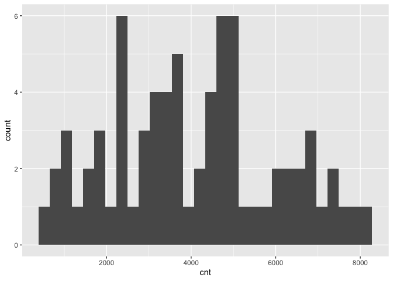
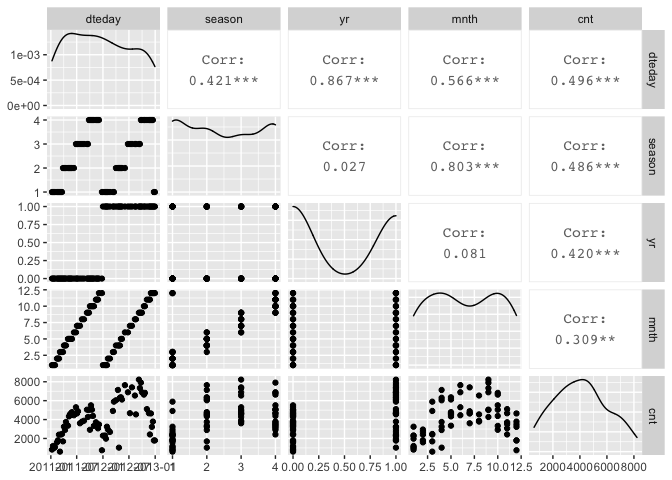
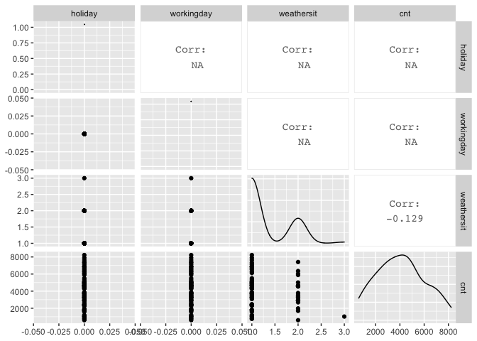
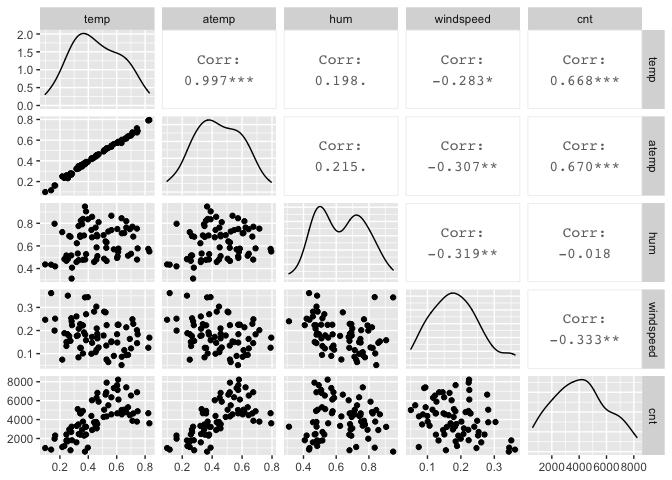
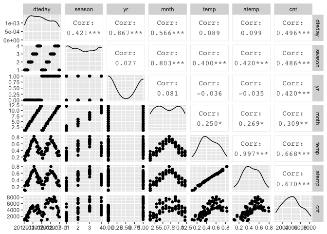

Project 2 - Karen Lopez
================
October 16, 2020

  - [Introduction](#introduction)
  - [Data](#data)
  - [Summarizations](#summarizations)
  - [Modeling](#modeling)
  - [Automation & Blog Post](#automation-blog-post)

## Introduction

This project uses the bike sharing data set, day.csv, that’s located
*[here](https://archive.ics.uci.edu/ml/datasets/Bike+Sharing+Dataset)*
and contains 731 observations with 15 attributes. For modeling, the
response variable is the count of total rental bikes rented (*cnt*) and
11 of the 14 remaining variables will be considered for predictor
variables. Variables *casual* and *registered* are omitted and analysis
are performed on each *weekday* variable. The 11 remaining variables
include date, season, year, month, holiday, working day, weather,
temperature, feeling temperature, humidity, and wind speed.  
Purpose of analysis:  
Methods I’ll use:  
To begin, necessary libraries are loaded so their functions are
accessible and global variables are set.

``` r
library(readr)
library(caret)
library(knitr)
library(corrplot)
library(dplyr)
library(tidyverse)
num <- 12
```

## Data

The dataset is read in using a relative path and saved as an object. The
weekday variable is used to filter the data for each day of the week.
The data is then randomly split into a training and testing set, where
70% of the data goes into the training set and the remaining 30% goes
into the testing set.

``` r
#read in dataset with relative path & save to object
bikeData <- read_csv("Bike-Sharing-Dataset/day.csv") #read in data
```

    ## Parsed with column specification:
    ## cols(
    ##   instant = col_double(),
    ##   dteday = col_date(format = ""),
    ##   season = col_double(),
    ##   yr = col_double(),
    ##   mnth = col_double(),
    ##   holiday = col_double(),
    ##   weekday = col_double(),
    ##   workingday = col_double(),
    ##   weathersit = col_double(),
    ##   temp = col_double(),
    ##   atemp = col_double(),
    ##   hum = col_double(),
    ##   windspeed = col_double(),
    ##   casual = col_double(),
    ##   registered = col_double(),
    ##   cnt = col_double()
    ## )

``` r
#bikeData$weekday <- as.factor(bikeData$weekday) #convert weekday to factor
bikeData <- bikeData %>% filter(weekday==0)

#create partitions in data indexes with 70% going in the training set
set.seed(num)
train <- sample(1:nrow(bikeData), size = nrow(bikeData)*0.7)
test <- dplyr::setdiff(1:nrow(bikeData), train)

#create train and test data set with split indexes
bikeDataTrain <- bikeData[train, ]
bikeDataTest <- bikeData[test, ]

#bikeDataTrain #check for 70% of data -> 73 of 105
#bikeDataTest #check for 30% of data -> 32 of 105

kable(head(bikeDataTrain)) #preview train data
```

| instant | dteday     | season | yr | mnth | holiday | weekday | workingday | weathersit |     temp |    atemp |      hum | windspeed | casual | registered |  cnt |
| ------: | :--------- | -----: | -: | ---: | ------: | ------: | ---------: | ---------: | -------: | -------: | -------: | --------: | -----: | ---------: | ---: |
|     457 | 2012-04-01 |      2 |  1 |    4 |       0 |       0 |          0 |          2 | 0.425833 | 0.417287 | 0.676250 | 0.1722670 |   2347 |       3694 | 6041 |
|     625 | 2012-09-16 |      3 |  1 |    9 |       0 |       0 |          0 |          1 | 0.580000 | 0.563125 | 0.570000 | 0.0901833 |   2166 |       5167 | 7333 |
|     555 | 2012-07-08 |      3 |  1 |    7 |       0 |       0 |          0 |          1 | 0.822500 | 0.790396 | 0.573750 | 0.1256290 |   1203 |       3469 | 4672 |
|     632 | 2012-09-23 |      4 |  1 |    9 |       0 |       0 |          0 |          1 | 0.529167 | 0.518933 | 0.467083 | 0.2232580 |   2454 |       5453 | 7907 |
|     317 | 2011-11-13 |      4 |  0 |   11 |       0 |       0 |          0 |          1 | 0.440833 | 0.430550 | 0.458333 | 0.2817210 |   1004 |       2713 | 3717 |
|     478 | 2012-04-22 |      2 |  1 |    4 |       0 |       0 |          0 |          3 | 0.396667 | 0.389504 | 0.835417 | 0.3445460 |    120 |        907 | 1027 |

``` r
kable(head(bikeDataTest)) #preview test data
```

| instant | dteday     | season | yr | mnth | holiday | weekday | workingday | weathersit |     temp |    atemp |      hum | windspeed | casual | registered |  cnt |
| ------: | :--------- | -----: | -: | ---: | ------: | ------: | ---------: | ---------: | -------: | -------: | -------: | --------: | -----: | ---------: | ---: |
|       2 | 2011-01-02 |      1 |  0 |    1 |       0 |       0 |          0 |          2 | 0.363478 | 0.353739 | 0.696087 |  0.248539 |    131 |        670 |  801 |
|      37 | 2011-02-06 |      1 |  0 |    2 |       0 |       0 |          0 |          1 | 0.285833 | 0.291671 | 0.568333 |  0.141800 |    354 |       1269 | 1623 |
|     114 | 2011-04-24 |      2 |  0 |    4 |       0 |       0 |          0 |          2 | 0.581667 | 0.551763 | 0.810833 |  0.192175 |   1710 |       2481 | 4191 |
|     156 | 2011-06-05 |      2 |  0 |    6 |       0 |       0 |          0 |          2 | 0.648333 | 0.616804 | 0.652500 |  0.138692 |   1685 |       3221 | 4906 |
|     170 | 2011-06-19 |      2 |  0 |    6 |       0 |       0 |          0 |          2 | 0.699167 | 0.645846 | 0.666667 |  0.102000 |   1639 |       3105 | 4744 |
|     198 | 2011-07-17 |      3 |  0 |    7 |       0 |       0 |          0 |          1 | 0.719167 | 0.669833 | 0.604167 |  0.245033 |   2006 |       3296 | 5302 |

## Summarizations

summary statistics and plot with some general explanations

``` r
summary(bikeDataTrain)
```

    ##     instant          dteday               season            yr        
    ##  Min.   :  9.0   Min.   :2011-01-09   Min.   :1.000   Min.   :0.0000  
    ##  1st Qu.:149.0   1st Qu.:2011-05-29   1st Qu.:1.000   1st Qu.:0.0000  
    ##  Median :331.0   Median :2011-11-27   Median :2.000   Median :0.0000  
    ##  Mean   :352.3   Mean   :2011-12-18   Mean   :2.466   Mean   :0.4658  
    ##  3rd Qu.:541.0   3rd Qu.:2012-06-24   3rd Qu.:4.000   3rd Qu.:1.0000  
    ##  Max.   :730.0   Max.   :2012-12-30   Max.   :4.000   Max.   :1.0000  
    ##       mnth           holiday     weekday    workingday   weathersit   
    ##  Min.   : 1.000   Min.   :0   Min.   :0   Min.   :0    Min.   :1.000  
    ##  1st Qu.: 3.000   1st Qu.:0   1st Qu.:0   1st Qu.:0    1st Qu.:1.000  
    ##  Median : 6.000   Median :0   Median :0   Median :0    Median :1.000  
    ##  Mean   : 6.479   Mean   :0   Mean   :0   Mean   :0    Mean   :1.301  
    ##  3rd Qu.:10.000   3rd Qu.:0   3rd Qu.:0   3rd Qu.:0    3rd Qu.:2.000  
    ##  Max.   :12.000   Max.   :0   Max.   :0   Max.   :0    Max.   :3.000  
    ##       temp             atemp              hum           windspeed      
    ##  Min.   :0.09652   Min.   :0.09884   Min.   :0.3113   Min.   :0.05038  
    ##  1st Qu.:0.33083   1st Qu.:0.32954   1st Qu.:0.4939   1st Qu.:0.12688  
    ##  Median :0.45167   Median :0.44570   Median :0.6317   Median :0.17911  
    ##  Mean   :0.45785   Mean   :0.44361   Mean   :0.6300   Mean   :0.18360  
    ##  3rd Qu.:0.60417   3rd Qu.:0.57388   3rd Qu.:0.7479   3rd Qu.:0.22512  
    ##  Max.   :0.83000   Max.   :0.79483   Max.   :0.9483   Max.   :0.36195  
    ##      casual       registered        cnt      
    ##  Min.   :  54   Min.   : 451   Min.   : 605  
    ##  1st Qu.: 616   1st Qu.:1781   1st Qu.:2471  
    ##  Median :1203   Median :2762   Median :3873  
    ##  Mean   :1271   Mean   :2804   Mean   :4075  
    ##  3rd Qu.:2015   3rd Qu.:3685   3rd Qu.:5107  
    ##  Max.   :2846   Max.   :5657   Max.   :8227

``` r
#quantitative histogram for cnt
g <- ggplot(bikeDataTrain, aes(x=cnt))
g + geom_histogram()
```

    ## `stat_bin()` using `bins = 30`. Pick better value with `binwidth`.

<!-- -->

``` r
#create 3 plots of variables against each other and the response variable
bikeDataTrain1 <- bikeDataTrain %>% select(dteday, season, yr, mnth, cnt)
GGally::ggpairs(bikeDataTrain1)
```

    ## Registered S3 method overwritten by 'GGally':
    ##   method from   
    ##   +.gg   ggplot2

<!-- -->

``` r
#all  might be of interest (corr=0.496, 0.486, 0.420, 0.309)

bikeDataTrain2 <- bikeDataTrain %>% select(holiday, workingday, weathersit, cnt)
GGally::ggpairs(bikeDataTrain2)
```

    ## Warning in cor(x, y): the standard deviation is zero
    
    ## Warning in cor(x, y): the standard deviation is zero
    
    ## Warning in cor(x, y): the standard deviation is zero
    
    ## Warning in cor(x, y): the standard deviation is zero
    
    ## Warning in cor(x, y): the standard deviation is zero

<!-- -->

``` r
#none might be of interest (all corr N/A or negative)

bikeDataTrain3 <- bikeDataTrain %>% select(temp, atemp, hum, windspeed, cnt)
GGally::ggpairs(bikeDataTrain3)
```

<!-- -->

``` r
#temp & atemp might be of interest (corr=0.668, 0.670)

bikeDataTrain4 <- bikeDataTrain %>% select(dteday, season, yr, mnth, temp, atemp, cnt)
GGally::ggpairs(bikeDataTrain4)
```

<!-- -->

``` r
#free sulfur dioxide & alcohol might be of more interest than the others but I want to add more predictors
```

## Modeling

fit some models (two)

## Automation & Blog Post

automate so it creates report for each day of the week
