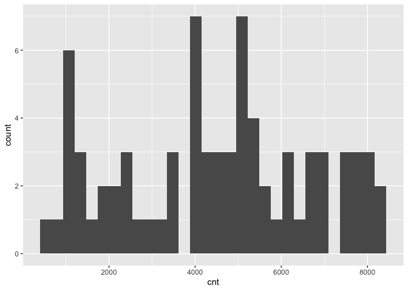
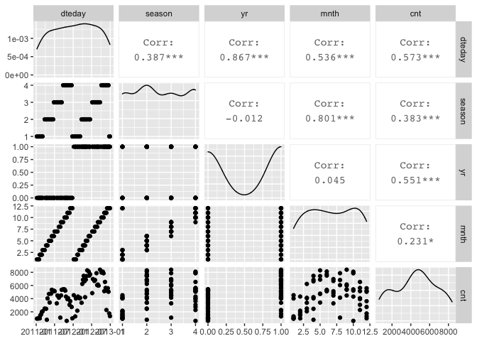
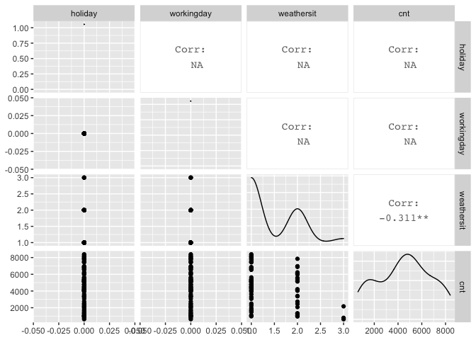
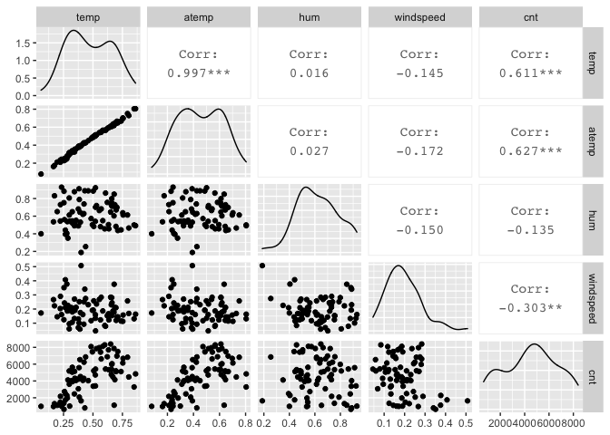

Project 2 - Karen Lopez
================
October 16, 2020

  - [Introduction](#introduction)
  - [Data](#data)
  - [Summarizations](#summarizations)
  - [Modeling](#modeling)

## Introduction

This project uses the bike sharing data set, day.csv, that’s located
*[here](https://archive.ics.uci.edu/ml/datasets/Bike+Sharing+Dataset)*
and contains 731 observations with 15 attributes. For modeling, the
response variable is the count of total rental bikes rented (*cnt*) and
11 of the 14 remaining variables will be considered for predictor
variables. Variables *casual* and *registered* are omitted and analysis
are performed on each *weekday* variable. The 11 remaining variables
include values for date, season, year, month, holiday, working day,
weather, temperature, feeling temperature, humidity, and wind speed.  
The purpose of this analysis is to fit two different tree models and
select the best one based on the appropriate criteria. This report will
be automated to run on the data set for each day of the week, starting
with Sunday at 0, Monday at 1, and so on.  
Many methods I’ll use come from a variety of packages installed in this
first code chunk. First I will read in the data and randomly separate it
into the training set and testing set, with 70% of the data going into
the traiing set. Then I will create some summary statistics and various
data plots to view variable relationships and narrow down the predictor
variables. Lastly, I will train and fit the models to compare them and
pick the final model.  
To begin, necessary libraries are loaded so their functions are
accessible and global variables are set.

``` r
library(readr)
library(caret)
library(knitr)
library(corrplot)
library(dplyr)
library(tidyverse)
library(rpart)
num <- 12
```

## Data

The dataset is read in using a relative path and saved as an object. The
weekday variable is converted to a factor with the day values replacing
their corresponding number, and then the weekday variable is used to
filter the data for each day of the week. The data is then randomly
split into a training and testing set, where 70% of the data goes into
the training set and the remaining 30% goes into the testing set.

``` r
#read in dataset with relative path & save to object
bikeData <- read_csv("Bike-Sharing-Dataset/day.csv") #read in data
#replace weekday numbers with day name
bikeData$weekday <- factor(bikeData$weekday, levels = c(0, 1, 2, 3, 4, 5, 6), labels = c("Sunday", "Monday", "Tuesday", "Wednesday", "Thursday", "Friday", "Saturday"))

bikeData <- bikeData %>% filter(weekday==params$weekday)

#create partitions in data indexes with 70% going in the training set
set.seed(num)
trainIndex <- createDataPartition(bikeData$cnt, p = 0.7, list = FALSE)

#create train and test data set using the trainIndex vector
bikeDataTrain <- bikeData[trainIndex, ]
bikeDataTest <- bikeData[-trainIndex, ]

bikeDataTrain #view train data
```

    ## # A tibble: 76 x 16
    ##    instant dteday     season    yr  mnth holiday weekday
    ##      <dbl> <date>      <dbl> <dbl> <dbl>   <dbl> <fct>  
    ##  1       8 2011-01-08      1     0     1       0 Saturd…
    ##  2      22 2011-01-22      1     0     1       0 Saturd…
    ##  3      29 2011-01-29      1     0     1       0 Saturd…
    ##  4      36 2011-02-05      1     0     2       0 Saturd…
    ##  5      43 2011-02-12      1     0     2       0 Saturd…
    ##  6      50 2011-02-19      1     0     2       0 Saturd…
    ##  7      57 2011-02-26      1     0     2       0 Saturd…
    ##  8      64 2011-03-05      1     0     3       0 Saturd…
    ##  9      85 2011-03-26      2     0     3       0 Saturd…
    ## 10      99 2011-04-09      2     0     4       0 Saturd…
    ## # … with 66 more rows, and 9 more variables: workingday <dbl>,
    ## #   weathersit <dbl>, temp <dbl>, atemp <dbl>, hum <dbl>,
    ## #   windspeed <dbl>, casual <dbl>, registered <dbl>, cnt <dbl>

``` r
bikeDataTest #view train data
```

    ## # A tibble: 29 x 16
    ##    instant dteday     season    yr  mnth holiday weekday
    ##      <dbl> <date>      <dbl> <dbl> <dbl>   <dbl> <fct>  
    ##  1       1 2011-01-01      1     0     1       0 Saturd…
    ##  2      15 2011-01-15      1     0     1       0 Saturd…
    ##  3      71 2011-03-12      1     0     3       0 Saturd…
    ##  4      78 2011-03-19      1     0     3       0 Saturd…
    ##  5      92 2011-04-02      2     0     4       0 Saturd…
    ##  6     120 2011-04-30      2     0     4       0 Saturd…
    ##  7     141 2011-05-21      2     0     5       0 Saturd…
    ##  8     162 2011-06-11      2     0     6       0 Saturd…
    ##  9     190 2011-07-09      3     0     7       0 Saturd…
    ## 10     197 2011-07-16      3     0     7       0 Saturd…
    ## # … with 19 more rows, and 9 more variables: workingday <dbl>,
    ## #   weathersit <dbl>, temp <dbl>, atemp <dbl>, hum <dbl>,
    ## #   windspeed <dbl>, casual <dbl>, registered <dbl>, cnt <dbl>

## Summarizations

Just to get an overview of the data, I first look at the summary of all
variables, and the distribution of the rental bike counts. Then I delve
deeper into the variable relationships with the response variable,
count, and with each other using ggpairs. These correlations will help
me narrow down which variables to include in the tree models, but I can
also view their corresponding scatterplots and density curves.

``` r
#summary of training data set
summary(bikeDataTrain)
```

    ##     instant          dteday               season     
    ##  Min.   :  8.0   Min.   :2011-01-08   Min.   :1.000  
    ##  1st Qu.:198.8   1st Qu.:2011-07-17   1st Qu.:2.000  
    ##  Median :389.5   Median :2012-01-24   Median :2.000  
    ##  Mean   :380.7   Mean   :2012-01-15   Mean   :2.513  
    ##  3rd Qu.:564.5   3rd Qu.:2012-07-17   3rd Qu.:4.000  
    ##  Max.   :729.0   Max.   :2012-12-29   Max.   :4.000  
    ##                                                      
    ##        yr              mnth           holiday       weekday  
    ##  Min.   :0.0000   Min.   : 1.000   Min.   :0   Sunday   : 0  
    ##  1st Qu.:0.0000   1st Qu.: 4.000   1st Qu.:0   Monday   : 0  
    ##  Median :1.0000   Median : 7.000   Median :0   Tuesday  : 0  
    ##  Mean   :0.5263   Mean   : 6.697   Mean   :0   Wednesday: 0  
    ##  3rd Qu.:1.0000   3rd Qu.:10.000   3rd Qu.:0   Thursday : 0  
    ##  Max.   :1.0000   Max.   :12.000   Max.   :0   Friday   : 0  
    ##                                                Saturday :76  
    ##    workingday   weathersit         temp        
    ##  Min.   :0    Min.   :1.000   Min.   :0.05913  
    ##  1st Qu.:0    1st Qu.:1.000   1st Qu.:0.32208  
    ##  Median :0    Median :1.000   Median :0.44875  
    ##  Mean   :0    Mean   :1.408   Mean   :0.47499  
    ##  3rd Qu.:0    3rd Qu.:2.000   3rd Qu.:0.65146  
    ##  Max.   :0    Max.   :3.000   Max.   :0.86167  
    ##                                                
    ##      atemp              hum           windspeed     
    ##  Min.   :0.07907   Min.   :0.1879   Min.   :0.0454  
    ##  1st Qu.:0.32385   1st Qu.:0.5022   1st Qu.:0.1326  
    ##  Median :0.43812   Median :0.6133   Median :0.1859  
    ##  Mean   :0.45611   Mean   :0.6213   Mean   :0.1939  
    ##  3rd Qu.:0.60859   3rd Qu.:0.7300   3rd Qu.:0.2435  
    ##  Max.   :0.80491   Max.   :0.9292   Max.   :0.5075  
    ##                                                     
    ##      casual         registered        cnt      
    ##  Min.   :  57.0   Min.   : 570   Min.   : 627  
    ##  1st Qu.: 751.8   1st Qu.:1938   1st Qu.:2678  
    ##  Median :1441.5   Median :3130   Median :4618  
    ##  Mean   :1444.3   Mean   :3085   Mean   :4530  
    ##  3rd Qu.:2234.2   3rd Qu.:4289   3rd Qu.:6164  
    ##  Max.   :3410.0   Max.   :5883   Max.   :8395  
    ## 

``` r
#quantitative histogram for cnt to view distribution
g <- ggplot(bikeDataTrain, aes(x=cnt))
g + geom_histogram()
```

<!-- -->

``` r
#create 3 plots of variables against each other and the response variable
bikeDataTrain1 <- bikeDataTrain %>% select(dteday, season, yr, mnth, cnt)
GGally::ggpairs(bikeDataTrain1)
```

<!-- -->

``` r
#all 3 might be of interest

bikeDataTrain2 <- bikeDataTrain %>% select(holiday, workingday, weathersit, cnt)
GGally::ggpairs(bikeDataTrain2)
```

<!-- -->

``` r
#workingday might be of interest

bikeDataTrain3 <- bikeDataTrain %>% select(temp, atemp, hum, windspeed, cnt)
GGally::ggpairs(bikeDataTrain3)
```

<!-- -->

``` r
#temp & atemp might be of interest

bikeDataTrain4 <- bikeDataTrain %>% select(dteday, season, yr, mnth, workingday, temp, atemp, cnt)
GGally::ggpairs(bikeDataTrain4)
```

<!-- -->

``` r
# yr & atemp might be of more interest than the others 
```

Various predictor variables have interactions with each other, and I
want to focus on those with the lower correlation values with each other
but higher correlations with the response. These variables include such
as year, temperature, and feeling temperature. The date, season, and
month variables will be omitted from further analysis because of their
stronger correlations with other variables, and working day will be
omitted for its weak correlation with count. The temperature and feeling
temperature have a very strong correlation so I’ll only keep feeling
temperature for it’s slightly stronger correlation with the response
variable, and analyze it alongside the year variable. These variables
were chosen using the `weekday = Monday` data, and will be used for all
other days to keep analyses consistent.

## Modeling

Next I will utilize the `caret` package to create two tree models with
the training set and then predict each on the testing set, after
reducing both sets to include only the variables of interest. The models
are based on the response variable, *cnt*, being a continuous variable.
The predictors are *yr* and *atemp*, which are categorical (0: 2011, 1:
2012) and continuous variables, respectively.

The first model is a non-ensemble tree-based model chosen using
leave-one-out cross-validation, and the second model is a boosted tree
model chosen using 12-fold cross-validation. Just in case, and for good
practice, the predictor variables are standardize via centering and
scaling. Each model is then predicted on using the training set, and
their performances are compared via root mean square error (RMSE) and/or
mean absolute error (MAE) values.

``` r
#select only variables needed for modeling
bikeDataTrain <- bikeDataTrain %>% select(cnt, yr, atemp)
kable(head(bikeDataTrain)) #preview reduced train data
```

|  cnt | yr |     atemp |
| ---: | -: | --------: |
|  959 |  0 | 0.1622540 |
|  981 |  0 | 0.0790696 |
| 1098 |  0 | 0.2121260 |
| 1005 |  0 | 0.2430580 |
| 1472 |  0 | 0.2329540 |
| 1635 |  0 | 0.3914040 |

``` r
bikeDataTest <- bikeDataTest %>% select(cnt, yr, atemp)
kable(head(bikeDataTest)) #preview reduced test data
```

|  cnt | yr |    atemp |
| ---: | -: | -------: |
|  985 |  0 | 0.363625 |
| 1248 |  0 | 0.248112 |
| 2132 |  0 | 0.325750 |
| 3117 |  0 | 0.466525 |
| 2252 |  0 | 0.315637 |
| 5312 |  0 | 0.464021 |

``` r
#(not ensemble) tree-based model chosen using leave one out cross validation
#using regression tree to model cnt (continuous variable)
treeFit1 <- train(cnt ~ ., data = bikeDataTrain, method = "rpart", preProcess = c("center", "scale"), trControl = trainControl(method = "LOOCV"))
treeFit1 #view resulting tree parameters
```

    ## CART 
    ## 
    ## 76 samples
    ##  2 predictor
    ## 
    ## Pre-processing: centered (2), scaled (2) 
    ## Resampling: Leave-One-Out Cross-Validation 
    ## Summary of sample sizes: 75, 75, 75, 75, 75, 75, ... 
    ## Resampling results across tuning parameters:
    ## 
    ##   cp          RMSE      Rsquared     MAE     
    ##   0.08266664  1509.628  0.539500069  1241.332
    ##   0.22190293  1957.932  0.258267842  1689.814
    ##   0.43602739  2318.796  0.001599663  2053.423
    ## 
    ## RMSE was used to select the optimal model using the
    ##  smallest value.
    ## The final value used for the model was cp = 0.08266664.

``` r
#plot(treeFit1) #plot result

#boosted tree model chosen using cross-validation
treeFit2 <- train(cnt ~ ., data = bikeDataTrain, method = "gbm", preProcess = c("center", "scale"), trControl = trainControl(method = "cv", number = num))
```

    ## Iter   TrainDeviance   ValidDeviance   StepSize   Improve
    ##      1  4315484.5032             nan     0.1000 407537.1777
    ##      2  4020586.5511             nan     0.1000 329286.9745
    ##      3  3730588.9362             nan     0.1000 213386.7313
    ##      4  3430722.3676             nan     0.1000 258587.8010
    ##      5  3202873.7890             nan     0.1000 247617.9754
    ##      6  2992130.0710             nan     0.1000 125050.0524
    ##      7  2860415.1967             nan     0.1000 105554.7194
    ##      8  2699522.3436             nan     0.1000 178691.3314
    ##      9  2538149.7279             nan     0.1000 131841.1531
    ##     10  2383703.5287             nan     0.1000 110515.5398
    ##     20  1529266.7119             nan     0.1000 46461.2997
    ##     40  1153262.2318             nan     0.1000 -20700.0047
    ##     60  1064280.7382             nan     0.1000 2276.4830
    ##     80  1035108.0460             nan     0.1000 -14664.0651
    ##    100   992813.5494             nan     0.1000 -19986.8201
    ##    120   949716.1545             nan     0.1000 -4847.4467
    ##    140   921080.6203             nan     0.1000 -16884.8592
    ##    150   910142.7456             nan     0.1000 -17212.1018
    ## 
    ## Iter   TrainDeviance   ValidDeviance   StepSize   Improve
    ##      1  4270734.0860             nan     0.1000 307174.4168
    ##      2  3900838.6620             nan     0.1000 313587.1807
    ##      3  3625860.0797             nan     0.1000 208505.4512
    ##      4  3170111.4043             nan     0.1000 412547.5217
    ##      5  3011933.0974             nan     0.1000 148070.2431
    ##      6  2662601.0015             nan     0.1000 327357.6563
    ##      7  2422775.1870             nan     0.1000 190145.7213
    ##      8  2230641.9918             nan     0.1000 172900.6371
    ##      9  2125485.8395             nan     0.1000 102681.5137
    ##     10  1952806.1160             nan     0.1000 75153.5461
    ##     20  1262411.3503             nan     0.1000 55929.5648
    ##     40   983692.5809             nan     0.1000 -305.1316
    ##     60   916399.2534             nan     0.1000 -9444.9351
    ##     80   864096.3807             nan     0.1000 -10490.4637
    ##    100   845407.0801             nan     0.1000 -11706.4002
    ##    120   809892.4461             nan     0.1000 -10226.6278
    ##    140   768731.2276             nan     0.1000 -11016.9537
    ##    150   764879.4813             nan     0.1000 -9337.8551
    ## 
    ## Iter   TrainDeviance   ValidDeviance   StepSize   Improve
    ##      1  4359299.2257             nan     0.1000 400618.6446
    ##      2  3867357.5469             nan     0.1000 386593.5819
    ##      3  3522588.5733             nan     0.1000 219559.4781
    ##      4  3297961.3386             nan     0.1000 188241.4442
    ##      5  3055403.3620             nan     0.1000 149907.0741
    ##      6  2755204.7587             nan     0.1000 244503.3783
    ##      7  2585805.6454             nan     0.1000 110256.0822
    ##      8  2262349.4728             nan     0.1000 236055.0927
    ##      9  2034334.1824             nan     0.1000 221030.9831
    ##     10  1889811.0303             nan     0.1000 91666.1100
    ##     20  1272425.2390             nan     0.1000 -15276.5306
    ##     40   937208.3170             nan     0.1000 -2903.5502
    ##     60   875351.0287             nan     0.1000 -3928.0505
    ##     80   840914.4872             nan     0.1000 -21414.1753
    ##    100   793578.7029             nan     0.1000 -11144.7157
    ##    120   757145.2287             nan     0.1000 -19417.9089
    ##    140   735023.0336             nan     0.1000 -13527.9289
    ##    150   722806.4659             nan     0.1000 -22891.8963
    ## 
    ## Iter   TrainDeviance   ValidDeviance   StepSize   Improve
    ##      1  4469406.2849             nan     0.1000 272245.9163
    ##      2  4214988.1768             nan     0.1000 286943.9577
    ##      3  3999572.9765             nan     0.1000 226498.0098
    ##      4  3666927.5931             nan     0.1000 211992.9581
    ##      5  3428196.4707             nan     0.1000 225457.0416
    ##      6  3254803.1572             nan     0.1000 159514.9996
    ##      7  3030335.3773             nan     0.1000 77024.3356
    ##      8  2870005.4968             nan     0.1000 186087.3635
    ##      9  2682138.3782             nan     0.1000 65064.3378
    ##     10  2578526.7632             nan     0.1000 73981.0156
    ##     20  1736055.1797             nan     0.1000 -30740.3615
    ##     40  1398529.4274             nan     0.1000 -40816.9221
    ##     60  1340190.6246             nan     0.1000 -22765.9325
    ##     80  1290164.9712             nan     0.1000 -7898.4255
    ##    100  1235940.5271             nan     0.1000 -17276.4280
    ##    120  1188485.0574             nan     0.1000 -5291.8859
    ##    140  1157681.1572             nan     0.1000 -8580.9767
    ##    150  1139467.1539             nan     0.1000 -4276.1269
    ## 
    ## Iter   TrainDeviance   ValidDeviance   StepSize   Improve
    ##      1  4551663.0441             nan     0.1000 281096.7390
    ##      2  4131256.9038             nan     0.1000 314946.8093
    ##      3  3813175.6896             nan     0.1000 295770.9371
    ##      4  3529311.7104             nan     0.1000 155319.8435
    ##      5  3286935.1577             nan     0.1000 218156.1232
    ##      6  3005604.1405             nan     0.1000 299207.5922
    ##      7  2850648.2193             nan     0.1000 105421.4746
    ##      8  2648983.1575             nan     0.1000 84545.6097
    ##      9  2523620.3056             nan     0.1000 109290.0645
    ##     10  2424519.2060             nan     0.1000 74546.3970
    ##     20  1587442.7562             nan     0.1000 27054.2293
    ##     40  1277092.4269             nan     0.1000 -3279.1979
    ##     60  1203069.6441             nan     0.1000 -5118.6902
    ##     80  1164375.9910             nan     0.1000 -57002.3774
    ##    100  1134215.6461             nan     0.1000 -40601.3646
    ##    120  1065441.7121             nan     0.1000 -9543.8525
    ##    140  1040124.0770             nan     0.1000 -2644.1350
    ##    150  1013036.6055             nan     0.1000 -16440.9633
    ## 
    ## Iter   TrainDeviance   ValidDeviance   StepSize   Improve
    ##      1  4238059.8733             nan     0.1000 525625.0993
    ##      2  3863877.8003             nan     0.1000 297344.2153
    ##      3  3679310.9664             nan     0.1000 110220.2244
    ##      4  3352859.1821             nan     0.1000 174465.9280
    ##      5  3152072.4513             nan     0.1000 204200.7693
    ##      6  2967921.3557             nan     0.1000 160356.9677
    ##      7  2794153.6648             nan     0.1000 100347.4108
    ##      8  2558923.7466             nan     0.1000 180845.0132
    ##      9  2385465.0544             nan     0.1000 112225.2628
    ##     10  2288373.9432             nan     0.1000 86752.1256
    ##     20  1567715.8489             nan     0.1000 7829.6485
    ##     40  1261035.3155             nan     0.1000 -4776.5469
    ##     60  1165917.1619             nan     0.1000 -17215.9177
    ##     80  1099020.3658             nan     0.1000 -995.5084
    ##    100  1075430.3305             nan     0.1000 -23390.0099
    ##    120  1046571.0802             nan     0.1000 -8707.8269
    ##    140  1008962.9553             nan     0.1000 -6250.1274
    ##    150  1007823.5483             nan     0.1000 -20999.6822
    ## 
    ## Iter   TrainDeviance   ValidDeviance   StepSize   Improve
    ##      1  4560415.9559             nan     0.1000 287165.1620
    ##      2  4148124.4681             nan     0.1000 261276.3000
    ##      3  3794930.1465             nan     0.1000 210943.4653
    ##      4  3570375.0658             nan     0.1000 224478.5866
    ##      5  3314818.0085             nan     0.1000 186837.0191
    ##      6  3153350.3350             nan     0.1000 139870.7849
    ##      7  2912831.6482             nan     0.1000 177294.0817
    ##      8  2739439.7797             nan     0.1000 98823.8330
    ##      9  2525234.6360             nan     0.1000 108106.9259
    ##     10  2443743.1516             nan     0.1000 44934.2348
    ##     20  1547960.0516             nan     0.1000 9493.7709
    ##     40  1187524.3953             nan     0.1000 -19011.2430
    ##     60  1097575.6332             nan     0.1000 -16103.2711
    ##     80  1055492.2923             nan     0.1000 -8816.0273
    ##    100  1032803.3962             nan     0.1000 -2495.0582
    ##    120  1009458.3555             nan     0.1000 -21531.3452
    ##    140   966700.3984             nan     0.1000 -21910.8485
    ##    150   949529.2011             nan     0.1000 -7440.8762
    ## 
    ## Iter   TrainDeviance   ValidDeviance   StepSize   Improve
    ##      1  4414042.9516             nan     0.1000 358108.8526
    ##      2  4144666.8865             nan     0.1000 280640.4774
    ##      3  3897240.7930             nan     0.1000 217731.4106
    ##      4  3666894.4663             nan     0.1000 142508.9189
    ##      5  3259675.0423             nan     0.1000 461414.4276
    ##      6  3034810.7206             nan     0.1000 215214.3279
    ##      7  2844037.4586             nan     0.1000 178631.6400
    ##      8  2640985.3830             nan     0.1000 99108.4528
    ##      9  2557639.5975             nan     0.1000 71873.3633
    ##     10  2380762.8521             nan     0.1000 200043.1873
    ##     20  1527866.5863             nan     0.1000 21851.4898
    ##     40  1052625.3305             nan     0.1000 2127.2699
    ##     60   970193.3517             nan     0.1000 -28968.9073
    ##     80   938654.4129             nan     0.1000 -12238.5607
    ##    100   895271.8141             nan     0.1000 2621.1447
    ##    120   867662.0314             nan     0.1000 -23272.0054
    ##    140   847856.7544             nan     0.1000 -4784.0597
    ##    150   823839.1198             nan     0.1000 -6848.4393
    ## 
    ## Iter   TrainDeviance   ValidDeviance   StepSize   Improve
    ##      1  4546378.5818             nan     0.1000 328767.4988
    ##      2  4298080.8756             nan     0.1000 267508.2316
    ##      3  3768319.3266             nan     0.1000 497399.3019
    ##      4  3461157.2517             nan     0.1000 214091.9268
    ##      5  3281784.7619             nan     0.1000 178861.1827
    ##      6  2972480.2941             nan     0.1000 347248.4432
    ##      7  2820155.0517             nan     0.1000 115042.9757
    ##      8  2659272.0296             nan     0.1000 171478.3687
    ##      9  2445305.2728             nan     0.1000 232101.7221
    ##     10  2230977.5296             nan     0.1000 142705.8090
    ##     20  1383616.5866             nan     0.1000 9295.2869
    ##     40  1032697.3386             nan     0.1000 -5624.3900
    ##     60   988044.3918             nan     0.1000 -15653.3116
    ##     80   947204.1592             nan     0.1000 -5909.3632
    ##    100   906264.3637             nan     0.1000  100.7428
    ##    120   894060.1610             nan     0.1000 -32303.6072
    ##    140   862810.1680             nan     0.1000 -8897.5392
    ##    150   857573.8607             nan     0.1000 -2944.2128
    ## 
    ## Iter   TrainDeviance   ValidDeviance   StepSize   Improve
    ##      1  4397900.1782             nan     0.1000 311799.0184
    ##      2  4069264.8244             nan     0.1000 267702.6240
    ##      3  3772502.5586             nan     0.1000 292317.2460
    ##      4  3472657.7309             nan     0.1000 126043.0896
    ##      5  3304153.5116             nan     0.1000 180839.1106
    ##      6  3074498.2119             nan     0.1000 95443.8354
    ##      7  2874658.9646             nan     0.1000 140486.5709
    ##      8  2707074.3174             nan     0.1000 73082.1451
    ##      9  2527074.3982             nan     0.1000 172293.3315
    ##     10  2377606.6868             nan     0.1000 155533.3920
    ##     20  1582340.6180             nan     0.1000 -40184.4970
    ##     40  1321717.2782             nan     0.1000 -13855.2292
    ##     60  1271885.1484             nan     0.1000 -23004.0269
    ##     80  1197203.5313             nan     0.1000 -12737.8537
    ##    100  1152035.7982             nan     0.1000 -632.6629
    ##    120  1120330.2934             nan     0.1000 -11275.3159
    ##    140  1066349.7917             nan     0.1000 -7821.5406
    ##    150  1062840.6074             nan     0.1000 -5245.1571
    ## 
    ## Iter   TrainDeviance   ValidDeviance   StepSize   Improve
    ##      1  4411509.5418             nan     0.1000 208933.0376
    ##      2  3929282.4685             nan     0.1000 452274.3974
    ##      3  3674051.3723             nan     0.1000 292190.9553
    ##      4  3318817.1422             nan     0.1000 253852.2145
    ##      5  3128165.9196             nan     0.1000 168872.1860
    ##      6  2928312.8275             nan     0.1000 159568.7653
    ##      7  2767776.0139             nan     0.1000 103992.2794
    ##      8  2623496.1783             nan     0.1000 85064.2519
    ##      9  2416741.7649             nan     0.1000 139123.7854
    ##     10  2305366.6357             nan     0.1000 68247.2823
    ##     20  1585645.6348             nan     0.1000 10814.2215
    ##     40  1248823.1075             nan     0.1000 -11219.7358
    ##     60  1205854.5458             nan     0.1000 -16722.5965
    ##     80  1152713.2334             nan     0.1000 -8375.3200
    ##    100  1125501.6581             nan     0.1000 -7224.0012
    ##    120  1045233.3113             nan     0.1000 -7637.1080
    ##    140   986056.4727             nan     0.1000 -18150.3019
    ##    150   971413.7253             nan     0.1000 -371.3944
    ## 
    ## Iter   TrainDeviance   ValidDeviance   StepSize   Improve
    ##      1  4460046.0521             nan     0.1000 267175.4158
    ##      2  4134911.1868             nan     0.1000 356889.1720
    ##      3  3806616.1391             nan     0.1000 303456.6204
    ##      4  3536509.6641             nan     0.1000 147600.5466
    ##      5  3065518.2826             nan     0.1000 339746.2500
    ##      6  2772628.3313             nan     0.1000 267304.4822
    ##      7  2573496.4614             nan     0.1000 107426.8074
    ##      8  2415536.5040             nan     0.1000 118582.2443
    ##      9  2292331.3304             nan     0.1000 78088.9196
    ##     10  2101412.3625             nan     0.1000 161614.6477
    ##     20  1435676.0816             nan     0.1000 -26135.7367
    ##     40  1162436.8590             nan     0.1000 -32117.2662
    ##     60  1123892.8280             nan     0.1000 -17179.9905
    ##     80  1088473.9791             nan     0.1000 -3365.8233
    ##    100  1051699.5203             nan     0.1000 -16544.0432
    ##    120  1028653.0142             nan     0.1000 -15014.9259
    ##    140  1003591.2146             nan     0.1000 -15506.0689
    ##    150   995718.4100             nan     0.1000 -17498.8408
    ## 
    ## Iter   TrainDeviance   ValidDeviance   StepSize   Improve
    ##      1  4420946.6873             nan     0.1000 356092.4206
    ##      2  4051047.1214             nan     0.1000 223780.5947
    ##      3  3811526.5287             nan     0.1000 240108.9474
    ##      4  3508367.6514             nan     0.1000 279818.7722
    ##      5  3284806.1170             nan     0.1000 238864.5780
    ##      6  3035468.4713             nan     0.1000 120048.2866
    ##      7  2838386.2053             nan     0.1000 180135.2920
    ##      8  2692536.9552             nan     0.1000 119712.4349
    ##      9  2505813.9173             nan     0.1000 83149.1425
    ##     10  2394110.2982             nan     0.1000 130296.8827
    ##     20  1556618.5090             nan     0.1000 43697.6035
    ##     40  1180461.1636             nan     0.1000 -1060.8540
    ##     60  1095577.5633             nan     0.1000 -17177.1261
    ##     80  1070311.5880             nan     0.1000 -18064.3985
    ##    100  1059085.0709             nan     0.1000 -30265.4093
    ##    120  1025547.6432             nan     0.1000 -1986.5393
    ##    140  1004314.5252             nan     0.1000 -2500.2415
    ##    150   991257.3599             nan     0.1000 -15710.4626
    ## 
    ## Iter   TrainDeviance   ValidDeviance   StepSize   Improve
    ##      1  4461435.7260             nan     0.1000 291931.8959
    ##      2  4049728.9099             nan     0.1000 319387.5312
    ##      3  3745346.8490             nan     0.1000 281418.7789
    ##      4  3483040.8843             nan     0.1000 235854.8370
    ##      5  3181855.0053             nan     0.1000 224960.0164
    ##      6  3008471.7703             nan     0.1000 172973.5199
    ##      7  2757528.1541             nan     0.1000 244080.7582
    ##      8  2639268.3187             nan     0.1000 126678.3875
    ##      9  2510520.4592             nan     0.1000 98959.6937
    ##     10  2424369.1981             nan     0.1000 85767.6280
    ##     20  1629438.3416             nan     0.1000 25467.5939
    ##     40  1200429.0192             nan     0.1000 -14348.9573
    ##     60  1083246.3555             nan     0.1000 -27316.2375
    ##     80  1028968.8574             nan     0.1000 -3734.1590
    ##    100   977380.8324             nan     0.1000 -22055.6532
    ##    120   934173.1415             nan     0.1000 -3547.9714
    ##    140   887291.9770             nan     0.1000 -19269.2537
    ##    150   883772.4229             nan     0.1000 -9848.5371
    ## 
    ## Iter   TrainDeviance   ValidDeviance   StepSize   Improve
    ##      1  4246079.3645             nan     0.1000 525598.2461
    ##      2  3872960.3319             nan     0.1000 381140.1819
    ##      3  3554155.7157             nan     0.1000 314542.5063
    ##      4  3191715.6413             nan     0.1000 331339.0405
    ##      5  2911640.4276             nan     0.1000 243130.1541
    ##      6  2714886.7947             nan     0.1000 191697.7915
    ##      7  2551503.5548             nan     0.1000 112741.6644
    ##      8  2361385.3008             nan     0.1000 162356.6659
    ##      9  2217212.2809             nan     0.1000 83791.7681
    ##     10  2109119.8068             nan     0.1000 107908.3897
    ##     20  1362027.1098             nan     0.1000 1637.2098
    ##     40  1125310.2746             nan     0.1000 -17365.4933
    ##     60  1060102.1565             nan     0.1000 -6646.5016
    ##     80  1005849.0765             nan     0.1000 -3514.6377
    ##    100   952847.2682             nan     0.1000 -17692.5791
    ##    120   919224.8255             nan     0.1000 -9524.0150
    ##    140   892656.1168             nan     0.1000 -19758.5024
    ##    150   882081.3118             nan     0.1000 -3418.1276
    ## 
    ## Iter   TrainDeviance   ValidDeviance   StepSize   Improve
    ##      1  4629643.8037             nan     0.1000 248336.2416
    ##      2  4262822.4454             nan     0.1000 268022.2920
    ##      3  3846873.0692             nan     0.1000 267123.0698
    ##      4  3622143.9139             nan     0.1000 232236.7563
    ##      5  3368929.9289             nan     0.1000 146584.3084
    ##      6  3162247.9585             nan     0.1000 96593.0526
    ##      7  2986658.3659             nan     0.1000 158202.8357
    ##      8  2789898.6374             nan     0.1000 178666.7187
    ##      9  2643890.8637             nan     0.1000 109661.3687
    ##     10  2519764.6219             nan     0.1000 130278.1726
    ##     20  1640572.9212             nan     0.1000 15488.4078
    ##     40  1320689.2746             nan     0.1000 -563.5986
    ##     60  1213921.8318             nan     0.1000 -8613.5432
    ##     80  1187383.0512             nan     0.1000 -4270.2624
    ##    100  1145240.9342             nan     0.1000 -1247.7173
    ##    120  1129650.7127             nan     0.1000 -20611.1416
    ##    140  1094695.9190             nan     0.1000 -16134.6214
    ##    150  1085472.1784             nan     0.1000 -4297.7381
    ## 
    ## Iter   TrainDeviance   ValidDeviance   StepSize   Improve
    ##      1  4380955.4628             nan     0.1000 535933.3084
    ##      2  4085374.7201             nan     0.1000 189188.8800
    ##      3  3682581.3219             nan     0.1000 344560.8176
    ##      4  3406134.7212             nan     0.1000 229192.5707
    ##      5  3182669.1910             nan     0.1000 112394.1544
    ##      6  2873700.1508             nan     0.1000 334678.0530
    ##      7  2633161.4646             nan     0.1000 243498.5711
    ##      8  2502348.5382             nan     0.1000 109733.1294
    ##      9  2370602.2960             nan     0.1000 79873.7799
    ##     10  2222269.6408             nan     0.1000 96852.0122
    ##     20  1418470.6923             nan     0.1000 21441.3169
    ##     40  1092067.2187             nan     0.1000 -7807.6462
    ##     60  1047802.8456             nan     0.1000 -16391.7780
    ##     80  1036993.7617             nan     0.1000 -12651.7065
    ##    100  1002296.4196             nan     0.1000 -14151.2595
    ##    120   981458.4159             nan     0.1000 -9713.8125
    ##    140   938051.4416             nan     0.1000 -15882.9975
    ##    150   917113.6634             nan     0.1000 -3145.0207
    ## 
    ## Iter   TrainDeviance   ValidDeviance   StepSize   Improve
    ##      1  4277464.4503             nan     0.1000 606369.0115
    ##      2  4005265.0912             nan     0.1000 269173.3362
    ##      3  3749348.0820             nan     0.1000 205495.3373
    ##      4  3548597.9986             nan     0.1000 137417.8652
    ##      5  3407223.6947             nan     0.1000 174610.4019
    ##      6  3197380.2922             nan     0.1000 206640.9817
    ##      7  2882648.6153             nan     0.1000 318083.2891
    ##      8  2703157.7239             nan     0.1000 123351.0660
    ##      9  2557117.0094             nan     0.1000 113829.3668
    ##     10  2416946.8115             nan     0.1000 87808.0332
    ##     20  1585395.6899             nan     0.1000 16981.8197
    ##     40  1212621.5641             nan     0.1000 -14094.6992
    ##     60  1131387.8943             nan     0.1000 -17604.2485
    ##     80  1082181.0004             nan     0.1000 -8599.3114
    ##    100  1045139.2906             nan     0.1000 -14636.9228
    ##    120  1027029.6533             nan     0.1000 -20568.5426
    ##    140   995863.4749             nan     0.1000 -13134.8393
    ##    150   987098.7993             nan     0.1000 -4219.4181
    ## 
    ## Iter   TrainDeviance   ValidDeviance   StepSize   Improve
    ##      1  4560253.6155             nan     0.1000 240076.2807
    ##      2  4196028.8998             nan     0.1000 310349.0516
    ##      3  3878408.8722             nan     0.1000 218848.9284
    ##      4  3611158.9332             nan     0.1000 199377.1517
    ##      5  3381396.6564             nan     0.1000 234388.8564
    ##      6  3178457.9541             nan     0.1000 161414.4520
    ##      7  2967658.9005             nan     0.1000 157283.5458
    ##      8  2823054.3694             nan     0.1000 93395.3203
    ##      9  2692509.3012             nan     0.1000 116897.5592
    ##     10  2539945.8155             nan     0.1000 123833.9530
    ##     20  1748508.9992             nan     0.1000 37020.4470
    ##     40  1402382.3096             nan     0.1000 -7341.5354
    ##     60  1315868.0476             nan     0.1000 1284.2828
    ##     80  1256607.1880             nan     0.1000 -10614.8181
    ##    100  1223717.7842             nan     0.1000 -25903.0458
    ##    120  1195222.8667             nan     0.1000 -2030.9449
    ##    140  1169569.8360             nan     0.1000 -3208.8865
    ##    150  1158035.8860             nan     0.1000 -2970.9347
    ## 
    ## Iter   TrainDeviance   ValidDeviance   StepSize   Improve
    ##      1  4335414.7116             nan     0.1000 540758.5899
    ##      2  3840654.8113             nan     0.1000 408707.1804
    ##      3  3593469.7322             nan     0.1000 252484.5562
    ##      4  3331271.0043             nan     0.1000 169667.3808
    ##      5  3025623.1824             nan     0.1000 222090.9560
    ##      6  2732254.8011             nan     0.1000 263884.6612
    ##      7  2492796.6674             nan     0.1000 199610.1479
    ##      8  2271980.6967             nan     0.1000 192001.3884
    ##      9  2159760.8929             nan     0.1000 58591.2354
    ##     10  2040210.5503             nan     0.1000 19692.9690
    ##     20  1386777.5901             nan     0.1000 -13432.5288
    ##     40  1143300.5068             nan     0.1000 -12952.8312
    ##     60  1050711.9165             nan     0.1000 -11481.9133
    ##     80   991810.9401             nan     0.1000 -5195.8806
    ##    100   954283.7312             nan     0.1000 -9105.5570
    ##    120   940388.8472             nan     0.1000 -8361.8223
    ##    140   922062.5333             nan     0.1000 -5312.8854
    ##    150   915130.9165             nan     0.1000 -10399.3810
    ## 
    ## Iter   TrainDeviance   ValidDeviance   StepSize   Improve
    ##      1  4420724.5797             nan     0.1000 288466.1830
    ##      2  4167308.2379             nan     0.1000 236262.1907
    ##      3  3719085.1152             nan     0.1000 439975.0203
    ##      4  3432197.8431             nan     0.1000 259811.2302
    ##      5  3243378.4044             nan     0.1000 80788.0051
    ##      6  2993271.2488             nan     0.1000 214188.4384
    ##      7  2770713.6517             nan     0.1000 230279.9332
    ##      8  2643453.7423             nan     0.1000 140887.6422
    ##      9  2375993.9291             nan     0.1000 268264.6559
    ##     10  2252233.4336             nan     0.1000 61608.8417
    ##     20  1501140.9335             nan     0.1000 21842.2132
    ##     40  1185725.1298             nan     0.1000 -7383.4901
    ##     60  1118533.6665             nan     0.1000 -4296.4590
    ##     80  1073580.7008             nan     0.1000 -43976.9721
    ##    100  1019991.8107             nan     0.1000 -5238.7351
    ##    120   997180.7083             nan     0.1000 -14381.2616
    ##    140   946979.9063             nan     0.1000 -8305.2532
    ##    150   936964.4891             nan     0.1000 -13178.7664
    ## 
    ## Iter   TrainDeviance   ValidDeviance   StepSize   Improve
    ##      1  4617549.4787             nan     0.1000 378116.1153
    ##      2  4302968.5058             nan     0.1000 299631.5834
    ##      3  3999977.8110             nan     0.1000 200522.0765
    ##      4  3728422.1624             nan     0.1000 223859.9703
    ##      5  3487722.4321             nan     0.1000 194377.0987
    ##      6  3271276.3305             nan     0.1000 115830.4403
    ##      7  3038584.9085             nan     0.1000 72274.1705
    ##      8  2733017.3488             nan     0.1000 197315.5248
    ##      9  2547242.4854             nan     0.1000 166695.4348
    ##     10  2399594.0453             nan     0.1000 86237.9713
    ##     20  1603207.5907             nan     0.1000 -829.3647
    ##     40  1260244.2236             nan     0.1000 -4598.3010
    ##     60  1204325.4808             nan     0.1000 -16764.2776
    ##     80  1161024.9626             nan     0.1000 -18910.3252
    ##    100  1146713.1818             nan     0.1000 -4229.6550
    ##    120  1108390.8854             nan     0.1000 -20034.5375
    ##    140  1097248.0076             nan     0.1000 -4072.8825
    ##    150  1101608.6418             nan     0.1000 -40918.3389
    ## 
    ## Iter   TrainDeviance   ValidDeviance   StepSize   Improve
    ##      1  4661597.8758             nan     0.1000 289687.6154
    ##      2  4284701.2246             nan     0.1000 300609.7114
    ##      3  3871275.0637             nan     0.1000 217183.0089
    ##      4  3548648.6585             nan     0.1000 270055.5100
    ##      5  3177467.5937             nan     0.1000 255908.7005
    ##      6  2882407.1820             nan     0.1000 170696.0165
    ##      7  2652123.7739             nan     0.1000 134141.7114
    ##      8  2463781.7037             nan     0.1000 199048.8718
    ##      9  2342277.0742             nan     0.1000 105334.4599
    ##     10  2238515.9451             nan     0.1000 86171.3968
    ##     20  1485434.7180             nan     0.1000 31640.4526
    ##     40  1165214.4742             nan     0.1000 -13094.7700
    ##     60  1089078.6178             nan     0.1000 -8880.6361
    ##     80  1057060.0501             nan     0.1000 -1423.8412
    ##    100  1026061.6893             nan     0.1000 -5006.5323
    ##    120   993667.8251             nan     0.1000 -12315.3177
    ##    140   974470.1270             nan     0.1000 -11786.5731
    ##    150   960913.2981             nan     0.1000 -22890.3073
    ## 
    ## Iter   TrainDeviance   ValidDeviance   StepSize   Improve
    ##      1  4540111.8879             nan     0.1000 442576.2001
    ##      2  4205291.2561             nan     0.1000 277919.3005
    ##      3  3887442.2052             nan     0.1000 235363.4668
    ##      4  3618537.3277             nan     0.1000 137883.3131
    ##      5  3412672.0196             nan     0.1000 158157.6826
    ##      6  3177360.7201             nan     0.1000 191195.8575
    ##      7  2994475.8875             nan     0.1000 148146.2530
    ##      8  2669491.4966             nan     0.1000 297864.4471
    ##      9  2547383.1043             nan     0.1000 135787.8267
    ##     10  2435951.8528             nan     0.1000 104961.2399
    ##     20  1461852.2362             nan     0.1000 1251.7762
    ##     40  1176914.7892             nan     0.1000 6786.8150
    ##     60  1109838.0655             nan     0.1000 -3371.3499
    ##     80  1067587.9850             nan     0.1000 -12645.3841
    ##    100  1040033.0809             nan     0.1000 -3009.7867
    ##    120  1019228.7949             nan     0.1000 -6978.6184
    ##    140  1000791.9690             nan     0.1000 -18831.8881
    ##    150   977393.3134             nan     0.1000 -7628.2946
    ## 
    ## Iter   TrainDeviance   ValidDeviance   StepSize   Improve
    ##      1  4351749.0736             nan     0.1000 267515.6623
    ##      2  4053566.4542             nan     0.1000 342544.8269
    ##      3  3764021.8655             nan     0.1000 217104.5353
    ##      4  3573321.3050             nan     0.1000 179673.6747
    ##      5  3365680.9262             nan     0.1000 182274.6709
    ##      6  3141125.3661             nan     0.1000 260614.0706
    ##      7  2925481.4861             nan     0.1000 190083.3871
    ##      8  2725341.8973             nan     0.1000 158816.9131
    ##      9  2573165.8964             nan     0.1000 142364.2451
    ##     10  2408559.9740             nan     0.1000 107628.4784
    ##     20  1518925.4871             nan     0.1000 40316.6024
    ##     40  1168931.8941             nan     0.1000 -11779.4643
    ##     60  1046870.5668             nan     0.1000 -2630.0904
    ##     80   994689.0356             nan     0.1000 -2800.0061
    ##    100   964641.4746             nan     0.1000 -1763.4995
    ##    120   948732.5379             nan     0.1000 -5272.8975
    ##    140   925475.7571             nan     0.1000 -13760.7703
    ##    150   910670.0254             nan     0.1000 -10919.9771
    ## 
    ## Iter   TrainDeviance   ValidDeviance   StepSize   Improve
    ##      1  4289046.0574             nan     0.1000 336714.7803
    ##      2  3991126.7395             nan     0.1000 233267.7498
    ##      3  3743128.5625             nan     0.1000 270604.8885
    ##      4  3497659.9512             nan     0.1000 168564.8342
    ##      5  3164035.5712             nan     0.1000 375016.3765
    ##      6  2995523.8759             nan     0.1000 190077.4538
    ##      7  2824474.1396             nan     0.1000 127519.3025
    ##      8  2648040.2013             nan     0.1000 152246.3219
    ##      9  2419822.6494             nan     0.1000 234238.5471
    ##     10  2323381.7787             nan     0.1000 99522.9843
    ##     20  1444252.3454             nan     0.1000 24331.7384
    ##     40  1052670.6552             nan     0.1000 -7147.0668
    ##     60   975844.6656             nan     0.1000 -5129.7766
    ##     80   918233.7605             nan     0.1000 1151.5516
    ##    100   887212.9204             nan     0.1000 -17098.8851
    ##    120   853981.8941             nan     0.1000 -2708.2226
    ##    140   816363.8566             nan     0.1000 -5769.7452
    ##    150   805698.9635             nan     0.1000 -6709.7098
    ## 
    ## Iter   TrainDeviance   ValidDeviance   StepSize   Improve
    ##      1  4261813.6288             nan     0.1000 318870.1395
    ##      2  3923750.6026             nan     0.1000 288266.1665
    ##      3  3700910.7726             nan     0.1000 225409.5296
    ##      4  3417199.8946             nan     0.1000 234467.3852
    ##      5  3074728.1925             nan     0.1000 367040.8598
    ##      6  2910777.7638             nan     0.1000 134802.8294
    ##      7  2611601.4146             nan     0.1000 254021.8018
    ##      8  2422601.6459             nan     0.1000 140823.2956
    ##      9  2210426.9277             nan     0.1000 155084.3581
    ##     10  2059738.9187             nan     0.1000 97264.8006
    ##     20  1248561.3894             nan     0.1000 -17621.5783
    ##     40  1007851.1548             nan     0.1000 -18869.6348
    ##     60   923769.3298             nan     0.1000 -23101.9894
    ##     80   894839.0219             nan     0.1000 -8781.3372
    ##    100   864751.7578             nan     0.1000 -10015.6194
    ##    120   825558.9022             nan     0.1000 -7584.0594
    ##    140   814230.0053             nan     0.1000 -5565.8474
    ##    150   806910.8878             nan     0.1000 -6512.1806
    ## 
    ## Iter   TrainDeviance   ValidDeviance   StepSize   Improve
    ##      1  4656366.0817             nan     0.1000 295639.7399
    ##      2  4235388.0942             nan     0.1000 233355.7060
    ##      3  3873456.8824             nan     0.1000 262255.1634
    ##      4  3598538.9437             nan     0.1000 246919.6535
    ##      5  3331690.8281             nan     0.1000 185798.6638
    ##      6  3106847.1374             nan     0.1000 195013.0165
    ##      7  2959217.2067             nan     0.1000 155816.1028
    ##      8  2748923.9327             nan     0.1000 156140.1117
    ##      9  2611080.8496             nan     0.1000 110605.6030
    ##     10  2486247.7691             nan     0.1000 100572.7877
    ##     20  1645117.4287             nan     0.1000 48488.5574
    ##     40  1263712.3405             nan     0.1000 -2795.2186
    ##     60  1192359.0824             nan     0.1000 -8684.6323
    ##     80  1163515.1381             nan     0.1000 -7270.6365
    ##    100  1141787.3021             nan     0.1000 -3064.6308
    ##    120  1112053.8743             nan     0.1000 -13982.4050
    ##    140  1100037.0523             nan     0.1000 1678.6223
    ##    150  1090048.6652             nan     0.1000 -6240.7772
    ## 
    ## Iter   TrainDeviance   ValidDeviance   StepSize   Improve
    ##      1  4611508.8528             nan     0.1000 395707.1389
    ##      2  4233135.9509             nan     0.1000 314343.5622
    ##      3  3791370.2239             nan     0.1000 401789.3146
    ##      4  3588406.3135             nan     0.1000 228492.8393
    ##      5  3222327.4367             nan     0.1000 362326.5817
    ##      6  2986845.4809             nan     0.1000 180500.4380
    ##      7  2755487.1969             nan     0.1000 255939.8221
    ##      8  2597615.9276             nan     0.1000 156758.2819
    ##      9  2356912.6838             nan     0.1000 204502.1747
    ##     10  2192707.3217             nan     0.1000 140286.5263
    ##     20  1508348.8681             nan     0.1000 42948.2095
    ##     40  1189672.4536             nan     0.1000 -9208.8052
    ##     60  1110722.7329             nan     0.1000 -12153.3935
    ##     80  1057073.2947             nan     0.1000 -8002.1993
    ##    100  1012497.8754             nan     0.1000 -11260.7772
    ##    120   979101.5147             nan     0.1000 -38779.0645
    ##    140   957890.0573             nan     0.1000 -9422.1196
    ##    150   937465.1476             nan     0.1000 -11586.3592
    ## 
    ## Iter   TrainDeviance   ValidDeviance   StepSize   Improve
    ##      1  4638106.6420             nan     0.1000 321548.7670
    ##      2  4273431.1410             nan     0.1000 333820.8229
    ##      3  3742825.1156             nan     0.1000 382948.9610
    ##      4  3357174.8392             nan     0.1000 187087.2865
    ##      5  3179370.3108             nan     0.1000 225953.8903
    ##      6  2949563.3456             nan     0.1000 195882.6795
    ##      7  2752915.9870             nan     0.1000 183298.3595
    ##      8  2587617.7162             nan     0.1000 153519.8073
    ##      9  2447560.8111             nan     0.1000 98936.2630
    ##     10  2298366.9252             nan     0.1000 115553.4622
    ##     20  1412508.9254             nan     0.1000 11180.0642
    ##     40  1123935.5612             nan     0.1000 -12883.5535
    ##     60  1032013.2928             nan     0.1000 -4507.2820
    ##     80  1003106.6800             nan     0.1000 -15102.3425
    ##    100   983048.6463             nan     0.1000 -1718.7839
    ##    120   954236.8892             nan     0.1000 -8179.7952
    ##    140   942602.1641             nan     0.1000 -30403.5400
    ##    150   940475.1515             nan     0.1000 -29422.9581
    ## 
    ## Iter   TrainDeviance   ValidDeviance   StepSize   Improve
    ##      1  4427731.6005             nan     0.1000 205807.7070
    ##      2  4010667.1391             nan     0.1000 281748.4289
    ##      3  3747259.1826             nan     0.1000 255856.9058
    ##      4  3511535.1415             nan     0.1000 144877.6258
    ##      5  3269495.7937             nan     0.1000 209624.8339
    ##      6  3094425.5577             nan     0.1000 111850.7902
    ##      7  2906467.7077             nan     0.1000 147476.6064
    ##      8  2744031.7822             nan     0.1000 137954.0094
    ##      9  2592273.3008             nan     0.1000 122159.5989
    ##     10  2498029.6566             nan     0.1000 111375.2658
    ##     20  1729297.6771             nan     0.1000 24401.9186
    ##     40  1377866.5228             nan     0.1000 -20782.5802
    ##     60  1281512.0880             nan     0.1000 -8020.3751
    ##     80  1250092.4786             nan     0.1000 -6412.3481
    ##    100  1221652.7686             nan     0.1000 -14006.1922
    ##    120  1207421.3826             nan     0.1000 -7874.4944
    ##    140  1168138.5024             nan     0.1000 -12521.7405
    ##    150  1155678.9484             nan     0.1000 -6786.3005
    ## 
    ## Iter   TrainDeviance   ValidDeviance   StepSize   Improve
    ##      1  4254508.6974             nan     0.1000 339763.5027
    ##      2  3936732.6397             nan     0.1000 203852.4981
    ##      3  3660715.5806             nan     0.1000 202354.5265
    ##      4  3356452.2631             nan     0.1000 335233.8059
    ##      5  3206933.2819             nan     0.1000 88452.9215
    ##      6  3037504.1586             nan     0.1000 174979.0611
    ##      7  2868982.0964             nan     0.1000 96184.1073
    ##      8  2691605.6833             nan     0.1000 98618.2889
    ##      9  2474222.8552             nan     0.1000 224605.1249
    ##     10  2328781.7729             nan     0.1000 53014.0906
    ##     20  1607585.5853             nan     0.1000 20128.5222
    ##     40  1283075.7986             nan     0.1000 -9010.8729
    ##     60  1238276.3881             nan     0.1000 -12478.2017
    ##     80  1181688.5336             nan     0.1000 -3212.4402
    ##    100  1144247.0658             nan     0.1000 -23113.9830
    ##    120  1093101.7898             nan     0.1000 -8268.6410
    ##    140  1052554.2556             nan     0.1000 -451.5149
    ##    150  1040826.4771             nan     0.1000 -20943.6118
    ## 
    ## Iter   TrainDeviance   ValidDeviance   StepSize   Improve
    ##      1  4341214.4065             nan     0.1000 369982.4464
    ##      2  3957505.5695             nan     0.1000 385534.5560
    ##      3  3708383.4790             nan     0.1000 219251.2946
    ##      4  3425059.4000             nan     0.1000 192536.2660
    ##      5  3039266.8305             nan     0.1000 292802.0356
    ##      6  2823921.9107             nan     0.1000 107582.5511
    ##      7  2559658.5426             nan     0.1000 206540.0225
    ##      8  2348153.9334             nan     0.1000 69747.4241
    ##      9  2240221.0945             nan     0.1000 83088.7976
    ##     10  2106845.4734             nan     0.1000 64037.7421
    ##     20  1529064.1935             nan     0.1000 -4765.1583
    ##     40  1247630.6221             nan     0.1000 -3687.8635
    ##     60  1171445.8982             nan     0.1000 -4758.3086
    ##     80  1141877.5059             nan     0.1000 -19590.7259
    ##    100  1115238.8352             nan     0.1000 -14499.4912
    ##    120  1058016.6849             nan     0.1000 -4643.7411
    ##    140  1010084.3611             nan     0.1000 -20791.2020
    ##    150   983137.9399             nan     0.1000 -3819.9770
    ## 
    ## Iter   TrainDeviance   ValidDeviance   StepSize   Improve
    ##      1  4705771.1508             nan     0.1000 392619.6361
    ##      2  4334706.7706             nan     0.1000 239828.7803
    ##      3  4081083.5357             nan     0.1000 242931.1102
    ##      4  3718044.5651             nan     0.1000 141157.3942
    ##      5  3504006.5188             nan     0.1000 187968.3770
    ##      6  3311985.9667             nan     0.1000 185407.7153
    ##      7  3160807.3622             nan     0.1000 128008.5139
    ##      8  2886788.6092             nan     0.1000 235394.5881
    ##      9  2742624.0886             nan     0.1000 64720.1562
    ##     10  2571147.8353             nan     0.1000 170821.7941
    ##     20  1682777.9688             nan     0.1000 -3718.6369
    ##     40  1294380.4139             nan     0.1000 12368.1161
    ##     60  1202026.0515             nan     0.1000 1227.5288
    ##     80  1164803.0675             nan     0.1000 -7524.6834
    ##    100  1120620.9675             nan     0.1000 -33485.3087
    ##    120  1095277.1320             nan     0.1000 -9694.3214
    ##    140  1080186.1775             nan     0.1000 -10179.4078
    ##    150  1061200.1766             nan     0.1000 -1672.7527
    ## 
    ## Iter   TrainDeviance   ValidDeviance   StepSize   Improve
    ##      1  4652113.1289             nan     0.1000 394734.9213
    ##      2  4303382.5483             nan     0.1000 298106.9394
    ##      3  3942874.7073             nan     0.1000 252613.3967
    ##      4  3566503.1470             nan     0.1000 438833.2377
    ##      5  3379016.4191             nan     0.1000 195165.4712
    ##      6  2963776.5798             nan     0.1000 375028.2654
    ##      7  2724500.2613             nan     0.1000 200313.2664
    ##      8  2563770.2449             nan     0.1000 161566.0806
    ##      9  2399641.4598             nan     0.1000 113415.3617
    ##     10  2203884.0377             nan     0.1000 205366.7171
    ##     20  1450596.9746             nan     0.1000 15046.5153
    ##     40  1173434.0884             nan     0.1000 -17005.6092
    ##     60  1088128.3302             nan     0.1000 -16215.0038
    ##     80  1020310.7344             nan     0.1000 -5701.4498
    ##    100   986809.8079             nan     0.1000 -15800.4896
    ##    120   946041.4166             nan     0.1000 -11825.9604
    ##    140   912429.7459             nan     0.1000 -12259.3910
    ##    150   897086.9092             nan     0.1000 -13273.6055
    ## 
    ## Iter   TrainDeviance   ValidDeviance   StepSize   Improve
    ##      1  4553452.1196             nan     0.1000 468657.1413
    ##      2  4175303.7459             nan     0.1000 331468.0859
    ##      3  3861709.0427             nan     0.1000 263334.0504
    ##      4  3538584.2384             nan     0.1000 262782.4805
    ##      5  3301797.7885             nan     0.1000 240519.1466
    ##      6  3019529.5436             nan     0.1000 249936.8502
    ##      7  2837854.1620             nan     0.1000 145971.0726
    ##      8  2672893.3274             nan     0.1000 145091.2090
    ##      9  2537194.4397             nan     0.1000 85632.8416
    ##     10  2379438.5727             nan     0.1000 105709.9529
    ##     20  1443088.7406             nan     0.1000 40085.2282
    ##     40  1152994.5573             nan     0.1000 -3338.8371
    ##     60  1090610.5160             nan     0.1000 -9996.3528
    ##     80  1017772.6169             nan     0.1000 -18558.9292
    ##    100   971486.3015             nan     0.1000 -8254.2328
    ##    120   951592.9263             nan     0.1000 -10724.3831
    ##    140   891062.2610             nan     0.1000 -17610.3791
    ##    150   884522.9513             nan     0.1000 -10743.6125
    ## 
    ## Iter   TrainDeviance   ValidDeviance   StepSize   Improve
    ##      1  4486451.2251             nan     0.1000 288034.4955
    ##      2  3980351.2374             nan     0.1000 465712.9953
    ##      3  3628029.8131             nan     0.1000 420472.9102
    ##      4  3282160.6797             nan     0.1000 400867.0961
    ##      5  3020751.6520             nan     0.1000 273430.9230
    ##      6  2802353.5943             nan     0.1000 234216.0544
    ##      7  2479583.2492             nan     0.1000 213631.3675
    ##      8  2294059.3767             nan     0.1000 137347.6407
    ##      9  2193469.3099             nan     0.1000 115898.8500
    ##     10  2060639.0549             nan     0.1000 61807.9332
    ##     20  1299504.0204             nan     0.1000 28801.6486
    ##     40  1008936.2333             nan     0.1000 4565.6646
    ##     50   975610.3218             nan     0.1000 -12150.3268

``` r
treeFit2 #view resulting tree parameters
```

    ## Stochastic Gradient Boosting 
    ## 
    ## 76 samples
    ##  2 predictor
    ## 
    ## Pre-processing: centered (2), scaled (2) 
    ## Resampling: Cross-Validated (12 fold) 
    ## Summary of sample sizes: 70, 69, 69, 68, 71, 69, ... 
    ## Resampling results across tuning parameters:
    ## 
    ##   interaction.depth  n.trees  RMSE      Rsquared   MAE      
    ##   1                   50      1228.206  0.7370715  1001.1083
    ##   1                  100      1251.428  0.7239922  1016.5822
    ##   1                  150      1258.943  0.7242214  1032.0056
    ##   2                   50      1223.443  0.7512256   997.1205
    ##   2                  100      1243.832  0.7447965  1010.5457
    ##   2                  150      1259.598  0.7342437  1033.3761
    ##   3                   50      1210.640  0.7589383   990.9120
    ##   3                  100      1223.967  0.7504072  1008.5086
    ##   3                  150      1227.842  0.7535064  1006.5722
    ## 
    ## Tuning parameter 'shrinkage' was held constant at a value
    ##  of 0.1
    ## Tuning parameter 'n.minobsinnode' was held constant
    ##  at a value of 10
    ## RMSE was used to select the optimal model using the
    ##  smallest value.
    ## The final values used for the model were n.trees =
    ##  50, interaction.depth = 3, shrinkage = 0.1 and
    ##  n.minobsinnode = 10.

``` r
#compare models on test set, using predict
treePred1 <- predict(treeFit1, newdata = data.frame(bikeDataTest))
#treePred1 #view prediction results
postResample(treePred1, bikeDataTest$cnt) # view root mean square error
```

    ##         RMSE     Rsquared          MAE 
    ## 1422.5249595    0.5754763 1243.2526135

``` r
treePred2 <- predict(treeFit2, newdata = data.frame(bikeDataTest))
#treePred2 #view prediction results
postResample(treePred2, bikeDataTest$cnt) # view root mean square error
```

    ##         RMSE     Rsquared          MAE 
    ## 1123.2469202    0.7311833  895.5501618

The model with the lowest RMSE and/or lowest MAE value should be used as
the final model. The instructor later asked us to focus on MAE, so for
the Monday data, the better model is the boosted tree model.
