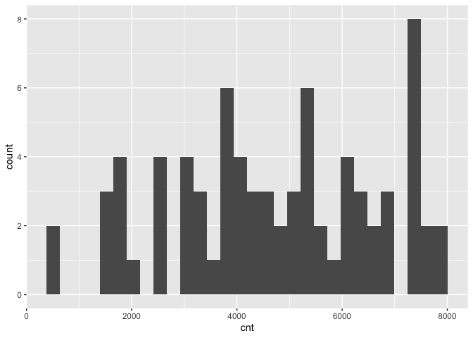
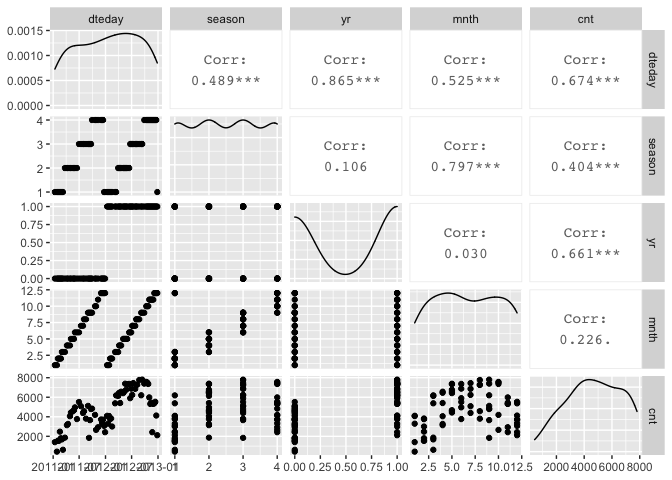
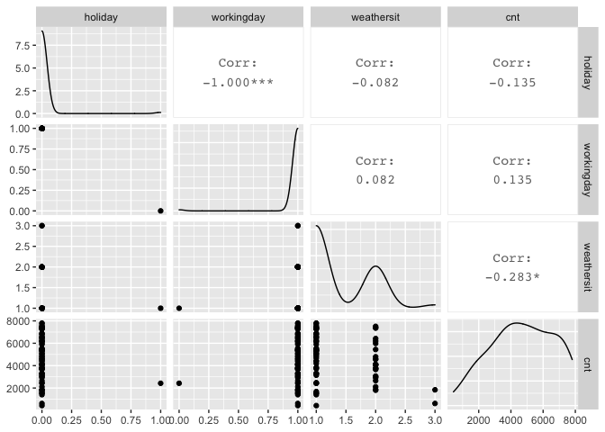
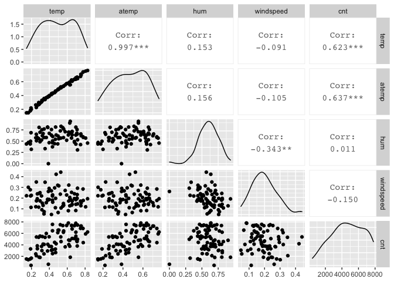
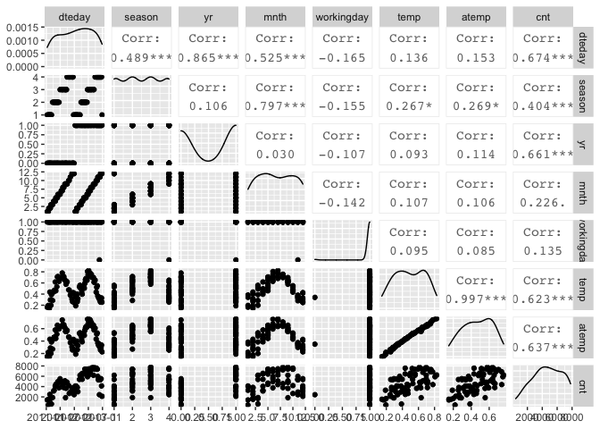

Project 2 - Karen Lopez
================
October 16, 2020

  - [Introduction](#introduction)
  - [Data](#data)
  - [Summarizations](#summarizations)
  - [Modeling](#modeling)

## Introduction

This project uses the bike sharing data set, day.csv, that’s located
*[here](https://archive.ics.uci.edu/ml/datasets/Bike+Sharing+Dataset)*
and contains 731 observations with 15 attributes. For modeling, the
response variable is the count of total rental bikes rented (*cnt*) and
11 of the 14 remaining variables will be considered for predictor
variables. Variables *casual* and *registered* are omitted and analysis
are performed on each *weekday* variable. The 11 remaining variables
include values for date, season, year, month, holiday, working day,
weather, temperature, feeling temperature, humidity, and wind speed.  
The purpose of this analysis is to fit two different tree models and
select the best one based on the appropriate criteria. This report will
be automated to run on the data set for each day of the week, starting
with Sunday at 0, Monday at 1, and so on.  
Many methods I’ll use come from a variety of packages installed in this
first code chunk. First I will read in the data and randomly separate it
into the training set and testing set, with 70% of the data going into
the traiing set. Then I will create some summary statistics and various
data plots to view variable relationships and narrow down the predictor
variables. Lastly, I will train and fit the models to compare them and
pick the final model.  
To begin, necessary libraries are loaded so their functions are
accessible and global variables are set.

``` r
library(readr)
library(caret)
library(knitr)
library(corrplot)
library(dplyr)
library(tidyverse)
library(rpart)
num <- 12
```

## Data

The dataset is read in using a relative path and saved as an object. The
weekday variable is converted to a factor with the day values replacing
their corresponding number, and then the weekday variable is used to
filter the data for each day of the week. The data is then randomly
split into a training and testing set, where 70% of the data goes into
the training set and the remaining 30% goes into the testing set.

``` r
#read in dataset with relative path & save to object
bikeData <- read_csv("Bike-Sharing-Dataset/day.csv") #read in data
#replace weekday numbers with day name
bikeData$weekday <- factor(bikeData$weekday, levels = c(0, 1, 2, 3, 4, 5, 6), labels = c("Sunday", "Monday", "Tuesday", "Wednesday", "Thursday", "Friday", "Saturday"))

bikeData <- bikeData %>% filter(weekday==params$weekday)

#create partitions in data indexes with 70% going in the training set
set.seed(num)
trainIndex <- createDataPartition(bikeData$cnt, p = 0.7, list = FALSE)

#create train and test data set using the trainIndex vector
bikeDataTrain <- bikeData[trainIndex, ]
bikeDataTest <- bikeData[-trainIndex, ]

bikeDataTrain #view train data
```

    ## # A tibble: 76 x 16
    ##    instant dteday     season    yr  mnth holiday weekday
    ##      <dbl> <date>      <dbl> <dbl> <dbl>   <dbl> <fct>  
    ##  1      13 2011-01-13      1     0     1       0 Thursd…
    ##  2      27 2011-01-27      1     0     1       0 Thursd…
    ##  3      34 2011-02-03      1     0     2       0 Thursd…
    ##  4      41 2011-02-10      1     0     2       0 Thursd…
    ##  5      48 2011-02-17      1     0     2       0 Thursd…
    ##  6      55 2011-02-24      1     0     2       0 Thursd…
    ##  7      62 2011-03-03      1     0     3       0 Thursd…
    ##  8      69 2011-03-10      1     0     3       0 Thursd…
    ##  9      83 2011-03-24      2     0     3       0 Thursd…
    ## 10      97 2011-04-07      2     0     4       0 Thursd…
    ## # … with 66 more rows, and 9 more variables: workingday <dbl>,
    ## #   weathersit <dbl>, temp <dbl>, atemp <dbl>, hum <dbl>,
    ## #   windspeed <dbl>, casual <dbl>, registered <dbl>, cnt <dbl>

``` r
bikeDataTest #view train data
```

    ## # A tibble: 28 x 16
    ##    instant dteday     season    yr  mnth holiday weekday
    ##      <dbl> <date>      <dbl> <dbl> <dbl>   <dbl> <fct>  
    ##  1       6 2011-01-06      1     0     1       0 Thursd…
    ##  2      20 2011-01-20      1     0     1       0 Thursd…
    ##  3      76 2011-03-17      1     0     3       0 Thursd…
    ##  4      90 2011-03-31      2     0     3       0 Thursd…
    ##  5     111 2011-04-21      2     0     4       0 Thursd…
    ##  6     132 2011-05-12      2     0     5       0 Thursd…
    ##  7     160 2011-06-09      2     0     6       0 Thursd…
    ##  8     174 2011-06-23      3     0     6       0 Thursd…
    ##  9     188 2011-07-07      3     0     7       0 Thursd…
    ## 10     202 2011-07-21      3     0     7       0 Thursd…
    ## # … with 18 more rows, and 9 more variables: workingday <dbl>,
    ## #   weathersit <dbl>, temp <dbl>, atemp <dbl>, hum <dbl>,
    ## #   windspeed <dbl>, casual <dbl>, registered <dbl>, cnt <dbl>

## Summarizations

Just to get an overview of the data, I first look at the summary of all
variables, and the distribution of the rental bike counts. Then I delve
deeper into the variable relationships with the response variable,
count, and with each other using ggpairs. These correlations will help
me narrow down which variables to include in the tree models, but I can
also view their corresponding scatterplots and density curves.

``` r
#summary of training data set
summary(bikeDataTrain)
```

    ##     instant          dteday               season    
    ##  Min.   : 13.0   Min.   :2011-01-13   Min.   :1.00  
    ##  1st Qu.:205.5   1st Qu.:2011-07-24   1st Qu.:1.75  
    ##  Median :394.5   Median :2012-01-29   Median :2.50  
    ##  Mean   :385.1   Mean   :2012-01-20   Mean   :2.50  
    ##  3rd Qu.:562.5   3rd Qu.:2012-07-15   3rd Qu.:3.25  
    ##  Max.   :727.0   Max.   :2012-12-27   Max.   :4.00  
    ##                                                     
    ##        yr              mnth           holiday       
    ##  Min.   :0.0000   Min.   : 1.000   Min.   :0.00000  
    ##  1st Qu.:0.0000   1st Qu.: 4.000   1st Qu.:0.00000  
    ##  Median :1.0000   Median : 6.500   Median :0.00000  
    ##  Mean   :0.5395   Mean   : 6.684   Mean   :0.01316  
    ##  3rd Qu.:1.0000   3rd Qu.:10.000   3rd Qu.:0.00000  
    ##  Max.   :1.0000   Max.   :12.000   Max.   :1.00000  
    ##                                                     
    ##       weekday     workingday       weathersit   
    ##  Sunday   : 0   Min.   :0.0000   Min.   :1.000  
    ##  Monday   : 0   1st Qu.:1.0000   1st Qu.:1.000  
    ##  Tuesday  : 0   Median :1.0000   Median :1.000  
    ##  Wednesday: 0   Mean   :0.9868   Mean   :1.382  
    ##  Thursday :76   3rd Qu.:1.0000   3rd Qu.:2.000  
    ##  Friday   : 0   Max.   :1.0000   Max.   :3.000  
    ##  Saturday : 0                                   
    ##       temp            atemp             hum        
    ##  Min.   :0.1443   Min.   :0.1495   Min.   :0.0000  
    ##  1st Qu.:0.3375   1st Qu.:0.3402   1st Qu.:0.5031  
    ##  Median :0.4850   Median :0.4744   Median :0.5998  
    ##  Mean   :0.4913   Mean   :0.4701   Mean   :0.6000  
    ##  3rd Qu.:0.6512   3rd Qu.:0.6097   3rd Qu.:0.6978  
    ##  Max.   :0.8275   Max.   :0.7614   Max.   :0.9396  
    ##                                                    
    ##    windspeed           casual         registered  
    ##  Min.   :0.04727   Min.   :  15.0   Min.   : 416  
    ##  1st Qu.:0.13993   1st Qu.: 242.2   1st Qu.:3104  
    ##  Median :0.19091   Median : 570.0   Median :4052  
    ##  Mean   :0.19800   Mean   : 582.9   Mean   :4116  
    ##  3rd Qu.:0.24145   3rd Qu.: 878.2   3rd Qu.:5526  
    ##  Max.   :0.44156   Max.   :1405.0   Max.   :6750  
    ##                                                   
    ##       cnt      
    ##  Min.   : 431  
    ##  1st Qu.:3286  
    ##  Median :4736  
    ##  Mean   :4699  
    ##  3rd Qu.:6286  
    ##  Max.   :7804  
    ## 

``` r
#quantitative histogram for cnt to view distribution
g <- ggplot(bikeDataTrain, aes(x=cnt))
g + geom_histogram()
```

<!-- -->

``` r
#create 3 plots of variables against each other and the response variable
bikeDataTrain1 <- bikeDataTrain %>% select(dteday, season, yr, mnth, cnt)
GGally::ggpairs(bikeDataTrain1)
```

<!-- -->

``` r
#all 3 might be of interest

bikeDataTrain2 <- bikeDataTrain %>% select(holiday, workingday, weathersit, cnt)
GGally::ggpairs(bikeDataTrain2)
```

<!-- -->

``` r
#workingday might be of interest

bikeDataTrain3 <- bikeDataTrain %>% select(temp, atemp, hum, windspeed, cnt)
GGally::ggpairs(bikeDataTrain3)
```

<!-- -->

``` r
#temp & atemp might be of interest

bikeDataTrain4 <- bikeDataTrain %>% select(dteday, season, yr, mnth, workingday, temp, atemp, cnt)
GGally::ggpairs(bikeDataTrain4)
```

<!-- -->

``` r
# yr & atemp might be of more interest than the others 
```

Various predictor variables have interactions with each other, and I
want to focus on those with the lower correlation values with each other
but higher correlations with the response. These variables include such
as year, temperature, and feeling temperature. The date, season, and
month variables will be omitted from further analysis because of their
stronger correlations with other variables, and working day will be
omitted for its weak correlation with count. The temperature and feeling
temperature have a very strong correlation so I’ll only keep feeling
temperature for it’s slightly stronger correlation with the response
variable, and analyze it alongside the year variable. These variables
were chosen using the `weekday = Monday` data, and will be used for all
other days to keep analyses consistent.

## Modeling

Next I will utilize the `caret` package to create two tree models with
the training set and then predict each on the testing set, after
reducing both sets to include only the variables of interest. The models
are based on the response variable, *cnt*, being a continuous variable.
The predictors are *yr* and *atemp*, which are categorical (0: 2011, 1:
2012) and continuous variables, respectively.

The first model is a non-ensemble tree-based model chosen using
leave-one-out cross-validation, and the second model is a boosted tree
model chosen using 12-fold cross-validation. Just in case, and for good
practice, the predictor variables are standardize via centering and
scaling. Each model is then predicted on using the training set, and
their performances are compared via root mean square error (RMSE) and/or
mean absolute error (MAE) values.

``` r
#select only variables needed for modeling
bikeDataTrain <- bikeDataTrain %>% select(cnt, yr, atemp)
kable(head(bikeDataTrain)) #preview reduced train data
```

|  cnt | yr |    atemp |
| ---: | -: | -------: |
| 1406 |  0 | 0.150883 |
|  431 |  0 | 0.219700 |
| 1550 |  0 | 0.177878 |
| 1538 |  0 | 0.149548 |
| 2475 |  0 | 0.428658 |
| 1807 |  0 | 0.289191 |

``` r
bikeDataTest <- bikeDataTest %>% select(cnt, yr, atemp)
kable(head(bikeDataTest)) #preview reduced test data
```

|  cnt | yr |    atemp |
| ---: | -: | -------: |
| 1606 |  0 | 0.233209 |
| 1927 |  0 | 0.255050 |
| 2744 |  0 | 0.410333 |
| 1685 |  0 | 0.257575 |
| 4189 |  0 | 0.453892 |
| 4864 |  0 | 0.523363 |

``` r
#(not ensemble) tree-based model chosen using leave one out cross validation
#using regression tree to model cnt (continuous variable)
treeFit1 <- train(cnt ~ ., data = bikeDataTrain, method = "rpart", preProcess = c("center", "scale"), trControl = trainControl(method = "LOOCV"))
treeFit1 #view resulting tree parameters
```

    ## CART 
    ## 
    ## 76 samples
    ##  2 predictor
    ## 
    ## Pre-processing: centered (2), scaled (2) 
    ## Resampling: Leave-One-Out Cross-Validation 
    ## Summary of sample sizes: 75, 75, 75, 75, 75, 75, ... 
    ## Resampling results across tuning parameters:
    ## 
    ##   cp         RMSE      Rsquared    MAE     
    ##   0.1205370  1297.984  0.56213227  1115.184
    ##   0.2244224  1539.841  0.38622422  1312.542
    ##   0.4368172  2183.345  0.02003888  1992.153
    ## 
    ## RMSE was used to select the optimal model using the
    ##  smallest value.
    ## The final value used for the model was cp = 0.120537.

``` r
#plot(treeFit1) #plot result

#boosted tree model chosen using cross-validation
treeFit2 <- train(cnt ~ ., data = bikeDataTrain, method = "gbm", preProcess = c("center", "scale"), trControl = trainControl(method = "cv", number = num))
```

    ## Iter   TrainDeviance   ValidDeviance   StepSize   Improve
    ##      1  3359393.3777             nan     0.1000 281275.6011
    ##      2  3122771.6795             nan     0.1000 285649.2576
    ##      3  2834776.9724             nan     0.1000 233588.2528
    ##      4  2626162.8945             nan     0.1000 212833.0929
    ##      5  2399116.2161             nan     0.1000 178208.8281
    ##      6  2174144.8233             nan     0.1000 158494.4311
    ##      7  2040381.5118             nan     0.1000 126223.7216
    ##      8  1876123.6966             nan     0.1000 140872.6125
    ##      9  1766196.5016             nan     0.1000 87072.3924
    ##     10  1645274.7491             nan     0.1000 104784.8043
    ##     20   965670.9270             nan     0.1000 15695.8578
    ##     40   677367.5446             nan     0.1000 -8239.8121
    ##     60   662898.0838             nan     0.1000 -4038.3535
    ##     80   638868.1842             nan     0.1000 -4252.5936
    ##    100   628820.8007             nan     0.1000 -674.3909
    ##    120   614204.1410             nan     0.1000 -3030.0964
    ##    140   602954.7843             nan     0.1000 -36832.6974
    ##    150   598313.7279             nan     0.1000 -24654.1824
    ## 
    ## Iter   TrainDeviance   ValidDeviance   StepSize   Improve
    ##      1  3336842.7790             nan     0.1000 273074.6041
    ##      2  2916261.5045             nan     0.1000 448623.3420
    ##      3  2671280.2603             nan     0.1000 254383.4050
    ##      4  2498381.7796             nan     0.1000 200719.0817
    ##      5  2331767.0431             nan     0.1000 146728.7303
    ##      6  2155562.6723             nan     0.1000 130511.6524
    ##      7  1914452.5042             nan     0.1000 216480.7593
    ##      8  1809788.2616             nan     0.1000 92932.8936
    ##      9  1695482.7447             nan     0.1000 126997.7999
    ##     10  1580345.5275             nan     0.1000 57218.9155
    ##     20   925276.9906             nan     0.1000 18203.3426
    ##     40   665320.7210             nan     0.1000 -5259.7810
    ##     60   620435.9372             nan     0.1000 -3839.7482
    ##     80   596238.8336             nan     0.1000 -814.0061
    ##    100   570340.3583             nan     0.1000 -19998.6561
    ##    120   560270.8678             nan     0.1000 -7654.9364
    ##    140   533385.0813             nan     0.1000 -7939.7224
    ##    150   531184.7113             nan     0.1000 -11201.1025
    ## 
    ## Iter   TrainDeviance   ValidDeviance   StepSize   Improve
    ##      1  3405865.6490             nan     0.1000 287003.2700
    ##      2  3065565.2627             nan     0.1000 284456.2346
    ##      3  2767696.6842             nan     0.1000 202786.8366
    ##      4  2408618.6375             nan     0.1000 373092.9215
    ##      5  2230767.4169             nan     0.1000 85700.2865
    ##      6  2005647.6265             nan     0.1000 225843.8579
    ##      7  1885486.7088             nan     0.1000 116078.8175
    ##      8  1711138.0648             nan     0.1000 130924.8169
    ##      9  1608594.2268             nan     0.1000 88401.5468
    ##     10  1496773.6738             nan     0.1000 55208.0299
    ##     20   921119.3488             nan     0.1000 32301.5465
    ##     40   672842.0072             nan     0.1000 -7864.2734
    ##     60   630578.4277             nan     0.1000 -4946.7028
    ##     80   604581.4014             nan     0.1000 -6537.4875
    ##    100   587769.6057             nan     0.1000 -13972.0819
    ##    120   571359.2902             nan     0.1000 -10477.4320
    ##    140   556728.3307             nan     0.1000 -908.4020
    ##    150   549656.3295             nan     0.1000 -3206.6684
    ## 
    ## Iter   TrainDeviance   ValidDeviance   StepSize   Improve
    ##      1  3386784.9133             nan     0.1000 231211.3631
    ##      2  3147508.5943             nan     0.1000 293439.2278
    ##      3  2958687.8370             nan     0.1000 234212.5642
    ##      4  2724827.0659             nan     0.1000 183734.7286
    ##      5  2501619.9139             nan     0.1000 220544.4374
    ##      6  2325235.2757             nan     0.1000 137599.9769
    ##      7  2120302.3291             nan     0.1000 17307.1834
    ##      8  1962081.5951             nan     0.1000 170833.9517
    ##      9  1827070.7932             nan     0.1000 38594.3290
    ##     10  1689668.9353             nan     0.1000 143464.3832
    ##     20  1040562.0057             nan     0.1000 13776.0909
    ##     40   757306.5470             nan     0.1000 -7211.9634
    ##     60   715274.4981             nan     0.1000 -18868.1867
    ##     80   689630.4760             nan     0.1000 -6063.5499
    ##    100   675793.8176             nan     0.1000 -621.4120
    ##    120   655012.7956             nan     0.1000 -1152.5742
    ##    140   648072.3178             nan     0.1000 -620.4382
    ##    150   640578.5596             nan     0.1000 -901.3469
    ## 
    ## Iter   TrainDeviance   ValidDeviance   StepSize   Improve
    ##      1  3350575.5937             nan     0.1000 308403.8482
    ##      2  2960022.3527             nan     0.1000 299606.5777
    ##      3  2741086.0163             nan     0.1000 240208.8160
    ##      4  2478324.6622             nan     0.1000 140613.1316
    ##      5  2282008.3298             nan     0.1000 189943.9182
    ##      6  2146332.5131             nan     0.1000 152434.5224
    ##      7  2012694.3828             nan     0.1000 114199.8897
    ##      8  1854188.1239             nan     0.1000 57599.0265
    ##      9  1703269.4540             nan     0.1000 109440.3894
    ##     10  1546992.8131             nan     0.1000 139310.4184
    ##     20   916852.5889             nan     0.1000 28580.3591
    ##     40   685004.5284             nan     0.1000 -943.2143
    ##     60   649889.0730             nan     0.1000 -2868.5020
    ##     80   623440.5185             nan     0.1000 -6470.5208
    ##    100   608462.5877             nan     0.1000 -12989.1210
    ##    120   589988.8559             nan     0.1000 -3820.2358
    ##    140   569148.4467             nan     0.1000 -20937.4026
    ##    150   561868.0352             nan     0.1000 -16324.0163
    ## 
    ## Iter   TrainDeviance   ValidDeviance   StepSize   Improve
    ##      1  3315886.3919             nan     0.1000 312010.6955
    ##      2  3000829.1195             nan     0.1000 195357.1969
    ##      3  2753039.0068             nan     0.1000 240173.7570
    ##      4  2533811.4557             nan     0.1000 161029.8911
    ##      5  2314807.5137             nan     0.1000 154206.4061
    ##      6  2025185.0281             nan     0.1000 302996.0024
    ##      7  1856959.4140             nan     0.1000 113109.6526
    ##      8  1740139.8877             nan     0.1000 112385.6648
    ##      9  1623577.3546             nan     0.1000 65275.2475
    ##     10  1518931.2767             nan     0.1000 94781.9932
    ##     20   883107.8450             nan     0.1000 10615.1344
    ##     40   679784.5021             nan     0.1000 -1973.4825
    ##     60   646586.5040             nan     0.1000 -10380.6044
    ##     80   622450.0748             nan     0.1000 -6786.6290
    ##    100   596060.1503             nan     0.1000 -3493.3537
    ##    120   586669.1269             nan     0.1000 -2330.3285
    ##    140   566600.0201             nan     0.1000 -2385.2711
    ##    150   559512.3007             nan     0.1000 -7040.4150
    ## 
    ## Iter   TrainDeviance   ValidDeviance   StepSize   Improve
    ##      1  3354782.9721             nan     0.1000 224511.2404
    ##      2  3079349.2228             nan     0.1000 -3676.5276
    ##      3  2772449.3415             nan     0.1000 285572.4993
    ##      4  2558634.0338             nan     0.1000 208078.8247
    ##      5  2388979.5092             nan     0.1000 179047.2791
    ##      6  2228357.4575             nan     0.1000 147627.0547
    ##      7  2065065.9421             nan     0.1000 152002.2569
    ##      8  1933521.6231             nan     0.1000 92794.2258
    ##      9  1815521.2795             nan     0.1000 45661.3318
    ##     10  1710635.1437             nan     0.1000 33143.6392
    ##     20  1044746.8358             nan     0.1000 21067.0190
    ##     40   763434.1822             nan     0.1000 -3614.0050
    ##     60   736930.8610             nan     0.1000 -1380.5642
    ##     80   726482.3122             nan     0.1000 -25500.1204
    ##    100   698353.6832             nan     0.1000 -8400.1849
    ##    120   684743.2048             nan     0.1000 -4108.1992
    ##    140   676806.4639             nan     0.1000 -5655.5350
    ##    150   669759.7995             nan     0.1000 -2483.7440
    ## 
    ## Iter   TrainDeviance   ValidDeviance   StepSize   Improve
    ##      1  3355516.6505             nan     0.1000 232672.0901
    ##      2  3056689.5962             nan     0.1000 295918.5680
    ##      3  2663289.8816             nan     0.1000 337929.9530
    ##      4  2394004.5525             nan     0.1000 204124.9270
    ##      5  2247472.4116             nan     0.1000 163190.7932
    ##      6  2084144.6061             nan     0.1000 139185.4879
    ##      7  1958205.0084             nan     0.1000 96981.5831
    ##      8  1794985.1451             nan     0.1000 120328.8164
    ##      9  1709644.6130             nan     0.1000 63171.1456
    ##     10  1582977.0533             nan     0.1000 145701.4875
    ##     20   967600.0409             nan     0.1000 25202.8886
    ##     40   741309.3688             nan     0.1000 -14920.1084
    ##     60   708033.2835             nan     0.1000 -34588.4306
    ##     80   686634.9794             nan     0.1000 -2105.2667
    ##    100   674315.2906             nan     0.1000 -2348.4147
    ##    120   649136.7317             nan     0.1000 -9865.7676
    ##    140   639004.6116             nan     0.1000 -7274.4470
    ##    150   619961.8977             nan     0.1000 -12433.3147
    ## 
    ## Iter   TrainDeviance   ValidDeviance   StepSize   Improve
    ##      1  3377513.9300             nan     0.1000 294123.5928
    ##      2  3198944.8767             nan     0.1000 216802.2661
    ##      3  2969310.5927             nan     0.1000 252503.0747
    ##      4  2676248.8194             nan     0.1000 174850.2489
    ##      5  2511790.8948             nan     0.1000 198186.1900
    ##      6  2342380.4910             nan     0.1000 171183.0711
    ##      7  2169144.1285             nan     0.1000 131852.4704
    ##      8  1954223.4903             nan     0.1000 222810.0944
    ##      9  1819028.2136             nan     0.1000 94212.1191
    ##     10  1681560.2121             nan     0.1000 124051.6312
    ##     20  1009586.9693             nan     0.1000 34632.0677
    ##     40   752291.7155             nan     0.1000 -2028.5591
    ##     60   716606.0502             nan     0.1000 -768.7692
    ##     80   695392.8850             nan     0.1000 -6677.8011
    ##    100   672456.1398             nan     0.1000 -1500.3918
    ##    120   654687.3572             nan     0.1000 -8703.7531
    ##    140   634261.6131             nan     0.1000 -844.6034
    ##    150   621838.3157             nan     0.1000 -20380.6048
    ## 
    ## Iter   TrainDeviance   ValidDeviance   StepSize   Improve
    ##      1  3430327.6847             nan     0.1000 265234.7711
    ##      2  3187034.6443             nan     0.1000 249298.0795
    ##      3  2857114.4958             nan     0.1000 239006.4636
    ##      4  2634672.1340             nan     0.1000 168599.9555
    ##      5  2449544.8880             nan     0.1000 185716.9476
    ##      6  2269678.7994             nan     0.1000 127183.1071
    ##      7  2079863.2052             nan     0.1000 183017.3178
    ##      8  1915416.2404             nan     0.1000 149577.0204
    ##      9  1827012.8545             nan     0.1000 13126.9376
    ##     10  1726525.5479             nan     0.1000 33942.0045
    ##     20  1020517.1481             nan     0.1000 -6629.3901
    ##     40   758012.5320             nan     0.1000 -9526.9862
    ##     60   741591.6095             nan     0.1000 -10197.8224
    ##     80   724238.5964             nan     0.1000 -7274.9182
    ##    100   713101.3375             nan     0.1000 -483.8520
    ##    120   698909.3357             nan     0.1000 -1766.7180
    ##    140   685857.0351             nan     0.1000 -4161.2698
    ##    150   680673.2846             nan     0.1000 -2708.3614
    ## 
    ## Iter   TrainDeviance   ValidDeviance   StepSize   Improve
    ##      1  3384084.5051             nan     0.1000 247714.9387
    ##      2  3170215.4047             nan     0.1000 226126.6452
    ##      3  2937002.5115             nan     0.1000 239711.2185
    ##      4  2651550.8889             nan     0.1000 192234.2026
    ##      5  2478413.0440             nan     0.1000 194713.8104
    ##      6  2303178.1508             nan     0.1000 163411.9946
    ##      7  2152199.2129             nan     0.1000 138538.9113
    ##      8  1943207.6790             nan     0.1000 225855.4139
    ##      9  1815175.1099             nan     0.1000 92318.6102
    ##     10  1697208.2391             nan     0.1000 96544.8890
    ##     20   969993.6008             nan     0.1000 30469.8673
    ##     40   772512.3059             nan     0.1000 -14720.5227
    ##     60   724384.8989             nan     0.1000 -12863.4485
    ##     80   696394.9339             nan     0.1000 -9664.8021
    ##    100   683964.6174             nan     0.1000 -23278.0537
    ##    120   657622.6964             nan     0.1000 -5654.9389
    ##    140   639576.7046             nan     0.1000 -15842.8346
    ##    150   628906.1031             nan     0.1000 -13573.4593
    ## 
    ## Iter   TrainDeviance   ValidDeviance   StepSize   Improve
    ##      1  3468176.4270             nan     0.1000 298654.8784
    ##      2  3189152.4295             nan     0.1000 291324.1419
    ##      3  2970650.1446             nan     0.1000 205493.2214
    ##      4  2706330.5171             nan     0.1000 137005.4518
    ##      5  2472049.7924             nan     0.1000 223351.2480
    ##      6  2231552.6523             nan     0.1000 211281.9294
    ##      7  2115075.9741             nan     0.1000 52147.0261
    ##      8  1946098.9410             nan     0.1000 138397.0065
    ##      9  1825361.6583             nan     0.1000 88692.3416
    ##     10  1713705.2564             nan     0.1000 75875.7234
    ##     20   988207.4268             nan     0.1000 -3951.1308
    ##     40   776367.9259             nan     0.1000 -8790.9662
    ##     60   734515.4003             nan     0.1000 -5345.6278
    ##     80   715226.6211             nan     0.1000 -21430.4277
    ##    100   695201.7732             nan     0.1000 -14326.7619
    ##    120   683148.8805             nan     0.1000 -8526.3819
    ##    140   669108.1343             nan     0.1000 -18706.7501
    ##    150   660738.5502             nan     0.1000 -4135.0008
    ## 
    ## Iter   TrainDeviance   ValidDeviance   StepSize   Improve
    ##      1  3613643.8012             nan     0.1000 265247.5872
    ##      2  3285201.7094             nan     0.1000 309381.3794
    ##      3  3072489.3365             nan     0.1000 143148.3284
    ##      4  2820827.3176             nan     0.1000 241400.4825
    ##      5  2621796.2811             nan     0.1000 199079.5455
    ##      6  2422305.6917             nan     0.1000 139139.5659
    ##      7  2262837.6610             nan     0.1000 154477.6990
    ##      8  2115755.1352             nan     0.1000 146565.1844
    ##      9  1993138.2586             nan     0.1000 78149.0089
    ##     10  1904864.4042             nan     0.1000 74775.2602
    ##     20  1159472.1412             nan     0.1000 37098.2156
    ##     40   835349.2098             nan     0.1000 -2800.6349
    ##     60   783467.0875             nan     0.1000 -10325.0581
    ##     80   759127.4500             nan     0.1000 -3705.3638
    ##    100   748322.8825             nan     0.1000 -6038.7655
    ##    120   716254.0673             nan     0.1000 -4574.5684
    ##    140   700520.4057             nan     0.1000 -2523.0367
    ##    150   697434.7511             nan     0.1000 -4872.2469
    ## 
    ## Iter   TrainDeviance   ValidDeviance   StepSize   Improve
    ##      1  3550218.7939             nan     0.1000 310095.2527
    ##      2  3239143.9866             nan     0.1000 259654.7012
    ##      3  2991768.8346             nan     0.1000 213855.6339
    ##      4  2793507.8467             nan     0.1000 155006.1749
    ##      5  2573630.3392             nan     0.1000 232989.4069
    ##      6  2386782.5574             nan     0.1000 199925.7181
    ##      7  2130233.2140             nan     0.1000 277069.4174
    ##      8  2000400.0317             nan     0.1000 136762.4563
    ##      9  1851684.5786             nan     0.1000 105434.1592
    ##     10  1736526.2808             nan     0.1000 72436.1177
    ##     20  1048150.0402             nan     0.1000 16426.3388
    ##     40   790272.0994             nan     0.1000 -1035.3977
    ##     60   753712.4745             nan     0.1000 -35267.0874
    ##     80   722319.0807             nan     0.1000 -182.3347
    ##    100   689398.8124             nan     0.1000 -2355.5030
    ##    120   666201.6095             nan     0.1000 -8414.7761
    ##    140   654436.3720             nan     0.1000 -16607.1480
    ##    150   645795.3221             nan     0.1000 -5168.7947
    ## 
    ## Iter   TrainDeviance   ValidDeviance   StepSize   Improve
    ##      1  3552528.2813             nan     0.1000 239398.0999
    ##      2  3324971.8316             nan     0.1000 290155.4070
    ##      3  2978858.5291             nan     0.1000 305036.2927
    ##      4  2697375.5185             nan     0.1000 268167.2113
    ##      5  2429632.6400             nan     0.1000 303719.1157
    ##      6  2299691.3933             nan     0.1000 144608.4346
    ##      7  2091270.4261             nan     0.1000 189467.4260
    ##      8  1970322.5463             nan     0.1000 80712.9709
    ##      9  1769862.9485             nan     0.1000 176759.6852
    ##     10  1660423.1229             nan     0.1000 18898.5021
    ##     20   991957.9810             nan     0.1000 29712.3035
    ##     40   769597.9793             nan     0.1000 -13384.3875
    ##     60   736324.1090             nan     0.1000  588.8912
    ##     80   706079.2268             nan     0.1000 -5704.4607
    ##    100   683110.7685             nan     0.1000 -13179.7822
    ##    120   656650.9931             nan     0.1000 -7964.9579
    ##    140   621316.9463             nan     0.1000 -6791.0818
    ##    150   616486.3788             nan     0.1000 -14007.0377
    ## 
    ## Iter   TrainDeviance   ValidDeviance   StepSize   Improve
    ##      1  3393065.2777             nan     0.1000 276245.8815
    ##      2  3160057.6113             nan     0.1000 216723.7961
    ##      3  2897718.7794             nan     0.1000 225146.7845
    ##      4  2692429.5535             nan     0.1000 207935.7035
    ##      5  2466614.2968             nan     0.1000 175380.6615
    ##      6  2292522.5135             nan     0.1000 29150.6909
    ##      7  2107442.8186             nan     0.1000 126477.1901
    ##      8  1946454.9096             nan     0.1000 126310.2640
    ##      9  1819421.2281             nan     0.1000 102268.2753
    ##     10  1727300.8981             nan     0.1000 100926.0011
    ##     20  1063041.6980             nan     0.1000 19283.7370
    ##     40   802769.3310             nan     0.1000 -1176.5949
    ##     60   762804.3768             nan     0.1000 -3451.3585
    ##     80   745008.2820             nan     0.1000 -1533.7986
    ##    100   739327.8491             nan     0.1000 -13283.1049
    ##    120   727169.7216             nan     0.1000 -8311.0240
    ##    140   714297.8608             nan     0.1000 -6069.4291
    ##    150   704181.1089             nan     0.1000 -5851.3060
    ## 
    ## Iter   TrainDeviance   ValidDeviance   StepSize   Improve
    ##      1  3254678.9300             nan     0.1000 328916.6436
    ##      2  2972945.3679             nan     0.1000 253500.8526
    ##      3  2754322.6418             nan     0.1000 151272.8264
    ##      4  2500234.7331             nan     0.1000 196524.6173
    ##      5  2327465.5176             nan     0.1000 112458.6165
    ##      6  2182094.6791             nan     0.1000 175517.0245
    ##      7  2035830.9471             nan     0.1000 144449.3497
    ##      8  1882271.8978             nan     0.1000 120731.7105
    ##      9  1755457.1315             nan     0.1000 86626.8261
    ##     10  1588965.3729             nan     0.1000 151312.5390
    ##     20  1038984.6296             nan     0.1000 26836.5117
    ##     40   795516.1641             nan     0.1000 -21965.5552
    ##     60   762151.6495             nan     0.1000   54.5764
    ##     80   729145.7754             nan     0.1000 -9678.3339
    ##    100   705872.1766             nan     0.1000 -11377.2137
    ##    120   688130.6475             nan     0.1000 -6283.5698
    ##    140   672431.8325             nan     0.1000 -13057.1337
    ##    150   662163.7123             nan     0.1000 -10569.9775
    ## 
    ## Iter   TrainDeviance   ValidDeviance   StepSize   Improve
    ##      1  3410709.7065             nan     0.1000 279704.1954
    ##      2  3166131.4897             nan     0.1000 253920.1994
    ##      3  2987829.4072             nan     0.1000 177486.9735
    ##      4  2730602.4075             nan     0.1000 183101.7893
    ##      5  2522333.0549             nan     0.1000 216390.7901
    ##      6  2355387.3837             nan     0.1000 171633.7977
    ##      7  2226136.3016             nan     0.1000 144381.6360
    ##      8  2056903.8890             nan     0.1000 128610.4374
    ##      9  1924563.4912             nan     0.1000 111416.4528
    ##     10  1768776.6375             nan     0.1000 170081.6059
    ##     20  1111495.1821             nan     0.1000 17815.0935
    ##     40   851630.5948             nan     0.1000 2945.9803
    ##     60   801260.1154             nan     0.1000 -989.1895
    ##     80   758650.3399             nan     0.1000 -5050.0810
    ##    100   739803.1156             nan     0.1000 -8697.1402
    ##    120   714497.5423             nan     0.1000 -8370.3902
    ##    140   691973.1435             nan     0.1000 -3294.2268
    ##    150   679965.7039             nan     0.1000 -3403.2321
    ## 
    ## Iter   TrainDeviance   ValidDeviance   StepSize   Improve
    ##      1  3431715.8614             nan     0.1000 305187.4553
    ##      2  3182468.9212             nan     0.1000 243089.9130
    ##      3  2973243.7417             nan     0.1000 179769.8976
    ##      4  2750263.8401             nan     0.1000 237958.5615
    ##      5  2564673.8551             nan     0.1000 199304.1701
    ##      6  2404445.0902             nan     0.1000 145280.4401
    ##      7  2241586.8803             nan     0.1000 66294.7158
    ##      8  2104968.6110             nan     0.1000 129834.3043
    ##      9  1962980.1576             nan     0.1000 131788.7719
    ##     10  1828787.9571             nan     0.1000 82273.3751
    ##     20  1189390.7838             nan     0.1000 43919.9566
    ##     40   796723.3302             nan     0.1000 -2235.4237
    ##     60   753787.8218             nan     0.1000  595.6599
    ##     80   734698.7615             nan     0.1000  290.6693
    ##    100   724513.9333             nan     0.1000 -13945.9557
    ##    120   705150.2803             nan     0.1000 -4391.9610
    ##    140   690911.0339             nan     0.1000 -9022.8726
    ##    150   685022.9036             nan     0.1000 -19325.3578
    ## 
    ## Iter   TrainDeviance   ValidDeviance   StepSize   Improve
    ##      1  3424015.5941             nan     0.1000 302332.7025
    ##      2  3092811.9682             nan     0.1000 319704.5218
    ##      3  2889641.0263             nan     0.1000 187376.8848
    ##      4  2559096.0532             nan     0.1000 269939.8223
    ##      5  2272944.9900             nan     0.1000 226758.1992
    ##      6  2162366.4988             nan     0.1000 129643.3426
    ##      7  1930976.7346             nan     0.1000 171718.6035
    ##      8  1822351.3290             nan     0.1000 94252.5398
    ##      9  1674195.6947             nan     0.1000 92558.0227
    ##     10  1576475.4277             nan     0.1000 83550.7706
    ##     20   969896.6355             nan     0.1000 8730.0905
    ##     40   762143.6802             nan     0.1000 -11957.1718
    ##     60   734924.4183             nan     0.1000 -12578.6292
    ##     80   705994.2153             nan     0.1000 -5778.7550
    ##    100   684423.0201             nan     0.1000 -1446.5031
    ##    120   660263.1089             nan     0.1000 -1593.2993
    ##    140   642445.6519             nan     0.1000 -10282.8572
    ##    150   633104.7707             nan     0.1000 -4265.1698
    ## 
    ## Iter   TrainDeviance   ValidDeviance   StepSize   Improve
    ##      1  3462330.7584             nan     0.1000 204585.2091
    ##      2  3188043.8819             nan     0.1000 205469.3711
    ##      3  2920489.4598             nan     0.1000 299898.2376
    ##      4  2554103.4423             nan     0.1000 360417.6183
    ##      5  2404017.7011             nan     0.1000 80242.2893
    ##      6  2136215.6705             nan     0.1000 214765.9696
    ##      7  1966047.9087             nan     0.1000 135072.8593
    ##      8  1836409.9070             nan     0.1000 127338.5081
    ##      9  1652743.5756             nan     0.1000 174809.4643
    ##     10  1579787.5598             nan     0.1000 8794.9213
    ##     20   975180.1298             nan     0.1000 21045.2509
    ##     40   784827.3123             nan     0.1000 -14979.1136
    ##     60   745396.1732             nan     0.1000 1098.9009
    ##     80   707410.1127             nan     0.1000 -12363.6952
    ##    100   691463.8259             nan     0.1000 -6194.0336
    ##    120   667529.2214             nan     0.1000 -13373.3461
    ##    140   653275.2437             nan     0.1000 -7205.5864
    ##    150   648629.7496             nan     0.1000 -6175.1218
    ## 
    ## Iter   TrainDeviance   ValidDeviance   StepSize   Improve
    ##      1  3546991.6951             nan     0.1000 257248.4664
    ##      2  3259195.3108             nan     0.1000 326828.8506
    ##      3  3037915.4704             nan     0.1000 168652.7011
    ##      4  2854173.1243             nan     0.1000 164162.7168
    ##      5  2599558.9764             nan     0.1000 246044.7681
    ##      6  2415374.8464             nan     0.1000 171603.4438
    ##      7  2266812.2252             nan     0.1000 78696.5323
    ##      8  2026889.7855             nan     0.1000 136152.1835
    ##      9  1878844.4652             nan     0.1000 119987.8300
    ##     10  1747263.2745             nan     0.1000 79760.0399
    ##     20  1068186.1359             nan     0.1000 7673.4763
    ##     40   809076.4888             nan     0.1000 1582.1026
    ##     60   764826.4076             nan     0.1000 -19015.4682
    ##     80   735984.2508             nan     0.1000 -5648.8144
    ##    100   721362.1426             nan     0.1000 -17644.6614
    ##    120   691742.3693             nan     0.1000  241.4975
    ##    140   679351.2749             nan     0.1000 -4231.5501
    ##    150   668736.1561             nan     0.1000 -7651.0409
    ## 
    ## Iter   TrainDeviance   ValidDeviance   StepSize   Improve
    ##      1  3600862.3185             nan     0.1000 250327.0062
    ##      2  3214520.2847             nan     0.1000 314351.2663
    ##      3  2860902.4841             nan     0.1000 306157.2057
    ##      4  2643550.7798             nan     0.1000 194985.9194
    ##      5  2401055.3277             nan     0.1000 161911.5276
    ##      6  2141519.8817             nan     0.1000 133883.4603
    ##      7  1970884.9459             nan     0.1000 108382.2548
    ##      8  1795937.1982             nan     0.1000 148431.8901
    ##      9  1706221.9017             nan     0.1000 79509.5251
    ##     10  1617783.2710             nan     0.1000 63315.2027
    ##     20   942549.5735             nan     0.1000 4735.6422
    ##     40   735848.9247             nan     0.1000 -3628.3926
    ##     60   714750.6335             nan     0.1000 -20242.9749
    ##     80   693256.8114             nan     0.1000 -9526.6229
    ##    100   668186.7400             nan     0.1000 -8143.2835
    ##    120   642410.3420             nan     0.1000 -2315.2488
    ##    140   620012.9453             nan     0.1000 -13282.5593
    ##    150   608714.3446             nan     0.1000 -4646.5214
    ## 
    ## Iter   TrainDeviance   ValidDeviance   StepSize   Improve
    ##      1  3501007.6146             nan     0.1000 345129.4772
    ##      2  3160090.8345             nan     0.1000 301163.6121
    ##      3  2970690.3361             nan     0.1000 191327.7419
    ##      4  2716086.7163             nan     0.1000 231037.3253
    ##      5  2498590.4174             nan     0.1000 174278.4250
    ##      6  2315693.7938             nan     0.1000 183292.4539
    ##      7  2065238.6184             nan     0.1000 222608.5541
    ##      8  1833798.2255             nan     0.1000 176997.5149
    ##      9  1742530.1422             nan     0.1000 110441.0638
    ##     10  1630307.2513             nan     0.1000 89379.3810
    ##     20  1023168.7823             nan     0.1000 48334.0642
    ##     40   784528.5803             nan     0.1000 -11837.0685
    ##     60   750365.5603             nan     0.1000 -9164.6653
    ##     80   717363.9649             nan     0.1000 -10680.6796
    ##    100   695770.1255             nan     0.1000 -7029.7357
    ##    120   662028.7150             nan     0.1000 -10459.3602
    ##    140   640797.3336             nan     0.1000 -11558.5238
    ##    150   634076.6900             nan     0.1000 -9081.1659
    ## 
    ## Iter   TrainDeviance   ValidDeviance   StepSize   Improve
    ##      1  3553707.6337             nan     0.1000 217431.9974
    ##      2  3289808.7190             nan     0.1000 310093.5128
    ##      3  2980682.4686             nan     0.1000 245448.3044
    ##      4  2785397.0250             nan     0.1000 180350.6060
    ##      5  2586920.3898             nan     0.1000 159493.9761
    ##      6  2368222.4175             nan     0.1000 221185.7631
    ##      7  2175593.8759             nan     0.1000 163776.8286
    ##      8  2043322.2114             nan     0.1000 121820.4328
    ##      9  1909888.6854             nan     0.1000 95383.4484
    ##     10  1806190.8052             nan     0.1000 90772.9695
    ##     20  1123772.5316             nan     0.1000 28462.6195
    ##     40   809260.4592             nan     0.1000 -977.3710
    ##     60   770040.9820             nan     0.1000 -3542.0282
    ##     80   755081.7247             nan     0.1000 -8882.4029
    ##    100   728395.5401             nan     0.1000  527.9038
    ##    120   722778.9845             nan     0.1000 -6446.5679
    ##    140   704269.1700             nan     0.1000 -4833.3955
    ##    150   696187.6385             nan     0.1000 -4442.0126
    ## 
    ## Iter   TrainDeviance   ValidDeviance   StepSize   Improve
    ##      1  3568177.5260             nan     0.1000 311967.0000
    ##      2  3177964.3657             nan     0.1000 352052.9656
    ##      3  2888040.1511             nan     0.1000 318030.2115
    ##      4  2512852.6927             nan     0.1000 330909.9844
    ##      5  2311747.6312             nan     0.1000 189541.8440
    ##      6  2119029.8359             nan     0.1000 158500.9615
    ##      7  1995240.0862             nan     0.1000 110833.4906
    ##      8  1805536.9437             nan     0.1000 143826.4090
    ##      9  1684299.8638             nan     0.1000 123425.4557
    ##     10  1589814.7150             nan     0.1000 88673.0734
    ##     20  1006818.8185             nan     0.1000 32105.2142
    ##     40   795660.2165             nan     0.1000 -2005.8045
    ##     60   754785.1600             nan     0.1000 -1327.0854
    ##     80   722781.2379             nan     0.1000 -3910.4500
    ##    100   705706.1943             nan     0.1000 -14785.5085
    ##    120   677577.9811             nan     0.1000 -5118.8257
    ##    140   667644.7284             nan     0.1000 -1332.8975
    ##    150   658091.0337             nan     0.1000 -1980.4954
    ## 
    ## Iter   TrainDeviance   ValidDeviance   StepSize   Improve
    ##      1  3406946.3596             nan     0.1000 402995.6782
    ##      2  3099827.5637             nan     0.1000 224689.8902
    ##      3  2901310.0436             nan     0.1000 184517.9261
    ##      4  2619080.4063             nan     0.1000 237517.8943
    ##      5  2441344.6625             nan     0.1000 147961.8439
    ##      6  2171879.9926             nan     0.1000 274655.3022
    ##      7  1998946.6468             nan     0.1000 130991.5624
    ##      8  1859203.6020             nan     0.1000 112009.8104
    ##      9  1686281.9063             nan     0.1000 140747.3405
    ##     10  1582008.3060             nan     0.1000 87595.1343
    ##     20   962702.3992             nan     0.1000 -16349.8564
    ##     40   782285.6900             nan     0.1000 -1786.6733
    ##     60   739410.6626             nan     0.1000 -21223.0069
    ##     80   735197.2891             nan     0.1000 -17077.0555
    ##    100   698513.8768             nan     0.1000 -766.0287
    ##    120   678988.4264             nan     0.1000 -1258.0232
    ##    140   656482.2485             nan     0.1000 -3547.6209
    ##    150   647340.8697             nan     0.1000 -3028.5373
    ## 
    ## Iter   TrainDeviance   ValidDeviance   StepSize   Improve
    ##      1  3480992.8441             nan     0.1000 324316.4715
    ##      2  3177129.7976             nan     0.1000 272059.4462
    ##      3  2891255.6754             nan     0.1000 263712.9576
    ##      4  2679218.6158             nan     0.1000 183553.1916
    ##      5  2440142.6735             nan     0.1000 174835.7806
    ##      6  2257514.2558             nan     0.1000 154390.3033
    ##      7  2098813.5822             nan     0.1000 162865.1394
    ##      8  1929200.5977             nan     0.1000 114655.8345
    ##      9  1798241.2850             nan     0.1000 83796.6751
    ##     10  1679069.6771             nan     0.1000 88360.8219
    ##     20   976424.3520             nan     0.1000 36893.3157
    ##     40   680740.8345             nan     0.1000 -1851.5926
    ##     60   643488.4033             nan     0.1000 -7909.5155
    ##     80   626043.6505             nan     0.1000 -2950.7250
    ##    100   614349.9870             nan     0.1000   27.3123
    ##    120   604320.6729             nan     0.1000 -2369.8137
    ##    140   598677.9008             nan     0.1000 -3144.0140
    ##    150   588630.5688             nan     0.1000 -7168.4682
    ## 
    ## Iter   TrainDeviance   ValidDeviance   StepSize   Improve
    ##      1  3485572.2571             nan     0.1000 333387.4675
    ##      2  3094262.2943             nan     0.1000 316419.9430
    ##      3  2732275.2578             nan     0.1000 295285.0505
    ##      4  2484146.8227             nan     0.1000 244430.4403
    ##      5  2289278.0893             nan     0.1000 199464.1957
    ##      6  2007010.8977             nan     0.1000 269253.8773
    ##      7  1880598.3022             nan     0.1000 118020.6346
    ##      8  1755457.4783             nan     0.1000 134386.8901
    ##      9  1581412.8157             nan     0.1000 170198.2417
    ##     10  1432361.9689             nan     0.1000 132149.7908
    ##     20   852207.3821             nan     0.1000 21035.7040
    ##     40   648819.9807             nan     0.1000 -10206.9894
    ##     60   619092.1669             nan     0.1000 -2271.6156
    ##     80   594830.5540             nan     0.1000  672.9224
    ##    100   580703.8948             nan     0.1000 -4495.2041
    ##    120   565260.2268             nan     0.1000 -7114.8706
    ##    140   549121.2325             nan     0.1000 -2349.6016
    ##    150   544577.7209             nan     0.1000 -15181.5021
    ## 
    ## Iter   TrainDeviance   ValidDeviance   StepSize   Improve
    ##      1  3380754.0829             nan     0.1000 464891.9804
    ##      2  2980283.7376             nan     0.1000 338820.9439
    ##      3  2638068.2278             nan     0.1000 369885.2679
    ##      4  2433616.3707             nan     0.1000 129435.7436
    ##      5  2226403.8907             nan     0.1000 237798.8115
    ##      6  2013561.4049             nan     0.1000 157000.2286
    ##      7  1862899.7145             nan     0.1000 126591.2782
    ##      8  1730576.8018             nan     0.1000 122587.5983
    ##      9  1621918.7440             nan     0.1000 70967.4527
    ##     10  1491084.4571             nan     0.1000 110826.6201
    ##     20   956108.5376             nan     0.1000 13750.5387
    ##     40   697596.3219             nan     0.1000 -10377.3757
    ##     60   643200.1079             nan     0.1000 -13586.6526
    ##     80   618300.5130             nan     0.1000 -11882.7177
    ##    100   596416.5252             nan     0.1000 -14451.4260
    ##    120   581882.1702             nan     0.1000 -10335.0919
    ##    140   562426.5120             nan     0.1000 -3408.0097
    ##    150   556726.0179             nan     0.1000 -5180.3436
    ## 
    ## Iter   TrainDeviance   ValidDeviance   StepSize   Improve
    ##      1  3292401.0149             nan     0.1000 267575.4726
    ##      2  3007282.9647             nan     0.1000 194525.4924
    ##      3  2788790.1936             nan     0.1000 223735.0641
    ##      4  2576700.3722             nan     0.1000 168368.5709
    ##      5  2386182.0062             nan     0.1000 186237.8982
    ##      6  2225896.5279             nan     0.1000 131229.5875
    ##      7  2067061.2268             nan     0.1000 132867.6322
    ##      8  1948624.5252             nan     0.1000 120506.5198
    ##      9  1849480.4205             nan     0.1000 103409.4045
    ##     10  1759499.5801             nan     0.1000 44390.4954
    ##     20  1070056.9208             nan     0.1000 11139.8580
    ##     40   785564.5665             nan     0.1000 -25281.0122
    ##     60   744643.6989             nan     0.1000 -5039.9597
    ##     80   733557.9901             nan     0.1000 -3171.1135
    ##    100   712801.5992             nan     0.1000 -14587.6629
    ##    120   702806.1817             nan     0.1000 -1622.4119
    ##    140   687173.2803             nan     0.1000 -4851.1982
    ##    150   680969.4766             nan     0.1000 -1323.0322
    ## 
    ## Iter   TrainDeviance   ValidDeviance   StepSize   Improve
    ##      1  3297857.4476             nan     0.1000 261273.7898
    ##      2  2973272.2537             nan     0.1000 209241.1350
    ##      3  2570905.1687             nan     0.1000 362508.4815
    ##      4  2321171.6092             nan     0.1000 247571.2333
    ##      5  2186429.8666             nan     0.1000 137233.5384
    ##      6  2064535.9782             nan     0.1000 129259.3946
    ##      7  1948301.2963             nan     0.1000 119239.3583
    ##      8  1808401.2035             nan     0.1000 81605.7778
    ##      9  1658700.0743             nan     0.1000 158762.3392
    ##     10  1532302.6805             nan     0.1000 101527.8056
    ##     20   976279.5617             nan     0.1000 24538.7644
    ##     40   778962.5204             nan     0.1000 -181.7016
    ##     60   756576.7063             nan     0.1000 -4953.7326
    ##     80   731829.0493             nan     0.1000 -7330.7754
    ##    100   699665.3831             nan     0.1000 -13129.1288
    ##    120   685785.9653             nan     0.1000 -4984.6777
    ##    140   677141.2115             nan     0.1000 -6266.1429
    ##    150   668166.1070             nan     0.1000 -32416.8379
    ## 
    ## Iter   TrainDeviance   ValidDeviance   StepSize   Improve
    ##      1  3275228.5558             nan     0.1000 259361.8935
    ##      2  3030145.8703             nan     0.1000 235958.8678
    ##      3  2663214.6029             nan     0.1000 365587.5062
    ##      4  2364621.5899             nan     0.1000 193795.7206
    ##      5  2190878.8958             nan     0.1000 125009.5658
    ##      6  1993063.0473             nan     0.1000 111724.9936
    ##      7  1809647.8575             nan     0.1000 194586.9479
    ##      8  1651886.3294             nan     0.1000 48442.9799
    ##      9  1560763.2929             nan     0.1000 47809.5527
    ##     10  1437649.2669             nan     0.1000 72032.0790
    ##     20   908449.4565             nan     0.1000 -1292.8090
    ##     40   760100.6288             nan     0.1000 -21791.1497
    ##     60   722362.8357             nan     0.1000 -1361.2107
    ##     80   695876.1842             nan     0.1000 -22205.2741
    ##    100   671571.5224             nan     0.1000 -2278.9253
    ##    120   659313.1357             nan     0.1000 -19903.3169
    ##    140   638927.6384             nan     0.1000 -7711.9318
    ##    150   631623.9569             nan     0.1000 -13271.1627
    ## 
    ## Iter   TrainDeviance   ValidDeviance   StepSize   Improve
    ##      1  3441774.1816             nan     0.1000 292410.2996
    ##      2  3171868.2750             nan     0.1000 251282.4217
    ##      3  2941711.6631             nan     0.1000 234806.2533
    ##      4  2679431.7699             nan     0.1000 175583.2165
    ##      5  2486646.0464             nan     0.1000 168300.7974
    ##      6  2341136.6101             nan     0.1000 155194.2060
    ##      7  2185103.4013             nan     0.1000 55225.8844
    ##      8  2089076.8946             nan     0.1000 52552.5492
    ##      9  1982947.8819             nan     0.1000 45329.9795
    ##     10  1859498.4077             nan     0.1000 132598.0184
    ##     20  1119909.3612             nan     0.1000 41035.8861
    ##     40   813993.4252             nan     0.1000 -6466.7397
    ##     60   768980.9248             nan     0.1000 -5352.3454
    ##     80   746030.4639             nan     0.1000 -2476.1243
    ##    100   725877.0779             nan     0.1000  789.4683
    ##    120   712772.8941             nan     0.1000 -2811.1716
    ##    140   698634.0018             nan     0.1000 -7710.5457
    ##    150   693310.8423             nan     0.1000 -12097.4150
    ## 
    ## Iter   TrainDeviance   ValidDeviance   StepSize   Improve
    ##      1  3404997.9858             nan     0.1000 233491.1140
    ##      2  3003044.0306             nan     0.1000 273019.2397
    ##      3  2723284.8251             nan     0.1000 231232.2810
    ##      4  2376189.9507             nan     0.1000 339032.6642
    ##      5  2255027.0495             nan     0.1000 107309.0145
    ##      6  2119538.0430             nan     0.1000 39344.3914
    ##      7  1939599.0919             nan     0.1000 145070.5199
    ##      8  1887548.4879             nan     0.1000 16098.6139
    ##      9  1736690.3920             nan     0.1000 123185.0733
    ##     10  1641057.7502             nan     0.1000 37834.1640
    ##     20   980476.6285             nan     0.1000 29698.4125
    ##     40   760950.7128             nan     0.1000 -9028.6689
    ##     60   730235.4822             nan     0.1000 -7145.9453
    ##     80   696304.4445             nan     0.1000 -12086.0450
    ##    100   686704.0388             nan     0.1000 -9899.4743
    ##    120   658211.3547             nan     0.1000 -20205.3839
    ##    140   644946.9304             nan     0.1000 -32425.9570
    ##    150   632211.8074             nan     0.1000 -6729.9813
    ## 
    ## Iter   TrainDeviance   ValidDeviance   StepSize   Improve
    ##      1  3413725.6008             nan     0.1000 283376.6362
    ##      2  3150018.7571             nan     0.1000 219835.8968
    ##      3  2897571.9254             nan     0.1000 178142.7713
    ##      4  2720135.0982             nan     0.1000 142898.5367
    ##      5  2527300.9272             nan     0.1000 223267.1863
    ##      6  2302981.8781             nan     0.1000 174639.0782
    ##      7  2106462.9489             nan     0.1000 115481.3487
    ##      8  1958915.7348             nan     0.1000 90835.8651
    ##      9  1762962.2421             nan     0.1000 187336.7482
    ##     10  1664936.3679             nan     0.1000 95184.9236
    ##     20  1037258.4314             nan     0.1000 20049.0846
    ##     40   798048.6957             nan     0.1000 3115.2679
    ##     60   758043.9319             nan     0.1000 -3608.8633
    ##     80   740179.0182             nan     0.1000 -8318.1714
    ##    100   715586.1213             nan     0.1000 -19860.7527
    ##    120   680313.9623             nan     0.1000 -6058.0490
    ##    140   665500.5250             nan     0.1000 -8054.7646
    ##    150   652019.3319             nan     0.1000 -5161.1449
    ## 
    ## Iter   TrainDeviance   ValidDeviance   StepSize   Improve
    ##      1  3435911.0058             nan     0.1000 278462.6299
    ##      2  3166547.0032             nan     0.1000 260570.9370
    ##      3  2992675.7455             nan     0.1000 206437.4012
    ##      4  2809174.9167             nan     0.1000 222607.7735
    ##      5  2565260.2243             nan     0.1000 192734.6127
    ##      6  2421995.2661             nan     0.1000 161891.6899
    ##      7  2257007.4681             nan     0.1000 157008.3122
    ##      8  2112214.0411             nan     0.1000 95895.3527
    ##      9  1963183.1416             nan     0.1000 154995.7018
    ##     10  1813386.5956             nan     0.1000 106541.7792
    ##     20  1108052.7127             nan     0.1000 39720.5309
    ##     40   804413.3018             nan     0.1000 -6753.7031
    ##     50   767283.0177             nan     0.1000 -2764.0842

``` r
treeFit2 #view resulting tree parameters
```

    ## Stochastic Gradient Boosting 
    ## 
    ## 76 samples
    ##  2 predictor
    ## 
    ## Pre-processing: centered (2), scaled (2) 
    ## Resampling: Cross-Validated (12 fold) 
    ## Summary of sample sizes: 70, 69, 69, 68, 71, 69, ... 
    ## Resampling results across tuning parameters:
    ## 
    ##   interaction.depth  n.trees  RMSE      Rsquared   MAE     
    ##   1                   50      902.0347  0.7937873  758.6623
    ##   1                  100      913.1623  0.7923933  762.9228
    ##   1                  150      924.4096  0.7816217  762.3346
    ##   2                   50      905.0749  0.7966692  762.8325
    ##   2                  100      911.9585  0.7919271  763.7894
    ##   2                  150      934.7529  0.7789934  782.6886
    ##   3                   50      922.8240  0.7951328  781.9453
    ##   3                  100      926.2277  0.7888671  787.0713
    ##   3                  150      935.2845  0.7835432  784.0975
    ## 
    ## Tuning parameter 'shrinkage' was held constant at a value
    ##  of 0.1
    ## Tuning parameter 'n.minobsinnode' was held constant
    ##  at a value of 10
    ## RMSE was used to select the optimal model using the
    ##  smallest value.
    ## The final values used for the model were n.trees =
    ##  50, interaction.depth = 1, shrinkage = 0.1 and
    ##  n.minobsinnode = 10.

``` r
#compare models on test set, using predict
treePred1 <- predict(treeFit1, newdata = data.frame(bikeDataTest))
#treePred1 #view prediction results
postResample(treePred1, bikeDataTest$cnt) # view root mean square error
```

    ##         RMSE     Rsquared          MAE 
    ## 1160.5937239    0.6375377 1007.6903061

``` r
treePred2 <- predict(treeFit2, newdata = data.frame(bikeDataTest))
#treePred2 #view prediction results
postResample(treePred2, bikeDataTest$cnt) # view root mean square error
```

    ##        RMSE    Rsquared         MAE 
    ## 817.8418026   0.8175234 689.0103556

The model with the lowest RMSE and/or lowest MAE value should be used as
the final model. The instructor later asked us to focus on MAE, so for
the Monday data, the better model is the boosted tree model.
