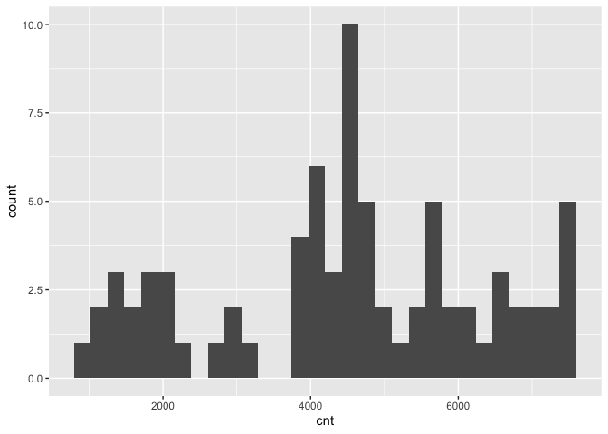
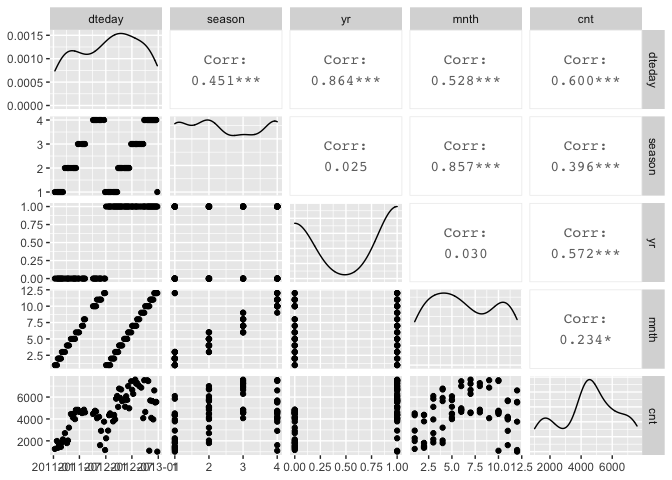
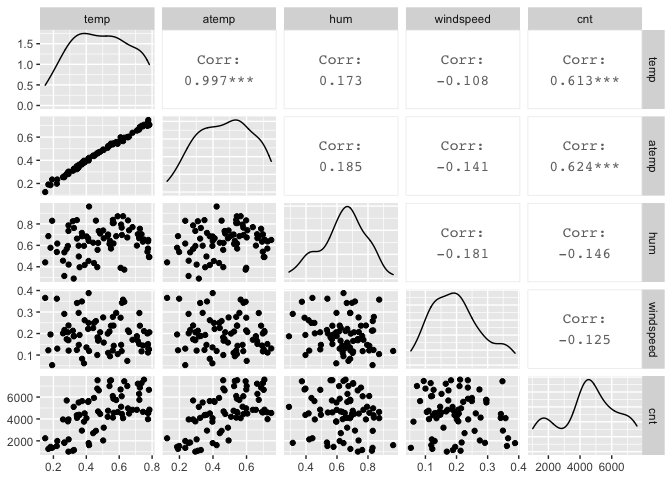
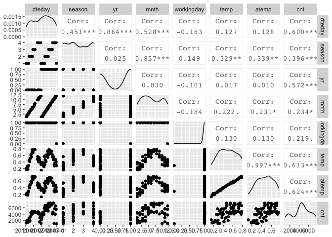

Project 2 - Karen Lopez
================
October 16, 2020

  - [Introduction](#introduction)
  - [Data](#data)
  - [Summarizations](#summarizations)
  - [Modeling](#modeling)
  - [Automation](#automation)

## Introduction

This project uses the bike sharing data set, day.csv, that’s located
*[here](https://archive.ics.uci.edu/ml/datasets/Bike+Sharing+Dataset)*
and contains 731 observations with 15 attributes. For modeling, the
response variable is the count of total rental bikes rented (*cnt*) and
11 of the 14 remaining variables will be considered for predictor
variables. Variables *casual* and *registered* are omitted and analysis
are performed on each *weekday* variable. The 11 remaining variables
include values for date, season, year, month, holiday, working day,
weather, temperature, feeling temperature, humidity, and wind speed.  
The purpose of this analysis is to fit two different tree models and
select the best one based on the appropriate criteria. This report will
be automated to run on the data set for each day of the week, starting
with Sunday at 0, Monday at 1, and so on.  
Many methods I’ll use come from a variety of packages installed in this
first code chunk. First I will read in the data and randomly separate it
into the training set and testing set, with 70% of the data going into
the traiing set. Then I will create some summary statistics and various
data plots to view variable relationships and narrow down the predictor
variables. Lastly, I will train and fit the models to compare them and
pick the final model.  
To begin, necessary libraries are loaded so their functions are
accessible and global variables are set.

``` r
library(readr)
library(caret)
library(knitr)
library(corrplot)
library(dplyr)
library(tidyverse)
library(rpart)
num <- 12
```

## Data

The dataset is read in using a relative path and saved as an object. The
weekday variable is converted to a factor with the day values replacing
their corresponding number, and then the weekday variable is used to
filter the data for each day of the week. The data is then randomly
split into a training and testing set, where 70% of the data goes into
the training set and the remaining 30% goes into the testing set.

``` r
#read in dataset with relative path & save to object
bikeData <- read_csv("Bike-Sharing-Dataset/day.csv") #read in data
#replace weekday numbers with day name
bikeData$weekday <- factor(bikeData$weekday, levels = c(0, 1, 2, 3, 4, 5, 6), labels = c("Sunday", "Monday", "Tuesday", "Wednesday", "Thursday", "Friday", "Saturday"))

bikeData <- bikeData %>% filter(weekday==params$weekday)

#create partitions in data indexes with 70% going in the training set
set.seed(num)
trainIndex <- createDataPartition(bikeData$cnt, p = 0.7, list = FALSE)

#create train and test data set using the trainIndex vector
bikeDataTrain <- bikeData[trainIndex, ]
bikeDataTest <- bikeData[-trainIndex, ]

bikeDataTrain #view train data
```

    ## # A tibble: 76 x 16
    ##    instant dteday     season    yr  mnth holiday weekday
    ##      <dbl> <date>      <dbl> <dbl> <dbl>   <dbl> <fct>  
    ##  1      11 2011-01-11      1     0     1       0 Tuesday
    ##  2      25 2011-01-25      1     0     1       0 Tuesday
    ##  3      32 2011-02-01      1     0     2       0 Tuesday
    ##  4      39 2011-02-08      1     0     2       0 Tuesday
    ##  5      46 2011-02-15      1     0     2       0 Tuesday
    ##  6      53 2011-02-22      1     0     2       0 Tuesday
    ##  7      60 2011-03-01      1     0     3       0 Tuesday
    ##  8      67 2011-03-08      1     0     3       0 Tuesday
    ##  9      81 2011-03-22      2     0     3       0 Tuesday
    ## 10      95 2011-04-05      2     0     4       0 Tuesday
    ## # … with 66 more rows, and 9 more variables: workingday <dbl>,
    ## #   weathersit <dbl>, temp <dbl>, atemp <dbl>, hum <dbl>,
    ## #   windspeed <dbl>, casual <dbl>, registered <dbl>, cnt <dbl>

``` r
bikeDataTest #view train data
```

    ## # A tibble: 28 x 16
    ##    instant dteday     season    yr  mnth holiday weekday
    ##      <dbl> <date>      <dbl> <dbl> <dbl>   <dbl> <fct>  
    ##  1       4 2011-01-04      1     0     1       0 Tuesday
    ##  2      18 2011-01-18      1     0     1       0 Tuesday
    ##  3      74 2011-03-15      1     0     3       0 Tuesday
    ##  4      88 2011-03-29      2     0     3       0 Tuesday
    ##  5     116 2011-04-26      2     0     4       0 Tuesday
    ##  6     130 2011-05-10      2     0     5       0 Tuesday
    ##  7     165 2011-06-14      2     0     6       0 Tuesday
    ##  8     186 2011-07-05      3     0     7       0 Tuesday
    ##  9     193 2011-07-12      3     0     7       0 Tuesday
    ## 10     228 2011-08-16      3     0     8       0 Tuesday
    ## # … with 18 more rows, and 9 more variables: workingday <dbl>,
    ## #   weathersit <dbl>, temp <dbl>, atemp <dbl>, hum <dbl>,
    ## #   windspeed <dbl>, casual <dbl>, registered <dbl>, cnt <dbl>

## Summarizations

Just to get an overview of the data, I first look at the summary of all
variables, and the distribution of the rental bike counts. Then I delve
deeper into the variable relationships with the response variable,
count, and with each other using ggpairs. These correlations will help
me narrow down which variables to include in the tree models, but I can
also view their corresponding scatterplots and density curves.

``` r
#summary of training data set
summary(bikeDataTrain)
```

    ##     instant          dteday               season     
    ##  Min.   : 11.0   Min.   :2011-01-11   Min.   :1.000  
    ##  1st Qu.:194.8   1st Qu.:2011-07-13   1st Qu.:1.000  
    ##  Median :410.0   Median :2012-02-14   Median :2.000  
    ##  Mean   :386.2   Mean   :2012-01-21   Mean   :2.487  
    ##  3rd Qu.:560.5   3rd Qu.:2012-07-13   3rd Qu.:4.000  
    ##  Max.   :725.0   Max.   :2012-12-25   Max.   :4.000  
    ##                                                      
    ##        yr              mnth           holiday       
    ##  Min.   :0.0000   Min.   : 1.000   Min.   :0.00000  
    ##  1st Qu.:0.0000   1st Qu.: 3.000   1st Qu.:0.00000  
    ##  Median :1.0000   Median : 6.000   Median :0.00000  
    ##  Mean   :0.5658   Mean   : 6.395   Mean   :0.01316  
    ##  3rd Qu.:1.0000   3rd Qu.:10.000   3rd Qu.:0.00000  
    ##  Max.   :1.0000   Max.   :12.000   Max.   :1.00000  
    ##                                                     
    ##       weekday     workingday       weathersit   
    ##  Sunday   : 0   Min.   :0.0000   Min.   :1.000  
    ##  Monday   : 0   1st Qu.:1.0000   1st Qu.:1.000  
    ##  Tuesday  :76   Median :1.0000   Median :1.000  
    ##  Wednesday: 0   Mean   :0.9868   Mean   :1.461  
    ##  Thursday : 0   3rd Qu.:1.0000   3rd Qu.:2.000  
    ##  Friday   : 0   Max.   :1.0000   Max.   :3.000  
    ##  Saturday : 0                                   
    ##       temp            atemp             hum        
    ##  Min.   :0.1500   Min.   :0.1263   Min.   :0.2900  
    ##  1st Qu.:0.3508   1st Qu.:0.3464   1st Qu.:0.5649  
    ##  Median :0.4800   Median :0.4710   Median :0.6590  
    ##  Mean   :0.4914   Mean   :0.4717   Mean   :0.6401  
    ##  3rd Qu.:0.6252   3rd Qu.:0.5955   3rd Qu.:0.7359  
    ##  Max.   :0.7833   Max.   :0.7475   Max.   :0.9625  
    ##                                                    
    ##    windspeed           casual         registered  
    ##  Min.   :0.05321   Min.   :  43.0   Min.   : 573  
    ##  1st Qu.:0.13433   1st Qu.: 227.0   1st Qu.:3186  
    ##  Median :0.19455   Median : 524.5   Median :3981  
    ##  Mean   :0.19888   Mean   : 545.9   Mean   :3969  
    ##  3rd Qu.:0.24052   3rd Qu.: 805.5   3rd Qu.:5117  
    ##  Max.   :0.38807   Max.   :1348.0   Max.   :6693  
    ##                                                   
    ##       cnt      
    ##  Min.   :1013  
    ##  1st Qu.:3614  
    ##  Median :4576  
    ##  Mean   :4515  
    ##  3rd Qu.:5769  
    ##  Max.   :7592  
    ## 

``` r
#quantitative histogram for cnt to view distribution
g <- ggplot(bikeDataTrain, aes(x=cnt))
g + geom_histogram()
```

<!-- -->

``` r
#create 3 plots of variables against each other and the response variable
bikeDataTrain1 <- bikeDataTrain %>% select(dteday, season, yr, mnth, cnt)
GGally::ggpairs(bikeDataTrain1)
```

<!-- -->

``` r
#all 3 might be of interest

bikeDataTrain2 <- bikeDataTrain %>% select(holiday, workingday, weathersit, cnt)
GGally::ggpairs(bikeDataTrain2)
```

<!-- -->

``` r
#workingday might be of interest

bikeDataTrain3 <- bikeDataTrain %>% select(temp, atemp, hum, windspeed, cnt)
GGally::ggpairs(bikeDataTrain3)
```

<!-- -->

``` r
#temp & atemp might be of interest

bikeDataTrain4 <- bikeDataTrain %>% select(dteday, season, yr, mnth, workingday, temp, atemp, cnt)
GGally::ggpairs(bikeDataTrain4)
```

<!-- -->

``` r
# yr & atemp might be of more interest than the others 
```

Various predictor variables have interactions with each other, and I
want to focus on those with the lower correlation values with each other
but higher correlations with the response. These variables include such
as year, temperature, and feeling temperature. The date, season, and
month variables will be omitted from further analysis because of their
stronger correlations with other variables, and working day will be
omitted for its weak correlation with count. The temperature and feeling
temperature have a very strong correlation so I’ll only keep feeling
temperature for it’s slightly stronger correlation with the response
variable, and analyze it alongside the year variable. These variables
were chosen using the `weekday = Monday` data, and will be used for all
other days to keep analyses consistent.

## Modeling

Next I will utilize the `caret` package to create two tree models with
the training set and then predict each on the testing set, after
reducing both sets to include only the variables of interest. The models
are based on the response variable, *cnt*, being a continuous variable.
The predictors are *yr* and *atemp*, which are categorical (0: 2011, 1:
2012) and continuous variables, respectively.

The first model is a non-ensemble tree-based model chosen using
leave-one-out cross-validation, and the second model is a boosted tree
model chosen using 12-fold cross-validation. Just in case, and for good
practice, the predictor variables are standardize via centering and
scaling. Each model is then predicted on using the training set, and
their performances are compared via root mean square error (RMSE) and/or
mean absolute error (MAE) values.

``` r
#select only variables needed for modeling
bikeDataTrain <- bikeDataTrain %>% select(cnt, yr, atemp)
kable(head(bikeDataTrain)) #preview reduced train data
```

|  cnt | yr |    atemp |
| ---: | -: | -------: |
| 1263 |  0 | 0.191464 |
| 1985 |  0 | 0.234526 |
| 1360 |  0 | 0.234530 |
| 1530 |  0 | 0.198246 |
| 1815 |  0 | 0.254274 |
| 1450 |  0 | 0.186033 |

``` r
bikeDataTest <- bikeDataTest %>% select(cnt, yr, atemp)
kable(head(bikeDataTest)) #preview reduced test data
```

|  cnt | yr |    atemp |
| ---: | -: | -------: |
| 1562 |  0 | 0.212122 |
|  683 |  0 | 0.232333 |
| 2056 |  0 | 0.318178 |
| 2425 |  0 | 0.292908 |
| 4400 |  0 | 0.594083 |
| 4803 |  0 | 0.522721 |

``` r
#(not ensemble) tree-based model chosen using leave one out cross validation
#using regression tree to model cnt (continuous variable)
treeFit1 <- train(cnt ~ ., data = bikeDataTrain, method = "rpart", preProcess = c("center", "scale"), trControl = trainControl(method = "LOOCV"))
treeFit1 #view resulting tree parameters
```

    ## CART 
    ## 
    ## 76 samples
    ##  2 predictor
    ## 
    ## Pre-processing: centered (2), scaled (2) 
    ## Resampling: Leave-One-Out Cross-Validation 
    ## Summary of sample sizes: 75, 75, 75, 75, 75, 75, ... 
    ## Resampling results across tuning parameters:
    ## 
    ##   cp         RMSE      Rsquared    MAE     
    ##   0.1427090  1513.672  0.35504844  1221.280
    ##   0.1753039  1707.108  0.20462674  1528.081
    ##   0.3695166  2232.416  0.06173412  1990.934
    ## 
    ## RMSE was used to select the optimal model using the
    ##  smallest value.
    ## The final value used for the model was cp = 0.142709.

``` r
#plot(treeFit1) #plot result

#boosted tree model chosen using cross-validation
treeFit2 <- train(cnt ~ ., data = bikeDataTrain, method = "gbm", preProcess = c("center", "scale"), trControl = trainControl(method = "cv", number = num))
```

    ## Iter   TrainDeviance   ValidDeviance   StepSize   Improve
    ##      1  3244701.7592             nan     0.1000 235088.3332
    ##      2  3102839.1367             nan     0.1000 156741.6596
    ##      3  2869380.2491             nan     0.1000 192588.7917
    ##      4  2699900.4958             nan     0.1000 151889.1003
    ##      5  2573052.0401             nan     0.1000 109008.8297
    ##      6  2357364.9913             nan     0.1000 90014.6602
    ##      7  2199941.4059             nan     0.1000 158150.0517
    ##      8  2025334.5059             nan     0.1000 121734.5495
    ##      9  1944539.8591             nan     0.1000 71951.8580
    ##     10  1846452.4366             nan     0.1000 91081.7101
    ##     20  1208003.4803             nan     0.1000 25354.8100
    ##     40   886446.3692             nan     0.1000 -5366.6001
    ##     60   845341.8135             nan     0.1000 -4198.5100
    ##     80   814351.6990             nan     0.1000 -6954.1649
    ##    100   795113.8314             nan     0.1000 -8824.8597
    ##    120   772245.5692             nan     0.1000 -4611.6931
    ##    140   753555.9893             nan     0.1000  391.9129
    ##    150   746946.8802             nan     0.1000 -15393.8758
    ## 
    ## Iter   TrainDeviance   ValidDeviance   StepSize   Improve
    ##      1  3203856.6962             nan     0.1000 243119.7947
    ##      2  2848648.9339             nan     0.1000 328604.8172
    ##      3  2639047.3189             nan     0.1000 147231.5258
    ##      4  2402366.0006             nan     0.1000 287238.3027
    ##      5  2166879.7778             nan     0.1000 234556.7169
    ##      6  2029833.9162             nan     0.1000 71292.0045
    ##      7  1870408.6128             nan     0.1000 140026.9223
    ##      8  1781687.9320             nan     0.1000 113428.6162
    ##      9  1635258.6516             nan     0.1000 107176.1474
    ##     10  1533422.9106             nan     0.1000 66960.4553
    ##     20  1074260.3632             nan     0.1000 -5505.4677
    ##     40   867065.0357             nan     0.1000 -14922.8367
    ##     60   794688.4945             nan     0.1000 -9020.7018
    ##     80   762011.3817             nan     0.1000 -21077.1999
    ##    100   734076.3416             nan     0.1000 -9842.6367
    ##    120   707583.0811             nan     0.1000 -9542.5806
    ##    140   678421.6308             nan     0.1000 -1965.0925
    ##    150   670255.5239             nan     0.1000 -23050.0309
    ## 
    ## Iter   TrainDeviance   ValidDeviance   StepSize   Improve
    ##      1  3243560.6109             nan     0.1000 212834.8872
    ##      2  2988431.9897             nan     0.1000 255393.0216
    ##      3  2726822.6399             nan     0.1000 166628.0593
    ##      4  2582411.8054             nan     0.1000 141854.4173
    ##      5  2337808.9443             nan     0.1000 239450.4293
    ##      6  2141269.3651             nan     0.1000 176288.2789
    ##      7  2036315.2375             nan     0.1000 65318.1821
    ##      8  1904851.1439             nan     0.1000 84599.7779
    ##      9  1827644.4369             nan     0.1000 69981.0227
    ##     10  1723956.8993             nan     0.1000 73095.2773
    ##     20  1156017.4450             nan     0.1000 21397.1375
    ##     40   868898.0109             nan     0.1000 2637.3126
    ##     60   789737.5372             nan     0.1000 -11758.0646
    ##     80   741451.9021             nan     0.1000 -1990.4150
    ##    100   723805.9923             nan     0.1000 -13829.2986
    ##    120   678317.4307             nan     0.1000 -5784.0242
    ##    140   644372.1818             nan     0.1000 -7406.4519
    ##    150   637261.9360             nan     0.1000 -8104.1867
    ## 
    ## Iter   TrainDeviance   ValidDeviance   StepSize   Improve
    ##      1  3131116.4727             nan     0.1000 167648.1521
    ##      2  2960720.8526             nan     0.1000 213505.9211
    ##      3  2806582.2275             nan     0.1000 159497.5396
    ##      4  2589564.8757             nan     0.1000 146826.5681
    ##      5  2413145.8154             nan     0.1000 99806.2373
    ##      6  2226971.1129             nan     0.1000 167843.3505
    ##      7  2067407.7901             nan     0.1000 25554.1941
    ##      8  1921845.8498             nan     0.1000 131349.5652
    ##      9  1806589.8540             nan     0.1000 41134.1689
    ##     10  1735731.7149             nan     0.1000 57046.2258
    ##     20  1139388.3034             nan     0.1000 18182.6796
    ##     40   792406.7151             nan     0.1000 -4136.3692
    ##     60   743664.5724             nan     0.1000 1723.7562
    ##     80   706623.4614             nan     0.1000 -1999.5431
    ##    100   688069.4183             nan     0.1000 -7076.3466
    ##    120   658605.8680             nan     0.1000 -15808.0788
    ##    140   641973.1108             nan     0.1000 -5901.0189
    ##    150   635603.1355             nan     0.1000 -2728.6688
    ## 
    ## Iter   TrainDeviance   ValidDeviance   StepSize   Improve
    ##      1  3148422.9631             nan     0.1000 225749.1675
    ##      2  2875220.1913             nan     0.1000 181766.1395
    ##      3  2688462.0807             nan     0.1000 202889.0220
    ##      4  2465915.9865             nan     0.1000 192350.0265
    ##      5  2319686.9842             nan     0.1000 143882.3519
    ##      6  2189504.3946             nan     0.1000 143816.9195
    ##      7  1969511.1905             nan     0.1000 201939.1720
    ##      8  1836318.8699             nan     0.1000 89993.2992
    ##      9  1731668.2140             nan     0.1000 -2886.3215
    ##     10  1642509.6790             nan     0.1000 97695.4279
    ##     20  1004827.9404             nan     0.1000 16981.7933
    ##     40   759942.4639             nan     0.1000 -8444.7387
    ##     60   697850.8047             nan     0.1000 -18527.6016
    ##     80   663497.9566             nan     0.1000 -5607.6241
    ##    100   636204.7587             nan     0.1000 -5409.8474
    ##    120   609485.9306             nan     0.1000 -15396.1406
    ##    140   577522.3510             nan     0.1000 -11152.0557
    ##    150   570049.3454             nan     0.1000 -16996.9636
    ## 
    ## Iter   TrainDeviance   ValidDeviance   StepSize   Improve
    ##      1  2962774.3666             nan     0.1000 335276.4383
    ##      2  2713388.1028             nan     0.1000 228528.6621
    ##      3  2509016.8611             nan     0.1000 201553.7213
    ##      4  2317489.3269             nan     0.1000 134483.8915
    ##      5  2148602.6687             nan     0.1000 133410.6758
    ##      6  1930729.1419             nan     0.1000 205938.6580
    ##      7  1835901.1669             nan     0.1000 90456.4193
    ##      8  1672625.1915             nan     0.1000 142989.3912
    ##      9  1584433.7266             nan     0.1000 69116.9630
    ##     10  1518222.3771             nan     0.1000 15239.8389
    ##     20   989413.3685             nan     0.1000 9029.0734
    ##     40   758016.7381             nan     0.1000 -26573.2713
    ##     60   681359.0949             nan     0.1000 -4021.3015
    ##     80   643237.6400             nan     0.1000 1352.5393
    ##    100   610701.2710             nan     0.1000 -601.7851
    ##    120   583841.5725             nan     0.1000 -1422.6032
    ##    140   565348.1289             nan     0.1000 -1542.6496
    ##    150   549838.8017             nan     0.1000 -1518.7124
    ## 
    ## Iter   TrainDeviance   ValidDeviance   StepSize   Improve
    ##      1  3178250.0346             nan     0.1000 170485.6811
    ##      2  2930647.1968             nan     0.1000 58851.7789
    ##      3  2730441.1270             nan     0.1000 203363.0249
    ##      4  2592114.7284             nan     0.1000 141132.7305
    ##      5  2449821.1453             nan     0.1000 99776.1885
    ##      6  2338647.1958             nan     0.1000 95737.0556
    ##      7  2214753.1949             nan     0.1000 88444.1416
    ##      8  2103790.1909             nan     0.1000 128978.3636
    ##      9  1946310.6568             nan     0.1000 83477.8591
    ##     10  1850103.6693             nan     0.1000 10315.7363
    ##     20  1273489.1658             nan     0.1000 34556.2612
    ##     40  1000963.1524             nan     0.1000 4765.7887
    ##     60   922235.1777             nan     0.1000 -11027.9819
    ##     80   885289.5685             nan     0.1000 -6088.8681
    ##    100   846594.6026             nan     0.1000 -10566.0802
    ##    120   815793.1002             nan     0.1000 -3618.2779
    ##    140   790679.3895             nan     0.1000 -4138.5678
    ##    150   788458.5950             nan     0.1000 -4925.1079
    ## 
    ## Iter   TrainDeviance   ValidDeviance   StepSize   Improve
    ##      1  3117941.4441             nan     0.1000 185274.4526
    ##      2  2923927.3215             nan     0.1000 193857.1023
    ##      3  2615067.8071             nan     0.1000 270155.3688
    ##      4  2441155.2636             nan     0.1000 84180.8723
    ##      5  2320909.2394             nan     0.1000 112458.2078
    ##      6  2189278.2778             nan     0.1000 128246.6617
    ##      7  2061254.0842             nan     0.1000 86317.0525
    ##      8  1935602.0700             nan     0.1000 96379.5858
    ##      9  1826422.0231             nan     0.1000 114093.0948
    ##     10  1713920.3647             nan     0.1000 79302.1152
    ##     20  1166951.5801             nan     0.1000  282.7723
    ##     40   906884.6783             nan     0.1000 -8332.5430
    ##     60   829626.7606             nan     0.1000 -9329.1236
    ##     80   792074.1784             nan     0.1000 -15908.4412
    ##    100   769580.8600             nan     0.1000 -9508.7417
    ##    120   727588.3326             nan     0.1000 -5667.1222
    ##    140   713124.4766             nan     0.1000 -3216.0373
    ##    150   701037.1653             nan     0.1000 -1427.2097
    ## 
    ## Iter   TrainDeviance   ValidDeviance   StepSize   Improve
    ##      1  3092008.7940             nan     0.1000 345719.7835
    ##      2  2889994.9510             nan     0.1000 201517.9748
    ##      3  2668005.9367             nan     0.1000 126120.7258
    ##      4  2524224.9570             nan     0.1000 67120.5067
    ##      5  2413732.0662             nan     0.1000 132929.2015
    ##      6  2186336.9758             nan     0.1000 206808.9365
    ##      7  2034252.4658             nan     0.1000 42241.8204
    ##      8  1902467.8524             nan     0.1000 132658.1219
    ##      9  1819116.0559             nan     0.1000 40424.5942
    ##     10  1698557.8980             nan     0.1000 85018.0817
    ##     20  1135198.7622             nan     0.1000 2308.4374
    ##     40   893655.9035             nan     0.1000 -1465.9764
    ##     60   839172.5208             nan     0.1000 -4748.1992
    ##     80   800066.7678             nan     0.1000 -2236.7727
    ##    100   778959.3052             nan     0.1000 -9149.5867
    ##    120   756125.8687             nan     0.1000 -15367.4141
    ##    140   725384.6352             nan     0.1000 -6010.2851
    ##    150   712296.5896             nan     0.1000 -9726.3916
    ## 
    ## Iter   TrainDeviance   ValidDeviance   StepSize   Improve
    ##      1  3220581.8122             nan     0.1000 198657.9815
    ##      2  2996960.3524             nan     0.1000 169934.3277
    ##      3  2825764.6804             nan     0.1000 95640.0226
    ##      4  2578498.8360             nan     0.1000 253399.5586
    ##      5  2397218.8349             nan     0.1000 181987.9397
    ##      6  2209973.5668             nan     0.1000 100890.1870
    ##      7  2069212.2947             nan     0.1000 139992.0038
    ##      8  1954572.3479             nan     0.1000 81338.2957
    ##      9  1872776.1839             nan     0.1000 95640.2291
    ##     10  1807371.4603             nan     0.1000 6976.5331
    ##     20  1188752.0431             nan     0.1000 45309.9228
    ##     40   892257.1531             nan     0.1000 -2170.6139
    ##     60   860197.2341             nan     0.1000 -17682.7605
    ##     80   819466.9128             nan     0.1000 -1203.0092
    ##    100   803902.8821             nan     0.1000 -12094.2763
    ##    120   784610.7859             nan     0.1000 -3192.8430
    ##    140   764586.1031             nan     0.1000 -30105.3707
    ##    150   755215.6260             nan     0.1000 -9077.5876
    ## 
    ## Iter   TrainDeviance   ValidDeviance   StepSize   Improve
    ##      1  3164003.1744             nan     0.1000 190667.8880
    ##      2  2932140.6142             nan     0.1000 233688.9986
    ##      3  2644123.3465             nan     0.1000 321947.4464
    ##      4  2433445.3295             nan     0.1000 167821.8224
    ##      5  2295680.3480             nan     0.1000 107916.4936
    ##      6  2124909.7445             nan     0.1000 130380.4357
    ##      7  1979289.7652             nan     0.1000 98942.3918
    ##      8  1844817.0764             nan     0.1000 109916.4077
    ##      9  1731002.0743             nan     0.1000 86131.4311
    ##     10  1652631.2218             nan     0.1000 80345.6390
    ##     20  1132658.6640             nan     0.1000 33596.1895
    ##     40   865599.5982             nan     0.1000 -10942.6778
    ##     60   799326.6531             nan     0.1000 -4993.8264
    ##     80   759024.4955             nan     0.1000 -4252.8421
    ##    100   741680.1255             nan     0.1000 -10299.6414
    ##    120   709174.2219             nan     0.1000 -11486.7173
    ##    140   680830.9793             nan     0.1000 -15624.2962
    ##    150   669996.7341             nan     0.1000 -8320.6760
    ## 
    ## Iter   TrainDeviance   ValidDeviance   StepSize   Improve
    ##      1  3220322.0590             nan     0.1000 221277.4992
    ##      2  3016120.8612             nan     0.1000 152461.3621
    ##      3  2777553.3399             nan     0.1000 225792.4501
    ##      4  2542498.1134             nan     0.1000 205819.9184
    ##      5  2389728.8201             nan     0.1000 168350.4449
    ##      6  2190274.4138             nan     0.1000 159166.3699
    ##      7  1995756.0420             nan     0.1000 182185.5359
    ##      8  1880048.8078             nan     0.1000 90664.2490
    ##      9  1794759.1538             nan     0.1000 57439.4242
    ##     10  1720822.4423             nan     0.1000 52831.0105
    ##     20  1118465.9578             nan     0.1000 12050.4025
    ##     40   896424.3035             nan     0.1000 3006.6841
    ##     60   835430.5628             nan     0.1000 -9455.8132
    ##     80   799330.3692             nan     0.1000  827.7483
    ##    100   766513.8830             nan     0.1000 -20441.1436
    ##    120   734727.4115             nan     0.1000 -11761.1579
    ##    140   718069.3314             nan     0.1000 -9708.4104
    ##    150   699159.0382             nan     0.1000 -21751.2976
    ## 
    ## Iter   TrainDeviance   ValidDeviance   StepSize   Improve
    ##      1  3170524.5386             nan     0.1000 182202.4048
    ##      2  2945287.9552             nan     0.1000 216865.6185
    ##      3  2769200.3130             nan     0.1000 156493.3949
    ##      4  2602219.0676             nan     0.1000 132048.4134
    ##      5  2409898.2419             nan     0.1000 172782.9291
    ##      6  2261348.9123             nan     0.1000 100952.4981
    ##      7  2121190.3329             nan     0.1000 108205.1284
    ##      8  1999340.5600             nan     0.1000 50365.6692
    ##      9  1902992.7819             nan     0.1000 85168.0626
    ##     10  1805553.0709             nan     0.1000 92351.0079
    ##     20  1256100.8885             nan     0.1000 44459.6616
    ##     40   917777.7956             nan     0.1000 -17317.1048
    ##     60   876028.5544             nan     0.1000 -22900.7127
    ##     80   854876.8413             nan     0.1000 -34644.2650
    ##    100   819398.1195             nan     0.1000 -3647.6795
    ##    120   803856.8917             nan     0.1000 -9796.0024
    ##    140   787751.9807             nan     0.1000 1718.0527
    ##    150   773508.4373             nan     0.1000 -17231.6924
    ## 
    ## Iter   TrainDeviance   ValidDeviance   StepSize   Improve
    ##      1  3158226.1185             nan     0.1000 196006.1031
    ##      2  2899119.1544             nan     0.1000 193435.9032
    ##      3  2633286.0294             nan     0.1000 236606.0290
    ##      4  2423245.2379             nan     0.1000 115669.5733
    ##      5  2248821.1987             nan     0.1000 150399.8271
    ##      6  2120788.0493             nan     0.1000 64532.2890
    ##      7  2010359.8244             nan     0.1000 124166.0948
    ##      8  1932561.6013             nan     0.1000 66534.9927
    ##      9  1809676.5663             nan     0.1000 95687.6145
    ##     10  1717337.8207             nan     0.1000 53196.7360
    ##     20  1176197.6112             nan     0.1000  630.8242
    ##     40   905145.3764             nan     0.1000  380.8880
    ##     60   837653.9987             nan     0.1000 -17381.7068
    ##     80   793536.5128             nan     0.1000 -25022.4572
    ##    100   746137.8451             nan     0.1000 -13484.6263
    ##    120   717838.4061             nan     0.1000 -3110.7123
    ##    140   701030.3724             nan     0.1000 -10574.0801
    ##    150   691891.5739             nan     0.1000 -8619.5138
    ## 
    ## Iter   TrainDeviance   ValidDeviance   StepSize   Improve
    ##      1  3090908.4377             nan     0.1000 269585.8400
    ##      2  2888136.9966             nan     0.1000 162950.9687
    ##      3  2686910.3220             nan     0.1000 213082.0701
    ##      4  2447356.1062             nan     0.1000 268833.0044
    ##      5  2312725.6065             nan     0.1000 122048.6885
    ##      6  2110287.2834             nan     0.1000 196306.2586
    ##      7  2023444.2550             nan     0.1000 42417.5194
    ##      8  1901889.5851             nan     0.1000 79782.7085
    ##      9  1741748.3766             nan     0.1000 127382.9585
    ##     10  1576104.9461             nan     0.1000 110463.4015
    ##     20  1063788.8033             nan     0.1000 7297.3582
    ##     40   839424.6981             nan     0.1000 -5949.8472
    ##     60   769193.0232             nan     0.1000 -12533.3445
    ##     80   726370.5512             nan     0.1000 -2720.3926
    ##    100   692474.3579             nan     0.1000 -14752.3309
    ##    120   668269.3305             nan     0.1000 -9682.3273
    ##    140   642797.8388             nan     0.1000 -5338.6543
    ##    150   634903.0537             nan     0.1000 -2539.3084
    ## 
    ## Iter   TrainDeviance   ValidDeviance   StepSize   Improve
    ##      1  3092964.8458             nan     0.1000 154334.0493
    ##      2  2917485.5597             nan     0.1000 138799.5239
    ##      3  2708932.7554             nan     0.1000 182083.3202
    ##      4  2547497.2196             nan     0.1000 96463.7706
    ##      5  2423055.8912             nan     0.1000 63059.4263
    ##      6  2306245.4447             nan     0.1000 -25562.0947
    ##      7  2141702.0797             nan     0.1000 153487.2887
    ##      8  2018086.6000             nan     0.1000 121506.6160
    ##      9  1911476.9693             nan     0.1000 51663.0712
    ##     10  1839011.9211             nan     0.1000 43945.6560
    ##     20  1195026.7819             nan     0.1000 -18930.5481
    ##     40   964639.0165             nan     0.1000 -13910.5985
    ##     60   893274.5484             nan     0.1000 -5624.8320
    ##     80   864513.1346             nan     0.1000 -19537.1465
    ##    100   831352.5517             nan     0.1000 -9145.8345
    ##    120   804356.0887             nan     0.1000 -12731.9188
    ##    140   783693.3571             nan     0.1000 -16664.4769
    ##    150   769969.1397             nan     0.1000 -11122.2626
    ## 
    ## Iter   TrainDeviance   ValidDeviance   StepSize   Improve
    ##      1  2976204.7664             nan     0.1000 375447.9671
    ##      2  2803979.2061             nan     0.1000 140501.7075
    ##      3  2578695.1688             nan     0.1000 116449.5542
    ##      4  2391010.4632             nan     0.1000 112183.2008
    ##      5  2247380.2684             nan     0.1000 126646.2271
    ##      6  2123548.8414             nan     0.1000 116173.9155
    ##      7  1960100.7655             nan     0.1000 160550.5079
    ##      8  1828231.7293             nan     0.1000 53653.8800
    ##      9  1715987.8777             nan     0.1000 72038.1366
    ##     10  1645588.4747             nan     0.1000 57995.6370
    ##     20  1172948.9453             nan     0.1000 43760.7605
    ##     40   874502.8186             nan     0.1000 -17397.7327
    ##     60   810469.3079             nan     0.1000 4638.0986
    ##     80   765976.5899             nan     0.1000 -12700.5157
    ##    100   738546.2938             nan     0.1000 -1196.4855
    ##    120   705550.7245             nan     0.1000 -4919.0355
    ##    140   686965.2019             nan     0.1000  312.0652
    ##    150   677956.3893             nan     0.1000 -17375.3206
    ## 
    ## Iter   TrainDeviance   ValidDeviance   StepSize   Improve
    ##      1  3014160.8221             nan     0.1000 362864.4978
    ##      2  2829974.3157             nan     0.1000 178270.4830
    ##      3  2661687.3398             nan     0.1000 134083.9732
    ##      4  2408464.6147             nan     0.1000 244292.4738
    ##      5  2198937.9624             nan     0.1000 205356.7290
    ##      6  1984734.8392             nan     0.1000 200677.1378
    ##      7  1808487.8779             nan     0.1000 135010.6806
    ##      8  1699518.0977             nan     0.1000 68938.9737
    ##      9  1622104.4484             nan     0.1000 43837.1765
    ##     10  1561756.2593             nan     0.1000 47638.3929
    ##     20  1088359.3893             nan     0.1000 23576.2284
    ##     40   914541.6751             nan     0.1000 -46132.1256
    ##     60   842554.8325             nan     0.1000 -10258.8700
    ##     80   797787.7046             nan     0.1000 2246.1807
    ##    100   761128.5562             nan     0.1000 -3872.1081
    ##    120   727795.9420             nan     0.1000 -40033.7946
    ##    140   709589.0196             nan     0.1000 -217.4217
    ##    150   692444.3976             nan     0.1000 -2884.2468
    ## 
    ## Iter   TrainDeviance   ValidDeviance   StepSize   Improve
    ##      1  3145832.4814             nan     0.1000 176234.5665
    ##      2  2959825.0040             nan     0.1000 199842.9644
    ##      3  2787148.6675             nan     0.1000 163379.4645
    ##      4  2587964.5025             nan     0.1000 122912.6684
    ##      5  2455865.3284             nan     0.1000 133079.5754
    ##      6  2304863.5976             nan     0.1000 118946.9004
    ##      7  2170095.7946             nan     0.1000 98894.6889
    ##      8  2035083.1756             nan     0.1000 81188.1158
    ##      9  1924534.1000             nan     0.1000 49720.3558
    ##     10  1812722.9099             nan     0.1000 82665.2778
    ##     20  1250841.8948             nan     0.1000 34919.4316
    ##     40   929473.7809             nan     0.1000 5014.4687
    ##     60   857755.8488             nan     0.1000 -17286.1063
    ##     80   833133.4877             nan     0.1000 -1915.2249
    ##    100   806748.1564             nan     0.1000 -1600.9673
    ##    120   793135.7756             nan     0.1000 -5516.9374
    ##    140   775848.8251             nan     0.1000 -11883.8915
    ##    150   765035.0333             nan     0.1000 -5795.1327
    ## 
    ## Iter   TrainDeviance   ValidDeviance   StepSize   Improve
    ##      1  3004271.2015             nan     0.1000 377335.6895
    ##      2  2735238.9086             nan     0.1000 293190.3563
    ##      3  2549325.1390             nan     0.1000 166814.1478
    ##      4  2370036.3514             nan     0.1000 163462.5651
    ##      5  2183096.1315             nan     0.1000 138969.3820
    ##      6  2067415.9026             nan     0.1000 119612.6357
    ##      7  1869534.0213             nan     0.1000 162962.9473
    ##      8  1746128.8294             nan     0.1000 42506.0967
    ##      9  1665150.1195             nan     0.1000 66871.0521
    ##     10  1565269.5080             nan     0.1000 57533.7059
    ##     20  1061266.9446             nan     0.1000 5358.4730
    ##     40   852314.6904             nan     0.1000 -4678.6597
    ##     60   776777.2340             nan     0.1000 -1491.2872
    ##     80   737594.4270             nan     0.1000 -11862.5475
    ##    100   715665.2672             nan     0.1000 -22922.6311
    ##    120   686515.5562             nan     0.1000  114.8979
    ##    140   665141.2242             nan     0.1000 -3738.7958
    ##    150   647170.3306             nan     0.1000 -9416.4062
    ## 
    ## Iter   TrainDeviance   ValidDeviance   StepSize   Improve
    ##      1  3063663.3387             nan     0.1000 205585.7169
    ##      2  2858380.0255             nan     0.1000 181083.0717
    ##      3  2637903.8586             nan     0.1000 179379.5842
    ##      4  2420320.2321             nan     0.1000 244274.3942
    ##      5  2244671.9585             nan     0.1000 123658.7811
    ##      6  2107609.8504             nan     0.1000 113738.4899
    ##      7  1962268.3686             nan     0.1000 113779.8730
    ##      8  1769316.4283             nan     0.1000 169120.6770
    ##      9  1619229.8543             nan     0.1000 143330.5621
    ##     10  1532083.4090             nan     0.1000 70100.0697
    ##     20  1065123.3135             nan     0.1000 11573.9620
    ##     40   825918.9021             nan     0.1000 -12788.6902
    ##     60   772913.0712             nan     0.1000 -9613.4030
    ##     80   736444.5854             nan     0.1000 -8133.1992
    ##    100   700391.5918             nan     0.1000 -14462.1746
    ##    120   678333.8558             nan     0.1000 -14430.5121
    ##    140   649630.7697             nan     0.1000 -8579.6505
    ##    150   634641.6892             nan     0.1000 -20944.0438
    ## 
    ## Iter   TrainDeviance   ValidDeviance   StepSize   Improve
    ##      1  3340923.3426             nan     0.1000 152751.1415
    ##      2  3116289.2940             nan     0.1000 185223.4772
    ##      3  2868418.6290             nan     0.1000 230187.8597
    ##      4  2667256.6869             nan     0.1000 172953.3099
    ##      5  2499720.8108             nan     0.1000 115300.3940
    ##      6  2342995.7726             nan     0.1000 75916.3502
    ##      7  2206889.8525             nan     0.1000 15323.8410
    ##      8  1991282.4452             nan     0.1000 190673.5069
    ##      9  1848798.0421             nan     0.1000 147684.5948
    ##     10  1718949.8071             nan     0.1000 97391.3536
    ##     20  1073948.7919             nan     0.1000 15858.5408
    ##     40   855595.2384             nan     0.1000 1503.9297
    ##     60   820079.5313             nan     0.1000 1983.0457
    ##     80   780181.9143             nan     0.1000 -1055.1429
    ##    100   759796.1284             nan     0.1000 -979.0611
    ##    120   742026.7486             nan     0.1000 -6128.2406
    ##    140   729533.6503             nan     0.1000 -2715.1943
    ##    150   716487.9089             nan     0.1000 -5858.3964
    ## 
    ## Iter   TrainDeviance   ValidDeviance   StepSize   Improve
    ##      1  3346771.4706             nan     0.1000 203094.7695
    ##      2  3090342.4024             nan     0.1000 237763.4651
    ##      3  2820467.2957             nan     0.1000 184763.9341
    ##      4  2636930.9678             nan     0.1000 171308.2477
    ##      5  2409227.9388             nan     0.1000 153208.3705
    ##      6  2143177.6011             nan     0.1000 194229.2150
    ##      7  1987392.6054             nan     0.1000 94758.0987
    ##      8  1851386.2679             nan     0.1000 104535.2688
    ##      9  1756529.6805             nan     0.1000 83896.9083
    ##     10  1666942.0636             nan     0.1000 84930.2754
    ##     20  1070088.0087             nan     0.1000 9676.7291
    ##     40   795541.0575             nan     0.1000 -18302.6169
    ##     60   730380.5998             nan     0.1000 -2616.9387
    ##     80   690648.3080             nan     0.1000 -2250.9541
    ##    100   664139.2737             nan     0.1000 -4556.4818
    ##    120   642041.7871             nan     0.1000 -15980.5295
    ##    140   622360.6194             nan     0.1000 -2032.4144
    ##    150   610083.1065             nan     0.1000 -856.0903
    ## 
    ## Iter   TrainDeviance   ValidDeviance   StepSize   Improve
    ##      1  3214951.2936             nan     0.1000 424596.0365
    ##      2  2996515.4638             nan     0.1000 183489.4164
    ##      3  2744479.3648             nan     0.1000 293632.4364
    ##      4  2479263.0054             nan     0.1000 168112.0434
    ##      5  2300284.6284             nan     0.1000 193650.5975
    ##      6  2115641.5443             nan     0.1000 116750.0900
    ##      7  1988366.2546             nan     0.1000 83709.5303
    ##      8  1801222.9444             nan     0.1000 139861.2591
    ##      9  1739023.6341             nan     0.1000 48114.8479
    ##     10  1624424.7803             nan     0.1000 119609.5006
    ##     20  1005553.1795             nan     0.1000 8689.8544
    ##     40   801182.0735             nan     0.1000 3722.9169
    ##     60   751688.2466             nan     0.1000 -6579.7782
    ##     80   708793.8973             nan     0.1000 -10329.4670
    ##    100   679080.6168             nan     0.1000 -3145.4980
    ##    120   661158.6867             nan     0.1000 -7208.3020
    ##    140   635396.0104             nan     0.1000 -3480.7545
    ##    150   628022.8219             nan     0.1000 -11522.8647
    ## 
    ## Iter   TrainDeviance   ValidDeviance   StepSize   Improve
    ##      1  3114319.3360             nan     0.1000 167857.7989
    ##      2  2894074.5773             nan     0.1000 181016.9787
    ##      3  2686264.8359             nan     0.1000 174080.8744
    ##      4  2583284.3921             nan     0.1000 67840.5986
    ##      5  2383577.3060             nan     0.1000 142791.3842
    ##      6  2239533.3676             nan     0.1000 78902.4556
    ##      7  2089681.9982             nan     0.1000 88657.4295
    ##      8  1932430.2470             nan     0.1000 152683.6419
    ##      9  1796359.0443             nan     0.1000 107178.1972
    ##     10  1677969.0336             nan     0.1000 84076.8756
    ##     20  1096119.6192             nan     0.1000 21381.8450
    ##     40   808659.5192             nan     0.1000 -13056.7587
    ##     60   764406.6225             nan     0.1000 -826.1549
    ##     80   744110.1075             nan     0.1000 -10039.3446
    ##    100   731149.0318             nan     0.1000 -14881.4309
    ##    120   715204.1214             nan     0.1000 -20834.5045
    ##    140   698399.5918             nan     0.1000 -10614.4464
    ##    150   691802.0773             nan     0.1000 -11934.3550
    ## 
    ## Iter   TrainDeviance   ValidDeviance   StepSize   Improve
    ##      1  3132823.4697             nan     0.1000 261431.8131
    ##      2  2860157.7130             nan     0.1000 252055.2105
    ##      3  2656779.0273             nan     0.1000 152871.6583
    ##      4  2411948.9154             nan     0.1000 240882.3723
    ##      5  2143678.9120             nan     0.1000 206237.7312
    ##      6  1947431.4937             nan     0.1000 192580.0249
    ##      7  1829401.7916             nan     0.1000 101749.8971
    ##      8  1726570.2633             nan     0.1000 30844.2964
    ##      9  1632276.2751             nan     0.1000 86725.7952
    ##     10  1552008.7396             nan     0.1000 76293.4932
    ##     20  1000725.7357             nan     0.1000 11512.8159
    ##     40   803705.6401             nan     0.1000 -6019.9045
    ##     60   740411.3824             nan     0.1000 -7836.0789
    ##     80   706043.3603             nan     0.1000 -10145.7512
    ##    100   684094.1960             nan     0.1000 -8326.1382
    ##    120   666627.4016             nan     0.1000 -2415.2350
    ##    140   647152.7036             nan     0.1000 -14254.5301
    ##    150   637280.6564             nan     0.1000 -17889.1444
    ## 
    ## Iter   TrainDeviance   ValidDeviance   StepSize   Improve
    ##      1  3081516.9980             nan     0.1000 240399.9523
    ##      2  2785617.4232             nan     0.1000 166490.7481
    ##      3  2556554.9036             nan     0.1000 174773.8064
    ##      4  2320502.5826             nan     0.1000 177169.9455
    ##      5  2221157.0033             nan     0.1000 56055.5759
    ##      6  1998596.4284             nan     0.1000 196126.0475
    ##      7  1854543.8332             nan     0.1000 176835.2288
    ##      8  1710492.4518             nan     0.1000 115190.8217
    ##      9  1609359.3606             nan     0.1000 57752.3080
    ##     10  1514771.7730             nan     0.1000 80126.4636
    ##     20  1001860.1644             nan     0.1000 -13213.8024
    ##     40   764838.2047             nan     0.1000 -6611.5821
    ##     60   700732.5132             nan     0.1000 -2369.9595
    ##     80   671222.7148             nan     0.1000 -17793.1875
    ##    100   645886.1097             nan     0.1000 -18606.5319
    ##    120   624599.5984             nan     0.1000 -5926.8404
    ##    140   607964.5979             nan     0.1000 -3992.2617
    ##    150   595018.4964             nan     0.1000 -9979.6982
    ## 
    ## Iter   TrainDeviance   ValidDeviance   StepSize   Improve
    ##      1  3141636.8174             nan     0.1000 239598.1930
    ##      2  2886117.1430             nan     0.1000 241117.1317
    ##      3  2696372.2601             nan     0.1000 156330.1977
    ##      4  2498853.7406             nan     0.1000 166261.2529
    ##      5  2326483.8700             nan     0.1000 126238.1927
    ##      6  2153728.6783             nan     0.1000 105255.2110
    ##      7  1988308.7238             nan     0.1000 127112.9526
    ##      8  1854094.5272             nan     0.1000 99892.7521
    ##      9  1756235.2307             nan     0.1000 73000.5891
    ##     10  1653599.1533             nan     0.1000 82523.5080
    ##     20  1049660.4895             nan     0.1000 23146.9097
    ##     40   790046.3062             nan     0.1000 -3865.9240
    ##     60   759476.9980             nan     0.1000 -8390.2526
    ##     80   720194.6600             nan     0.1000 -3682.0903
    ##    100   696896.6547             nan     0.1000 -3350.0641
    ##    120   675750.3992             nan     0.1000 -9570.1935
    ##    140   656949.9920             nan     0.1000 -6479.2129
    ##    150   644431.1225             nan     0.1000 -383.7481
    ## 
    ## Iter   TrainDeviance   ValidDeviance   StepSize   Improve
    ##      1  3124120.9415             nan     0.1000 214215.2206
    ##      2  2665872.4945             nan     0.1000 352871.6032
    ##      3  2426164.3792             nan     0.1000 177640.1706
    ##      4  2312510.5976             nan     0.1000 108517.9668
    ##      5  2096163.0891             nan     0.1000 111049.4675
    ##      6  1924015.6172             nan     0.1000 203881.9303
    ##      7  1789603.3033             nan     0.1000 147227.4969
    ##      8  1681721.7815             nan     0.1000 74764.2065
    ##      9  1612113.5893             nan     0.1000 76857.2404
    ##     10  1516933.1175             nan     0.1000 91680.6386
    ##     20  1020103.1647             nan     0.1000 8063.5346
    ##     40   783839.1560             nan     0.1000 -19181.5064
    ##     60   692080.7993             nan     0.1000 -5967.2086
    ##     80   650916.6681             nan     0.1000 -1861.2157
    ##    100   625888.6728             nan     0.1000 -5235.8713
    ##    120   598373.7397             nan     0.1000 -6655.3907
    ##    140   576759.1846             nan     0.1000 -17162.0238
    ##    150   572360.6109             nan     0.1000 -13405.3741
    ## 
    ## Iter   TrainDeviance   ValidDeviance   StepSize   Improve
    ##      1  3126772.0560             nan     0.1000 252760.8896
    ##      2  2891283.6526             nan     0.1000 173107.8673
    ##      3  2591007.7942             nan     0.1000 282773.8636
    ##      4  2373295.7400             nan     0.1000 222131.9712
    ##      5  2163558.4273             nan     0.1000 235741.8934
    ##      6  1945301.2407             nan     0.1000 175656.6361
    ##      7  1805371.4685             nan     0.1000 129709.5359
    ##      8  1710815.6099             nan     0.1000 76634.0331
    ##      9  1615688.8702             nan     0.1000 78766.2833
    ##     10  1525096.1701             nan     0.1000 96071.3763
    ##     20   996471.3527             nan     0.1000 21759.3188
    ##     40   763990.3884             nan     0.1000 -15617.9645
    ##     60   697285.8049             nan     0.1000 -13480.8598
    ##     80   664938.4265             nan     0.1000 -8428.4815
    ##    100   627963.0697             nan     0.1000 -17679.7171
    ##    120   607866.9974             nan     0.1000 -10582.6641
    ##    140   580782.3903             nan     0.1000 -9519.2331
    ##    150   567081.6791             nan     0.1000 -1140.2322
    ## 
    ## Iter   TrainDeviance   ValidDeviance   StepSize   Improve
    ##      1  3011765.6781             nan     0.1000 168046.1892
    ##      2  2805386.2753             nan     0.1000 114236.8029
    ##      3  2590975.5884             nan     0.1000 165808.4235
    ##      4  2384402.8805             nan     0.1000 175319.8896
    ##      5  2219640.4480             nan     0.1000 122762.4575
    ##      6  2085575.4862             nan     0.1000 90964.3208
    ##      7  1894470.0640             nan     0.1000 114088.7271
    ##      8  1807372.1235             nan     0.1000 77837.0209
    ##      9  1722974.3832             nan     0.1000 66479.5518
    ##     10  1616759.6193             nan     0.1000 84947.6249
    ##     20  1035882.4424             nan     0.1000 18781.2956
    ##     40   788240.7658             nan     0.1000 5357.9477
    ##     60   731518.4787             nan     0.1000 -8344.3326
    ##     80   706723.1467             nan     0.1000 -3953.1816
    ##    100   684023.3775             nan     0.1000 -2389.4833
    ##    120   672143.5894             nan     0.1000 -4013.9650
    ##    140   658876.2645             nan     0.1000 -16410.5218
    ##    150   651259.7952             nan     0.1000 -5989.9169
    ## 
    ## Iter   TrainDeviance   ValidDeviance   StepSize   Improve
    ##      1  2982921.5105             nan     0.1000 247051.4558
    ##      2  2750121.5385             nan     0.1000 165884.6611
    ##      3  2558336.1604             nan     0.1000 86790.5420
    ##      4  2319024.7351             nan     0.1000 257073.1968
    ##      5  2193349.8627             nan     0.1000 144880.7290
    ##      6  2009480.5220             nan     0.1000 203396.0547
    ##      7  1882166.8463             nan     0.1000 104373.8272
    ##      8  1710048.5226             nan     0.1000 142406.9883
    ##      9  1580207.3726             nan     0.1000 117976.5028
    ##     10  1465571.7298             nan     0.1000 74544.4093
    ##     20   992616.4965             nan     0.1000 17254.1948
    ##     40   745680.5081             nan     0.1000 -17843.7532
    ##     60   686794.7644             nan     0.1000 -16375.5033
    ##     80   663186.8935             nan     0.1000 -13940.8211
    ##    100   624773.4963             nan     0.1000 -19096.0267
    ##    120   599478.8409             nan     0.1000 -9541.3206
    ##    140   581006.7661             nan     0.1000 -1839.8795
    ##    150   578871.1590             nan     0.1000 -2278.7277
    ## 
    ## Iter   TrainDeviance   ValidDeviance   StepSize   Improve
    ##      1  2934964.3966             nan     0.1000 251722.8699
    ##      2  2661590.9704             nan     0.1000 205287.9993
    ##      3  2472931.7059             nan     0.1000 174878.1301
    ##      4  2276653.3261             nan     0.1000 132351.8383
    ##      5  2115933.9253             nan     0.1000 128856.6526
    ##      6  1988654.2737             nan     0.1000 101255.1757
    ##      7  1819624.6579             nan     0.1000 178388.4393
    ##      8  1678478.4559             nan     0.1000 78307.4013
    ##      9  1521837.0110             nan     0.1000 104338.3811
    ##     10  1447338.0537             nan     0.1000 44325.0980
    ##     20   971555.9061             nan     0.1000 9475.8310
    ##     40   770370.1857             nan     0.1000 -6715.5074
    ##     60   697635.1319             nan     0.1000 -4075.6993
    ##     80   672039.7625             nan     0.1000 -6324.2647
    ##    100   651426.2823             nan     0.1000 -12806.2622
    ##    120   618316.5681             nan     0.1000 -3659.4753
    ##    140   600085.5645             nan     0.1000 -18702.6676
    ##    150   592602.3783             nan     0.1000 -1429.9110
    ## 
    ## Iter   TrainDeviance   ValidDeviance   StepSize   Improve
    ##      1  3302388.9223             nan     0.1000 226159.2226
    ##      2  3099075.5163             nan     0.1000 221547.5320
    ##      3  2901391.7104             nan     0.1000 200252.8831
    ##      4  2674476.8687             nan     0.1000 144218.3772
    ##      5  2488177.1226             nan     0.1000 161808.8411
    ##      6  2307364.3522             nan     0.1000 131089.3142
    ##      7  2179759.7165             nan     0.1000 111304.6005
    ##      8  2047753.1309             nan     0.1000 56640.3488
    ##      9  1924090.2884             nan     0.1000 51123.4030
    ##     10  1840239.2064             nan     0.1000 29506.7086
    ##     20  1139475.3451             nan     0.1000 28594.1940
    ##     40   902169.5314             nan     0.1000 -13722.7522
    ##     60   852922.8124             nan     0.1000 -1113.6308
    ##     80   824514.7547             nan     0.1000 -14913.7556
    ##    100   804131.5541             nan     0.1000 -5681.0830
    ##    120   783607.5308             nan     0.1000 -2696.6435
    ##    140   764961.2095             nan     0.1000  390.7373
    ##    150   756158.6299             nan     0.1000 -7074.3497
    ## 
    ## Iter   TrainDeviance   ValidDeviance   StepSize   Improve
    ##      1  3274801.8068             nan     0.1000 242940.6069
    ##      2  3003010.4508             nan     0.1000 175879.5092
    ##      3  2713707.1469             nan     0.1000 275692.6111
    ##      4  2541386.9841             nan     0.1000 188140.3271
    ##      5  2385410.4342             nan     0.1000 169734.9034
    ##      6  2178888.4663             nan     0.1000 177240.6532
    ##      7  2027709.6616             nan     0.1000 83389.4206
    ##      8  1924589.0109             nan     0.1000 114818.9171
    ##      9  1808968.7365             nan     0.1000 77581.3289
    ##     10  1696637.2094             nan     0.1000 71359.7631
    ##     20  1106891.7473             nan     0.1000 1484.4749
    ##     40   873013.4809             nan     0.1000 -7999.3770
    ##     60   802986.7676             nan     0.1000 -4980.8697
    ##     80   763617.4275             nan     0.1000 -4890.6664
    ##    100   719688.6291             nan     0.1000 -6406.0858
    ##    120   682496.6189             nan     0.1000 -20160.4706
    ##    140   656295.4165             nan     0.1000 -7221.1348
    ##    150   645576.9447             nan     0.1000 -12623.5506
    ## 
    ## Iter   TrainDeviance   ValidDeviance   StepSize   Improve
    ##      1  3120027.8508             nan     0.1000 392601.1026
    ##      2  2913130.1792             nan     0.1000 157352.1263
    ##      3  2658713.1534             nan     0.1000 177400.7684
    ##      4  2401988.7491             nan     0.1000 235436.9049
    ##      5  2165638.1580             nan     0.1000 222565.0191
    ##      6  2002593.6556             nan     0.1000 133801.5448
    ##      7  1868258.3019             nan     0.1000 64979.8999
    ##      8  1755147.9051             nan     0.1000 78334.2572
    ##      9  1632560.4740             nan     0.1000 109589.2058
    ##     10  1561772.8837             nan     0.1000 65945.0547
    ##     20  1085622.1745             nan     0.1000 -858.2689
    ##     40   859487.1089             nan     0.1000 -13443.7112
    ##     60   798584.0361             nan     0.1000 -14569.6860
    ##     80   746549.2246             nan     0.1000 -6782.7320
    ##    100   708940.3642             nan     0.1000 -10195.6315
    ##    120   683966.9963             nan     0.1000 -15840.2915
    ##    140   660343.2266             nan     0.1000 -3334.8564
    ##    150   654826.6334             nan     0.1000 -18795.8162
    ## 
    ## Iter   TrainDeviance   ValidDeviance   StepSize   Improve
    ##      1  3136218.8941             nan     0.1000 152789.2889
    ##      2  2776462.6443             nan     0.1000 334002.8945
    ##      3  2522091.7767             nan     0.1000 305427.5446
    ##      4  2324727.4049             nan     0.1000 249409.0759
    ##      5  2102140.1540             nan     0.1000 179135.2652
    ##      6  1958903.8224             nan     0.1000 157654.3980
    ##      7  1812278.7950             nan     0.1000 133597.5893
    ##      8  1710836.6115             nan     0.1000 76174.6063
    ##      9  1614627.9736             nan     0.1000 99003.6411
    ##     10  1529016.2239             nan     0.1000 69364.3384
    ##     20  1013652.3802             nan     0.1000 12675.2815
    ##     40   800292.2971             nan     0.1000 3201.9881
    ##     60   733752.0421             nan     0.1000 -5846.0388
    ##     80   702997.9009             nan     0.1000 -8456.4605
    ##    100   669491.8785             nan     0.1000 -258.0787
    ##    120   642570.5724             nan     0.1000 -4190.8336
    ##    140   624027.7574             nan     0.1000 -22360.1260
    ##    150   607802.2297             nan     0.1000 -6674.7388

``` r
treeFit2 #view resulting tree parameters
```

    ## Stochastic Gradient Boosting 
    ## 
    ## 76 samples
    ##  2 predictor
    ## 
    ## Pre-processing: centered (2), scaled (2) 
    ## Resampling: Cross-Validated (12 fold) 
    ## Summary of sample sizes: 70, 69, 69, 68, 71, 69, ... 
    ## Resampling results across tuning parameters:
    ## 
    ##   interaction.depth  n.trees  RMSE      Rsquared   MAE     
    ##   1                   50      962.6820  0.7322438  770.9997
    ##   1                  100      937.7915  0.7301749  742.4747
    ##   1                  150      940.6836  0.7337072  736.6839
    ##   2                   50      945.0696  0.7259466  768.7204
    ##   2                  100      930.3622  0.7270992  753.1728
    ##   2                  150      919.3336  0.7404289  737.1187
    ##   3                   50      971.4418  0.7223613  799.0588
    ##   3                  100      936.8898  0.7381883  742.7175
    ##   3                  150      925.5139  0.7474917  732.4106
    ## 
    ## Tuning parameter 'shrinkage' was held constant at a value
    ##  of 0.1
    ## Tuning parameter 'n.minobsinnode' was held constant
    ##  at a value of 10
    ## RMSE was used to select the optimal model using the
    ##  smallest value.
    ## The final values used for the model were n.trees =
    ##  150, interaction.depth = 2, shrinkage = 0.1 and
    ##  n.minobsinnode = 10.

``` r
#compare models on test set, using predict
treePred1 <- predict(treeFit1, newdata = data.frame(bikeDataTest))
#treePred1 #view prediction results
postResample(treePred1, bikeDataTest$cnt) # view root mean square error
```

    ##         RMSE     Rsquared          MAE 
    ## 1140.9413255    0.5808283  873.3963585

``` r
treePred2 <- predict(treeFit2, newdata = data.frame(bikeDataTest))
#treePred2 #view prediction results
postResample(treePred2, bikeDataTest$cnt) # view root mean square error
```

    ##        RMSE    Rsquared         MAE 
    ## 815.9426582   0.8015096 616.0044002

The model with the lowest RMSE and/or lowest MAE value should be used as
the final model. The instructor later asked us to focus on MAE, so for
the Monday data, the better model is the boosted tree model.

## Automation

``` r
#save unique days
weekdays <- unique(bikeData$weekday)
#set filenames
outFile <- paste0(weekdays, ".md")
#get list for each day with the day parameter
params = lapply(weekdays, FUN = function(x){list(weekday = x)})
#create data frame
reports <- tibble(outFile, params)
reports
apply(reports, MARGIN = 1,
  FUN = function(x){
    render(input = "Bike-Sharing-Dataset/day.csv",
    output_file = x[[1]],
    params = x[[2]])
  })
```
