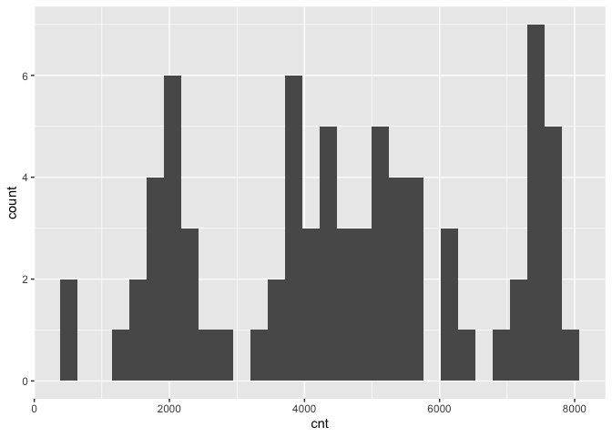
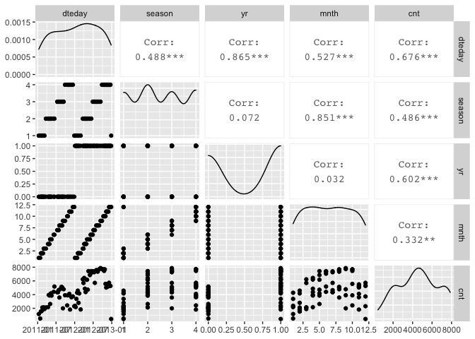
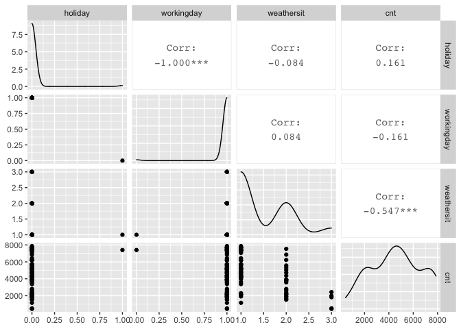
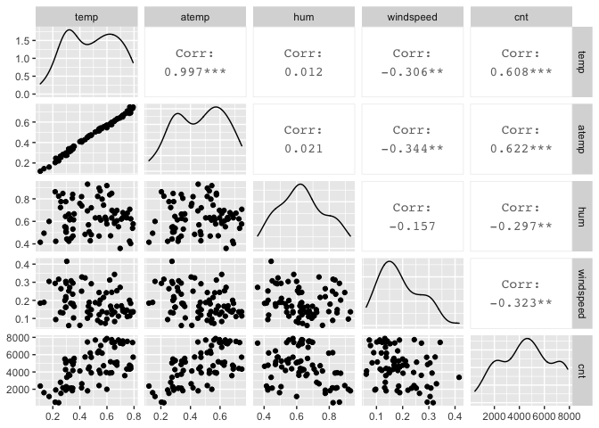
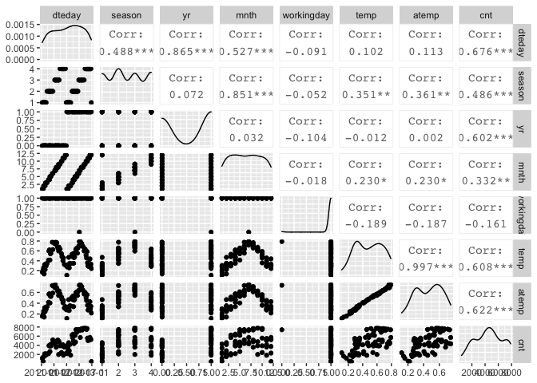

Project 2 - Karen Lopez
================
October 16, 2020

  - [Introduction](#introduction)
  - [Data](#data)
  - [Summarizations](#summarizations)
  - [Modeling](#modeling)
  - [Automation](#automation)

## Introduction

This project uses the bike sharing data set, day.csv, that’s located
*[here](https://archive.ics.uci.edu/ml/datasets/Bike+Sharing+Dataset)*
and contains 731 observations with 15 attributes. For modeling, the
response variable is the count of total rental bikes rented (*cnt*) and
11 of the 14 remaining variables will be considered for predictor
variables. Variables *casual* and *registered* are omitted and analysis
are performed on each *weekday* variable. The 11 remaining variables
include values for date, season, year, month, holiday, working day,
weather, temperature, feeling temperature, humidity, and wind speed.  
The purpose of this analysis is to fit two different tree models and
select the best one based on the appropriate criteria. This report will
be automated to run on the data set for each day of the week, starting
with Sunday at 0, Monday at 1, and so on.  
Many methods I’ll use come from a variety of packages installed in this
first code chunk. First I will read in the data and randomly separate it
into the training set and testing set, with 70% of the data going into
the traiing set. Then I will create some summary statistics and various
data plots to view variable relationships and narrow down the predictor
variables. Lastly, I will train and fit the models to compare them and
pick the final model.  
To begin, necessary libraries are loaded so their functions are
accessible and global variables are set.

``` r
library(readr)
library(caret)
library(knitr)
library(corrplot)
library(dplyr)
library(tidyverse)
library(rpart)
num <- 12
```

## Data

The dataset is read in using a relative path and saved as an object. The
weekday variable is converted to a factor with the day values replacing
their corresponding number, and then the weekday variable is used to
filter the data for each day of the week. The data is then randomly
split into a training and testing set, where 70% of the data goes into
the training set and the remaining 30% goes into the testing set.

``` r
#read in dataset with relative path & save to object
bikeData <- read_csv("Bike-Sharing-Dataset/day.csv") #read in data
#replace weekday numbers with day name
bikeData$weekday <- factor(bikeData$weekday, levels = c(0, 1, 2, 3, 4, 5, 6), labels = c("Sunday", "Monday", "Tuesday", "Wednesday", "Thursday", "Friday", "Saturday"))

bikeData <- bikeData %>% filter(weekday==params$weekday)

#create partitions in data indexes with 70% going in the training set
set.seed(num)
trainIndex <- createDataPartition(bikeData$cnt, p = 0.7, list = FALSE)

#create train and test data set using the trainIndex vector
bikeDataTrain <- bikeData[trainIndex, ]
bikeDataTest <- bikeData[-trainIndex, ]

bikeDataTrain #view train data
```

    ## # A tibble: 76 x 16
    ##    instant dteday     season    yr  mnth holiday weekday
    ##      <dbl> <date>      <dbl> <dbl> <dbl>   <dbl> <fct>  
    ##  1      12 2011-01-12      1     0     1       0 Wednes…
    ##  2      26 2011-01-26      1     0     1       0 Wednes…
    ##  3      33 2011-02-02      1     0     2       0 Wednes…
    ##  4      40 2011-02-09      1     0     2       0 Wednes…
    ##  5      47 2011-02-16      1     0     2       0 Wednes…
    ##  6      54 2011-02-23      1     0     2       0 Wednes…
    ##  7      61 2011-03-02      1     0     3       0 Wednes…
    ##  8      68 2011-03-09      1     0     3       0 Wednes…
    ##  9      82 2011-03-23      2     0     3       0 Wednes…
    ## 10     103 2011-04-13      2     0     4       0 Wednes…
    ## # … with 66 more rows, and 9 more variables: workingday <dbl>,
    ## #   weathersit <dbl>, temp <dbl>, atemp <dbl>, hum <dbl>,
    ## #   windspeed <dbl>, casual <dbl>, registered <dbl>, cnt <dbl>

``` r
bikeDataTest #view train data
```

    ## # A tibble: 28 x 16
    ##    instant dteday     season    yr  mnth holiday weekday
    ##      <dbl> <date>      <dbl> <dbl> <dbl>   <dbl> <fct>  
    ##  1       5 2011-01-05      1     0     1       0 Wednes…
    ##  2      19 2011-01-19      1     0     1       0 Wednes…
    ##  3      75 2011-03-16      1     0     3       0 Wednes…
    ##  4      89 2011-03-30      2     0     3       0 Wednes…
    ##  5      96 2011-04-06      2     0     4       0 Wednes…
    ##  6     145 2011-05-25      2     0     5       0 Wednes…
    ##  7     152 2011-06-01      2     0     6       0 Wednes…
    ##  8     173 2011-06-22      3     0     6       0 Wednes…
    ##  9     180 2011-06-29      3     0     6       0 Wednes…
    ## 10     187 2011-07-06      3     0     7       0 Wednes…
    ## # … with 18 more rows, and 9 more variables: workingday <dbl>,
    ## #   weathersit <dbl>, temp <dbl>, atemp <dbl>, hum <dbl>,
    ## #   windspeed <dbl>, casual <dbl>, registered <dbl>, cnt <dbl>

## Summarizations

Just to get an overview of the data, I first look at the summary of all
variables, and the distribution of the rental bike counts. Then I delve
deeper into the variable relationships with the response variable,
count, and with each other using ggpairs. These correlations will help
me narrow down which variables to include in the tree models, but I can
also view their corresponding scatterplots and density curves.

``` r
#summary of training data set
summary(bikeDataTrain)
```

    ##     instant          dteday               season    
    ##  Min.   : 12.0   Min.   :2011-01-12   Min.   :1.00  
    ##  1st Qu.:206.2   1st Qu.:2011-07-25   1st Qu.:2.00  
    ##  Median :393.5   Median :2012-01-28   Median :2.00  
    ##  Mean   :383.1   Mean   :2012-01-18   Mean   :2.50  
    ##  3rd Qu.:559.8   3rd Qu.:2012-07-12   3rd Qu.:3.25  
    ##  Max.   :726.0   Max.   :2012-12-26   Max.   :4.00  
    ##                                                     
    ##        yr              mnth           holiday       
    ##  Min.   :0.0000   Min.   : 1.000   Min.   :0.00000  
    ##  1st Qu.:0.0000   1st Qu.: 3.750   1st Qu.:0.00000  
    ##  Median :1.0000   Median : 6.500   Median :0.00000  
    ##  Mean   :0.5526   Mean   : 6.447   Mean   :0.01316  
    ##  3rd Qu.:1.0000   3rd Qu.: 9.250   3rd Qu.:0.00000  
    ##  Max.   :1.0000   Max.   :12.000   Max.   :1.00000  
    ##                                                     
    ##       weekday     workingday       weathersit   
    ##  Sunday   : 0   Min.   :0.0000   Min.   :1.000  
    ##  Monday   : 0   1st Qu.:1.0000   1st Qu.:1.000  
    ##  Tuesday  : 0   Median :1.0000   Median :1.000  
    ##  Wednesday:76   Mean   :0.9868   Mean   :1.447  
    ##  Thursday : 0   3rd Qu.:1.0000   3rd Qu.:2.000  
    ##  Friday   : 0   Max.   :1.0000   Max.   :3.000  
    ##  Saturday : 0                                   
    ##       temp            atemp             hum        
    ##  Min.   :0.1075   Min.   :0.1193   Min.   :0.3600  
    ##  1st Qu.:0.3233   1st Qu.:0.3191   1st Qu.:0.5366  
    ##  Median :0.4842   Median :0.4719   Median :0.6281  
    ##  Mean   :0.4885   Mean   :0.4667   Mean   :0.6347  
    ##  3rd Qu.:0.6415   3rd Qu.:0.6002   3rd Qu.:0.7265  
    ##  Max.   :0.7933   Max.   :0.7469   Max.   :0.9300  
    ##                                                    
    ##    windspeed           casual         registered  
    ##  Min.   :0.06096   Min.   :   9.0   Min.   : 432  
    ##  1st Qu.:0.13418   1st Qu.: 207.5   1st Qu.:2614  
    ##  Median :0.17444   Median : 481.0   Median :4024  
    ##  Mean   :0.18893   Mean   : 550.0   Mean   :4032  
    ##  3rd Qu.:0.24595   3rd Qu.: 781.8   3rd Qu.:5205  
    ##  Max.   :0.41543   Max.   :2562.0   Max.   :6946  
    ##                                                   
    ##       cnt      
    ##  Min.   : 441  
    ##  1st Qu.:2760  
    ##  Median :4618  
    ##  Mean   :4582  
    ##  3rd Qu.:6176  
    ##  Max.   :7870  
    ## 

``` r
#quantitative histogram for cnt to view distribution
g <- ggplot(bikeDataTrain, aes(x=cnt))
g + geom_histogram()
```

<!-- -->

``` r
#create 3 plots of variables against each other and the response variable
bikeDataTrain1 <- bikeDataTrain %>% select(dteday, season, yr, mnth, cnt)
GGally::ggpairs(bikeDataTrain1)
```

<!-- -->

``` r
#all 3 might be of interest

bikeDataTrain2 <- bikeDataTrain %>% select(holiday, workingday, weathersit, cnt)
GGally::ggpairs(bikeDataTrain2)
```

<!-- -->

``` r
#workingday might be of interest

bikeDataTrain3 <- bikeDataTrain %>% select(temp, atemp, hum, windspeed, cnt)
GGally::ggpairs(bikeDataTrain3)
```

<!-- -->

``` r
#temp & atemp might be of interest

bikeDataTrain4 <- bikeDataTrain %>% select(dteday, season, yr, mnth, workingday, temp, atemp, cnt)
GGally::ggpairs(bikeDataTrain4)
```

<!-- -->

``` r
# yr & atemp might be of more interest than the others 
```

Various predictor variables have interactions with each other, and I
want to focus on those with the lower correlation values with each other
but higher correlations with the response. These variables include such
as year, temperature, and feeling temperature. The date, season, and
month variables will be omitted from further analysis because of their
stronger correlations with other variables, and working day will be
omitted for its weak correlation with count. The temperature and feeling
temperature have a very strong correlation so I’ll only keep feeling
temperature for it’s slightly stronger correlation with the response
variable, and analyze it alongside the year variable. These variables
were chosen using the `weekday = Monday` data, and will be used for all
other days to keep analyses consistent.

## Modeling

Next I will utilize the `caret` package to create two tree models with
the training set and then predict each on the testing set, after
reducing both sets to include only the variables of interest. The models
are based on the response variable, *cnt*, being a continuous variable.
The predictors are *yr* and *atemp*, which are categorical (0: 2011, 1:
2012) and continuous variables, respectively.

The first model is a non-ensemble tree-based model chosen using
leave-one-out cross-validation, and the second model is a boosted tree
model chosen using 12-fold cross-validation. Just in case, and for good
practice, the predictor variables are standardize via centering and
scaling. Each model is then predicted on using the training set, and
their performances are compared via root mean square error (RMSE) and/or
mean absolute error (MAE) values.

``` r
#select only variables needed for modeling
bikeDataTrain <- bikeDataTrain %>% select(cnt, yr, atemp)
kable(head(bikeDataTrain)) #preview reduced train data
```

|  cnt | yr |    atemp |
| ---: | -: | -------: |
| 1162 |  0 | 0.160473 |
|  506 |  0 | 0.203600 |
| 1526 |  0 | 0.254417 |
| 1605 |  0 | 0.144283 |
| 2115 |  0 | 0.316200 |
| 1917 |  0 | 0.245717 |

``` r
bikeDataTest <- bikeDataTest %>% select(cnt, yr, atemp)
kable(head(bikeDataTest)) #preview reduced test data
```

|  cnt | yr |    atemp |
| ---: | -: | -------: |
| 1600 |  0 | 0.229270 |
| 1650 |  0 | 0.298422 |
| 2192 |  0 | 0.366930 |
| 1536 |  0 | 0.297350 |
| 2808 |  0 | 0.387608 |
| 4978 |  0 | 0.615542 |

``` r
#(not ensemble) tree-based model chosen using leave one out cross validation
#using regression tree to model cnt (continuous variable)
treeFit1 <- train(cnt ~ ., data = bikeDataTrain, method = "rpart", preProcess = c("center", "scale"), trControl = trainControl(method = "LOOCV"))
treeFit1 #view resulting tree parameters
```

    ## CART 
    ## 
    ## 76 samples
    ##  2 predictor
    ## 
    ## Pre-processing: centered (2), scaled (2) 
    ## Resampling: Leave-One-Out Cross-Validation 
    ## Summary of sample sizes: 75, 75, 75, 75, 75, 75, ... 
    ## Resampling results across tuning parameters:
    ## 
    ##   cp         RMSE      Rsquared    MAE     
    ##   0.1024837  1587.252  0.41378132  1353.956
    ##   0.2474035  2005.882  0.12695923  1725.566
    ##   0.3626776  2489.364  0.09934249  2308.460
    ## 
    ## RMSE was used to select the optimal model using the
    ##  smallest value.
    ## The final value used for the model was cp = 0.1024837.

``` r
#plot(treeFit1) #plot result

#boosted tree model chosen using cross-validation
treeFit2 <- train(cnt ~ ., data = bikeDataTrain, method = "gbm", preProcess = c("center", "scale"), trControl = trainControl(method = "cv", number = num))
```

    ## Iter   TrainDeviance   ValidDeviance   StepSize   Improve
    ##      1  3774163.1058             nan     0.1000 280429.9285
    ##      2  3552038.3729             nan     0.1000 251761.4651
    ##      3  3316536.2196             nan     0.1000 209204.7844
    ##      4  3084804.9205             nan     0.1000 225659.1079
    ##      5  2910383.3759             nan     0.1000 148091.6089
    ##      6  2640999.9260             nan     0.1000 162992.3131
    ##      7  2514558.9569             nan     0.1000 117614.6703
    ##      8  2318672.7404             nan     0.1000 130002.4080
    ##      9  2230590.5893             nan     0.1000 66119.6233
    ##     10  2116016.7488             nan     0.1000 104620.2797
    ##     20  1344434.5157             nan     0.1000 21385.3587
    ##     40   960921.7890             nan     0.1000 -2359.0420
    ##     60   905475.0123             nan     0.1000 -12153.4927
    ##     80   893356.5844             nan     0.1000 -8731.2535
    ##    100   873990.8108             nan     0.1000 -4481.3702
    ##    120   854631.0832             nan     0.1000 -4036.4878
    ##    140   838947.7092             nan     0.1000 -23068.1966
    ##    150   827169.8479             nan     0.1000 -17497.6053
    ## 
    ## Iter   TrainDeviance   ValidDeviance   StepSize   Improve
    ##      1  3768800.5141             nan     0.1000 274227.5263
    ##      2  3361970.2449             nan     0.1000 410013.9405
    ##      3  3117647.8611             nan     0.1000 201383.1325
    ##      4  2853800.0185             nan     0.1000 282015.2699
    ##      5  2569242.7331             nan     0.1000 265921.5937
    ##      6  2384953.9180             nan     0.1000 55487.5714
    ##      7  2132817.6243             nan     0.1000 239563.9386
    ##      8  1949650.4704             nan     0.1000 176388.6736
    ##      9  1854141.6425             nan     0.1000 87589.3819
    ##     10  1716492.3578             nan     0.1000 134672.8956
    ##     20  1115130.4261             nan     0.1000 26389.0373
    ##     40   912356.9180             nan     0.1000 -161.6102
    ##     60   836721.7106             nan     0.1000 -4497.0059
    ##     80   806913.1335             nan     0.1000 -18519.9847
    ##    100   769154.5431             nan     0.1000 -4442.0634
    ##    120   750538.6146             nan     0.1000 -9962.6335
    ##    140   722732.0753             nan     0.1000  -25.2530
    ##    150   716400.3735             nan     0.1000 -7213.8945
    ## 
    ## Iter   TrainDeviance   ValidDeviance   StepSize   Improve
    ##      1  3830354.0399             nan     0.1000 290758.6643
    ##      2  3560926.7899             nan     0.1000 230977.7363
    ##      3  3300286.4146             nan     0.1000 185956.3400
    ##      4  2926021.7984             nan     0.1000 412831.3275
    ##      5  2676662.4579             nan     0.1000 171236.1106
    ##      6  2389006.7433             nan     0.1000 251043.5142
    ##      7  2286774.3777             nan     0.1000 72619.0065
    ##      8  2097701.9316             nan     0.1000 142953.4406
    ##      9  1968909.2410             nan     0.1000 118940.7532
    ##     10  1842709.7366             nan     0.1000 60258.9108
    ##     20  1163435.5315             nan     0.1000 26078.4281
    ##     40   900793.9876             nan     0.1000 -10716.9540
    ##     60   818189.9538             nan     0.1000 6339.1743
    ##     80   778960.3322             nan     0.1000 -2810.6993
    ##    100   741106.9612             nan     0.1000 -7237.5363
    ##    120   712088.4913             nan     0.1000 -11076.3936
    ##    140   691338.2369             nan     0.1000 -1403.0823
    ##    150   679525.7703             nan     0.1000 -2080.7172
    ## 
    ## Iter   TrainDeviance   ValidDeviance   StepSize   Improve
    ##      1  3738847.5576             nan     0.1000 230047.8420
    ##      2  3504959.7870             nan     0.1000 278847.7120
    ##      3  3344861.6315             nan     0.1000 147543.5497
    ##      4  3154488.0359             nan     0.1000 129094.6846
    ##      5  3015558.6446             nan     0.1000 58554.5544
    ##      6  2739750.1875             nan     0.1000 217755.3593
    ##      7  2513471.0063             nan     0.1000 37224.2135
    ##      8  2320258.6784             nan     0.1000 189941.4958
    ##      9  2199539.3294             nan     0.1000 69229.1550
    ##     10  2064522.5056             nan     0.1000 149603.5767
    ##     20  1358870.1249             nan     0.1000 15062.2104
    ##     40   925620.9913             nan     0.1000 -18561.5459
    ##     60   875564.4736             nan     0.1000 -12928.0046
    ##     80   857854.5394             nan     0.1000 -2042.0829
    ##    100   828193.1623             nan     0.1000 -4496.0889
    ##    120   803199.5610             nan     0.1000 -19172.0942
    ##    140   785588.0916             nan     0.1000 -4748.3205
    ##    150   780322.7570             nan     0.1000 -3329.3448
    ## 
    ## Iter   TrainDeviance   ValidDeviance   StepSize   Improve
    ##      1  3701485.3342             nan     0.1000 288375.3189
    ##      2  3284903.5845             nan     0.1000 286037.3476
    ##      3  3037057.9727             nan     0.1000 232515.0396
    ##      4  2658974.9117             nan     0.1000 302559.6002
    ##      5  2516526.1458             nan     0.1000 143029.0868
    ##      6  2281710.7238             nan     0.1000 264732.1961
    ##      7  2084617.7701             nan     0.1000 140689.0531
    ##      8  1963421.4187             nan     0.1000 52772.7725
    ##      9  1807424.8589             nan     0.1000 78635.6765
    ##     10  1720984.7478             nan     0.1000 97673.5160
    ##     20  1087834.1092             nan     0.1000 23021.3914
    ##     40   850208.4713             nan     0.1000 -3542.3885
    ##     60   795508.3775             nan     0.1000 -14157.4331
    ##     80   775644.3056             nan     0.1000 -8178.5849
    ##    100   744072.8056             nan     0.1000 -16358.7018
    ##    120   717914.2213             nan     0.1000 -19940.2428
    ##    140   695402.7730             nan     0.1000 -3832.9939
    ##    150   681330.0609             nan     0.1000 -12603.0612
    ## 
    ## Iter   TrainDeviance   ValidDeviance   StepSize   Improve
    ##      1  3511713.9453             nan     0.1000 474501.9144
    ##      2  3125943.9659             nan     0.1000 314676.8608
    ##      3  2774844.0408             nan     0.1000 349230.1359
    ##      4  2583982.1320             nan     0.1000 162725.4360
    ##      5  2373560.2259             nan     0.1000 152711.2063
    ##      6  2177326.3090             nan     0.1000 219317.7451
    ##      7  2041220.1027             nan     0.1000 102468.5778
    ##      8  1881098.3290             nan     0.1000 178396.1387
    ##      9  1788431.8695             nan     0.1000 57181.1561
    ##     10  1700465.1867             nan     0.1000 94044.7544
    ##     20  1092444.0708             nan     0.1000 30165.7086
    ##     40   866718.8257             nan     0.1000 -22978.4175
    ##     60   815203.6253             nan     0.1000 -13618.5884
    ##     80   787630.5295             nan     0.1000 -11780.2603
    ##    100   761364.9218             nan     0.1000 -14972.2337
    ##    120   738950.5880             nan     0.1000 -2349.8709
    ##    140   714802.2154             nan     0.1000 -9238.4970
    ##    150   706529.4800             nan     0.1000 -4104.8651
    ## 
    ## Iter   TrainDeviance   ValidDeviance   StepSize   Improve
    ##      1  3785520.6886             nan     0.1000 268241.1513
    ##      2  3405773.5208             nan     0.1000 242548.9946
    ##      3  3185079.7384             nan     0.1000 140081.9813
    ##      4  2985632.5646             nan     0.1000 188966.2121
    ##      5  2810334.5483             nan     0.1000 132541.3975
    ##      6  2635183.9830             nan     0.1000 121674.1138
    ##      7  2453336.4043             nan     0.1000 155985.7310
    ##      8  2337841.5312             nan     0.1000 103103.9800
    ##      9  2191652.5795             nan     0.1000 124924.8943
    ##     10  2087775.1300             nan     0.1000 66267.3751
    ##     20  1400744.8044             nan     0.1000 31101.4520
    ##     40  1056690.5342             nan     0.1000 -13740.5124
    ##     60  1006669.7122             nan     0.1000 -4755.0401
    ##     80   953171.6584             nan     0.1000 -7355.1905
    ##    100   921341.1200             nan     0.1000 -7363.6846
    ##    120   907768.2150             nan     0.1000 -17463.7168
    ##    140   880907.8718             nan     0.1000 -6982.0415
    ##    150   874654.0834             nan     0.1000 -6965.7981
    ## 
    ## Iter   TrainDeviance   ValidDeviance   StepSize   Improve
    ##      1  3783828.6457             nan     0.1000 268676.6010
    ##      2  3495382.7819             nan     0.1000 262354.7439
    ##      3  3226188.5923             nan     0.1000 237362.5012
    ##      4  3036621.8663             nan     0.1000 180662.0798
    ##      5  2763597.2915             nan     0.1000 347645.3224
    ##      6  2557522.0980             nan     0.1000 167503.4478
    ##      7  2412290.3052             nan     0.1000 141664.9599
    ##      8  2222843.9193             nan     0.1000 120703.9849
    ##      9  2121274.8564             nan     0.1000 66803.8192
    ##     10  2041998.8650             nan     0.1000 80189.5239
    ##     20  1289203.6879             nan     0.1000 34632.4581
    ##     40   922636.0237             nan     0.1000 -21866.5914
    ##     60   844827.9781             nan     0.1000 -25701.9493
    ##     80   823195.0628             nan     0.1000 -1547.1932
    ##    100   802204.9866             nan     0.1000 -10871.0330
    ##    120   777159.5921             nan     0.1000 -13272.4559
    ##    140   749020.4286             nan     0.1000 -9661.2115
    ##    150   736064.8579             nan     0.1000 -11619.7871
    ## 
    ## Iter   TrainDeviance   ValidDeviance   StepSize   Improve
    ##      1  3866714.4970             nan     0.1000 266832.4835
    ##      2  3497443.3329             nan     0.1000 428087.2917
    ##      3  3241410.6115             nan     0.1000 249561.7154
    ##      4  2994761.9297             nan     0.1000 120827.3365
    ##      5  2816783.2675             nan     0.1000 198067.0637
    ##      6  2632096.1540             nan     0.1000 171631.1329
    ##      7  2461362.2315             nan     0.1000 149640.1186
    ##      8  2209740.7231             nan     0.1000 265538.8623
    ##      9  2086035.2189             nan     0.1000 58995.1575
    ##     10  1941461.1862             nan     0.1000 114568.1021
    ##     20  1167314.2122             nan     0.1000 11968.6439
    ##     40   884339.0744             nan     0.1000 2601.6562
    ##     60   842696.6478             nan     0.1000 -12636.3456
    ##     80   821423.0574             nan     0.1000 -12997.5401
    ##    100   779516.8767             nan     0.1000 -9727.3546
    ##    120   753494.1730             nan     0.1000 -3130.5609
    ##    140   723502.5914             nan     0.1000 -15417.1027
    ##    150   710680.7191             nan     0.1000 -5965.5967
    ## 
    ## Iter   TrainDeviance   ValidDeviance   StepSize   Improve
    ##      1  3726203.9645             nan     0.1000 278383.4044
    ##      2  3436609.4834             nan     0.1000 209968.6935
    ##      3  3191701.7259             nan     0.1000 166219.4237
    ##      4  2978505.4503             nan     0.1000 175281.2762
    ##      5  2743401.7940             nan     0.1000 242629.0669
    ##      6  2557442.3701             nan     0.1000 137419.4164
    ##      7  2361412.2709             nan     0.1000 176716.0611
    ##      8  2194811.3727             nan     0.1000 138251.6116
    ##      9  2088591.2074             nan     0.1000 108980.5333
    ##     10  1964780.6024             nan     0.1000 27814.8268
    ##     20  1224302.0924             nan     0.1000 38029.0573
    ##     40   925972.5144             nan     0.1000 -10278.3679
    ##     60   893861.8384             nan     0.1000 -2951.3834
    ##     80   872037.1367             nan     0.1000 -2146.6069
    ##    100   847806.8802             nan     0.1000 -12363.5494
    ##    120   839131.5738             nan     0.1000 -24427.9416
    ##    140   821205.3669             nan     0.1000 -4397.2249
    ##    150   808081.2216             nan     0.1000 -6637.5764
    ## 
    ## Iter   TrainDeviance   ValidDeviance   StepSize   Improve
    ##      1  3701433.3721             nan     0.1000 247935.4314
    ##      2  3448430.8329             nan     0.1000 216981.5677
    ##      3  3167264.2918             nan     0.1000 314367.3307
    ##      4  2868278.4561             nan     0.1000 243175.3571
    ##      5  2557983.6333             nan     0.1000 310700.6560
    ##      6  2361998.4447             nan     0.1000 127298.3302
    ##      7  2230154.2380             nan     0.1000 118213.8198
    ##      8  2067951.6168             nan     0.1000 120576.9568
    ##      9  1893434.3165             nan     0.1000 90936.0315
    ##     10  1785745.6715             nan     0.1000 79520.9316
    ##     20  1124706.1462             nan     0.1000 6571.4469
    ##     40   949845.8220             nan     0.1000 -17747.3822
    ##     60   897031.2127             nan     0.1000 -2508.3401
    ##     80   842663.1768             nan     0.1000 -2678.2661
    ##    100   819538.6532             nan     0.1000 -27422.8116
    ##    120   800671.2631             nan     0.1000 -2903.8946
    ##    140   770634.2009             nan     0.1000 -18906.8231
    ##    150   740922.0592             nan     0.1000 -10316.8679
    ## 
    ## Iter   TrainDeviance   ValidDeviance   StepSize   Improve
    ##      1  3744796.8507             nan     0.1000 282649.4972
    ##      2  3468418.3878             nan     0.1000 200128.9427
    ##      3  3241769.4564             nan     0.1000 236808.7067
    ##      4  2967687.1624             nan     0.1000 194460.9968
    ##      5  2759824.2136             nan     0.1000 153942.8915
    ##      6  2643930.5503             nan     0.1000 107204.2848
    ##      7  2533290.7605             nan     0.1000 31002.5845
    ##      8  2361834.0456             nan     0.1000 171791.5701
    ##      9  2174077.4338             nan     0.1000 137727.4045
    ##     10  2059295.0925             nan     0.1000 77334.1967
    ##     20  1217255.2441             nan     0.1000 11340.3574
    ##     40   908449.0488             nan     0.1000 -4133.9417
    ##     60   860286.1294             nan     0.1000 -8511.6755
    ##     80   831730.9189             nan     0.1000 -25730.8734
    ##    100   787372.8464             nan     0.1000  410.8711
    ##    120   750989.0208             nan     0.1000 1638.9841
    ##    140   729599.5979             nan     0.1000 -12214.7664
    ##    150   716711.0609             nan     0.1000 -19222.2680
    ## 
    ## Iter   TrainDeviance   ValidDeviance   StepSize   Improve
    ##      1  3955662.2268             nan     0.1000 272935.2325
    ##      2  3683030.5263             nan     0.1000 240525.0157
    ##      3  3417097.3332             nan     0.1000 248495.5178
    ##      4  3192902.4265             nan     0.1000 181375.2978
    ##      5  3022385.3948             nan     0.1000 176630.8859
    ##      6  2858197.2199             nan     0.1000 123502.8680
    ##      7  2659521.5455             nan     0.1000 143810.5690
    ##      8  2541152.2177             nan     0.1000 90450.1316
    ##      9  2421299.1906             nan     0.1000 50628.6897
    ##     10  2257798.5713             nan     0.1000 152535.1661
    ##     20  1397098.1259             nan     0.1000 36735.1802
    ##     40  1013524.8696             nan     0.1000 -5365.9815
    ##     60   964868.7493             nan     0.1000 -13927.1554
    ##     80   931685.1784             nan     0.1000 -919.9225
    ##    100   899552.8566             nan     0.1000 -10997.7750
    ##    120   875277.2577             nan     0.1000 -1077.4455
    ##    140   859631.8350             nan     0.1000 -19881.4430
    ##    150   851747.4832             nan     0.1000 -1954.0418
    ## 
    ## Iter   TrainDeviance   ValidDeviance   StepSize   Improve
    ##      1  3850624.1868             nan     0.1000 273248.6735
    ##      2  3587003.2902             nan     0.1000 187604.6765
    ##      3  3264504.1533             nan     0.1000 312121.1499
    ##      4  2997936.0495             nan     0.1000 176429.5831
    ##      5  2792358.2716             nan     0.1000 127134.4697
    ##      6  2616815.3902             nan     0.1000 173642.6532
    ##      7  2440553.4904             nan     0.1000 155992.3608
    ##      8  2216899.2661             nan     0.1000 217115.3318
    ##      9  2046474.9352             nan     0.1000 55342.6766
    ##     10  1836584.5449             nan     0.1000 157258.5288
    ##     20  1179036.6148             nan     0.1000 10547.6834
    ##     40   905500.3213             nan     0.1000 -4955.7425
    ##     60   849411.1946             nan     0.1000 -46257.0263
    ##     80   826547.5250             nan     0.1000 -12024.7247
    ##    100   787237.1181             nan     0.1000 -8832.8124
    ##    120   764886.0508             nan     0.1000 -8056.0277
    ##    140   753503.7785             nan     0.1000 -9805.6387
    ##    150   739452.4413             nan     0.1000 -7075.4758
    ## 
    ## Iter   TrainDeviance   ValidDeviance   StepSize   Improve
    ##      1  3810390.5491             nan     0.1000 298296.5538
    ##      2  3569556.8965             nan     0.1000 263467.2885
    ##      3  3271579.7360             nan     0.1000 259678.7466
    ##      4  3003749.0542             nan     0.1000 214199.1970
    ##      5  2861328.9735             nan     0.1000 158219.1246
    ##      6  2693288.5296             nan     0.1000 172308.5128
    ##      7  2390938.2775             nan     0.1000 198031.6671
    ##      8  2245888.0244             nan     0.1000 104541.6402
    ##      9  1998679.3385             nan     0.1000 206212.4025
    ##     10  1893054.8870             nan     0.1000 36408.9465
    ##     20  1152822.0332             nan     0.1000 12718.4026
    ##     40   912526.7483             nan     0.1000 -10117.7415
    ##     60   860765.0801             nan     0.1000 -4476.9092
    ##     80   838671.2183             nan     0.1000 -11867.2788
    ##    100   803465.5183             nan     0.1000 -11737.9559
    ##    120   771261.2941             nan     0.1000 -3896.2407
    ##    140   743751.3632             nan     0.1000 -7296.3754
    ##    150   731988.1519             nan     0.1000 -13779.7805
    ## 
    ## Iter   TrainDeviance   ValidDeviance   StepSize   Improve
    ##      1  3903603.9990             nan     0.1000 262917.0161
    ##      2  3670383.5524             nan     0.1000 211621.8967
    ##      3  3425785.2714             nan     0.1000 132672.0482
    ##      4  3289581.7919             nan     0.1000 121833.8105
    ##      5  3039743.4515             nan     0.1000 266050.6786
    ##      6  2896505.3010             nan     0.1000 -6679.8413
    ##      7  2640313.9995             nan     0.1000 201940.2079
    ##      8  2430312.3962             nan     0.1000 144350.3958
    ##      9  2300973.1630             nan     0.1000 92769.4677
    ##     10  2217859.3179             nan     0.1000 74001.3859
    ##     20  1473416.7953             nan     0.1000 28351.9403
    ##     40  1127671.4214             nan     0.1000 5699.1821
    ##     60  1060955.1324             nan     0.1000 -7186.9850
    ##     80  1007712.4984             nan     0.1000 -4623.9937
    ##    100   997423.0066             nan     0.1000 -7248.0549
    ##    120   963873.5848             nan     0.1000 -21050.4797
    ##    140   950670.6009             nan     0.1000 -2871.1431
    ##    150   936386.3056             nan     0.1000 -7469.2464
    ## 
    ## Iter   TrainDeviance   ValidDeviance   StepSize   Improve
    ##      1  3735250.0459             nan     0.1000 286190.2471
    ##      2  3468342.7038             nan     0.1000 224260.5010
    ##      3  3207394.2424             nan     0.1000 125878.5156
    ##      4  2933231.6131             nan     0.1000 228760.0196
    ##      5  2754487.0289             nan     0.1000 118360.8158
    ##      6  2644408.2300             nan     0.1000 112425.1126
    ##      7  2404166.4220             nan     0.1000 268482.3152
    ##      8  2239458.6063             nan     0.1000 156954.8330
    ##      9  2099121.4321             nan     0.1000 81445.6068
    ##     10  1934535.8796             nan     0.1000 136968.4907
    ##     20  1320798.8925             nan     0.1000 28424.0408
    ##     40   997706.1780             nan     0.1000 -18466.3915
    ##     60   938210.2775             nan     0.1000 -2192.7146
    ##     80   895747.1227             nan     0.1000 -21698.5627
    ##    100   867715.0588             nan     0.1000 -15549.1682
    ##    120   849018.6135             nan     0.1000 -12671.2369
    ##    140   827617.9187             nan     0.1000 -12462.7483
    ##    150   812859.8981             nan     0.1000 -26759.0102
    ## 
    ## Iter   TrainDeviance   ValidDeviance   StepSize   Improve
    ##      1  3905921.2312             nan     0.1000 255180.3934
    ##      2  3607479.4138             nan     0.1000 323850.6001
    ##      3  3370634.9229             nan     0.1000 156663.6025
    ##      4  3099254.7559             nan     0.1000 162950.3535
    ##      5  2784974.7836             nan     0.1000 356218.3916
    ##      6  2612865.9153             nan     0.1000 158477.7893
    ##      7  2498681.6333             nan     0.1000 94303.1048
    ##      8  2355199.6051             nan     0.1000 125622.4167
    ##      9  2111713.3728             nan     0.1000 196613.4173
    ##     10  1980266.9316             nan     0.1000 98948.9267
    ##     20  1296514.6447             nan     0.1000 12304.2947
    ##     40  1035130.4467             nan     0.1000 -15550.3252
    ##     60   968663.0727             nan     0.1000 -9214.7606
    ##     80   918101.5198             nan     0.1000 -7114.9055
    ##    100   897551.2365             nan     0.1000 -15232.9054
    ##    120   867398.4813             nan     0.1000 -49505.3178
    ##    140   835820.1832             nan     0.1000 -8460.4389
    ##    150   827309.5104             nan     0.1000 -5445.2047
    ## 
    ## Iter   TrainDeviance   ValidDeviance   StepSize   Improve
    ##      1  3814388.2439             nan     0.1000 230699.1204
    ##      2  3622877.5569             nan     0.1000 200800.7067
    ##      3  3367515.2775             nan     0.1000 248731.0864
    ##      4  3117026.3555             nan     0.1000 201769.2303
    ##      5  2926501.6437             nan     0.1000 191531.4542
    ##      6  2738516.5774             nan     0.1000 152542.7241
    ##      7  2561725.0686             nan     0.1000 113707.4140
    ##      8  2448588.6494             nan     0.1000 53099.0996
    ##      9  2316437.5784             nan     0.1000 71358.0994
    ##     10  2172389.7548             nan     0.1000 109337.2800
    ##     20  1460617.1829             nan     0.1000 36929.9213
    ##     40  1133775.9272             nan     0.1000 -3083.1612
    ##     60  1050831.9481             nan     0.1000 -19684.2207
    ##     80  1022020.1160             nan     0.1000 -557.3734
    ##    100   995159.8144             nan     0.1000 -30325.0106
    ##    120   967680.5861             nan     0.1000 -2620.6273
    ##    140   937352.6838             nan     0.1000 4434.5184
    ##    150   938174.2984             nan     0.1000 -7793.0809
    ## 
    ## Iter   TrainDeviance   ValidDeviance   StepSize   Improve
    ##      1  3840696.1371             nan     0.1000 238708.6241
    ##      2  3558338.5523             nan     0.1000 278855.4534
    ##      3  3312888.3845             nan     0.1000 194245.9100
    ##      4  3037317.4127             nan     0.1000 199473.9636
    ##      5  2852289.7177             nan     0.1000 145221.4699
    ##      6  2718786.0028             nan     0.1000 153730.2857
    ##      7  2515294.4088             nan     0.1000 98050.1787
    ##      8  2375873.5697             nan     0.1000 103674.1299
    ##      9  2221901.5113             nan     0.1000 112266.7706
    ##     10  2107056.3289             nan     0.1000 54902.1516
    ##     20  1359661.6779             nan     0.1000 25825.7650
    ##     40  1052933.1703             nan     0.1000 -2601.0022
    ##     60   938963.9388             nan     0.1000 -5469.4946
    ##     80   883871.4686             nan     0.1000 -27790.9312
    ##    100   845221.7183             nan     0.1000 -7622.7545
    ##    120   810373.2610             nan     0.1000 -22427.7675
    ##    140   787669.0439             nan     0.1000 -10870.5956
    ##    150   775183.1073             nan     0.1000 -6146.2099
    ## 
    ## Iter   TrainDeviance   ValidDeviance   StepSize   Improve
    ##      1  3834018.7458             nan     0.1000 214485.1055
    ##      2  3557156.1561             nan     0.1000 258414.5702
    ##      3  3133335.3101             nan     0.1000 362107.7404
    ##      4  2783848.4087             nan     0.1000 332387.5177
    ##      5  2545653.5993             nan     0.1000 173527.2551
    ##      6  2425140.2843             nan     0.1000 108168.2218
    ##      7  2253805.9012             nan     0.1000 126532.2920
    ##      8  2132332.9881             nan     0.1000 97088.2725
    ##      9  1935733.4632             nan     0.1000 182545.4776
    ##     10  1822089.3631             nan     0.1000 88847.0827
    ##     20  1177289.6090             nan     0.1000 23571.8706
    ##     40   933376.1793             nan     0.1000 -11516.9632
    ##     60   877481.7767             nan     0.1000 -3816.9010
    ##     80   851977.3065             nan     0.1000 -9066.9534
    ##    100   825737.0154             nan     0.1000 -16219.2250
    ##    120   788188.0448             nan     0.1000 -11229.0070
    ##    140   764394.9590             nan     0.1000 -2079.1987
    ##    150   757784.2286             nan     0.1000 -4188.9225
    ## 
    ## Iter   TrainDeviance   ValidDeviance   StepSize   Improve
    ##      1  3906944.3517             nan     0.1000 310767.0359
    ##      2  3642987.7781             nan     0.1000 281395.8938
    ##      3  3368966.4885             nan     0.1000 190701.5299
    ##      4  3108562.2248             nan     0.1000 228583.5208
    ##      5  2895020.9301             nan     0.1000 148686.3349
    ##      6  2726942.3588             nan     0.1000 93717.3926
    ##      7  2560904.8284             nan     0.1000 28991.3107
    ##      8  2331705.6767             nan     0.1000 138668.9995
    ##      9  2198974.6887             nan     0.1000 132003.8634
    ##     10  2047636.3460             nan     0.1000 73268.2235
    ##     20  1385750.7637             nan     0.1000 -32599.0375
    ##     40  1072609.3104             nan     0.1000 -764.6233
    ##     60  1016272.7174             nan     0.1000 -18521.2901
    ##     80   981861.2801             nan     0.1000 -5216.5298
    ##    100   957325.5633             nan     0.1000 -10014.2389
    ##    120   923277.8621             nan     0.1000 -21573.2684
    ##    140   897125.1054             nan     0.1000 -5666.4409
    ##    150   881603.8505             nan     0.1000 -3701.9246
    ## 
    ## Iter   TrainDeviance   ValidDeviance   StepSize   Improve
    ##      1  3916600.0703             nan     0.1000 304662.8281
    ##      2  3534814.9607             nan     0.1000 279056.7453
    ##      3  3203687.6263             nan     0.1000 266989.9024
    ##      4  2995316.7673             nan     0.1000 210377.8555
    ##      5  2771853.8422             nan     0.1000 154803.5259
    ##      6  2539438.7317             nan     0.1000 209940.9792
    ##      7  2342857.9424             nan     0.1000 111264.0220
    ##      8  2222090.0484             nan     0.1000 97752.4506
    ##      9  2106622.2493             nan     0.1000 109513.2543
    ##     10  1993890.7535             nan     0.1000 104059.7847
    ##     20  1179233.4015             nan     0.1000 17460.5005
    ##     40   976929.0669             nan     0.1000 -5723.7501
    ##     60   928679.8817             nan     0.1000 -10885.7290
    ##     80   891873.7723             nan     0.1000 -8674.5859
    ##    100   836337.3704             nan     0.1000 -7548.4983
    ##    120   818259.1467             nan     0.1000 -20117.5881
    ##    140   771159.2543             nan     0.1000 -16192.5141
    ##    150   748535.9799             nan     0.1000 -2350.7550
    ## 
    ## Iter   TrainDeviance   ValidDeviance   StepSize   Improve
    ##      1  3866114.1335             nan     0.1000 331772.1381
    ##      2  3578782.1994             nan     0.1000 223865.8694
    ##      3  3147619.3227             nan     0.1000 404151.4555
    ##      4  2819969.1905             nan     0.1000 171586.2858
    ##      5  2619861.2377             nan     0.1000 157125.6066
    ##      6  2459235.2785             nan     0.1000 130644.0865
    ##      7  2286544.5755             nan     0.1000 83385.0538
    ##      8  2129735.1226             nan     0.1000 148451.7398
    ##      9  1951628.7283             nan     0.1000 181505.6646
    ##     10  1805654.3784             nan     0.1000 153753.9169
    ##     20  1168817.5461             nan     0.1000 -9164.4473
    ##     40   926639.5980             nan     0.1000 -18523.6600
    ##     60   881272.2051             nan     0.1000 -237.7917
    ##     80   842675.7986             nan     0.1000  -67.5618
    ##    100   812108.7340             nan     0.1000 -692.1025
    ##    120   790161.0455             nan     0.1000 -12519.1375
    ##    140   754739.1049             nan     0.1000 -3990.6121
    ##    150   739701.8793             nan     0.1000 -6294.6162
    ## 
    ## Iter   TrainDeviance   ValidDeviance   StepSize   Improve
    ##      1  3869056.5124             nan     0.1000 205372.6728
    ##      2  3660813.2490             nan     0.1000 236840.3816
    ##      3  3359658.9243             nan     0.1000 273410.8435
    ##      4  3093085.5205             nan     0.1000 211746.2727
    ##      5  2898716.7608             nan     0.1000 156720.4995
    ##      6  2730295.4890             nan     0.1000 159502.0381
    ##      7  2538578.6200             nan     0.1000 107411.6341
    ##      8  2348007.8220             nan     0.1000 160667.0919
    ##      9  2228714.3108             nan     0.1000 91116.9943
    ##     10  2094733.7164             nan     0.1000 77130.4822
    ##     20  1431154.6305             nan     0.1000 23674.3060
    ##     40  1054171.6769             nan     0.1000 -10338.1881
    ##     60   995430.9947             nan     0.1000 -2443.0252
    ##     80   957291.6278             nan     0.1000 -3590.8378
    ##    100   937120.0823             nan     0.1000 -3111.8343
    ##    120   905716.6446             nan     0.1000 -17163.2515
    ##    140   879264.8670             nan     0.1000 -6005.4607
    ##    150   870261.2465             nan     0.1000 -5618.5489
    ## 
    ## Iter   TrainDeviance   ValidDeviance   StepSize   Improve
    ##      1  3688058.2539             nan     0.1000 522572.0872
    ##      2  3408044.3364             nan     0.1000 259060.3328
    ##      3  3092435.1425             nan     0.1000 364319.8371
    ##      4  2718156.9172             nan     0.1000 310954.4338
    ##      5  2456557.4810             nan     0.1000 244386.7468
    ##      6  2314651.3230             nan     0.1000 120311.5207
    ##      7  2165619.6023             nan     0.1000 129926.7435
    ##      8  2016707.8421             nan     0.1000 90501.5358
    ##      9  1920918.1636             nan     0.1000 75596.3973
    ##     10  1821176.0598             nan     0.1000 85977.8274
    ##     20  1216545.1088             nan     0.1000 36259.2941
    ##     40   956643.2562             nan     0.1000 -12915.9356
    ##     60   923954.5525             nan     0.1000 -7771.4890
    ##     80   859943.9465             nan     0.1000 -7854.6983
    ##    100   824158.0787             nan     0.1000 -17057.3628
    ##    120   794017.2347             nan     0.1000 -518.6948
    ##    140   762922.7893             nan     0.1000 -9207.3973
    ##    150   754070.0220             nan     0.1000 -14931.7298
    ## 
    ## Iter   TrainDeviance   ValidDeviance   StepSize   Improve
    ##      1  3805233.1254             nan     0.1000 277172.7712
    ##      2  3539321.8981             nan     0.1000 190169.5613
    ##      3  3277495.8061             nan     0.1000 274500.9930
    ##      4  3027139.5081             nan     0.1000 173368.9735
    ##      5  2788045.8807             nan     0.1000 217448.0736
    ##      6  2614072.3208             nan     0.1000 177418.3044
    ##      7  2459532.4774             nan     0.1000 110350.0155
    ##      8  2331378.0822             nan     0.1000 75106.8467
    ##      9  2154327.8537             nan     0.1000 129687.9759
    ##     10  2008950.2313             nan     0.1000 87880.9536
    ##     20  1179292.1684             nan     0.1000 5773.8903
    ##     40   949563.5913             nan     0.1000 -6357.8744
    ##     60   868615.6537             nan     0.1000 -3466.4632
    ##     80   809609.5636             nan     0.1000 -6376.0457
    ##    100   783877.2044             nan     0.1000 -9205.9789
    ##    120   745179.8927             nan     0.1000 -3854.3580
    ##    140   714232.9193             nan     0.1000 -5603.7797
    ##    150   703358.4940             nan     0.1000 -9009.9953
    ## 
    ## Iter   TrainDeviance   ValidDeviance   StepSize   Improve
    ##      1  3697980.9101             nan     0.1000 305746.8628
    ##      2  3428693.0009             nan     0.1000 206312.9572
    ##      3  3163568.3313             nan     0.1000 217667.8923
    ##      4  2918125.3510             nan     0.1000 233351.5321
    ##      5  2691245.9132             nan     0.1000 158732.4197
    ##      6  2520402.0562             nan     0.1000 129351.1544
    ##      7  2344959.5395             nan     0.1000 146197.1549
    ##      8  2159555.0382             nan     0.1000 124629.6074
    ##      9  2023104.9626             nan     0.1000 104740.6891
    ##     10  1898125.0263             nan     0.1000 116843.0330
    ##     20  1227770.2893             nan     0.1000 15460.9668
    ##     40   920759.4313             nan     0.1000  908.3597
    ##     60   867369.6527             nan     0.1000 -3128.2776
    ##     80   830880.2505             nan     0.1000 -4465.9561
    ##    100   810671.5025             nan     0.1000 -6920.4090
    ##    120   788967.2755             nan     0.1000 -5921.2255
    ##    140   767039.9547             nan     0.1000  348.0599
    ##    150   757198.1210             nan     0.1000 -3697.3228
    ## 
    ## Iter   TrainDeviance   ValidDeviance   StepSize   Improve
    ##      1  3747316.0672             nan     0.1000 221485.5131
    ##      2  3389421.3556             nan     0.1000 281743.9279
    ##      3  3165432.8094             nan     0.1000 176072.9684
    ##      4  2916185.3657             nan     0.1000 256739.2188
    ##      5  2558832.2444             nan     0.1000 317872.1798
    ##      6  2398927.0320             nan     0.1000 164865.3646
    ##      7  2260228.4338             nan     0.1000 110275.7051
    ##      8  2086196.9032             nan     0.1000 173549.2010
    ##      9  1899733.8543             nan     0.1000 171581.6994
    ##     10  1692981.1542             nan     0.1000 143923.6385
    ##     20  1025210.9754             nan     0.1000 -9096.8310
    ##     40   795662.5928             nan     0.1000 -7372.4330
    ##     60   757069.3635             nan     0.1000 1275.7637
    ##     80   716744.3739             nan     0.1000 -6104.8361
    ##    100   681847.2610             nan     0.1000 -2101.9464
    ##    120   646901.7768             nan     0.1000 -20448.9193
    ##    140   617064.4095             nan     0.1000 -7849.3206
    ##    150   605798.7985             nan     0.1000 -12232.5748
    ## 
    ## Iter   TrainDeviance   ValidDeviance   StepSize   Improve
    ##      1  3754522.3208             nan     0.1000 267131.6763
    ##      2  3270689.9000             nan     0.1000 416323.3282
    ##      3  3058108.5495             nan     0.1000 157975.0233
    ##      4  2723967.2505             nan     0.1000 320212.6968
    ##      5  2458648.5937             nan     0.1000 277720.7714
    ##      6  2294548.8319             nan     0.1000 69754.6530
    ##      7  2115136.9817             nan     0.1000 167756.6880
    ##      8  1983800.2581             nan     0.1000 66572.6397
    ##      9  1840176.5521             nan     0.1000 125307.8825
    ##     10  1757576.2603             nan     0.1000 82722.4077
    ##     20  1057850.6995             nan     0.1000 18090.5003
    ##     40   800741.1107             nan     0.1000 -10831.7599
    ##     60   745550.4378             nan     0.1000 -7512.0410
    ##     80   702377.1696             nan     0.1000 -13209.1296
    ##    100   673856.5264             nan     0.1000 -5100.6801
    ##    120   650747.8590             nan     0.1000 -14309.7096
    ##    140   628522.3793             nan     0.1000 -4115.5233
    ##    150   623780.8196             nan     0.1000 -4869.3198
    ## 
    ## Iter   TrainDeviance   ValidDeviance   StepSize   Improve
    ##      1  3570708.0516             nan     0.1000 225080.4814
    ##      2  3337374.8907             nan     0.1000 195644.6711
    ##      3  3141904.7695             nan     0.1000 149379.0278
    ##      4  2913370.4831             nan     0.1000 188086.6006
    ##      5  2770847.5087             nan     0.1000 106266.6086
    ##      6  2586401.7995             nan     0.1000 141105.5008
    ##      7  2439643.6018             nan     0.1000 91644.4242
    ##      8  2325397.9925             nan     0.1000 114843.0402
    ##      9  2224437.3363             nan     0.1000 97764.2608
    ##     10  2109226.3645             nan     0.1000 88471.8493
    ##     20  1407101.6471             nan     0.1000 1727.6634
    ##     40  1092470.8761             nan     0.1000 -14950.4790
    ##     60  1036904.8991             nan     0.1000 -12756.8275
    ##     80  1017989.2457             nan     0.1000 -5081.7263
    ##    100   968826.3565             nan     0.1000 -6200.1646
    ##    120   943311.9896             nan     0.1000 -12538.9072
    ##    140   928294.6692             nan     0.1000 -3019.7076
    ##    150   913307.9870             nan     0.1000 -2237.1504
    ## 
    ## Iter   TrainDeviance   ValidDeviance   StepSize   Improve
    ##      1  3628864.3112             nan     0.1000 166584.4747
    ##      2  3420644.3196             nan     0.1000 91961.9661
    ##      3  2973653.8228             nan     0.1000 383148.0576
    ##      4  2693806.9046             nan     0.1000 281155.6884
    ##      5  2570881.7679             nan     0.1000 120577.8832
    ##      6  2443651.5380             nan     0.1000 147560.3147
    ##      7  2306541.7456             nan     0.1000 124958.5474
    ##      8  2179879.7125             nan     0.1000 93444.6185
    ##      9  1938753.9320             nan     0.1000 186232.0745
    ##     10  1827888.8033             nan     0.1000 91292.8706
    ##     20  1224344.7838             nan     0.1000 9841.9450
    ##     40   947833.1655             nan     0.1000 -1617.3466
    ##     60   910175.0077             nan     0.1000 -7233.1451
    ##     80   868186.1484             nan     0.1000 -5364.4429
    ##    100   845877.0719             nan     0.1000 -2505.8908
    ##    120   822254.9730             nan     0.1000 -3678.9281
    ##    140   802871.0586             nan     0.1000 -1707.7257
    ##    150   789295.2702             nan     0.1000 -11934.9115
    ## 
    ## Iter   TrainDeviance   ValidDeviance   StepSize   Improve
    ##      1  3546968.9607             nan     0.1000 223947.0045
    ##      2  3135767.9352             nan     0.1000 353041.6553
    ##      3  2780681.8036             nan     0.1000 331435.4801
    ##      4  2516555.3543             nan     0.1000 235622.1528
    ##      5  2403231.9543             nan     0.1000 59317.5031
    ##      6  2248209.4134             nan     0.1000 125060.9362
    ##      7  2040672.5460             nan     0.1000 192800.3699
    ##      8  1914361.8005             nan     0.1000 59868.3360
    ##      9  1786019.3928             nan     0.1000 119560.0967
    ##     10  1676827.5573             nan     0.1000 77289.2106
    ##     20  1144206.0102             nan     0.1000 1900.9555
    ##     40   965767.1515             nan     0.1000 -14832.7879
    ##     60   914183.3448             nan     0.1000 -5215.1355
    ##     80   861806.8789             nan     0.1000 -6945.5140
    ##    100   840327.9894             nan     0.1000 -10145.7301
    ##    120   804986.8049             nan     0.1000 -28569.6983
    ##    140   780743.5875             nan     0.1000 -30221.5851
    ##    150   779484.1902             nan     0.1000 -15347.3339
    ## 
    ## Iter   TrainDeviance   ValidDeviance   StepSize   Improve
    ##      1  3840623.5276             nan     0.1000 253414.8546
    ##      2  3595725.5033             nan     0.1000 207398.8142
    ##      3  3368170.9045             nan     0.1000 198593.3077
    ##      4  3133265.3016             nan     0.1000 111611.2475
    ##      5  2928176.0120             nan     0.1000 206960.9514
    ##      6  2801097.5392             nan     0.1000 107247.1645
    ##      7  2656071.5013             nan     0.1000 54022.2314
    ##      8  2471866.5628             nan     0.1000 178296.7245
    ##      9  2341849.1431             nan     0.1000 88967.1383
    ##     10  2237854.3104             nan     0.1000 60519.1677
    ##     20  1446925.0308             nan     0.1000 17222.7752
    ##     40  1037877.5426             nan     0.1000 -1691.3220
    ##     60   983576.9881             nan     0.1000 -231.0961
    ##     80   958957.4864             nan     0.1000 -2779.6345
    ##    100   935478.8174             nan     0.1000 -13742.3318
    ##    120   908796.3103             nan     0.1000 -10167.8003
    ##    140   879229.5740             nan     0.1000 -8598.0241
    ##    150   871844.3626             nan     0.1000 -7902.6802
    ## 
    ## Iter   TrainDeviance   ValidDeviance   StepSize   Improve
    ##      1  3825683.3729             nan     0.1000 226723.3818
    ##      2  3549275.0293             nan     0.1000 241930.5582
    ##      3  3302744.1202             nan     0.1000 145895.0003
    ##      4  3138522.3631             nan     0.1000 93525.6350
    ##      5  2808436.0892             nan     0.1000 351506.2182
    ##      6  2597603.2222             nan     0.1000 146217.0139
    ##      7  2456283.3213             nan     0.1000 86630.7870
    ##      8  2316478.6636             nan     0.1000 132535.2040
    ##      9  2115962.4983             nan     0.1000 164870.2235
    ##     10  1941573.7437             nan     0.1000 166086.3391
    ##     20  1248038.8452             nan     0.1000 34548.8286
    ##     40   958268.6669             nan     0.1000 -10687.1602
    ##     60   881639.4299             nan     0.1000 -10371.4869
    ##     80   832666.9185             nan     0.1000 -16995.3756
    ##    100   806316.1272             nan     0.1000 -2576.2804
    ##    120   773198.2655             nan     0.1000 -5512.6756
    ##    140   757810.0515             nan     0.1000 -9914.1951
    ##    150   748439.0539             nan     0.1000 -11930.1445
    ## 
    ## Iter   TrainDeviance   ValidDeviance   StepSize   Improve
    ##      1  3656354.9418             nan     0.1000 454479.2265
    ##      2  3445741.6833             nan     0.1000 194038.1984
    ##      3  3178635.3238             nan     0.1000 205921.1881
    ##      4  3010006.4574             nan     0.1000 163765.9442
    ##      5  2863617.2637             nan     0.1000 132447.5386
    ##      6  2626263.0417             nan     0.1000 244903.8833
    ##      7  2434890.2120             nan     0.1000 113901.3900
    ##      8  2277640.5965             nan     0.1000 71761.6083
    ##      9  2163498.4613             nan     0.1000 104378.1284
    ##     10  2030991.8812             nan     0.1000 105464.8881
    ##     20  1295680.7167             nan     0.1000 40610.3866
    ##     40  1003607.9740             nan     0.1000 -278.2159
    ##     60   918025.3661             nan     0.1000 -9005.0438
    ##     80   870021.7118             nan     0.1000 -13327.5009
    ##    100   835788.9482             nan     0.1000 -38717.9766
    ##    120   789256.4254             nan     0.1000 -818.9465
    ##    140   761266.0658             nan     0.1000 -17678.4535
    ##    150   747769.1685             nan     0.1000 -3778.7215
    ## 
    ## Iter   TrainDeviance   ValidDeviance   StepSize   Improve
    ##      1  3798382.8895             nan     0.1000 277256.1307
    ##      2  3352683.2474             nan     0.1000 430070.0709
    ##      3  3039540.2089             nan     0.1000 390517.1781
    ##      4  2756262.8732             nan     0.1000 341485.3950
    ##      5  2467514.6775             nan     0.1000 262495.6295
    ##      6  2235559.5782             nan     0.1000 206436.7564
    ##      7  2054235.8899             nan     0.1000 165955.3864
    ##      8  1877419.5432             nan     0.1000 136669.1553
    ##      9  1761283.8899             nan     0.1000 113975.8906
    ##     10  1665470.4873             nan     0.1000 75653.2882
    ##     20  1092332.4357             nan     0.1000 18826.2921
    ##     40   875152.9031             nan     0.1000 -1156.4460
    ##     50   834253.2861             nan     0.1000 -11795.1551

``` r
treeFit2 #view resulting tree parameters
```

    ## Stochastic Gradient Boosting 
    ## 
    ## 76 samples
    ##  2 predictor
    ## 
    ## Pre-processing: centered (2), scaled (2) 
    ## Resampling: Cross-Validated (12 fold) 
    ## Summary of sample sizes: 70, 69, 69, 68, 71, 69, ... 
    ## Resampling results across tuning parameters:
    ## 
    ##   interaction.depth  n.trees  RMSE      Rsquared   MAE     
    ##   1                   50      1022.398  0.7408624  805.8054
    ##   1                  100      1021.273  0.7393077  790.7506
    ##   1                  150      1054.411  0.7318173  808.3465
    ##   2                   50      1006.806  0.7368889  785.7936
    ##   2                  100      1012.589  0.7463539  772.5634
    ##   2                  150      1026.151  0.7443001  790.9542
    ##   3                   50      1032.604  0.7385943  807.1403
    ##   3                  100      1024.063  0.7422244  784.6089
    ##   3                  150      1034.988  0.7387754  794.9038
    ## 
    ## Tuning parameter 'shrinkage' was held constant at a value
    ##  of 0.1
    ## Tuning parameter 'n.minobsinnode' was held constant
    ##  at a value of 10
    ## RMSE was used to select the optimal model using the
    ##  smallest value.
    ## The final values used for the model were n.trees =
    ##  50, interaction.depth = 2, shrinkage = 0.1 and
    ##  n.minobsinnode = 10.

``` r
#compare models on test set, using predict
treePred1 <- predict(treeFit1, newdata = data.frame(bikeDataTest))
#treePred1 #view prediction results
postResample(treePred1, bikeDataTest$cnt) # view root mean square error
```

    ##        RMSE    Rsquared         MAE 
    ## 1318.478085    0.579703 1199.607143

``` r
treePred2 <- predict(treeFit2, newdata = data.frame(bikeDataTest))
#treePred2 #view prediction results
postResample(treePred2, bikeDataTest$cnt) # view root mean square error
```

    ##        RMSE    Rsquared         MAE 
    ## 853.9689403   0.8267173 645.0983239

The model with the lowest RMSE and/or lowest MAE value should be used as
the final model. The instructor later asked us to focus on MAE, so for
the Monday data, the better model is the boosted tree model.

## Automation

``` r
#save unique days
weekdays <- unique(bikeData$weekday)
#set filenames
outFile <- paste0(weekdays, ".md")
#get list for each day with the day parameter
params = lapply(weekdays, FUN = function(x){list(weekday = x)})
#create data frame
reports <- tibble(outFile, params)
reports
apply(reports, MARGIN = 1,
  FUN = function(x){
    render(input = "Bike-Sharing-Dataset/day.csv",
    output_file = x[[1]],
    params = x[[2]])
  })
```
